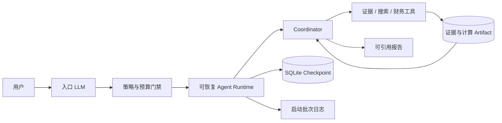

# Credra Agent

Credra Agent 是一个以企业授信尽调为业务载体的长任务 Agent 验证项目。它把自然语言入口、LLM 决策、确定性工具、证据引用、财务计算、预算控制、可恢复执行和人工审核组合在同一套 Runtime 中。

系统只提供调查辅助分析，不自动批准或拒绝贷款，也不生成授信额度。

## 主要能力

- 入口 LLM 根据用户 query、会话、任务目录、工具目录和预算决定回复、澄清、启动调查、查询状态或恢复任务。
- Coordinator 根据证据、冲突和缺口逐步选择只读工具；Policy 在执行前校验主体、期间、来源、引用和预算。
- 财务指标由 Python/Decimal 计算，模型负责解释和调查决策，不能改写计算结果。
- Evidence、Claim、Observation、Financial Result 和 Report 分别持久化并互相引用。
- LangGraph 与 SQLite 支持中断、跨进程恢复和不确定请求的保守处理。
- 根服务与 MCP 子进程共用一次启动批次日志，同时输出 UTF-8 `.log` 和 JSONL，单文件按 10 MB 轮转。
- Chainlit 提供自然语言入口、任务状态、人工审核和报告入口；命令行保留自动化与诊断能力。



## 环境准备

推荐 Python 3.11：

```powershell
conda create -n env_agent python=3.11 pip -y
conda activate env_agent
python -m pip install -r requirements-dev.txt
Copy-Item .env.example .env
```

`.env` 由运行者维护。不要提交真实 API Key；变量含义、入口策略、调查策略和日志参数见[开发计划](docs/Credra%20Agent%20自主调查架构开发计划%20v2.0.md)及[全服务日志使用说明](docs/全服务日志使用说明.md)。

## 启动界面

在仓库根目录执行：

```powershell
chainlit run chainlit_app.py
```

自然语言入口是否使用 LLM、是否允许自动派发调查，分别由入口模式和可信策略配置控制。配置变化后应重启服务；对话请求配置已持久化时，新版本应创建新会话，避免用不兼容配置恢复旧请求。

## 命令行入口

```powershell
# 查看任务命令及参数
python -m app.task_cli --help

# 查看离线评测命令
python -m app.eval_cli --help

# 运行固定离线业务评测
python -m app.eval_cli run

# 回放冻结的复杂案例，可选加入固定基线
python -m app.eval_cli complex-case-replay --include-baseline

# 导出已完成任务的审计包
python -m app.audit_cli export --thread-id <thread-id>
```

默认情况下无需单独启动 MCP Server；Runtime 会按需建立 stdio 子进程。Case 导入、验证和执行参数可通过 `python -m app.case_cli --help` 查看。

## 数据与产物

- `data/case_*`：业务 Case。首页隐藏 `_normal` 和 `_risky` 合成技术样例，比亚迪和上汽案例保留。
- `artifacts/<case>/<run>`：任务隔离的证据、计算和报告 Artifact。
- `checkpoints/`：SQLite Checkpoint 与入口会话状态。
- `logs/<startup-id>/`：一次整套服务启动的可读文本和结构化日志。
- `eval-results/`：每次评测的独立结果目录。

运行产物和本地策略文件按仓库忽略规则管理，不应把真实密钥、完整模型正文或本机缓存加入提交。

## 验证

```powershell
.\scripts\verify.ps1
```

脚本依次运行 Ruff、pytest、依赖一致性检查和独立 MCP stdio smoke。Windows 环境如在 pytest 临时目录遇到 `WinError 5`，应在允许创建隔离临时目录和子进程的终端中运行同一脚本。

## 文档

- [需求分析与技术设计](docs/Credra%20Agent%20MVP——企业授信尽调长任务智能体需求分析与技术设计方案%20v1.0.md)
- [自主调查架构与演进路线](docs/Credra%20Agent%20自主调查架构与演进路线%20v2.0（提案）.md)
- [自主调查架构开发计划](docs/Credra%20Agent%20自主调查架构开发计划%20v2.0.md)
- [V2-0 实施与验证记录](docs/V2-0%20实施与验证记录.md)
- [V2-1 实施与验证记录](docs/V2-1%20实施与验证记录.md)
- [V2-2 实施与验证记录](docs/V2-2%20实施与验证记录.md)
- [开发日志](docs/开发日志.md)
- [全服务日志使用说明](docs/全服务日志使用说明.md)
- [演示指南](docs/演示指南.md)
