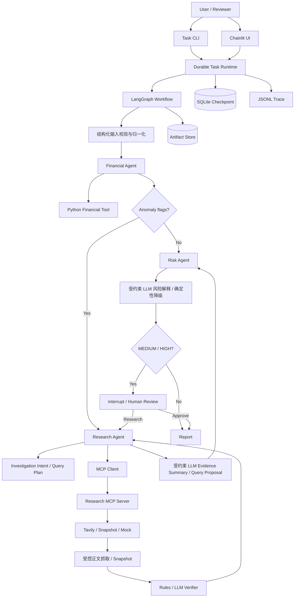
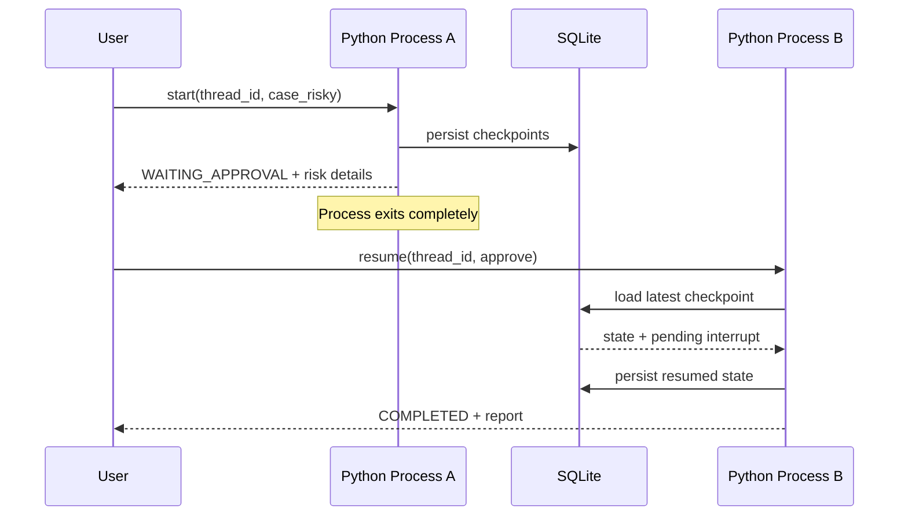
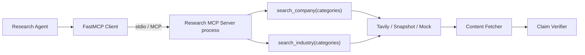

# Credra Agent

Credra Agent 是一个以企业授信尽调为业务载体的长任务 Agent MVP。项目重点不是构建银行级风控模型，而是验证一套可暂停、可恢复、可人工介入、可调用确定性工具并能追踪执行状态的 Agent Runtime。

核心能力：

- Runtime State 驱动的动态执行路径；
- Python 财务计算与规则异常检测；
- Artifact 与 Graph State 分离；
- Research Agent 通过 MCP 调用外部调查工具；
- 规则化 Investigation Intent 与可审计 Query Plan；
- 可插拔 Tavily / Snapshot / Mock 搜索、受控正文抓取与事实核验；
- Verified Fact 到外部风险项的类别化映射；
- 同一 Case 下按任务 Run ID 隔离 Artifact 与报告；
- SQLite Checkpoint 与跨进程 Resume；
- Human-in-the-loop 风险审核；
- Tool Retry、确定性故障注入与 JSONL Trace；
- CLI 可靠入口与 Chainlit 最小审核 UI。

> Credra Agent 只提供授信尽调辅助分析，不自动批准、拒绝贷款或生成授信额度。

## 1. 运行路径

正常 Case：

```text
Document → Financial → Risk → Report
```

风险 Case：

```text
Document → Financial → Research(MCP) → Risk → Human Review
                                                    ├─ Approve  → Report
                                                    └─ Research → Research vN
                                                                  → Risk vN
                                                                  → Human Review
```

执行路径由 `anomaly_flags`、`risk_level` 和 `human_decision` 决定，不由 LLM 自由规划。

## 2. 系统架构



### 跨进程恢复时序



### MCP边界



默认情况下无需提前手动启动 MCP Server。风险 Case 进入 Research 节点时，Client 会通过以下模块命令自动启动独立 stdio 子进程：

```powershell
python -m app.mcp.research_server
```

## 3. 技术原则

| 工作 | 实现方式 |
|---|---|
| 财务指标计算 | Python |
| 异常检测 | 配置化规则 |
| Graph Routing | 纯函数 |
| 数据结构约束 | Pydantic |
| 长任务持久化 | LangGraph + SQLite |
| 外部调查 | MCP |
| 中间结果 | Versioned Artifacts |
| 人工审核 | Dynamic interrupt |
| 执行记录 | JSONL Trace |
| LLM 表达 | 受约束的 JSON 输出 + 引用/状态校验 |

财务计算、异常检测、Verified Fact、Risk 等级、Graph Routing 和报告结构保持可离线回归的确定性基线。M4-A 在 Risk 节点后接入受约束的 OpenAI-compatible LLM 风险解释；M4-B 在 Research 节点内基于已形成的结构化证据索引生成 Evidence Summary 与仅供人工审核的 Query Proposal；M4-C2 在 Report 节点使用独立 Prompt/Schema 生成带引用的 Executive Summary 与固定类别报告段落；M4-C1 再对全部模型表达执行引用、来源指纹、事实、数字与 URL 校验，只把通过项投影到最终报告。模型没有 Tool 权限，不能新增事实、提升 Evidence 状态、修改规则 Query Plan、风险等级、路由或替代人工审核；模型、配置、结构化输出或引用校验失败时，任务保留确定性结论并安全降级。Report Draft 与最终投影分别写入 `report_draft_vN.json` 和 `report_expression_vN.json` 供审计。

## 4. 环境要求

已验证环境：

- Windows 11；
- Python 3.11.15；
- LangGraph 1.2.11；
- langgraph-checkpoint 4.2.0；
- langgraph-checkpoint-sqlite 3.1.1；
- FastMCP 3.4.7；
- MCP 1.29.0；
- Chainlit 2.11.1；
- Pydantic 2.13.4；
- pytest 9.1.1。

推荐使用 Conda：

```powershell
conda create -n env_agent python=3.11 pip -y
conda activate env_agent
python -m pip install -r requirements-dev.txt
python -m pip check
```

如果只运行应用，不执行测试和 Ruff：

```powershell
python -m pip install -r requirements.txt
```

## 5. 配置

复制示例文件：

```powershell
Copy-Item .env.example .env
```

模型连接字段：

```dotenv
MODEL_BASE_URL=https://api.openai.com/v1
MODEL_NAME=
MODEL_API_KEY=
```

主链路 LLM 表达字段（M4-A 风险解释、M4-B 调查表达与 M4-C2 Report Draft 共用）：

```dotenv
# deterministic（默认）| llm
ANALYSIS_MODE=deterministic
# 留空时复用 MODEL_NAME
ANALYSIS_MODEL=
# DashScope Qwen 混合思考模型使用 JSON Mode 时显式设为 false；其他 Provider 可不配置
# ANALYSIS_LLM_ENABLE_THINKING=false
ANALYSIS_LLM_TIMEOUT_SECONDS=30
ANALYSIS_LLM_MAX_RETRY=1
ANALYSIS_LLM_MAX_INPUT_CHARS=30000
ANALYSIS_LLM_MAX_OUTPUT_TOKENS=1200
# M4-B Evidence Summary / Query Proposal 独立输出上限
ANALYSIS_LLM_RESEARCH_MAX_OUTPUT_TOKENS=2400
```

启用 `ANALYSIS_MODE=llm` 前，必须在用户维护的 `.env` 中配置 `MODEL_API_KEY`，以及 `ANALYSIS_MODEL` 或 `MODEL_NAME`。DashScope 的 Qwen 混合思考模型在结构化 JSON Mode 下还应设置 `ANALYSIS_LLM_ENABLE_THINKING=false`；该字段未配置时不会向其他 OpenAI-compatible Provider 发送厂商扩展参数。网关关闭 OpenAI SDK 的隐式重试，只执行 `ANALYSIS_LLM_MAX_RETRY` 定义的应用级重试。M4-B 的 JSON 结构显著大于风险叙事和报告草稿，因此通过 `ANALYSIS_LLM_RESEARCH_MAX_OUTPUT_TOKENS` 使用独立的 2400-token 默认上限。默认 `deterministic` 不会调用模型，仍生成可审计的确定性风险解释 Artifact。

当 `FACT_VERIFIER=llm` 时，核验器默认继承 `ANALYSIS_LLM_ENABLE_THINKING`；如需独立覆盖，可配置 `FACT_VERIFIER_ENABLE_THINKING=false`。核验请求携带严格 JSON Schema，SDK 隐式重试关闭，实际尝试次数由 `FACT_VERIFIER_MAX_RETRY` 控制。

运行配置：

```dotenv
CHECKPOINT_DB_PATH=checkpoints/credra_agent.db
MAX_RETRY=2
RESEARCH_FAIL_FIRST=0
DEBT_RATIO_THRESHOLD=0.15
CASHFLOW_THRESHOLD=0.0
REVENUE_THRESHOLD=0.20
DATA_DIR=data
TRACE_DIR=traces
```

`.env` 由本地用户维护且已被 Git 忽略。不要在日志、截图或提交中暴露 API Key。

## 6. CLI快速开始

正式 Durable Demo 使用 `app.task_cli`。

也可以使用封装好的演示脚本自动生成不冲突的 `thread_id`：

```powershell
.\scripts\demo.ps1 normal
.\scripts\demo.ps1 risky
.\scripts\demo.ps1 retry
```

### Case A：正常企业

```powershell
python -m app.task_cli start `
  --thread-id normal-demo-001 `
  --case-id case_normal
```

预期：

```text
status=COMPLETED
risk_level=LOW
interrupts=[]
```

报告位于任务独立目录；实际 `run_id` 可从命令返回的 `state.run_id` 查看：

```text
data/case_normal/runs/<run_id>/output/credit_report.md
```

### Case B：风险企业

```powershell
python -m app.task_cli start `
  --thread-id risky-demo-001 `
  --case-id case_risky
```

预期：

```text
status=WAITING_APPROVAL
next=["approval"]
interrupts 包含风险项、证据和允许的人工决策
```

查询持久化状态：

```powershell
python -m app.task_cli status --thread-id risky-demo-001
```

批准并生成报告：

```powershell
python -m app.task_cli resume `
  --thread-id risky-demo-001 `
  --decision approve `
  --comment "人工复核完成，继续生成报告。"
```

### 补充调查

```powershell
python -m app.task_cli resume `
  --thread-id risky-demo-001 `
  --decision research `
  --comment "需要补充调查。"
```

任务会生成：

```text
research_result_v2.json
risk_analysis_v2.json
investigation_intent_v2.json
query_plan_v2.json
```

并再次进入 `WAITING_APPROVAL`。旧的 v1 Artifact 不会被覆盖。

## 7. 跨进程Resume演示

1. 启动风险 Case：

   ```powershell
   python -m app.task_cli start --thread-id restart-demo-001 --case-id case_risky
   ```

2. 确认状态为 `WAITING_APPROVAL` 后，完全关闭当前终端或 Python 进程。

3. 打开新终端，激活环境：

   ```powershell
   conda activate env_agent
   ```

4. 不提供 `case_id`，只用原 `thread_id` 查询：

   ```powershell
   python -m app.task_cli status --thread-id restart-demo-001
   ```

5. 恢复：

   ```powershell
   python -m app.task_cli resume `
     --thread-id restart-demo-001 `
     --decision approve `
     --comment "跨进程恢复验证。"
   ```

6. 确认 `status=COMPLETED`，并检查报告中的人工审核意见。

## 8. Retry与故障注入

PowerShell 当前会话中开启 fail-first：

```powershell
$env:RESEARCH_FAIL_FIRST="1"
$env:MAX_RETRY="2"

python -m app.task_cli start `
  --thread-id retry-demo-001 `
  --case-id case_risky
```

预期两个 Research Tool 都发生：

```text
第一次调用 → TimeoutError → RETRY
第二次调用 → SUCCESS
```

查看 Trace：

```powershell
Get-Content traces/retry-demo-001.jsonl
```

恢复当前终端的默认故障设置：

```powershell
Remove-Item Env:RESEARCH_FAIL_FIRST
Remove-Item Env:MAX_RETRY
```

故障注入状态按 `task_id + tool_name` 隔离。重复演示时应使用新的 `thread_id`。

## 9. Chainlit UI

启动：

```powershell
chainlit run chainlit_app.py
```

浏览器访问 Chainlit 输出的本地地址，然后可以：

- 从首页预检列表直接启动 Case；
- 点击“恢复已有任务”并输入 `thread_id`；
- 查看 Case、Thread、Run、状态、当前/下一节点和风险等级；
- 查看结构化输入预检、节点进度和当前 Artifact 引用；
- 风险任务使用“批准并继续”或“补充调查”按钮，并填写人工意见；
- 点击“刷新状态”读取 Durable Runtime 的最新状态。

`cases`、`start <case_id>`、`status <thread_id>` 与 `resume ...` 文本命令继续保留为兼容入口。M3-A 已完成工作台首页与状态总览；M3-B 已增加调查计划、Evidence、正文/Verifier 状态、Artifact 版本历史和 Retry/Trace 摘要；M3-C 已提供安全的 Markdown/HTML 报告预览和下载。M4-A/B 展示风险解释、Evidence Summary 与人工审核式 Query Proposal 的状态、引用和降级信息；任务完成后，最终报告及 Artifact 列表还会展示 M4-C2 Report Draft 与 M4-C1 二次校验审计结果。

Evidence 中只有通过安全检查的公开 `http/https` URL 会呈现为可点击链接；页面最多展示前 12 条 Evidence 和最近 16 个 Trace 事件，完整数据仍保留在当前 Run Artifact 与任务 Trace 中。工作台不读取或展示正文快照。

Chainlit 只调用 Durable Runtime，不独立维护任务状态。UI 重启后仍能凭 `thread_id` Resume。

## 10. 运行产物

```text
data/<case_id>/
├── source/                 # 版本控制内的固定输入
└── runs/                   # 按任务隔离，运行生成且 Git 忽略
    └── <run_id>/
        ├── artifacts/
        │   ├── company_profile_v1.json
        │   ├── financial_analysis_v1.json
        │   ├── investigation_intent_v1.json
        │   ├── query_plan_v1.json
        │   ├── research_result_v1.json
        │   ├── evidence_summary_v1.json
        │   ├── query_proposal_v1.json
        │   ├── risk_analysis_v1.json
        │   ├── risk_narrative_v1.json
        │   ├── report_draft_v1.json
        │   └── report_expression_v1.json
        └── output/
            └── credit_report.md

checkpoints/
└── credra_agent.db         # SQLite任务状态，Git忽略

traces/
├── <thread_id>.jsonl       # 执行Trace，Git忽略
└── .fault_state/           # 故障注入状态，Git忽略
```

Graph State 仅保存 Artifact Reference 和路由字段，不保存完整财务数据、Research 结果或报告。
M2.2 之前创建且已写入 Case 根目录的旧 Checkpoint 会继续读取原目录；系统不会静默移动或覆盖既有用户数据。新任务一律使用 `runs/<run_id>/`。

## 11. 测试与验证

一键执行项目验证：

```powershell
.\scripts\verify.ps1
```

等价命令：

```powershell
python -m ruff check app spikes tests chainlit_app.py
python -m ruff format --check app spikes tests chainlit_app.py
python -m pytest -q
python -m pip check
python -m tests.stdio_research_smoke
```

覆盖范围包括：

- 财务公式和输入边界；
- Artifact 安全和版本；
- Case A/B 路由；
- MCP Tool 与独立 stdio Server；
- HITL 和跨进程 Resume；
- Retry、故障注入与 incomplete 披露；
- Investigation Intent、Query 差异和人工意见传递；
- Evidence-Risk 类别映射、证据缺口与冲突披露；
- 同 Case 多任务隔离及持久化 FAILED 状态；
- JSONL Trace Schema；
- 五个固定 Regression Cases；
- Chainlit 渲染边界；
- M4-A 风险解释、M4-B Evidence Summary / Query Proposal、M4-C2 Report Draft 与 M4-C1 报告投影的 Schema、引用边界、Unsupported Claim 拦截、降级和主链路回归。

Chainlit 的传递依赖 `traceloop` 目前可能产生 Pydantic 旧式 Config 的弃用警告，不影响测试通过或项目代码。

## 12. 入口说明

| 入口 | 用途 |
|---|---|
| `python -m app.task_cli` | 正式 Durable CLI，推荐 |
| `chainlit run chainlit_app.py` | 最小审核 UI |
| `python -m app.mcp.research_server` | 手工启动 MCP Server，通常无需使用 |
| `python -m app.main <case_dir>` | 无 Checkpoint 的快速离线预览 |
| `python -m spikes.durable_execution.cli` | Day 0 Runtime Spike |

## 13. 常见问题

### `thread already exists`

一个 `thread_id` 对应一条持久任务。使用新 ID，或继续对原 ID 执行 `status/resume`。

### `thread is not waiting for approval`

任务可能已完成或尚未到达 interrupt。先执行 `status` 查看 `state.status` 和 `interrupts`。

### MCP显示 `Connection closed`

确认在仓库根目录运行、已激活正确 Python 环境，并验证：

```powershell
python -m tests.stdio_research_smoke
```

### Chainlit无法导入`app`

请从仓库根目录使用根入口：

```powershell
chainlit run chainlit_app.py
```

不要直接运行 `chainlit run app/chainlit_app.py`。

### Retry演示没有再次失败

故障状态按任务隔离。同一个 `thread_id` 的首次故障已经消费后不会重复注入，请使用新的 `thread_id`。

### Pytest临时目录提示`WinError 5`

统一使用 `scripts/verify.ps1`。脚本会在仓库的 `.test-tmp/` 下为本次运行创建独立临时目录，并禁用 pytest 缓存，避免访问损坏或权限异常的用户临时目录和 `.pytest_cache`；本次目录会在验证结束后自动清理。

## 14. 项目边界

MVP 不实现：

- 自动贷款批准/拒绝或授信额度；
- 银行级风控模型；
- 实时金融数据库；
- FastAPI、PostgreSQL、Redis、Kubernetes；
- A2A、长期记忆、完整 Agent Eval；
- PDF/OCR/VLM 与企业级 Sandbox。

## 15. 面试讨论要点

- 为什么已知财务异常使用规则路由，而不是 LLM Routing？
- 为什么财务计算必须由 Python Tool 完成？
- 为什么任务生命周期需要长于进程和 UI Session？
- 为什么 interrupt 前不能执行不可幂等副作用？
- 为什么 State 只保存 Artifact Reference？
- 为什么只将 Research Tool MCP 化？
- Retry 耗尽后为什么不能静默忽略？
- 如何证明 Resume 没有重新执行已完成节点？

完整演示命令见 [演示指南](docs/演示指南.md)，项目表述边界与问题参考见 [项目展示与面试说明](docs/项目展示与面试说明.md)。详细需求、技术设计、开发计划和适应性变更记录均位于 [docs](docs/) 目录。

## 15. M1 Case 导入前校验

使用 `app.case_cli` 创建、校验和启动结构化 Case。它不会修改 `.env`；`run` 会先完成导入前校验，失败时不会创建任务 Checkpoint。

```powershell
# 创建可编辑模板（会创建 data/case_my_company/source/）
python -m app.case_cli init --case-id case_my_company

# 校验来源、企业名称、年度、单位、财务勾稽及人工确认项
python -m app.case_cli validate --case-id case_byd_002594

# 校验通过后启动 Durable Runtime
python -m app.case_cli run `
  --case-id case_byd_002594 `
  --thread-id byd-m1-demo-001
```

新 Case 使用 `source_manifest_v2`，要求每个关键财务字段记录来源、页码、表格、原始单位、内部单位 `CNY_1000` 和会计口径。`CNY`、`CNY_10K`、`CNY_1000` 和 `CNY_100M` 在预检中会换算为 `CNY_1000`；原始源文件保持不变，以便与公开年报逐项核对。旧 `case_normal` 和 `case_risky` 仍可运行，但校验会提示缺少来源清单的迁移警告。
