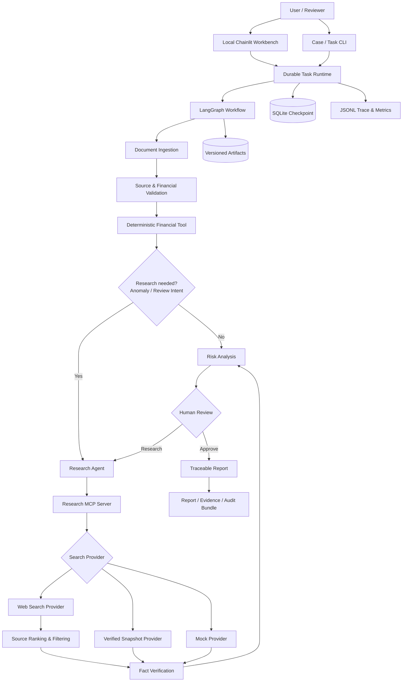

# Credra Agent 场景化能力优化计划

**版本：** v1.0  
**制定日期：** 2026-08-26  
**项目名称：** Credra Agent  
**计划性质：** 现有 Day 0–Day 6 MVP 之后的场景化扩展计划  
**预计周期：** 12–18 个有效开发日  
**预计工作量：** 80–120 小时

---

# 1. 计划背景

现有 Credra Agent MVP 已完成以下长任务 Agent Runtime 能力：

```text
Dynamic Routing
+
Deterministic Financial Tool
+
Versioned Artifact
+
MCP Research Boundary
+
SQLite Checkpoint / Cross-process Resume
+
Human-in-the-loop
+
Retry / Fault Injection / Trace
+
CLI / Minimal Chainlit UI
```

当前系统已经能够稳定演示 Agent 的动态执行、暂停、恢复、人工介入、工具重试和过程追踪，但业务输入仍以固定结构化样例为主，Research MCP 使用本地 Mock Dataset，Risk 与 Report 使用确定性基线，Chainlit 仅提供最小审核入口。

因此，当前成果适合定义为“企业授信尽调场景下的 Durable Agent 技术 MVP”，尚不足以定义为“能够对真实企业完成可信尽调的业务应用”。

本计划不替代原 MVP 开发计划，而是在其可靠 Runtime 基础上，将项目扩展为：

> 能够使用真实公开企业材料，通过可核验互联网来源形成 Evidence，在本地工作台中展示执行进度、完成人工审核、跨进程恢复并输出可追溯报告的场景化 Agent。

---

# 2. 优化目标

## 2.1 核心目标

本阶段需要完成以下业务闭环：

```text
真实公开年报与企业资料
        ↓
结构化导入与来源标注
        ↓
确定性财务校验与指标计算
        ↓
动态风险调查路径
        ↓
互联网搜索与事实核查
        ↓
带来源 Evidence 的风险分析
        ↓
本地工作台展示与人工审核
        ↓
跨进程 Resume
        ↓
可追溯报告与审计包
        ↓
人工对照验收
```

## 2.2 用户价值目标

完成后，一个不了解内部实现的使用者应能够：

1. 根据模板创建一个新的企业 Case；
2. 导入公开年报整理出的财务数据及业务材料；
3. 在运行前发现字段、年份、单位和基本勾稽错误；
4. 启动任务并观察当前节点、执行路径和等待原因；
5. 查看真实搜索结果及其 URL、时间和来源等级；
6. 区分已支持、相互印证、存在冲突和尚未核实的事实；
7. 在人工审核点批准继续或要求补充调查；
8. 在应用或 Python 进程退出后恢复同一任务；
9. 下载最终报告、Evidence、Artifact 和 Trace 摘要；
10. 使用人工对照答案评价计算、异常识别和引用质量。

## 2.3 非目标

本阶段不实现：

- 自动批准、拒绝贷款或生成授信额度；
- 银行级信用评分模型；
- 无限制自主浏览或自动执行外部操作；
- 覆盖所有格式、版式和语言的通用 PDF/OCR；
- 多 Agent 自主协商；
- 向量数据库、长期记忆或知识图谱；
- PostgreSQL、Redis、Kubernetes 等生产基础设施；
- 复杂前后端分离或移动端应用；
- 付费工商、司法或征信数据库的深度集成。

---

## 2.4 目标对齐审查结论（2026-09-01）

本次审查以当前工作区实现为准，包含尚待人工审核与提交的 M2.1-A 变更，并暂不把 M3 工作台展示能力作为主要完成度判断项。

结论分为两层：

- 原始 MVP 的核心目标是验证 Durable Agent Runtime，而不是建设银行级风控系统；Dynamic Routing、Python Tool、Artifact、MCP、SQLite Checkpoint、跨进程 Resume、HITL、Retry、Fault Injection 和 JSONL Trace 已经形成稳定纵向链路，主方向没有偏离；
- 场景化扩展的目标是让真实资料经过可核验互联网 Evidence 进入风险分析和可追溯报告；当前已完成真实 Case、导入校验、可插拔搜索和确定性候选过滤，但尚未完成正文核验、Evidence 到 Risk 的语义映射、受约束 LLM 表达和审计验收，因此还不能定义为“能够对真实企业完成可信尽调的业务应用”。

当前对外定位统一为：

> 基于真实企业案例、支持互联网候选检索的 Durable Agent 技术 MVP。

在 M2.1、M2.2、M4 和 M5 的对应门禁完成前，不得表述为“已自动完成互联网事实核查”“已由外部调查形成可信风险结论”或“可替代专业授信尽调”。

| 目标域 | 当前状态 | 审查结论 |
|---|---|---|
| Durable Runtime、Checkpoint、Resume、HITL | 已实现 | 原始 MVP 的核心价值已经成立 |
| 确定性财务计算、规则路由、Pydantic 结构 | 已实现 | 与 Reliability First 和 Deterministic Where Possible 一致 |
| 真实 Case、来源清单、导入前校验 | 已实现 | 已从纯 Mock Demo 扩展到可人工追溯的结构化真实输入 |
| MCP 与 Mock/Snapshot/Tavily Provider | 已实现 | Provider 边界、Retry 和失败披露符合计划 |
| Raw/Candidate/Verified 分层与负向过滤 | 已实现第一层 | 无关结果已不能进入事实，但真实 Web 候选仍未完成正文核验 |
| Evidence 驱动的风险分析与可追溯报告 | 部分实现 | 当前外部证据与风险项的语义映射不足，不能视为业务闭环完成 |
| 非结构化文档理解与受约束 LLM 推理 | 未进入主链路 | 属于 M4 计划项；当前 Document 节点只承担结构化输入校验与归一化 |
| 业务 Eval、审计包和运行指标 | 未实现 | 属于 M5，不得用现有单元测试替代业务质量验收 |

本次审查确认以下内容仍是明确非目标，不因路线校准而扩展范围：自动授信决策、银行级评分、通用 PDF/OCR 平台、无限制自主浏览、A2A、长期记忆和生产级基础设施。

---

# 3. 开发原则

## 3.1 真实来源优先

所有进入风险分析和最终报告的外部事实都必须保留可核验来源。搜索摘要不能代替原始来源，无法核验的信息不得表述为确定事实。

## 3.2 确定性核心不变

以下能力继续保持确定性：

| 能力 | 实现方式 |
|---|---|
| 财务数值读取与单位转换 | Python |
| 财务指标计算 | Python |
| 输入 Schema 校验 | Pydantic |
| 已知异常规则 | 配置化规则 |
| Graph Routing | 纯函数 |
| Checkpoint / Resume | LangGraph + SQLite |
| Artifact 版本管理 | 文件存储与显式引用 |

LLM 只用于非结构化材料理解、查询生成、Evidence 摘要、风险解释和报告语言组织，不参与确定性财务计算或自动授信决策。

## 3.3 在线与离线双模式

系统必须同时支持：

```text
mock      离线测试与固定回归
snapshot  真实来源的稳定回放与演示
web       实时互联网搜索
```

Web 失败时不得静默回退到 Mock，以避免在真实报告中混入模拟事实。失败应显式形成 `INCOMPLETE` Research Artifact，并在 State、Risk 和 Report 中披露。

## 3.4 来源分级与最小信任

推荐来源等级：

| 等级 | 来源类型 | 使用规则 |
|---|---|---|
| A | 监管部门、交易所、法院、政府公开信息 | 可直接支持重要事实 |
| B | 企业公告、审计报告、评级机构 | 可支持企业与财务事实 |
| C | 主流财经媒体 | 建议与 A/B 来源相互印证 |
| D | 一般媒体、行业网站 | 仅作为调查线索或补充证据 |
| E | 论坛、自媒体、来源不明网页 | 不单独支持风险结论 |

## 3.5 可复现与可审计

实时搜索必须记录 Query、URL、检索时间、来源等级、必要摘要和内容哈希。真实演示应能够切换到 Snapshot 模式复现关键结果。

## 3.6 小步提交与人工审核

每个 Milestone 形成独立 Git 提交。提交前必须展示拟提交文件、变更摘要、验证结果和建议提交信息，等待人工审核和明确批准。

如实际依赖、API 行为、运行环境或实现边界与本计划存在出入，必须记录到 `docs/开发日志.md`。

---

# 4. 目标架构



---

# 5. 阶段总览

| 阶段 | 预计时间 | 核心产出 | 阶段门禁 |
|---|---:|---|---|
| M0：真实案例与验收基线 | 1–2 天 | 公开企业 Case、来源清单、人工对照表 | Case 合法且可人工核验 |
| M1：真实材料导入与校验 | 2–3 天 | Case CLI、来源清单、财务预检 | 新 Case 可在运行前通过校验 |
| M2：互联网搜索与事实核查 | 3–4 天 | Search Provider、Tavily、Snapshot、基础 Fact Verification | Evidence 含真实 URL 且失败不伪装成功 |
| M2.1：搜索过滤与深度核验 | 3–5 天 | 实体解析、正文抓取、LLM Verifier、跨来源聚合 | 无关结果不得进入事实，确定事实可回查正文证据 |
| M2.2：调查语义闭环与运行隔离 | 2–3 天 | 意图驱动查询、Evidence-Risk 映射、任务级 Artifact、失败状态 | 调查响应真实意图，证据不串联，任务可独立重跑 |
| M3：场景化本地工作台 | 2–3 天 | Chainlit 状态时间线、Evidence、Artifact、审核和报告 | 非开发人员可完成完整任务 |
| M4：受约束 LLM 表达层 | 3–5 天 | 结构化模型网关、Evidence 摘要、风险解释、报告表达、降级机制 | 无来源事实不得进入确定结论 |
| M5：Eval、导出与可靠性收尾 | 2–3 天 | 业务 Eval、审计包、成本指标、安全检查 | 真实 Case 与固定回归全部通过 |

M0–M3（含 M2.1 与 M2.2）构成“可演示、可试用的场景化版本”；M4–M5 构成“质量增强版本”。M3 不得早于 M2.1-B、M2.1-C 和 M2.2 的核心门禁，以避免用界面掩盖证据与风险链路尚未闭合的问题。

---

# 6. M0：真实案例与验收基线

## 6.1 目标

选择一家资料充分、来源公开、风险边界清晰的企业，建立第一个不依赖虚构财务数据的验收 Case。

## 6.2 Case 选择原则

- 优先选择公开上市公司；
- 至少具有连续两到三年年报；
- 能找到交易所、监管部门或企业公告等权威来源；
- 财务数据结构清晰且单位明确；
- 存在至少一个可核验的经营、财务或监管事项；
- 不使用未获授权的个人、征信或内部敏感数据。

## 6.3 任务

- 建立 `data/<case_id>/source/` 真实 Case；
- 整理企业基本信息、主营业务和连续年度财务数据；
- 记录每个关键字段的原始文件、页码、表格、单位和口径；
- 建立外部来源清单，包括 URL、来源类型、发布日期和预期事实；
- 使用 Excel 或独立计算脚本生成财务指标对照答案；
- 标注预期异常、预期 Research Query 和预期人工审核点；
- 明确不应出现的错误事实和不应给出的授信结论。

## 6.4 交付物

```text
data/<case_id>/source/
├── company_profile.json
├── financial_statement.json
├── business_info.md
└── source_manifest.json

tests/fixtures/expected/<case_id>/
├── expected_financial.json
├── expected_anomalies.json
├── expected_evidence.json
└── acceptance_checklist.md
```

## 6.5 完成定义

- 所有输入均可回溯到公开来源；
- 人工对照财务指标已完成；
- 预期异常和关键事实已由人工标注；
- Case 不包含未授权敏感数据；
- Case 可被现有离线流程读取，或明确列出 M1 所需适配项。

---

# 7. M1：真实材料导入与校验

## 7.1 目标

让用户能够按模板创建和校验新 Case，避免必须理解内部目录和 Schema 才能使用系统。

## 7.2 任务

- 增加 Case CLI：

  ```powershell
  python -m app.case_cli init --case-id <case_id>
  python -m app.case_cli validate --case-id <case_id>
  python -m app.case_cli run --case-id <case_id> --thread-id <thread_id>
  ```

- 增加 `source_manifest.json` Schema；
- 为财务字段保存原始来源、页码、表格、单位和口径；
- 校验必需文件、JSON Schema、企业名称一致性和年份顺序；
- 校验元、万元、亿元等单位并统一到内部单位；
- 增加基础财务勾稽和合理性检查；
- 将输入错误区分为错误、警告和人工确认项；
- 保持现有 Case A/B 兼容；
- 第一版只支持人工结构化年报数据，不把通用 PDF/OCR 设为门禁。

## 7.3 验证

- 新 Case 模板可直接生成；
- 合法真实 Case 校验通过；
- 缺少文件、非法年份、未知单位和企业名称不一致会失败；
- 可疑但不一定错误的数据进入人工确认提示；
- 财务计算结果与 M0 人工答案一致；
- 既有回归 Case 不受影响。

## 7.4 完成定义

- 新用户可根据模板准备一个可运行 Case；
- 运行前能够发现主要结构和单位问题；
- 关键数字能够回溯到年报页码；
- 真实 Case 的确定性财务结果通过人工对照。

---

# 8. M2：互联网搜索与事实核查

## 8.1 目标

将现有本地 Mock Research 扩展为可切换的 Mock、Snapshot 和实时 Web Provider，并形成带真实来源、可核验状态的 Evidence。

## 8.2 Provider 设计

```text
SearchProvider
├── MockSearchProvider
├── SnapshotSearchProvider
└── TavilySearchProvider
```

现有 MCP Tool 名称 `search_company` 和 `search_industry` 保持不变，Provider 选择由配置决定。

拟新增配置：

```dotenv
RESEARCH_PROVIDER=mock
TAVILY_API_KEY=
SEARCH_DEPTH=basic
SEARCH_MAX_RESULTS=5
SEARCH_TIMEOUT_SECONDS=15
SEARCH_TIME_RANGE=year
```

真实配置由用户维护在 `.env` 中；开发仅更新 `.env.example`，不得输出或提交真实 API Key。

## 8.3 任务

- 定义 `SearchProvider` 接口和统一错误类型；
- 将现有 Mock Dataset 封装为 Mock Provider；
- 实现真实来源的 Snapshot Provider；
- 实现 Tavily Web Provider；
- 增加公司与行业的确定性 Query 模板；
- 按来源域名和来源类型执行优先级排序；
- 处理 401、429、超时、网络错误、额度耗尽和空结果；
- 复用现有 Tool Retry、Trace 和 incomplete 披露；
- 保存搜索 Query、标题、URL、来源域名、发布日期、检索时间、摘要、相关度和内容哈希；
- 禁止 Web 失败时静默回退到 Mock；
- 为真实 API 增加显式开启的 smoke test，默认测试不得消耗额度。

## 8.4 查询策略

基础 Query 至少覆盖：

```text
"<企业全称>" 经营异常
"<企业全称>" 监管处罚
"<企业全称>" 诉讼 仲裁
"<企业全称>" 债务 逾期
"<企业全称>" 财务造假
"<企业全称>" 业绩预警
"<企业全称>" 实际控制人 风险
"<所属行业>" 景气度 风险
```

第一轮优先 A/B 级来源，第二轮再补充主流财经媒体和行业来源。

## 8.5 Fact Verification

每条事实必须形成以下状态之一：

| 状态 | 含义 |
|---|---|
| `SUPPORTED` | 至少一个 A/B 级来源直接支持 |
| `CORROBORATED` | 两个相互独立来源相互印证 |
| `CONFLICTING` | 不同来源存在重要冲突 |
| `UNVERIFIED` | 只有低等级、单一或间接来源 |
| `NOT_FOUND` | 未找到能够支持该事实的来源 |

Risk 和 Report 只能把 `SUPPORTED` 与 `CORROBORATED` 表述为确定事实；其他状态必须显式说明不确定性。

## 8.6 Evidence Schema

建议至少包含：

```json
{
  "fact": "事实摘要",
  "verification_status": "SUPPORTED",
  "title": "来源标题",
  "source_url": "https://example.com/page",
  "source_domain": "example.com",
  "source_tier": "A",
  "published_at": "2026-06-30",
  "retrieved_at": "2026-08-26T12:00:00Z",
  "query": "企业名称 监管处罚",
  "relevance_score": 0.87,
  "content_hash": "sha256:..."
}
```

## 8.7 完成定义

- Web 模式能够返回真实 URL；
- Snapshot 模式能够稳定复现真实来源；
- 搜索失败不会混入 Mock 事实；
- 重要外部事实具备核验状态和来源等级；
- Risk Artifact 与最终报告可定位到 Evidence URL；
- API Key 不进入 Trace、Artifact、日志或 Git；
- Mock 模式的固定回归测试继续通过。

## 8.8 M2.1：搜索结果过滤与深度事实核验

### 8.8.1 问题与边界

实时搜索返回的是高召回候选，不是已经核实的事实。搜索引擎的相关度分数主要反映主题相关性，不能证明结果命中了目标企业，也不能证明正文支持待核查事实；来源等级高同样不等于内容支持当前结论。

现阶段基于“主体全称、类别关键词、来源等级和最低相关度”的规则只能作为第一层安全门槛。Raw Snapshot 为审计和复现保留 Provider 原始结果，因此允许包含无关结果；Risk 和 Report 必须只消费经过核验的 Evidence，不能直接消费 Raw Snapshot。

后续处理链路调整为：

```text
Raw Search Snapshot
        ↓
Deterministic Candidate Filter
        ↓
URL Fetch / HTML-PDF Extraction
        ↓
Structured Claim Extraction
        ↓
LLM Fact Verifier
        ↓
Cross-source Aggregation
        ↓
Verified Evidence → Risk / Report
```

产物应明确分层：

- `raw_search_snapshot`：搜索引擎原始响应，仅用于审计、回放和调试；
- `candidate_evidence`：通过确定性主体与类别过滤的候选材料；
- `verified_fact`：经过正文核验和信源聚合后，允许进入 Risk/Report 的事实。

### 8.8.2 确定性候选过滤

- 建立企业实体别名集合，包括企业全称、证券简称、证券代码、曾用名、主要子公司和控股股东；
- 区分目标企业、关联企业、同业企业和文章中顺带提及的企业，避免仅命中关键词即判定主体一致；
- 为经营异常、监管处罚、诉讼仲裁、债务逾期、财务造假、业绩预警、实际控制人风险和行业风险分别维护正向关键词、排除词和必要组合；
- 综合主体命中、类别命中、Provider 相关度、来源等级和发布时间计算候选分数；
- 每条被排除或降级的结果记录 `filter_reason`，例如 `SUBJECT_MISMATCH`、`CATEGORY_MISMATCH`、`LOW_RELEVANCE`、`DUPLICATE_CONTENT`；
- URL 规范化并按规范 URL、正文哈希和转载关系去重，转载同一稿件不得视为独立信源。

### 8.8.3 URL 正文获取与内容提取

- 增加受控 `ContentFetcher` 接口，支持 HTML 与公开 PDF；
- 设置连接/读取超时、最大响应体积、允许的 Content-Type、重定向上限和并发上限；
- 提取标题、发布日期、正文、公告页码或段落定位，并保存正文内容哈希；
- 抓取失败、登录墙、反爬限制、内容删除和不支持格式必须显式记录，不得用搜索摘要伪装为已读取全文；
- Web 内容一律视为不可信输入，隔离页面中的提示注入、脚本和操作指令，不允许网页内容改变 Agent 工作流或调用权限。

### 8.8.4 大模型逐条事实核验

只对通过确定性过滤的候选调用大模型，输出严格结构化结果：

```json
{
  "subject_match": "EXACT",
  "relation": "SUPPORTS",
  "claim": "待核查事实",
  "evidence_excerpt": "支持或反驳该事实的短证据片段",
  "evidence_location": "正文段落或 PDF 页码",
  "reason": "判定理由",
  "confidence": 0.91
}
```

其中 `relation` 至少支持：

| 状态 | 含义 |
|---|---|
| `SUPPORTS` | 正文直接支持待核查事实 |
| `REFUTES` | 正文明示反驳或否定待核查事实 |
| `IRRELEVANT` | 主题或主体不匹配 |
| `INSUFFICIENT` | 信息不足，无法形成判断 |

大模型不得仅根据标题、来源等级或搜索分数给出 `SUPPORTS`；输出必须能定位到已抓取正文中的短证据片段。模型输出不合法、证据片段无法回查或置信度不足时统一降级为 `UNVERIFIED`。

### 8.8.5 多来源聚合与最终状态

- A/B 级来源正文直接支持，且主体和事实均匹配时，才能形成 `SUPPORTED`；
- 两个真正独立的来源支持同一事实时形成 `CORROBORATED`；
- 不同可靠来源对关键事实存在实质分歧时形成 `CONFLICTING`，不得自动选边；
- 只有搜索摘要、低等级来源、单一间接表述或正文不足时保持 `UNVERIFIED`；
- 完全没有合格候选时为 `NOT_FOUND`；
- Risk 和 Report 只将 `SUPPORTED` / `CORROBORATED` 表述为确定事实，并展示 URL、证据位置、核验模型版本和核验时间。

### 8.8.6 成本、缓存与配置

建议新增配置：

```dotenv
SEARCH_MIN_RELEVANCE_SCORE=0.5
SEARCH_FETCH_TIMEOUT_SECONDS=15
SEARCH_FETCH_MAX_BYTES=5000000
SEARCH_FETCH_MAX_CONCURRENCY=3
FACT_VERIFIER=rules
FACT_VERIFIER_MODEL=
# FACT_VERIFIER_ENABLE_THINKING=false
FACT_VERIFIER_MIN_CONFIDENCE=0.75
FACT_VERIFIER_MAX_CANDIDATES=10
```

- `FACT_VERIFIER=rules` 保留离线与降级能力，`llm` 模式才执行正文级模型核验；
- 按 `URL + content_hash + verifier_model + prompt_version` 缓存核验结果；
- 为每个 Case 设置候选数、抓取数、模型调用数和总耗时预算；
- 额度耗尽、模型失败或抓取失败必须进入 Retry/Trace 和 incomplete 披露，不得回退为 Mock 或把规则命中升级为确定事实。

### 8.8.7 测试与验收

- 将“比亚迪债务逾期 Query 返回华谊兄弟文章”固化为负向回归：必须得到 `SUBJECT_MISMATCH` / `IRRELEVANT`，且不得进入 `facts`、Risk 或 Report；
- 可信 A/B 来源但类别不匹配时必须保持 `UNVERIFIED`；
- 覆盖企业简称、证券代码、子公司、同名企业和正文否定语义；
- 覆盖同稿转载去重、两个独立来源印证和可靠来源冲突；
- 覆盖 HTML、PDF、超时、重定向、超大正文、登录墙和页面提示注入；
- 使用固定 Snapshot 和 Mock Verifier 做默认回归，默认不得访问网络或调用真实模型；
- 真实搜索、正文抓取和真实模型核验分别使用显式开启的 smoke test。

完成定义：

- Raw Snapshot 中的无关结果可保留，但每条结果的筛选去向和原因可追踪；
- 无关企业、类别不匹配和低相关结果不会进入确定事实；
- 每条 `SUPPORTED` / `CORROBORATED` 事实都可回查到 URL、正文证据位置和核验记录；
- 搜索分数和来源等级不再被单独用作事实成立依据；
- Risk/Report 不消费未经正文核验的 Web 事实；
- Snapshot 回放、离线回归、成本预算和失败披露保持稳定。

---

## 8.9 M2.2：调查语义闭环与运行隔离

### 8.9.1 目标

在进入工作台开发前，修复目标审查发现的业务语义和运行隔离问题，使“补充调查”真正响应风险信号与人工意图，使核验事实只影响与其相关的风险项，并保证同一 Case 的多个任务可以独立、可重复运行。

本阶段不增加新的搜索引擎、Agent 角色或复杂平台组件，而是闭合现有纵向链路。

### 8.9.2 意图驱动的 Research

- 将 `anomaly_flags`、当前 `risk_flags`、`human_decision` 和 `human_comment` 归一化为结构化 `InvestigationIntent`；
- 由 Investigation Intent 选择调查类别和 Query，不再无条件重复全部固定查询；
- 人工选择“补充调查”时，审核意见必须进入 Query Planning、Artifact 和最小化 Trace；
- 对同一 Intent 保持确定性 Query，对不同 Intent 能够产生可解释的 Query 差异；
- Query Artifact 记录触发来源、调查类别、查询文本和与上一版本的变化；
- 模型辅助 Query Planning 属于 M4 可选增强，本阶段必须保留规则化离线实现。

### 8.9.3 Evidence 到 Risk 的语义映射

- Verified Fact 必须保留稳定 Fact/Evidence ID、主体、类别、Claim、Relation、URL 和正文位置；
- 按事实类别生成独立的外部风险项，例如监管、诉讼、债务、控制人和行业风险；
- 禁止把全部外部 Evidence 无差别追加到资产负债率、现金流或流动性风险项；
- 财务风险只引用相关财务指标和能够直接解释该指标的外部事实；
- `SUPPORTED` / `CORROBORATED` 才可形成确定风险描述，`CONFLICTING` / `UNVERIFIED` / `NOT_FOUND` 只能形成冲突、缺口或待核验披露；
- Risk Level 的变化必须能够回溯到具体规则和 Evidence ID，外部事实不得绕过人工审核。

### 8.9.4 任务级 Artifact 与报告隔离

- 将运行产物从仅按 Case 隔离调整为按 `case_id + thread_id` 或等价 Run ID 隔离；
- 同一 Case 的两个不同任务不得共享或覆盖 `research_result_v1`、`risk_analysis_v1` 和最终报告；
- 同一任务内的 Resume 和补充调查继续使用显式 v1/v2 版本引用；
- 保持 `source/` 为 Case 级只读输入，运行 Artifact、Report、Trace 和 Snapshot 的职责边界清晰；
- 为既有单任务目录提供明确兼容或迁移策略，不静默移动用户数据。

### 8.9.5 失败状态与能力表述

- 对无法降级的节点错误持久化 `FAILED` 状态、失败节点和最小错误摘要，使 `status` 能够解释终止原因；
- Research 可恢复失败继续使用 `INCOMPLETE`，不得把局部证据缺口误报为整个任务 `FAILED`；
- 在真正接入非结构化理解前，将 Document Agent 的能力边界表述为“结构化输入校验与归一化”，不得声称已经理解 `business_info.md` 正文；
- README、架构图、演示指南和项目展示材料必须同步反映 Tavily/Snapshot、证据分层、确定性 Risk/Report 与尚未接入主链路的 LLM 边界。

### 8.9.6 测试与完成定义

- 相同 Case、不同 `thread_id` 并行或顺序执行时，Artifact 和 Report 相互隔离；
- 同一任务 Resume 不重复已完成节点，补充调查生成新版本且保留历史；
- 不同异常或人工调查意见产生与意图对应的 Query，重复相同意图保持确定性；
- 监管、诉讼、债务和行业 Evidence 只进入对应风险项，不附着到无关财务指标；
- 无核验事实时 Risk/Report 明确显示证据缺口，不因搜索执行成功而声称调查结论成立；
- 不可恢复节点异常后可从 Task Status 读取 `FAILED`、失败节点和安全错误摘要；
- 比亚迪真实 Case 在 Web 与 Snapshot 模式下完成“候选 → 正文核验 → 风险映射 → HITL → 报告”的可复现验收；
- 既有 Runtime、Mock、Retry、Resume 和负向回归全部通过。

完成 M2.2 后，才允许把 M3 工作台作为主要下一阶段；工作台只展示已有可信状态，不承担修补后端证据语义或任务隔离问题。

---

# 9. M3：场景化本地工作台

## 9.1 目标

在现有 CLI 和 Chainlit 基础上形成一个本地场景化 Workbench，不新增复杂前后端工程。

## 9.2 任务

- 保留 `app.task_cli` 作为可靠降级入口；
- 扩展 Chainlit Case 创建与选择流程；
- 展示 Thread ID、任务状态、当前节点和下一节点；
- 展示节点执行时间线；
- 展示输入校验结果和人工确认项；
- 展示财务指标与异常标记；
- 展示 Research Query、Evidence、来源等级和可点击 URL；
- 展示 Artifact 版本和版本变化；
- 展示 Retry、Interrupt 和 Resume 摘要；
- 提供批准继续和补充调查按钮；
- 支持输入已有 `thread_id` 恢复任务；
- 提供 Markdown/HTML 报告预览和下载；
- 对缺少配置、网络失败和 API 额度不足给出可理解提示。

## 9.3 推荐布局

```text
┌──────────────────────────────────────────────┐
│ Case / Thread / Status / Current Node        │
├───────────────────┬──────────────────────────┤
│ Execution Timeline│ Financial / Risk Summary │
├───────────────────┼──────────────────────────┤
│ Evidence & Sources│ Artifact Versions        │
├───────────────────┼──────────────────────────┤
│ Retry / Trace     │ Human Review             │
├───────────────────┴──────────────────────────┤
│ Report Preview / Download                    │
└──────────────────────────────────────────────┘
```

## 9.4 完成定义

- 非开发人员无需手写 Runtime 命令即可启动真实 Case；
- 用户能够理解任务当前执行到哪里、为何暂停；
- Evidence URL 可直接打开核验；
- UI 关闭和重启后仍可凭 `thread_id` 恢复；
- UI 与 CLI 使用同一个 Durable Runtime；
- 完整演示不依赖隐藏的手工文件修改。

---

# 10. M4：受约束 LLM 表达层

## 10.1 目标与准确定位

在保持确定性计算、事实状态、风险分级和规则路由的前提下，让模型改善调查表达、风险解释和报告可读性。M4 的“接入主链路”是指模型调用成为 Graph 节点执行的一部分，并产生 Run 级可审计 Artifact；不代表把财务计算、事实裁决或授信决策交给模型。

运行模式：

```dotenv
ANALYSIS_MODE=deterministic
# 或
ANALYSIS_MODE=llm
```

`deterministic` 必须继续是安全默认值和完整降级路径；`llm` 使用用户维护的 `MODEL_BASE_URL`、`MODEL_NAME` 和 `MODEL_API_KEY`，可通过 M4 专用模型名覆盖基础模型名称。

## 10.2 主链路接入边界

```text
Document -> Financial -> Research (deterministic)
                              |
                              +-> LLM Evidence Summary / Query Proposal
                              |       |
                              |       +-> cited / review-only Artifact or fallback
                              |
                              v
                         Risk (deterministic)
                              |
                              +-> LLM Risk Narrative
                                    |
                                    +-> cited Artifact / fallback Artifact
                              |
                              v
                          HITL -> Report
```

- Financial 指标、Anomaly、Verified Fact、Risk Level 和是否进入 HITL 均先由现有确定性逻辑产生；
- LLM 只能消费已经形成的结构化 Artifact，不读取 API Key、Checkpoint、完整 Trace 或未受控正文；
- LLM 输出必须通过 Pydantic Schema 和 Evidence ID 白名单校验后才能写入新 Artifact；
- 模型调用失败、超时、输出解析失败或引用越界时，不使业务节点失败，改写确定性降级 Artifact；
- Trace 只记录用途、模型名、Prompt 版本、尝试次数、耗时和状态，不记录完整 Prompt、完整输入、模型原始响应或 Key；
- 模型 Artifact 不覆盖 Financial、Research、Risk 或 Report 的历史版本。

## 10.3 分段开发计划

实施状态（2026-09-02）：M4-A、M4-B、M4-C1 与 M4-C2 已完成实现并通过离线 Mock/主链路回归；M4-D 已完成 M4-A/B 的一次真实 Qwen 纵向成功验收和确定性降级验证，但新增 M4-C2 Report Draft 的真实调用、异常矩阵与固定 Eval 样本尚未完成。此状态不改变下列阶段的验收约束。

### M4-A：统一结构化模型网关与 Risk Narrative 主链路接入

目标是让基础模型第一次以受控方式进入 Durable Graph 主链路。

- 新增 OpenAI-compatible 结构化模型网关，统一模型、Base URL、超时、重试、JSON-only 输出和 Pydantic 校验；
- 新增 `ANALYSIS_MODEL`、`ANALYSIS_LLM_TIMEOUT_SECONDS`、`ANALYSIS_LLM_MAX_RETRY` 和输入/输出预算配置；
- 定义 Risk Narrative Draft/Artifact Schema；每条解释必须引用对应 Risk Flag 已存在的 Evidence ID；
- 在确定性 Risk 完成后调用模型生成风险解释，但不允许修改 Risk Level、Risk Flag、路由或人工审核要求；
- 模型不可用或引用越界时生成 `DEGRADED` Artifact，并保留确定性风险描述；
- State 保存当前 Narrative Artifact 引用，Trace 保存受限 `LLM_CALL` 摘要；
- 默认测试使用 Mock Structured Model，`deterministic` 模式不得触发模型调用。

阶段门禁：Risky Case 在 `llm` + Mock 模式下生成带合法 Evidence 引用的 Narrative Artifact 并正常停在 HITL；无 Key、超时、非法 JSON、Schema 错误和虚构 Evidence 均降级且不破坏主链路；默认完整回归不联网。

### M4-B：Evidence Summary 与受约束 Query Proposal

- 对 Verified Fact 和证据缺口生成结构化摘要，明确区分 `SUPPORTED/CORROBORATED/CONFLICTING/UNVERIFIED`；
- LLM 只能在 Investigation Intent 已允许的类别内提出 Query 文案，不能增加未授权调查类别；
- 规则 Query Plan 仍是基线，模型 Proposal 单独版本化并记录接受/拒绝原因；
- Query/Evidence Summary 绑定 Claim、Fact、Source 和 Evidence ID，不读取被拒绝正文全文；
- Snapshot/Mock 回归继续固定输入，LLM Proposal 不得破坏离线可重放能力。

实现产物为 `evidence_summary_vN.json` 与 `query_proposal_vN.json`。后者只记录 `ACCEPTED_FOR_REVIEW` 或 `REJECTED` 的人工审核结论及原因，不触发搜索、不改写 `query_plan_vN.json`，也不改变 Graph Routing。

阶段门禁：模型不得把 Candidate 或冲突 Evidence 写成确定事实；越界类别和不存在的 Source ID 被拒绝；模型失败时继续使用确定性 Query Plan。

### M4-C：受约束报告表达与 Unsupported Claim 检查

- **M4-C1（已实现）：** Report 节点不新增模型调用，只消费 M4-A/B 已生成的 Risk Narrative、Evidence Summary 和 Query Proposal；对 Risk/Evidence/Fact/Gap/Query 引用、确定性数字、事实原文和 URL 执行第二次交叉校验；
- M4-C1 将通过校验的表达投影到 `report_expression_vN.json`，最终报告由确定性模板组装并披露运行模式、模型、源状态、证据缺口、`NOT_EXECUTED` 查询建议和拒绝原因统计；无效、缺失或降级的可选模型 Artifact 不使 Report 节点失败，而是完整回退确定性内容；
- **M4-C2（已实现，待真实模型验收）：** Report 节点通过独立 Prompt、Schema 和 `report_draft` 模型用途生成 Executive Summary 与固定类别段落；模型只接收带哈希指纹的确定性来源索引，不接收正文、URL、人工意见、Key、Checkpoint 或完整 Trace；每个段落必须引用索引中的允许 ID；
- M4-C2 输出单独版本化为 `report_draft_vN.json`，随后由 M4-C1 重建来源索引并核对指纹、引用、URL 和数字。它不能改变财务数值、Verified Fact、Risk Level、Graph Routing 或人工决定；配置、模型、Schema 或引用失败时生成 `DEGRADED` Artifact 并继续使用 M4-C1/确定性报告。

M4-C 阶段门禁：未经支持的 URL、数字、Evidence/Fact/Metric/Risk 和 Query 引用以及模型生成的授信批准/拒绝建议不得进入最终报告；Query Proposal 始终保持 `NOT_EXECUTED`；确定性与 LLM 模式均能生成报告；离线 Mock 下完整高风险链路依次产生 `evidence_summary_query_proposal`、`risk_narrative`、`report_draft` 三个模型用途，第三个用途只在进入 Report 后执行。真实 Qwen Report Draft 验收归入 M4-D 剩余任务。

### M4-D：真实 Qwen 纵向验收、成本与稳定性

- 增加显式开启的模型连通性 Smoke，不在默认 pytest 中消耗额度；
- 使用用户配置的 Qwen 模型完成比亚迪 Snapshot/公开 Case 纵向验收；
- 验证超时、401/429、空输出、非法 JSON、Schema 漂移、引用越界和服务不可用降级；
- 记录每个用途的调用次数、延迟和可获得时的 Token Usage，但不记录完整 Prompt；
- 建立固定 Mock 响应和最小真实 Case 样本，为 M5 Eval 提供基线。

阶段门禁：至少一次真实模型调用生成可追溯 Artifact；关闭网络或移除模型配置后同一 Case 仍可通过确定性路径完成；真实 Key 不进入 Artifact、Trace、报告或快照。

阶段进展（2026-09-02）：首先使用隔离 `case_risky`、Mock Research 和 Rules Verifier 完成真实 `qwen3.7-plus` 的 M4-A/B 验收。随后使用比亚迪真实 Case 完成 M4-C2 首次纵向验收：Risk Narrative 两轮均为 `COMPLETE`，Report Draft 首次尝试生成 `COMPLETE` Artifact，最终报告完成且二次门禁正确剔除模型换算百分比、无引用阈值推导等 Unsupported Number，调查不完整和人工意见均被披露，密钥未进入 Trace/Artifact/报告。真实 Tavily 返回 15 条原始结果并保留 3 条候选，正文抓取 3/3 成功；其中一条实际主题为易华录的文章因弱别名命中误入候选，但保持 `UNVERIFIED`，未进入 Fact 或确定性风险。Fact Verifier 尚未继承 Qwen 的 `enable_thinking=false` Provider 参数，3 条均以 `INVALID_OUTPUT` 降级；M4-B 在 1200 Token 输出预算下两次 `INVALID_OUTPUT`，同一输入临时提高到 2400 后第二次尝试以 1631 输出 Token 成功，说明需按用途校准输出预算。Fact Verifier 兼容修复、搜索负样本增强、真实 Report Draft 的表达通过率优化，以及 401/429、空输出、Schema 漂移等完整异常矩阵和固定 Eval 样本仍待完成，因此 M4-D 尚未整体关闭。

## 10.4 配置基线

```dotenv
ANALYSIS_MODE=deterministic
ANALYSIS_MODEL=
# DashScope Qwen 混合思考模型的 JSON Mode：false；其他 Provider 可不配置
# ANALYSIS_LLM_ENABLE_THINKING=false
ANALYSIS_LLM_TIMEOUT_SECONDS=30
ANALYSIS_LLM_MAX_RETRY=1
ANALYSIS_LLM_MAX_INPUT_CHARS=30000
ANALYSIS_LLM_MAX_OUTPUT_TOKENS=1200
ANALYSIS_LLM_RESEARCH_MAX_OUTPUT_TOKENS=2400
```

`ANALYSIS_MODEL` 为空时复用 `MODEL_NAME`。`ANALYSIS_LLM_ENABLE_THINKING` 是可选 Provider 扩展；DashScope Qwen 混合思考模型使用 JSON Mode 时应显式设为 `false`，未配置时不得向其他 OpenAI-compatible Provider 注入该参数。OpenAI SDK 内部重试应关闭，由 `ANALYSIS_LLM_MAX_RETRY` 统一控制可审计的应用级尝试次数。上述字段只进入 `.env.example`；`.env` 仍由用户维护。

## 10.5 约束

LLM 不得：

- 自行计算财务指标；
- 修改 Artifact 历史版本；
- 决定贷款批准、拒绝或额度；
- 将 `UNVERIFIED` 事实改写为确定结论；
- 生成不存在的 URL、Evidence ID 或来源；
- 在无人工输入时跳过 HITL；
- 将 Candidate、Rejected 或 `UNVERIFIED` Evidence 改写为已核验事实；
- 输出或持久化完整 Prompt、原始模型响应、API Key 或 Authorization Header。

## 10.6 完成定义

- LLM 输出通过 Schema 校验；
- 报告中的重要外部陈述具有 Evidence 引用；
- 无法引用的陈述被拒绝或降级；
- 模型不可用时系统仍可生成确定性报告；
- API Key、完整 Prompt 和敏感源材料不写入普通 Trace；
- deterministic 模式保持全部回归能力。

---

# 11. M5：Eval、导出与可靠性收尾

## 11.1 目标

同时评价 Runtime 正确性和业务输出质量，使真实场景演示可重复、可比较、可审计。

## 11.2 Agent Eval

建立 5–10 个公开或脱敏 Case，标注：

- 预期财务指标；
- 预期异常；
- 应调查事项；
- 关键事实及来源；
- 不应出现的错误事实；
- 预期人工审核点；
- 允许的结论边界。

建议指标：

| 指标 | 说明 |
|---|---|
| Financial Accuracy | 财务计算与人工答案一致率 |
| Anomaly Recall | 已知异常召回率 |
| Citation Coverage | 重要事实引用覆盖率 |
| Citation Validity | URL 是否真正支持相关陈述 |
| Unsupported Claim Rate | 无证据结论比例 |
| Source Quality | A/B/C 等级来源占比 |
| Resume Success | 跨进程恢复成功率 |
| Tool Recovery Rate | 临时故障恢复率 |
| Human Review Integrity | 人工意见保存和展示正确性 |

### M5-A：固定业务 Eval 第一实施切片

首版先建立可扩展的离线 Eval 框架和一个真实公开 Case 基线，不在同一节点内追求一次补足 5–10 个 Case：

- 使用版本化 Suite Manifest 描述 Case 源目录、人工预期文件、数值容差、审核动作、禁止结论和负向搜索夹具；Manifest 中的路径必须限制在项目目录内；
- Eval Runner 将源 Case 复制到唯一的隔离运行目录，使用独立 SQLite Checkpoint、Trace 和 Run Artifact，强制 `deterministic + mock + disabled content fetch + rules verifier`，不读取用户联网模式、不调用 Tavily/Qwen；
- 通过正式 Durable Runtime 执行 `start → WAITING_APPROVAL → approve → COMPLETED`，不另写一套业务流水线；
- 首个 Suite 使用 `case_byd_002594`，比较财务指标、异常标记、风险等级和风险类型，并验证 HITL 状态、人工意见、报告存在性与禁止结论；
- 将“比亚迪查询召回华谊兄弟”和“比亚迪查询召回易华录”作为负向 Evidence Eval，要求结果停留在 `REJECTED/UNVERIFIED`，不能形成 Candidate 或 Fact；
- 输出版本化 `eval_result.json`，记录逐项 PASS/FAIL、聚合指标、输入 Manifest 指纹和运行产物位置；任何检查失败时 CLI 返回非零退出码，但保留完整结果供审计；
- 默认 Eval 不评价真实搜索结果随时间变化或 LLM 文风，只验证确定性业务边界。真实 Snapshot/Qwen 评分、更多公开/脱敏 Case 和统计门槛在后续 M5-A 扩展，不阻塞首版框架。

M5-A 第一切片门禁：同一 Suite 连续运行互不覆盖；默认运行新增外部调用数为零；人工预期被篡改时 Eval 必须稳定失败；无关来源不得进入 Candidate/Fact；`eval_result.json` 不包含 API Key、完整网页正文或完整模型 Prompt；既有主链路回归继续通过。

## 11.3 审计包导出

增加：

```text
<case_id>-<thread_id>-result.zip
├── report.md
├── report.html
├── evidence.json
├── source_manifest.json
├── artifact_manifest.json
├── artifacts/
├── trace_summary.json
├── runtime_metrics.json
└── manifest.json
```

PDF 报告可作为增强项，不阻塞第一版审计包。

### M5-B：单次任务审计包第一实施切片

首版审计包按以下边界实现：

- 提供 `python -m app.audit_cli export --thread-id <id>`，只接受安全 Thread ID，并通过现有 SQLite Checkpoint 定位 `case_id`、`run_id` 和最终 State；第一版只导出状态为 `COMPLETED` 且具有 M2.2 新式 Run ID 的任务，旧 Case 级运行目录与未完成任务显式拒绝；
- ZIP 文件名由安全 Case ID、Thread slug 和 Run ID 组成，默认写入 Git 忽略的 `audit-exports/`；已存在的同名包不覆盖；
- `report.md` 使用最终确定性报告，`report.html` 复用工作台的转义渲染器；`source_manifest.json` 复制 Case 来源清单，旧夹具缺失时写入显式 `NOT_AVAILABLE` 占位而不伪造来源；
- `evidence.json` 仅投影 Research 状态、计数、已核验 Fact 和 Evidence 的来源/阶段/过滤/核验元数据，不复制搜索摘要正文或正文快照；
- `artifacts/` 只包含 Run 下命名与 JSON Schema 边界一致、大小受限且可解析的版本化 JSON Artifact；`artifact_manifest.json` 记录每个 Artifact 的大小和 SHA-256；
- `trace_summary.json` 只包含节点、事件、状态计数与时间范围，不复制原始 Trace 行、输入/输出摘要；`runtime_metrics.json` 聚合总耗时、节点耗时、Search/LLM/Retry/Interrupt/Resume、可获得的 Token/尝试次数、Artifact 数和人工等待时间；无法从 Provider 得知的 API credits 明确为 `null`；历史执行模式只允许从对应 Run Artifact 推导，不得使用导出时的当前环境配置冒充，未被现有 Artifact 持久化的 Provider 明确标为不可得；
- `manifest.json` 记录任务身份、最终状态、导出时间、包内文件大小和 SHA-256。导出前扫描当前配置的模型/搜索 Key 和常见凭据字段，发现疑似泄漏则拒绝生成；Checkpoint、`.env`、正文/搜索/核验 Snapshot、原始 Trace 和运行故障状态目录永不入包；
- 使用临时目录组装并在全部校验通过后原子写入 ZIP；所有成员路径由程序生成，拒绝符号链接、路径穿越、异常文件名、文件数或总大小超限。

M5-B 第一切片门禁：真实完成任务可导出并独立读取；每个清单哈希与 ZIP 成员一致；包内没有绝对本地路径、API Key、Checkpoint、原始 Trace 或正文快照；损坏 Artifact、危险 Thread ID、未完成任务、重复输出和越界文件必须安全失败；既有 Runtime、Eval 与全量回归继续通过。

## 11.4 运行指标

记录并展示：

- 总耗时和各节点耗时；
- Search 请求数与 API credits；
- LLM token 和调用次数；
- Retry 次数；
- Artifact 数量和版本；
- 人工等待时间；
- 是否使用 Snapshot、Web 或降级模式。

## 11.5 安全与边界检查

- 上传文件类型与大小限制；
- 路径穿越防护；
- URL 协议和域名校验；
- API Key 脱敏；
- Trace 最小化；
- 搜索网页中的 Prompt Injection 不得直接成为系统指令；
- 报告显示检索日期、来源和信息局限；
- 演示数据清理命令只操作明确的 Case/Thread；
- 仓库不提交 Checkpoint、Trace、运行 Artifact 或敏感材料。

## 11.6 完成定义

- 真实公开 Case 通过人工对照验收；
- 既有固定回归 Case 全部通过；
- 关键事实引用覆盖和有效性达到预设门槛；
- Unsupported Claim 不被静默接受；
- Web、Snapshot、Mock 三种模式边界清晰；
- 审计包能够独立说明一次任务使用了什么输入、来源和执行路径；
- README、演示指南、配置示例和开发日志完整更新。

---

# 12. 测试策略

## 12.1 测试分层

| 层级 | 测试对象 | 是否访问外部服务 |
|---|---|---|
| 单元测试 | Schema、单位转换、来源分级、Fact 状态 | 否 |
| 组件测试 | Provider、Snapshot、Evidence、Case Validator | 否，使用 Stub/Mock HTTP |
| 集成测试 | Graph、Research、HITL、Artifact、报告 | 默认否 |
| 跨进程测试 | Checkpoint / Resume | 否 |
| UI 测试 | Workbench 展示和审核动作 | 否 |
| Live Smoke | Tavily、模型连接、真实 Case | 是，显式开启 |
| 业务 Eval | 真实/脱敏 Case 与人工答案 | Snapshot 为主 |

## 12.2 Live Test 原则

- 默认 `pytest` 不访问互联网、不消耗额度；
- Live Test 必须使用明确标记和单独命令；
- Live Test 缺少 Key 时应 Skip，不应失败；
- Live Test 不输出 Key 或完整敏感响应；
- 网络结果波动不能破坏固定回归；
- 演示验收优先使用一次 Live Search 加一份保存的 Snapshot。

## 12.3 每阶段统一门禁

```text
Ruff lint / format
        ↓
Unit / Component Tests
        ↓
Integration Tests
        ↓
Cross-process Resume Regression
        ↓
Stage-specific Acceptance
        ↓
Secret / Runtime Data Audit
        ↓
Human Review Before Commit
```

---

# 13. 风险与应对

| 风险 | 影响 | 应对 |
|---|---|---|
| 搜索结果随时间变化 | 演示不可重复 | 保存 Snapshot、Query、时间和哈希 |
| 搜索 API 限流或额度不足 | Research 中断 | Retry、明确错误、incomplete 披露 |
| 中文权威来源覆盖不足 | 找不到关键事实 | 域名优先、人工来源补充、Snapshot |
| 搜索结果包含虚假信息 | 风险结论失真 | 来源分级、交叉核验、人工审核 |
| 网页 Prompt Injection | 模型行为被污染 | 网页内容仅作为不可信数据，结构化提取 |
| 年报单位或口径错误 | 财务指标错误 | Source Manifest、单位校验、人工确认 |
| PDF 解析复杂度膨胀 | 阶段延期 | 第一版人工结构化，PDF/OCR 后置 |
| LLM 生成无来源事实 | 报告不可信 | Evidence ID 约束与 Unsupported Claim 检查 |
| UI 与 Runtime 状态分叉 | 恢复不一致 | UI 只调用统一 Durable Runtime |
| 真实企业数据合规风险 | 数据泄露 | 优先公开资料，脱敏并限制 Trace |

---

# 14. 建议演示脚本

最终场景化演示控制在 10–15 分钟：

1. 选择一个真实公开企业 Case；
2. 展示年报来源页码和 Case 校验结果；
3. 启动任务，观察 Document 与 Financial 节点；
4. 展示异常如何触发 Research；
5. 展示 MCP 实时搜索和真实 URL；
6. 展示 Fact Verification 和来源等级；
7. 任务进入 `WAITING_APPROVAL`；
8. 关闭 UI 或 Python 进程；
9. 重启后使用相同 `thread_id` 恢复；
10. 要求一次补充调查，展示 v1/v2 Artifact；
11. 人工批准并生成最终报告；
12. 下载报告和审计包；
13. 使用人工对照表展示计算与引用质量。

---

# 15. 总体验收标准

只有同时满足以下条件，场景化优化阶段才视为完成：

- 至少一个真实公开企业 Case 完整跑通；
- 财务指标与人工对照结果一致；
- 关键输入能够回溯到年报页码或公开来源；
- 实时搜索返回真实 URL，Snapshot 能够稳定复现；
- 重要外部事实具备来源等级和核验状态；
- 搜索或模型失败不会伪装成功或混入 Mock 事实；
- Research Query 能够反映异常信号或人工补充调查意图，重复调查不是无说明地重放相同查询；
- 已核验外部事实只映射到语义相关的风险项，未核验结果和无关来源不会影响风险等级；
- 同一 Case 的不同 `thread_id` 具有相互隔离的 Artifact 与报告；
- 不可恢复错误能够持久化为可查询的 `FAILED` 任务状态；
- 用户能在本地工作台观察节点、Evidence、Artifact 和审核状态；
- UI/进程退出后能够使用同一 `thread_id` 恢复；
- 报告不包含自动授信决定，且关键陈述具备 Evidence 引用；
- 可导出报告、Evidence、Artifact 和 Trace 摘要；
- 业务 Eval 与既有 Runtime 回归同时通过；
- `.env`、API Key、Checkpoint、Trace 和敏感运行数据未进入 Git；
- README、演示指南、配置示例和开发日志与实际实现一致。

---

# 16. 建议启动顺序

M0、M1、M2 和 M2.1-A 已完成开发或进入提交前审核。根据 2026-09-01 目标对齐审查，后续顺序调整为：

```text
M2.1-B：受控 URL 正文抓取与 HTML/PDF 内容定位
        ↓
M2.1-C：结构化 Claim、Verifier 与跨来源聚合
        ↓
M2.2：意图驱动调查、Evidence-Risk 映射、任务隔离与 FAILED 状态
        ↓
比亚迪 Web + Snapshot 真实纵向验收
        ↓
M3：扩展本地工作台
        ↓
M4：接入受约束 LLM 表达层
        ↓
M5：业务 Eval、审计包与可靠性收尾
```

工作台不再作为深度事实核验之后的立即节点。必须先证明真实候选能够回查正文、核验事实能够正确进入对应风险项、补充调查能够响应人工意图，并且同一 Case 的多个任务相互隔离；随后再用工作台展示这些已成立的能力。

这样能够保证每项技术扩展都服务于一个可核验的真实业务 Case，而不是继续增加无法证明业务价值的技术组件。

## 16.1 M4 真实验收问题修复收口（2026-09-02）

M4-C2 首次真实纵向验收暴露的三项问题已形成明确修复基线：

- Fact Verifier 必须继承或显式覆盖 `ANALYSIS_LLM_ENABLE_THINKING`，关闭 OpenAI SDK 隐式重试，并将完整输出 JSON Schema 与固定枚举发送给模型；非法结构只执行配置允许的应用级重试。Prompt 版本升级后不得复用旧失败缓存；
- M4-B Evidence Summary / Query Proposal 使用独立的 `ANALYSIS_LLM_RESEARCH_MAX_OUTPUT_TOKENS=2400` 默认预算，不扩大 Risk Narrative 与 Report Draft 的 1200-token 默认边界；
- 对公司查询的 C 级来源，标题必须命中目标主体或别名；只在摘要/正文偶然出现目标的弱结果以 `SUBJECT_TITLE_MISMATCH` 提前拒绝。比亚迪查询召回易华录文章是固定负向回归；A/B 级公告或权威报道仍可依靠正文主体匹配进入候选。

修复验收必须同时满足：离线全量门禁通过；新核验缓存下真实 Qwen Fact Verifier 不再产生 `INVALID_OUTPUT`；M4-B 首轮完成；易华录结果没有正文引用、Verifier 记录、Fact、Risk 或 Report 传播；最终 Unsupported Claim 门禁继续拒绝模型自行换算或推导的数字。Snapshot 回放用于固定搜索输入，但事实核验和主链路表达必须执行真实模型调用。
