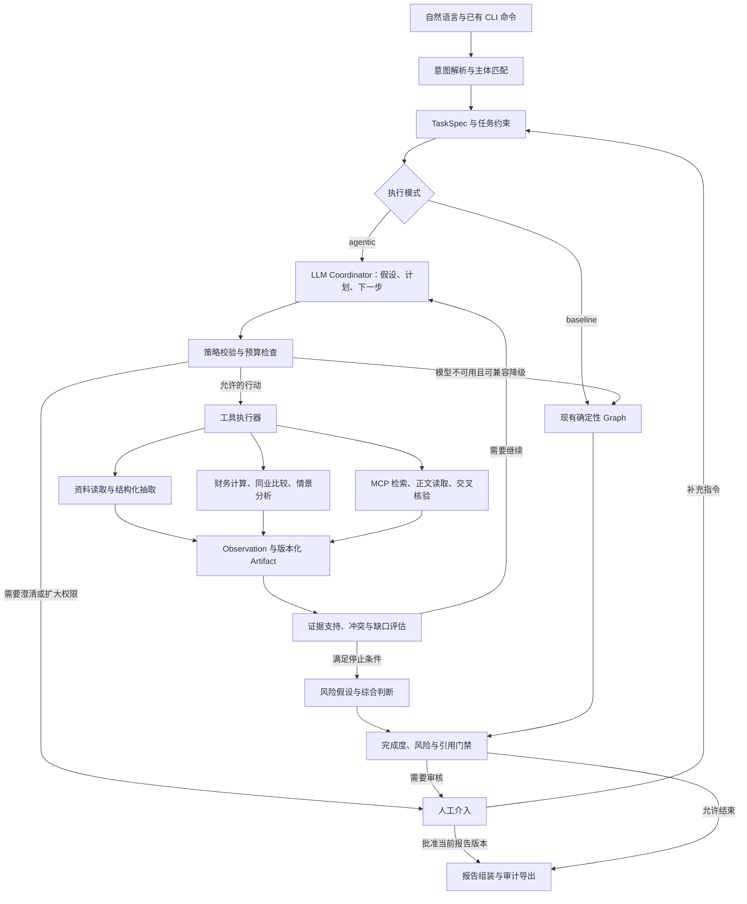

# Credra Agent 自主调查架构与演进路线 v2.0（提案）

日期：2026-09-07。状态：**待人工审核的设计提案，尚未实现，也不替代现有开发基线。**

本提案依据当前工作区代码、MVP 需求与开发计划、场景化能力优化计划及开发日志，响应本次“增加 LLM 决策参与、支持自然语言指导、保留默认/降级链路、提高案例复杂度”的要求。当前工作区包含此前未提交修改，设计以实际代码为依据；本轮只实施合成技术样例退出默认入口，比亚迪和上汽保留，完整架构实施在本提案获审后启动。

## 1. 结论与现状

建议把 Credra Agent 演进为：**自然语言指定尽调目标，LLM 持续提出和检验调查假设、选择工具并修订计划，Runtime 保证执行可控、结果可追溯、任务可恢复。**

Agent 能力的增量应该体现在执行决策产生的业务差异上。增加总结节点、思考展示或模型调用次数，并不能单独证明调查能力提升。

| 当前证据 | 当前限制 | 改造方向 |
|---|---|---|
| `app/graph/routing.py`：Financial 后只按 `anomaly_flags` 进入 Research | 没有规则异常时，无法因用户目标、资料缺口或新消息主动调查 | 用户目标、假设、证据缺口都可以触发调查 |
| `app/tools/investigation.py`：固定类别与人工意见关键词映射 | 难以理解否定、时间限制、比较对象和条件指令 | LLM 解析结构化任务约束与计划补丁 |
| `app/llm/research_analysis.py` 与 M4-B 基线：Query Proposal 不执行 | 模型建议无法改变下一步工具行为 | Proposal 经策略校验后成为可执行 Action |
| `app/agents/research.py` 主要传递类别；`app/mcp/research_server.py` 再按模板生成查询 | 即使前端有新 Query，也可能在传递时丢失具体文案 | 增加接收完整查询、时间与来源限制的 MCP 工具，并验证端到端参数传递 |
| `app/models/financial.py`：七项年度输入，五类指标输出 | 缺少季度、债务期限、营运资本、分部和同业口径 | 扩展财务数据契约和可审计计算工具 |
| M4-A/B/C2 已提供解释、摘要和报告草稿 | 模型多数在已有结果上组织表达 | 保留表达能力，把主要建设投入规划、证据判断和分析选择 |
| Checkpoint、Artifact、HITL、Retry、Trace 已存在 | 新循环与旧任务的兼容性需要专项设计 | 复用底座，按 Graph 版本隔离新旧执行 |

比亚迪和上汽资料仍可检验数值与恢复机制，但其有限财务字段和简单风险路径不能代表新架构的能力上限。

## 2. 推荐架构与职责边界

采用一个 Coordinator 决策循环和若干有明确工具边界的能力模块。第一版不引入多 Agent 自由协商、独立服务网络或新编排框架。Financial、Research、Risk 是可由 Coordinator 选择的专业能力；是否内部使用模型由任务性质决定。



整个循环运行在 LangGraph + SQLite Checkpoint 上；Artifact 保存大块资料和版本化结果，State 保存引用、计数和执行必要字段。CLI 和 Chainlit 共用同一个 Runtime。

| 决策/工作 | LLM 的职责 | 确定性系统的职责 |
|---|---|---|
| 任务理解 | 理解主体、时间、优先级、条件与否定 | 主体 ID 匹配、日期标准化、约束冲突检查 |
| 调查规划 | 分解问题、提出竞争假设、选择下一行动 | 校验工具白名单、参数、依赖、授权与预算 |
| 外部检索 | 按假设生成查询、选来源、遇阻调整路线 | 执行网络请求、限流、去重、时间过滤、快照 |
| 证据核验 | 判断语义相关性、是否支持具体主张、识别反证 | 校验证据存在、主体/期间匹配、原文定位、来源血缘 |
| 财务分析 | 决定查什么指标、如何比较、需要何种情景 | Python 执行公式、单位换算、勾稽与统计 |
| 综合判断 | 解释因果候选、区分竞争解释、提出新风险假设 | 保留规则风险基线，执行审核与报告门禁 |
| 停止与转人工 | 建议问题已回答、收益不足或需人工 | 检查覆盖率、关键缺口、硬预算和必审条件 |

事实和推断必须区分：LLM 可以新增“待核验主张”和“有引用的分析推断”，不能直接把推断写成已发生事实；模型自报置信度不能作为单独的采信依据。

## 3. 让 LLM 真正影响流程

### 3.1 循环协议

每轮只提交一个下一行动，或一个小型、无依赖的行动批次。模型可以保留多步计划，但每次得到新观察后要重新检查剩余计划。第一版顺序执行，后续再对独立检索做有界并发。

核心动作：`read_document`、`search_evidence`、`fetch_content`、`verify_claim`、`compute_metrics`、`compare_peers`、`run_scenario`、`ask_user`、`finish`。动作均为拟新增契约，当前尚不存在这套统一 API。

每个 Action 至少包含：`action_id`、`plan_version`、`task_spec_version`、`kind`、`tool_name`、`arguments`、`hypothesis_ids`、`evidence_refs`、`expected_observation`、`reason_summary`。公开原因描述业务依据，例如“确认现金增加是否来自受限资金”，不保存原始思维链。

执行次序：

1. Coordinator 根据 TaskSpec、当前假设、证据索引和预算提出 Action。
2. Pydantic 校验结构；Policy 校验主体、工具参数、来源范围、时间窗口及预算。
3. Action 与输入指纹先持久化，再交给 Executor。
4. 工具返回结构化 Observation：成功、无结果、不可访问、数据缺失或执行失败；这些状态不能混用。
5. Evidence Assessor 更新支持、反驳、冲突和未知项；Coordinator 决定继续、换来源、调整分析或请求结束。

例如，首次检索发现“现金增加”不能结束偿债分析：Coordinator 可以读取受限资金附注，再计算可用现金与短债差额；发现口径不同则先统一合并/母公司口径；发现关键资料缺失则明确保留未决问题。这条路径必须在工具调用与新 Artifact 中可观察。

### 3.2 有界自主性

第一轮试验建议：最多 12 个决策轮次、20 次外部工具请求、2 次连续无新增有效证据后必须换策略或结束；另设整任务活跃执行时间和模型 Token 上限。这些是待调参初值，必须由 Eval 验证，不能当成已验证最优值。

预算由 Runtime 计账，覆盖 LLM 重试、核验调用、检索扇出和 fallback；`search_company` 内部多次请求不能只记一次外部请求。执行前预留额度，执行后结算；没有可靠费用计价时记录 Token/请求数并标记费用未知。暂停等待用户不消耗活跃执行时间。现有流式读取空闲超时不能替代整任务硬截止。

`finish` 只是模型建议，Completion Gate 必须确认：必答问题已有支持或明确缺口、重要冲突已处理或交给人工、引用有效、审核要求满足。预算耗尽产生“受限完成/需人工”原因，不能伪装成完整尽调。

重复查询检测同时使用标准化参数、证据增量与失败原因；来源刚更新时可允许带理由刷新。Tool 参数非法时把结构化错误反馈给模型，最多有限次修正，随后降级或转人工。

### 3.3 默认链路与 fallback

将执行控制与表达控制分开：拟新增 `EXECUTION_MODE=baseline|shadow|agentic`，现有 `ANALYSIS_MODE` 继续控制解释与报告表达。配置名称为提案，本轮不增加配置字段或修改 `.env`。

| 模式 | 行为 | 用途 |
|---|---|---|
| baseline | 执行当前 Graph | 离线基线、旧任务恢复、简单固定输入 |
| shadow | 记录模型计划但不执行其工具选择，实际走 baseline | 检查计划合法性；不能据此声称自主调查已成功 |
| agentic | 执行经过校验的 LLM Action 循环 | 自然语言驱动的复杂调查 |

推广顺序：baseline 默认 → 显式 agentic 试验 → 通过质量/恢复/成本门禁后，新自然语言任务默认 agentic；旧任务始终按创建时 Graph 版本运行。

模型超时或 Schema 持续失败时，可以复用已经完成的规范化资料、计算和已核验证据进入 baseline。每次降级记录触发原因、未完成目标和覆盖范围。若 baseline 无法满足“仅限指定来源”“必须比较同业”等用户约束，则转为部分报告或请求用户处理，不能静默放宽条件。不存在可用结构化输入时，旧 Graph 不能充当万能 fallback。

## 4. 自然语言与流程联通

### 4.1 TaskSpec

自然语言只解释为用户权限范围内的结构化请求；解析器不直接执行工具。建议输出以下契约：

| 字段 | 内容 |
|---|---|
| `operation` | 创建、查看、修改计划、暂停、恢复、审核报告 |
| `subject` / `peer_subjects` | 主体 ID、法定名称、别名、合并范围、同业候选 |
| `as_of` / `periods` | 知识截止时间、财务期间、事件检索窗口 |
| `questions` | 必答问题、优先级与完成标准 |
| `source_policy` | 首选/允许/禁止来源；“优先官方”和“仅限官方”语义不同 |
| `analysis_requests` | 指标、比较口径、情景参数及其依据 |
| `constraints` | 时间、Token、工具请求预算、禁止行为 |
| `conditional_instructions` | 例如“若出现逾期线索，再调查担保链” |
| `assumptions` / `unresolved_fields` | 明示假设与需要澄清的歧义 |
| `version` / `source_message_id` | 版本及指令来源，支持恢复与审计 |

“最近三年”按任务创建时的 `as_of` 和已公布完整报告解释并展示实际年份；“去年”不能在恢复时重新计算。未知企业不自动套用已有 Case：先完成主体定位和资料建档。第一阶段自然语言入口只承诺对已导入主体生效，开放企业发现属于后续数据接入阶段。

### 4.2 交互样例与验收

以下企业名称都是**合成测试主体**，不影射真实企业。

| 用户表达 | 解析和行为 |
|---|---|
| “分析示例制造甲公司 2022–2024 年的偿债压力，重点看回款；先查公告，再看媒体。” | 创建任务；优先应收及短债分析，按来源优先级检索 |
| “先不要看行业消息，只核对这条担保公告是否与母公司有关。” | 缩小调查范围，解析主体关系，读取公告；暂不执行行业查询 |
| “如果经营现金流主要靠延迟付款改善，再看看供应商和票据风险。” | 保存条件指令，先核验现金流解释，满足条件再扩展问题 |
| “换成合并报表口径，并与两家业务相近公司比较。” | 更新 TaskSpec 版本，相关旧计算与报告标记过期，生成受口径约束的比较任务 |
| “这条消息指的是另一家同名公司，不要采信。” | 保存用户纠正并重新核验实体关系；不自动删除历史证据 |
| “批准这版报告，继续生成。” | 仅当任务处于对应审核点且报告版本未变时，映射为现有批准继续语义 |
| “别管风险，直接给贷款通过结论。” | 不映射为报告审核批准；保持项目不自动决策授信的边界 |

只有主体歧义、关键口径冲突、权限/预算扩大等实质问题才要求澄清。普通合法的调查指令可以直接进入执行，同时展示“我将重点调查什么”。

### 4.3 运行中的新指令

消息先写入持久化指令队列，Coordinator 在行动边界消费。每个修改携带 `expected_task_spec_version`，冲突时拒绝旧版本写入。暂停请求阻止下一动作，已发出的只读请求可以完成并记录；不能承诺撤销已发生的网络调用。

计划、计算、风险分析、报告及审核都记录输入版本。主体、期间、证据或口径变化时，只重新执行受影响的部分；旧报告审核不得自动授权新版报告。UI 展示计划变更和未完成问题，而非只显示固定六节点进度。

## 5. 多渠道采信与复杂数据分析

### 5.1 渠道设计

渠道按业务来源分类，Provider 只是接入方式。Tavily 返回五个站点不等于五个独立证据源；多个媒体转载同一公告只能算一条来源链。

| 来源类别 | 主要用途 | 接入阶段与局限 |
|---|---|---|
| 交易所/公告披露平台/企业投资者关系 | 财报、问询回复、担保、债券、重大事项 | 首批；公开网页和可下载文件，优先原始公告 |
| 企业报告附注、审计意见、经营月报 | 财务口径、受限资产、业务量、审计保留事项 | 首批；人工整理 + 受控解析，保留页码/表格 |
| 监管与司法公开材料 | 处罚、裁判、执行等事件线索 | 次批；逐一验证可访问性与实体匹配，不承诺匿名 API |
| 统计部门、行业协会、价格与产销数据 | 判断需求、价格、库存周期的行业解释 | 次批；频率和定义不一致时不能直接拼接 |
| 评级报告、债券募集说明书 | 偿债期限、担保、评级事件与流动性假设 | 首批可人工导入公开材料；区分评级意见和事实 |
| 财经媒体、公司澄清、公开互动问答 | 事件发现、时间线与正反陈述 | 首批；媒体线索需交叉核验，企业澄清也不是独立确认 |
| 用户授权的内部经营资料 | 账龄、借款清单、合同、客户集中度 | 后续可选；首版仅本地分析，不发送全文至外部搜索服务 |

本次只核对了[巨潮资讯](https://www.cninfo.com.cn/new/index)和[上交所公告入口](https://www.sse.com.cn/disclosure/listedinfo/announcement/)作为公开材料候选入口；未实现新的数据连接，也未验证上述全部渠道的下载稳定性、授权条件或 API。接入阶段先做每类一个真实文件的契约 Spike；不可访问来源支持用户导入，并显示覆盖缺口。

### 5.2 证据契约与采信

证据至少记录：来源 URL/本地文件 ID、发布者、原始文档 ID、哈希、发布日期、事件日期、抓取日期、主体关系、财务期间、页码/表格/段落、原文片段、转载关系、提取方法、核验版本。

把“来源可靠性”“这段话是否支持主张”“是否有独立印证”拆开，避免一个 `confidence` 混合三个问题。主张状态建议为待核验、已支持、存在反证、冲突、无法核验；与现有 Evidence/Verifier 状态建立显式映射，不能覆盖老 Artifact 的语义。

采信规则：公告可以证明其披露了某事项，但并不自动证明其中所有预测成立；行业下行不自动推出企业违约；找不到处罚信息不等于证明不存在处罚。重大负面主张优先要求原始材料，或独立来源相互支持；达不到条件时保留为未决线索。纠正公告和重述财报保持时间线，不覆盖旧记录。

外部正文视为资料，不能成为系统指令；工具描述由应用注册，不从网页动态装载。检索、抓取和内容导入继续执行现有网络与路径安全校验。

### 5.3 财务契约和工具扩展

现有七项年度字段不足以直接计算下列分析。必须先扩充 Schema 和字段血缘，再开发工具；缺少分母、不可比期间或不可用字段返回 `NOT_COMPUTABLE` 和原因，不能用 0 补齐。

| 分析问题 | 必须增加的输入 | 确定性计算及边界 |
|---|---|---|
| 利润是否转化为现金 | 扣非利润、经营现金流、应收/票据/合同资产、坏账计提 | 现金利润关系、应收增长与收入增长；净利润非正时不机械套用现金利润比 |
| 回款和库存占用 | 期初期末应收、存货、应付、营业成本、期间天数 | 周转天数和现金转换周期；应付口径/采购额不可得时标记近似口径 |
| 短期偿债压力 | 货币资金、受限资金、短借、一年内到期债务、债务到期表 | 可用现金、短债覆盖、期限缺口；经营现金不能全视为可偿债资金 |
| 利润质量与业务分化 | 非经常损益、资产处置、减值、分部收入/利润、销量/价格 | 扣非变化、分部贡献、价量拆解；合计勾稽不通过先处理口径 |
| 同业比较 | 同期同口径同行数据及业务结构 | 中位数/分位数与差异分析；记录可比性排除理由，不按行业标签随意凑样本 |
| 压力情景 | 回款延迟、毛利变化、融资续作等显式假设 | 现金占用和缺口敏感性；输出是假设下结果，不能称为预测事实 |
| 担保和关联关系 | 担保主体、余额、期限、关联方和公开事件 | 先用关系表与期限表聚合，暂不引入图数据库；不把子公司负面事件直接归因母公司 |

Financial v2 支持年度/季度及合并/母公司维度、字段可缺失、币种和原始单位、重述版本与血缘。货币和聚合运算优先使用 Decimal，展示再格式化。现有“负债不能大于资产”的硬拒绝仅适合旧样例校验；新复杂案例必须允许真实负净资产，并改为一致性检查与风险标记。这是拟变更基线，不能直接删旧断言而不增加新口径验收。

LLM 选择指标与解释异常，Python 执行计算；第一版不让模型生成任意 Python/SQL 执行代码。工具目录明确所需字段、公式版本和适用条件，便于模型判断工具是否能回答问题。

## 6. 新案例体系

案例按“需要什么调查能力”组织，随后选择公开资料足够的真实企业。第一轮使用明确标注的合成材料验证控制流，再补真实文件和人工核对结果；不能把合成新闻绑定到真实企业，也不能把尚未收集的数据写成已接入能力。

| 案例包（拟新增） | 材料与难点 | 要观察的 Agent 行为 |
|---|---|---|
| A：利润增长与回款恶化 | 三个完整年度 + 四个季度财务、应收附注、问询与回复、行业数据、媒体及澄清 | 主动区分赊销增长、季节性、渠道压货等解释，补查支持与反证后调整结论 |
| B：现金充足但短债承压 | 受限资金、债务期限、融资/评级文件、关联担保、公开争议材料 | 发现账面现金不等于可用现金，重新计算覆盖和担保压力，关键缺口触发人工 |
| C：消息冲突与主体混淆 | 原始公告、后续更正、转载、同名企业消息、子公司事件、失效链接 | 追溯原文，去除伪多源印证，处理主体边界，保留冲突状态 |
| D：同业差异与压力情景 | 主体及 2–3 家可比企业数据、分部结构、行业价格/销量、显式压力参数 | 解释选取/排除同行理由，计算敏感性，接受中途修改假设并使旧报告失效 |

首个旗舰案例将 A 的回款问题与 C 的冲突证据组合，避免一次堆满所有财务和关系能力。首包目标为 4 类以上业务来源、12–20 份可追溯材料，至少包含一次资料缺失、一次证据冲突、一个主体误匹配和一次用户中途改计划。文件数只是素材门槛，验收仍以问题解决质量为准。

每个案例包提供：材料目录与哈希、截止日期、结构化财务输入、可核验主张、禁止采信项、必答问题、允许的行动/偏序关系、停止条件和人工 rubric。真实材料只使用截止日之前已公布版本，防止评测泄漏未来信息。

样例展示：按用户澄清，首页隐藏 `case_normal`、`case_risky` 两个合成技术样例，`case_byd_002594`、`case_saic_600104` 继续展示。原有默认 `auto_manufacturers_v1` Eval 保留，不要求显式传入 Suite。隐藏样例的源文件、历史 runs、Checkpoint 和预期答案保留，以兼容回归和恢复。复杂新案例在后续阶段建设，不将旧例改名冒充新案例。

## 7. 状态、恢复和代码落点

### 7.1 状态和产物

拟新增 State 引用：`task_spec_ref`、`plan_ref`、`hypotheses_ref`、`evidence_index_ref`、`coverage_ref`、`assessment_ref`，以及 `graph_version`、`execution_mode`、`active_action_id`、`iteration`、`budget_ledger_ref`、`stop_reason`、`pending_instruction_version`。新增版本化 Artifact 保存完整内容。模型上下文按当前问题读取索引和相关片段，不把全部原文或对话塞入 State。

风险输出并列保存 `rule_risk_level` 与带依据的 `agent_assessment`，第一版不让模型覆盖既有规则等级。必审条件扩展为规则中高风险、重要未决冲突、模型提出且尚未审定的重大新风险、关键数据不足等。后续是否采用新的综合评级政策，应单独审核；“报告审核通过”始终不等于“授信通过”。

### 7.2 恢复约束

Coordinator 决策、Action 执行和审核节点分离，避免一个长 Node 内循环多轮导致恢复时重新规划。Action 以任务、计划版本、动作 ID 和标准化参数指纹绑定结果；已完成结果可重放。持久化执行账本区分 `PENDING/RUNNING/SUCCEEDED/FAILED`。

进程在“请求成功但结果未落盘”之间崩溃时，不能承诺外部服务 exactly-once；只读检索允许有记录的重试，结果按指纹去重，调用预算按可能已发生保守计账。引入外部写操作之前必须另外设计幂等协议与授权。

新增等待澄清/受限完成语义时，要同步 Runtime、CLI、UI、审计导出和 Eval，不能仅扩展 Graph 的 Enum。旧 Checkpoint 缺少版本字段时显式按 legacy Graph 加载；旧审批节点与状态结构保留，使用原 Run ID 恢复。新旧 Graph 的切换不是在运行中更换 `build_graph()`。

### 7.3 渐进代码组织

当前真实模块根为 `app/`，而项目约定语义包名为 `credra_agent`。新增实现建议放入 `credra_agent/`，`app/` 在迁移期作为兼容入口和旧 Graph；避免同一阶段同时大规模改包名、改路由、改数据契约。新增包不复制旧 Runtime，通过适配调用，再逐阶段迁移单一职责。

```text
credra_agent/
  intent/         # TaskSpec、意图解析、主体解析、指令补丁
  planning/       # Coordinator、假设、行动决策、覆盖评估
  execution/      # Action 策略、执行器、预算、动作账本
  evidence/       # 主张、支持/冲突关系、来源血缘
  analysis/       # 新财务契约、指标、同业、情景
  graph/          # agentic Graph 与版本入口
  prompts/        # 新用途的外置 Prompt
app/
  graph/          # 保留 legacy Graph 与路由
  runtime/        # 先复用现有任务持久化、Trace
  llm/            # 先复用结构化网关，按用途配置输出与预算
  mcp/            # 保留旧工具，增量扩展完整查询工具
```

关键改动点：`app/runtime/tasks.py` 增加版本化任务创建/恢复分发；`app/mcp/research_client.py` 和 `research_server.py` 增加完整 Action 参数通道；`app/chainlit_app.py` 新增自然语言适配和动态计划展示；`app/report_expression.py` 扩充新指标/推断引用白名单。以上均为后续实施范围，本轮未改。

## 8. 分阶段路线与门禁

以下为单人有效开发工时估算，含定向测试与日志，不含等待数据访问、人工审核或大规模通用 OCR。每阶段完成后准备聚焦提交，按 AGENTS.md 展示文件、摘要和提交信息，等待人工批准后才执行 commit。

| 阶段 | 工作与交付 | 阶段门禁 | 估算 |
|---|---|---|---|
| V2-0：设计收口与契约 | 审核本提案；明确 TaskSpec/Action/Evidence/Financial v2 契约；固定旧回归；准备 A+C 小型合成包 | 新旧边界、预算、停止条件和能力 rubric 可审核；不改原基线前先获批准 | 6–10h |
| V2-1：最小自主调查链路 | 已导入主体的自然语言入口；Coordinator + Policy + Executor；完整查询参数 MCP；循环与预算；baseline fallback | 两种表达触发不同工具行为；新证据使下一步改变；真实 Query 到达 Provider；无效动作被拒；崩溃后不重做已落盘动作 | 18–28h |
| V2-2：多渠道证据与新首例 | A+C 旗舰包；主体关联、时间线、去重、冲突、原文定位；真实材料人工对照 | 达到第 6 节素材门槛；混淆和转载负例被处理；模型不能自行升级证据状态；不可访问渠道有明确缺口 | 20–30h |
| V2-3：财务深度 | Financial v2；现金质量、营运资本、债务期限；B 案例；再加入同业和情景 D | 逐项对照人工算例；单位/期间/合并口径正确；缺失和负净资产可表示；情景与事实分开 | 18–28h |
| V2-4：多轮指令与恢复体验 | 持久化新指令、计划变更、动态 UI、旧报告失效、审核版本绑定 | 运行中改范围、暂停、关进程、重启、Resume 可验收；旧 checkpoint 兼容；浏览器不维护第二份业务真值 | 12–20h |
| V2-5：对照评测与上线默认值 | 固定场景 Eval、真实模型纵向验收、成本/时间统计、故障矩阵；选择是否启用新任务默认 agentic | 无硬门禁回归；关键复杂问题质量优于 baseline；公布成功/失败、成本与恢复证据；默认值变更经审核 | 12–18h |

总计约 86–134h。优先做到 V2-2，形成“自然语言 → 模型决策 → 工具 → 新证据 → 重规划 → 可追溯结论”的完整演示；再扩展更多财务指标。V2-1 已包含基础恢复门禁，不能将新循环的持久化全部推迟到 V2-4。

M4-E 两阶段流式网关继续复用，但不默认每个细小动作都调用两阶段思考；按用途和 Eval 决定是否需要。长输出/证据判断可以使用更高预算，意图解析采用较小输入和 Schema。具体模型与费用依据用户 Provider 和实测，不在本提案硬编码。

后续优化顺序：以测得的重复调用率做查询缓存和内容去重；以延迟分解决定有界并发；以证据召回瓶颈决定结构化索引/检索；只有任务并发和 SQLite 写入成为瓶颈后再评估 PostgreSQL/队列。跨任务长期记忆、任意代码执行、多服务 Agent 协商和 A2A 暂不进入首轮。

## 9. 怎样证明优化有效

对同一冻结素材分别运行 baseline 与 agentic；确定性测试固定模型响应和工具快照，真实模型评测使用独立留出问题。不能要求 Agent 路径逐节点固定，但可以要求必须先核验某主张再进入特定分析、不得访问被禁来源、重大缺口必须披露。

| 维度 | 度量与建议门禁 |
|---|---|
| 指令理解 | 主体/时间/否定/条件/来源约束的槽位与行为正确率；先构造不少于 30 条含歧义的指令，关键约束测试必须全部通过 |
| 决策有效性 | 新证据是否触发正确的下一步；至少有未触发规则异常但主动调查、证据冲突改查原文、中途修改分析三个成功场景 |
| 证据质量 | 支持准确率、关键材料召回、冲突发现率、引用完整性；固定关键主张不存在无支持结论，单独报告未知项 |
| 财务正确性 | 人工算例容差内一致；单位/口径错配、缺失分母和未来材料使用均为硬失败 |
| 完成质量 | 人工 rubric 逐问题评分，对照 baseline；不能用字数、工具次数或思考长度替代答案质量 |
| 运行可靠性 | JSON 错误、模型超时、MCP 超时、断网、无结果、循环、预算耗尽、进程崩溃、恢复、审核过期均覆盖 |
| 效率 | 每任务总 Token、外部请求、重复查询率、活跃耗时和等待耗时；报告均值及分布，不虚构未测成本 |
| 自主性收益 | baseline 无法回答的复杂问题中，agentic 新增了多少有证据支持的答案；人工介入原因分别计数，不能简单追求次数越少越好 |

首轮每个旗舰场景至少重复运行 3 次，明确这是小样本工程验收而非统计稳定性证明。上线阈值在 V2-0 固定：硬门禁必须全部通过；建议人工 rubric 平均至少 4/5，且预先定义的复杂问题得分优于 baseline，再结合实测成本决定默认模式。LLM Judge 只能辅助，核心事实/计算和最终验收使用人工基线。

## 10. 基线变更清单与本轮状态

需要人工审核的新基线差异：

1. MVP 的纯规则 Coordinator → 在权限和预算内执行 LLM 行动选择。
2. M4-B 的 Query Proposal 永不执行 → 新 agentic 契约允许校验后执行；旧模式保留原语义。
3. 仅规则异常触发调查 → 目标、假设、缺口和冲突也可触发。
4. 固定七字段年度 Schema → 可追溯、多期间、多口径财务契约。
5. 固定六节点展示与两种业务决策 → 增加计划、指令版本、澄清与受限完成语义。
6. 长任务没有整体执行预算 → 增加覆盖所有子调用和重试的任务硬预算。

本轮已实施范围仅为隐藏两个合成技术样例及配套说明/回归；完整新架构、自然语言解析器、多渠道连接和复杂案例材料均为待实施项。原始需求分析、开发计划与场景化优化计划不被本提案覆盖。原有未提交改动保留；`.env` 未修改；没有创建 Git 提交。

框架依据核对于 2026-09-07：[LangGraph 的 Workflow/Agent 区分](https://docs.langchain.com/oss/python/langgraph/workflows-agents)支持在现有编排底座组合固定路径与动态工具选择；[持久化说明](https://docs.langchain.com/oss/python/langgraph/persistence)和[Interrupt 说明](https://docs.langchain.com/oss/python/langgraph/interrupts)用于核对恢复设计方向。具体 API 行为仍须在项目已锁定版本上做 Spike，不根据在线文档自动升级依赖。本提案中的业务策略、预算、数据契约与路线是针对本项目的设计建议，不是框架自带能力。

## 11. 本轮拟提交范围（未提交，待人工审核）

建议提交信息：`docs(architecture): propose agentic redesign and hide synthetic demo cases`

| 文件 | 本轮修改摘要 |
|---|---|
| `docs/Credra Agent 自主调查架构与演进路线 v2.0（提案）.md` | 新增完整架构、数据/案例设计、迁移路线及门禁 |
| `app/cases.py` | 标记 case_normal/case_risky 两个隐藏技术样例 ID |
| `app/chainlit_app.py` | 默认目录隐藏合成技术样例，保留比亚迪/上汽与显式全部预检 |
| `tests/test_chainlit_ui.py` | 验证两个技术样例隐藏、两个真实案例可见、全部预检可用 |
| `README.md` | 提案入口与正确的样例隐藏范围说明 |
| `docs/演示指南.md` | 说明技术样例隐藏但 CLI 回归仍可用，保留原有真实案例演示与 Eval |
| `docs/开发日志.md` | 记录本次需求差异、实际改动与验证结果 |

上述多份文件另有本轮开始前的修改，当前索引中也已有暂存内容；提交审核应只选本轮相关片段，不将此前流式 LLM、UI 实时进度等修改合并进来。本轮不改变暂存区，不创建提交。架构基线审核与 Git 提交审核是两个独立事项，对提案方向的认可不自动视为 commit 授权。
