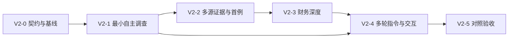
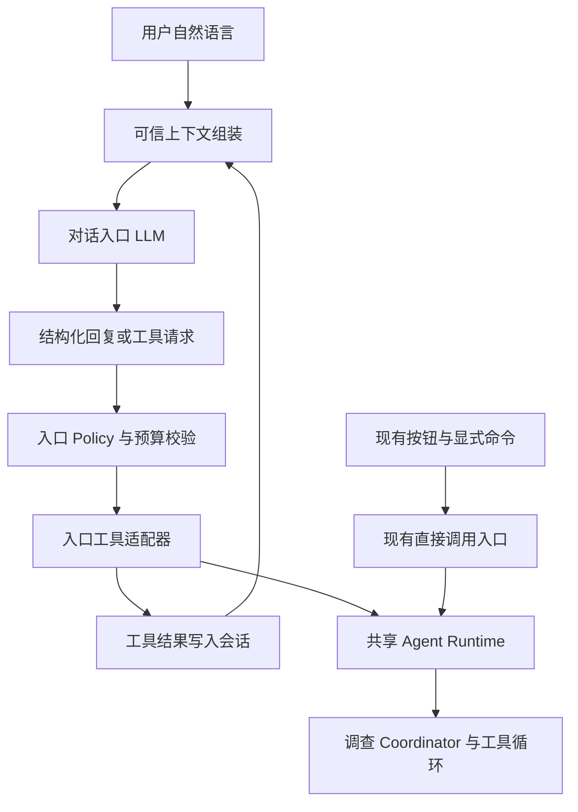

# Credra Agent 自主调查架构开发计划 v2.0

制定日期：2026-09-07。产品名称：Credra Agent。代码基线：`ce7dede`。计划依据：[自主调查架构与演进路线 v2.0](Credra%20Agent%20自主调查架构与演进路线%20v2.0（提案）.md)。

**状态说明：制定时仅交付开发计划，工作包从 `NOT_STARTED` 开始；后续实施事实不追溯改写初始验收记录。2026-09-15 当前进展：P25/P26/P24 已提交，当前基线为 `651ba20`；P26-4/E01–E09 技术验证及真实入口探索见第 6.2.16 节，E10 正式人工评分仍单独待验收。D04 已确认比亚迪2025/2024、资料截止2026-04-02，P24 输入、材料、期间及报告引用见第 6.3–6.5 节。P23 人工答案草案、同材料离线对照、证据/计算/报告及实际 UI 消息联合链路见第 6.6 节；离线技术项和标准门禁已通过，精确版本模型已有一份技术 PASS 候选，但多轮结果仍不稳定，五项人工评分与 G2 保持待审核。**

后续入口、日志优化和对应使用/验收记录统一维护在本计划：P25 见第 6.1.1–6.1.2 节，P26 见第 6.2 节，文本日志见第 10.5 节；实施事实与设计偏差继续记入既有《开发日志》。

## 1. 计划目标与边界

本计划将已认可的演进路线转化为可逐阶段实施、验收和审核提交的工作包。首个目标交付是：用户用自然语言提出尽调问题，LLM 选择并执行合适的只读工具，依据新证据修订调查计划，在预算和审核约束内形成可追溯结论；任务暂停或进程退出后能够继续。

项目成功的主要证据是“模型决策改变了工具行为，并解决了更多有证据支持的问题”，而非模型节点数量或报告长度。

### 1.1 已确认的设计约束

| 编号 | 实施约束 |
|---|---|
| R01 | 使用一个 Coordinator 决策循环，首版顺序执行；不引入多 Agent 自由协商或独立服务网络 |
| R02 | 模型负责意图理解、假设、工具选择、重规划与停止建议；执行前由 Policy 校验 |
| R03 | 保留 baseline Graph；新增 shadow/agentic 与现有表达模式分离，旧任务按创建时版本恢复 |
| R04 | 自然语言先支持已导入主体；包括时间、来源优先级/限制、否定与条件指令，后续支持运行中修订 |
| R05 | 财务数值由 Python 计算；证据、待核验主张、分析推断和假设情景分别记录 |
| R06 | 规则风险等级保留，模型评估单独保存；不自动批准/拒绝贷款或生成授信额度 |
| R07 | 使用现有 LangGraph、SQLite、MCP、Artifact、Retry、Trace 和结构化模型网关，依赖版本以仓库锁定值为准 |
| R08 | 首页隐藏 `case_normal`/`case_risky`，保留其数据和回归用途；比亚迪、上汽及现有默认 Eval 保留 |
| R09 | 首例先深化比亚迪或上汽，围绕回款/现金质量与冲突证据形成可验证问题；首例所需最小财务扩展前置到 V2-2，其余扩展及新企业后续建设 |
| R10 | 新包语义名为 `credra_agent`；`app` 兼容入口与旧 Graph 渐进保留，不同步进行大规模包重命名 |
| R11 | `.env` 由用户维护；配置通知通过 `.env.example` 和文档，配置验证不输出真实密钥 |
| R12 | 设计偏差先记录并确认；每个关键节点提交前必须展示本次文件、摘要和建议提交信息，等待明确 commit 批准 |
| R13 | 全服务统一日志：每次整套服务启动使用一个启动批次，包含 MCP 子进程；单文件按 10 MB 轮转；节点变化、任务状态变化、LLM 调用返回状态及运行异常均有可关联记录 |
| R14 | 计划编号只用于计划和实施追踪；生产模块、测试、CLI、Schema、运行标识和 Prompt 版本按稳定的功能/领域语义命名 |
| R15 | 新模块必须具有清晰、可独立说明的职责；现有模块能够自然承载时不为单个步骤创建文件，测试文件与被测功能对应 |
| R16 | 实施与验证文档按 `V2-x` 大阶段维护，每阶段最多一份；单个工作包只更新阶段记录和开发日志，不新增独立实施文档 |

本计划细化已获认可的 V2 方向，不追溯覆盖 MVP 的原始验收事实。对于 legacy 模式继续适用旧需求与计划；对于新 agentic 行为，以认可的架构及本计划经确认的条目为依据。后续遇到冲突或缺少决定时，应先向用户确认，不自动放宽约束或缩减验收。

### 1.2 初始规划交付与后续开发交付分开

制定时规划交付：本开发计划、架构文档的审核状态记录、开发日志。该规划轮不改 Python、Prompt、依赖、配置示例、数据、测试或 Git 暂存区，不执行 Git 提交。

后续完整开发交付：版本化 Agent Runtime、全服务启动归档与轮转日志、自然语言入口、可执行 MCP 查询、证据评估与冲突处理、财务分析扩展、复杂案例包、动态计划工作台、回归/Eval、演示与审计材料。所有开发工作包初始状态为 `NOT_STARTED`，已认可架构不等于这些能力已经完成。当前补充实施记录见对应章节，规划说明不替代验收证据。

### 1.3 新增代码与文档的组织规范

开发计划中的 `Pxx` 是排期和验收索引，不是领域模型。新增生产文件时先写明它负责的稳定能力、输入输出和调用边界，再选择领域名称；例如复杂案例的冻结材料回放使用 `complex_case_replay`，不使用工作包编号。相同规则适用于测试文件、CLI 子命令、Schema 版本、运行 ID、日志事件和 Prompt 版本。测试文件应能从名称直接对应被测能力，测试函数描述触发条件与可观察结果。

只有当职责无法自然归入现有模块、并且具备独立演进边界时才新增代码文件。一次性迁移、单个修复或开发步骤不得成为长期模块；公共接口和持久化名称变更必须记录兼容、恢复及迁移影响。

文档分为需求/架构、开发计划、阶段实施与验证记录、开发日志和用户使用说明。单个 `V2-x` 大阶段最多新增一份“实施与验证记录”；P 级步骤将结果追加到该阶段记录，并把实施事实或设计偏差追加到 `docs/开发日志.md`。README 只保留产品定位、快速开始、主要入口和文档索引，不复制阶段进度、长配置清单或逐步验证历史。

## 2. 用户决定与后续确认点

用户要求不确定事项先确认。本节区分当前规划需要的决定和进入相关开发阶段前才具备条件确认的事项；后一类列为明确门禁，不能在开发中自行选定。

| 编号 | 当前问题 | 用户确认结果（2026-09-07） | 对计划的影响 |
|---|---|---|---|
| D01 | 首个复杂真实案例的企业范围 | 先深化比亚迪或上汽，再新增企业 | V2-0 先比较两家现有案例的资料和问题，V2-2 完成其中一家深化；具体主体按 D04 确认 |
| D02 | 必须完成日期或工时上限 | 无；属于验证项目，用户会随时调整计划，不要求准确工时估算 | 采用工作包和阶段门禁，不设固定日期或工时承诺；用户调整优先级时更新计划 |
| D03 | 首例必要的最小财务扩展是否前置 | 同意前置至 V2-2，其余仍放 V2-3 | 新增 P24；V2-2 同时验收证据调查与实质计算，V2-3 只补齐剩余能力 |
| D09 | 单个日志文件的轮转阈值 | 10 MB | 按 UTF-8 编码后的字节数计算，配置值为 10,000,000 字节；写入下一完整记录会越界时先轮转 |
| D10 | 日志启动批次的归属 | 整套服务共用一个启动批次，包含 MCP 子进程 | 根服务创建 startup_id，子进程继承；集中写入同一批次的顺序分卷文件 |

**2026-09-12 已确认追加：** 当前 P22 保留 thinking 摘要与独立结构化 JSON 两段请求，后续加入“一次原生结构化输出 vs 两段分析＋JSON”的对照验证，见第 9.1 节。该验证不自动切换当前策略，不改变 P24→P23 的开发顺序；真实试跑的模型能力、规模和预算仍按 D05/D06/D07 确认。

**2026-09-12 已确认追加：** 在当前 V2-2 增补 P25“UI 最小执行闭环与流程验证”，见第 6.1 节。配置启用后，自然语言任务可在界面内完成澄清、可信策略授权、Agent 执行和结果查看，不再要求用户切换到 CLI。本次认可的是开发与验证计划；实际预算仍按 D05 确认，V2-4 完整工作台和 V2-5/D08 全局默认模式决策保留。

以下事项在对应阶段开始前提交可审核材料，再确认：

| 编号 | 确认内容 | 最晚门禁 | 确认前允许做的工作 |
|---|---|---|---|
| D04 | 比亚迪与上汽先深化哪家、期间、材料清单与必答问题；不预设企业必然存在某种风险 | 2026-09-14 已确认 | 比亚迪2025年度、比较2024、资料截止2026-04-02，独立Case、三项必答问题及12–20份材料范围；实际冻结清单见第6.4节 |
| D05 | 每任务 Token、活跃时长、真实模型/搜索试跑费用或调用上限 | V2-1 首次真实调用前 | 完成计账契约、Mock、Snapshot 和限额测试；不开始未获授权的付费试跑 |
| D06 | 需要新增或付费来源、模型更换、依赖升级、通用 OCR 等路线外能力 | 对应动作实施前 | 提交兼容性/可访问性调查及影响说明 |
| D07 | 正式验收评分表、不可接受错误及真实试跑规模 | V2-0 评分基线冻结前；预算与次数需在真实试跑前一致 | 形成逐问题 rubric 与建议门槛，不用自评代替审核 |
| D08 | 是否把新自然语言任务默认模式切换为 agentic | V2-5 | 提交质量、成本、恢复和回退证据；此前默认仍为 baseline |

12 个决策轮次、20 次外部请求和连续 2 次无证据增量是演进路线给出的**试验候选值**；本计划不把它们升级为已验证的发布默认值。参数契约、试验结果及最终值需分别记录。所有真实调用的预算覆盖模型、搜索、正文抓取、核验、重试和 fallback。

## 3. 阶段与依赖总览

| 阶段 | 阶段交付 | 前置条件 | 推进标准 |
|---|---|---|---|
| V2-0 | 契约、基线、日志设计、素材可行性与评分表 | 架构认可；规划决定已记录 | G0：契约与验收依据明确 |
| V2-1 | 全服务日志与已导入主体的最小自主调查闭环 | V2-0 门禁通过 | G1：执行可观测、决策真实改变执行且可恢复 |
| V2-2 | 多渠道证据、UI 最小执行闭环、最小财务扩展与现有企业深化首例 | V2-1 门禁通过；D04 已确认 | G2：证据与计算共同回答复杂问题，且能从 UI 发起并查看结果 |
| V2-3 | 财务深度、短债担保、同业与情景 | 财务契约冻结；V2-2 门禁通过 | G3：新增分析可计算、可引用、可复核 |
| V2-4 | 运行中指令、版本化审核与完整交互 | V2-1 恢复机制、V2-2/3 Artifact 契约稳定 | G4：变更、暂停、恢复及审核一致 |
| V2-5 | 对照评测、故障验收、默认值决策与展示 | V2-1 至 V2-4 验收完成 | G5：有质量、可靠性与成本证据 |

本项目按验证进展调整，不以原演进路线的工时区间作为本开发计划的进度约束。每完成一个工作包，记录实际结果、残留问题和下一步；用户可随时调整优先级。调整涉及未完成的依赖、验收口径或架构边界时，先说明影响并确认，再更新计划。

第一批能力交付截止于 V2-2；完整能力交付截止于 V2-5。基础 Checkpoint/Resume、预算和澄清能力必须随 V2-1 落地，V2-4 扩展的是运行中的指令与 UI 完整体验。



## 4. V2-0：契约、基线与实施准备

目标：开发前把“哪些内容可由模型决定、如何执行、如何停止、如何恢复、怎样算通过”明确为契约，避免先堆 Prompt 再补运行约束。

| 工作包 | 具体任务 | 交付物 |
|---|---|---|
| P00 基线冻结 | 记录代码版本、环境和既有用例结果；保存去敏的 legacy 等待审核与已完成任务样本；确认入口与包迁移边界 | 基线记录、兼容样本、检查结果；历史 179 项通过记录仅作参考，实施时重新核验 |
| P01 输入与执行契约 | 定义 TaskSpec、Plan、Hypothesis、Action、Observation、Coverage、BudgetLedger、GraphVersion；区分缺失与失败、业务停止与技术失败 | 结构化契约文档、最小 JSON 示例和适用版本；实现阶段使用 Pydantic 验证 |
| P02 证据与财务契约 | 明确 Evidence/Claim/Assessment 的映射与引用；Financial v2 的期间、合并口径、单位、缺失值、负净资产和血缘 | 数据契约与 v1 兼容表；先定数据表达，不代表所有指标在本阶段实现 |
| P03 案例与评分设计 | 按 D01 做首例素材可行性摸底；设计明确标注的 A+C 合成控制流样本；建立至少 30 条自然语言指令和逐问题评分表 | 素材可行性清单、合成 Fixture 规格、rubric、硬失败清单 |
| P04 全服务日志契约与 Spike | 冻结第 10.4 节事件/字段/归档规则；验证 Windows 上主进程汇聚 MCP 日志、单写入者轮转、退出刷新、协议隔离及与现有 Trace 的桥接 | 日志契约、独立进程汇聚/轮转 Spike、覆盖清单；发现框架兼容问题先确认处理方案 |

门禁 G0：

- TaskSpec 的歧义字段可以触发澄清，工具动作可以表达所需来源和期间限制。
- 每个动作能关联任务/计划版本、预算和结果；停止原因能跨 Runtime、UI、报告和导出一致表达。
- 明确旧 Graph 无版本字段时的处理方式，以及“请求已发生但结果未落盘”的恢复策略。
- 比亚迪与上汽有材料可行性对照；真实主体不必满足预设风险结论，如两家材料均不适合目标问题，先提交问题调整或后续新企业建议确认，不能强行套用。
- P24 的最小财务字段、公式候选和 P23 首例验收依赖明确；评分与预算待决项设为阻塞相应动作的门禁。
- 全服务日志采用已确认的 10 MB/整套启动批次语义；P04 证明子进程事件可被可靠关联与汇聚，日志不会混入 MCP 协议 stdout。

此阶段可以运行已有离线验证和小型契约测试，不接入新的真实业务渠道，不修改旧 Case 数值和人工答案。提交节点为“V2 契约与基线准备”。

## 5. V2-1：最小自主调查纵向链路

### 5.1 工作包与顺序

| 工作包 | 依赖 | 具体实现 | 主要代码落点（拟） |
|---|---|---|---|
| P15 全服务日志基础设施 | G0/P04，先于 P10/P11 集成 | 统一初始化、startup_id、主进程集中写入、MCP 日志汇聚、10 MB 顺序分卷、异常与状态事件、脱敏、Trace 桥接；先覆盖现有 baseline 服务再接新循环 | `credra_agent/observability/`、各 CLI/Chainlit/MCP 启动入口、`app/runtime/tracing.py`、`app/llm/gateway.py`、配置示例与 `.gitignore` |
| P10 TaskSpec 入口 | G0/P15 | 对已导入主体解析自然语言；固定 as_of；区分优先/仅限、否定、条件；必要澄清可持久化；保留既有命令入口 | `credra_agent/intent/`、`app/task_cli.py`、`app/chainlit_app.py` |
| P11 Action 执行通道 | P01/P02/P15 | 注册只读工具及参数 Schema；新增接收完整 query、主体、日期、来源限制的 MCP 通道；旧工具不改调用语义 | `credra_agent/execution/`、`app/mcp/research_client.py`、`app/mcp/research_server.py` |
| P12 Coordinator 循环 | P10/P11 | TaskSpec + 当前假设 + 索引 → 一次 Action → Observation → 覆盖评估 → 下一步；业务原因摘要外置 Prompt；不读取全部历史正文 | `credra_agent/planning/`、`credra_agent/prompts/`、`app/llm/gateway.py` 适配 |
| P13 执行门禁与预算 | P11，与 P12 一同集成 | 参数/来源/范围校验；执行前预留、后结算；重复/无增量处理；finish 审核；兼容约束的 fallback | `credra_agent/execution/`、新 Graph、配置示例 |
| P14 版本与恢复 | P11/P12/P13 | 决策与执行拆 Node；Action 账本先持久化；按 Graph 版本恢复；已有结果重放；澄清/受限完成状态投影 | `credra_agent/graph/`、`app/runtime/tasks.py`、Trace/报告/导出适配 |

顺序要求：先完成 P15，让现有运行路径也有全服务日志；再证明完整 Action 参数能到 Provider，然后接 Coordinator 选择。预算检查和执行账本与真实执行同时接入，不允许先跑无界循环再补。P10 的 UI 是输入/澄清/结果的最小投影，动态计划界面主要在 V2-4。

首版动作集实现 `read_document`、`search_evidence`、`fetch_content`、`verify_claim`、既有 `compute_metrics`、`ask_user`、`finish`。`compare_peers`、`run_scenario` 在对应工具完成前不可被执行；模型选到不可用工具应收到明确错误或能力缺口。

### 5.2 门禁 G1

| 验收 ID | 场景 | 必须出现的证据 |
|---|---|---|
| A10 | 同一企业，分别询问回款和担保 | TaskSpec 和允许执行的 Action 有可解释差异；不能只有最终文案不同 |
| A11 | 财务规则无异常，用户要求核对一条新消息 | 模型主动调查，Trace/Artifact 证明工具被执行 |
| A12 | 首次观察出现反证或缺口 | 下一次 Action 改变查询、资料读取或分析重点 |
| A13 | 自定义查询文本、日期和来源范围 | 客户端、MCP 服务端、Provider 收到同一受控请求；不被类别模板重建覆盖 |
| A14 | 非法工具、超范围来源、无结果、无增量、预算耗尽 | 错误/缺口状态正确；不能静默扩权或无限重试；不能将无结果判为无风险 |
| A15 | 在决策后、请求后、结果落盘后分别中止进程再恢复 | 已落盘 Action 不重复外调；不确定调用窗口有保守计账和去重；不宣称 exactly-once |
| A16 | 旧 Case、旧等待审核任务；新任务模型不可用 | legacy 可恢复；fallback 遵守原 TaskSpec 或明确受限/转人工 |
| A17 | 两次启动、多任务并发、MCP 子进程、日志阈值边界、LLM 失败与恢复 | 第 10.4 节 L01–L08 全部通过；每次启动隔离、分卷连续、节点/任务/LLM 状态可关联且没有敏感内容 |

验收以固定模型响应和 MCP/Provider 测试替身为主；第一次真实模型纵向试跑须完成 D05，记录请求数、Token 和实际失败，不提前承诺费用或成功率。shadow 只验收计划合法性，不能代替 A11/A12 的执行证明。

提交节点建议拆为“全服务日志与启动归档”“意图与执行契约接通”“Coordinator 闭环”“预算与版本化恢复”；每个提交点都必须具备可运行的定向验证，提交前逐次审核。

## 6. V2-2：多渠道证据与首个复杂真实案例

| 工作包 | 具体任务 | 交付物 |
|---|---|---|
| P20 渠道可行性与材料冻结 | 按 D01/D04 确定企业、截止日和问题；优先公告/报告、公开经营资料、行业数据和媒体/澄清；每类验证一个真实材料；不可访问来源列缺口 | 文件清单、哈希、来源类别、原始发布者、访问结果与授权边界 |
| P21 证据与实体处理 | 主体/子公司/同名关系；发布/事件/抓取时间分开；原文定位、转载去重、修订链、独立印证、支持与反证 | Evidence/Claim/Observation Artifact 和兼容映射 |
| P22 证据驱动重规划 | Coordinator 消费冲突与缺口，选择查原文、查另一独立来源或停止并披露；结构化计数不取代语义判断 | 可重放的计划版本、Action、证据状态与停止原因 |
| P25 UI 最小执行闭环与流程验证 | 在 P10/P13/P14 与 P22 之上接通配置策略、自然语言澄清、授权、实际执行和状态/结果投影；分离离线闭环与授权真实试跑，见第 6.1 节 | 配置示例、共享 Runtime 接入、UI 端到端验证脚本、任务/授权/预算/日志证据及能力边界说明 |
| P26 对话入口与上下文 | query、会话、任务列表和动态工具目录共同交给入口 LLM，委派共享 Runtime；会话/调查预算分开，按钮与页面保持不变；见第 6.2 节 | 基础接口、对话及委派见第 6.2.13–6.2.15 节；P26-4 恢复/集成及真实入口探索见第 6.2.16 节，正式 E10 人工评分与整体基线收口待审核 |
| P24 首例最小财务扩展 | 在 P02 契约下增加首例所需输入适配、字段血缘、Decimal/单位/缺失处理及应收、现金质量公式；复用既有收入、利润和现金流；不覆盖旧 Case 数值 | 最小 Financial v2 子集、人工算例、工具 Schema 和可引用计算 Artifact |
| P23 首例与人工答案 | A+C 组合包：问题、材料、允许行动偏序、应拒绝的主张、事实/推断答案、离线快照和人工检查表；准备第 9.1 节请求策略对照的共用样本 | 可复现的首个复杂案例与同素材 baseline 对照；供 P50/P51 复用的策略评测样本 |

**已确认的顺序细化：** P20 先冻结所需材料/问题，P21/P22 完成证据链，P24 完成首例最小计算，最后 P23 做联合验收。P24 的首批候选为应收账款增长、应收与收入增速差、经营现金流与净利润关系；取决于已确认期间和字段可用性，具体公式与容差在 G0/D04 冻结。净利润非正时不能机械使用现金利润比；缺少应收期初/期末值时，返回不可计算而非猜测。完整季度适配、受限资金/债务期限、担保、同业和压力情景仍在 V2-3。

**P25 插入顺序：** P22 已提交后，先完成 P25 的配置策略与已有工具 UI 离线闭环，再继续 P24→P23；P24 不因界面接入而扩展财务范围。P23 联合验收时补上复杂首例的 UI 执行证据。P25 真实试跑仅在 D05 已确认后进行，不以等待真实预算为理由阻塞离线实现，也不以离线通过替代真实调用验证。

为保留原两例回归，深化材料使用独立版本的案例包或新的 Case ID，并记录与原主体的关联；不得原地覆盖旧输入和期望答案。具体数据标识在契约阶段确认。真实结论可以是“不支持目标风险”，案例通过与否取决于调查和计算是否可靠，而不是是否输出负面判断。

门禁 G2：

- 材料目标为至少 4 类业务来源、12–20 份可追溯材料；转载同一文档不能计为独立来源。缺额不能自行下调，应先说明可行性与影响。
- 评测包覆盖资料缺失、证据冲突、主体误匹配；真实材料中没有的现象，通过独立合成反例测试，不伪造真实企业事实。使用脚本化补充指令验证重规划，完整运行中交互留待 V2-4。
- 每条关键结论可定位到原文/计算；企业声明、第三方事实、模型推断分别表达。无法支持的判断留作未决问题。
- baseline 与 agentic 使用相同截止日和可用素材。agentic 至少在一个预先定义问题上，因多轮工具执行得到 baseline 未覆盖的有效答案。
- P24 至少完成与首例必答问题相关的应收/现金质量计算，逐项通过字段与人工算例验收；P23 报告能引用计算结果，不能用语言解释代替未实现的计算。
- P25 完成第 6.1 节 U01–U08 离线验收；P23 从界面发起首例，实际 Action、证据与计算可追溯到同一任务。U09 授权真实试跑的状态与结果单独记录，未执行时不得宣称真实 UI 纵向验证完成。

提交节点：“多源证据与冲突处理”“UI 最小执行闭环与配置策略”“首例最小财务计算”“现有企业深化案例及人工基线”。真实渠道发生调用时按已确认预算执行，fixture 和验收不依赖持续联网。

### 6.1 P25：UI 最小执行闭环与流程验证

**目标：** 用户在 Chainlit 输入自然语言后，能够在同一界面完成必要澄清并启动实际 Agent 调查，看到当前任务、执行状态、证据、预算与停止原因。当前界面只调用 `interpret_message` 并提示转 CLI；P25 接到共享 Runtime，页面不维护另一套执行、预算或业务状态。

**配置与授权契约：**

- 增加自然语言 UI 执行开关及可信运行策略配置，提供 `.env.example`、策略示例与使用说明；不修改用户 `.env`。未配置启用时保留解析入口，明确提示如何开启；显式开启且配置有效后，符合范围的新任务自动执行，不逐条要求用户确认，也不要求使用 CLI。
- 运行策略由用户维护，明确每任务外部请求、Token、活跃时长和 Coordinator 单次/轮次限制，并使用现有模型、只读工具及来源 Policy。TaskSpec 就绪后由 Runtime 生成 `RUNTIME_POLICY` 授权，绑定任务、TaskSpec 版本与策略版本并持久化；模型输出不能生成授权、扩大范围或增加预算。策略示例中的限额须标明用途，不能将试验候选值当成已批准的生产默认值。
- 启用真实调用前检查策略、模型和执行依赖。策略缺失、无效或未批准时，不派发调查调用，界面给出具体缺项。LLM 意图解析本身也属于真实调用：必须在解析请求前具有受控额度，其调用与澄清重试计入同一任务的总消耗；TaskSpec 就绪后的授权不得清零前序消耗。具体预解析额度承接方式在 P25 实施设计中记录并验证。
- 澄清、重复消息和恢复不自动重置预算；恢复沿用持久化授权及账本，不因当前策略更宽松而扩大原任务额度。新授权必须有明确的新任务或经审核的范围变更依据；运行中修订、追加预算及异步暂停交互继续由 V2-4 实现。
- 本开关控制当前用户配置的 UI 验证入口，不更改旧 `start CASE`、baseline/fallback、CLI 或已创建任务的执行语义。全局发布默认切换仍由 D08/P53 决定。

**执行步骤：**

1. 用户启用 UI 执行并配置可信策略；页面显示当前入口模式与配置是否就绪，不展示真实密钥。
2. 输入已导入主体的自然语言问题；生成并持久化消息 ID、任务 ID 和 TaskSpec。字段不完整时展示具体澄清项，用户补充后继续同一任务，不重复解析已处理消息或创建第二个运行。
3. 就绪任务按可信策略取得绑定授权，通过共享 Runtime 启动 Coordinator → Policy → Action → Observation → 重规划循环；正文读取、检索、抓取和核验沿用 P22，财务工具在 P24 完成后加入联合验证。
4. 页面投影持久化状态，展示任务 ID、当前动作、执行/等待/受限状态、预算与公开原因摘要；结果提供证据/计算引用和缺口。当前 Agent 没有最终授信报告时，明确展示调查结果，不伪装成已完成报告或可批准的授信决策。
5. 用户查看状态或恢复已有任务；关闭浏览器不代表撤回外部请求。重连与服务重启按持久化任务 ID 找回状态，已有结果不重发，结果不确定的请求不自动重跑；恢复受运行授权、请求配置及日志健康门禁约束。

**验证顺序与验收：** 先用固定模型、Provider 替身和本地快照完成 UI 离线闭环，再在 D05/D06 已确认后做少量真实纵向试跑。离线自动验证必须经过实际 UI 消息处理入口和共享 Runtime；另做浏览器操作检查，不能仅调用底层函数或断言提示文案就宣称 UI 打通。

| 验收 ID | 场景 | 必须出现的证据 |
|---|---|---|
| U01 | 执行开关关闭；开启但策略/模型/依赖缺失或无效 | 页面准确区分解析模式与配置错误；调查模型/工具零派发；未获解析额度时也不调用意图 LLM；不自动生成宽松授权 |
| U02 | 完整自然语言任务，配置有效且自动执行开启 | 从 UI 消息生成就绪 TaskSpec 和绑定授权，实际 Coordinator 与工具被调用；页面展示同一任务状态、证据引用和停止原因；无需切 CLI 或逐任务批准 |
| U03 | 主体、期间或重点缺失，用户补充澄清 | 澄清前不启动调查；补充后沿用同一任务，授权绑定就绪版本；意图调用计入总消耗，不因新版 TaskSpec 重置预算 |
| U04 | 重复消息、重复启动、重复点击与同一任务并发输入 | 持久化消息/任务去重及执行锁定证明不会重复授权或派发；已有结果返回当前状态，运行中变更明确拒绝或提示能力边界，不静默开第二个循环 |
| U05 | 首轮出现缺口/反证；用户指定来源限制 | 后续 Action 改变调查方向；Policy 在调用前拒绝超范围来源；页面、Artifact 和日志能解释执行差异，不能只改变最终文案 |
| U06 | 预算不足、模型/工具失败、usage 缺失、日志收集器失效 | 停止新动作并显示受限原因/缺口；未知用量保守计账；已发生请求结果保留；日志恢复后按已有授权继续，不自动重跑不确定请求 |
| U07 | 浏览器重连、进程在决策/请求/结果窗口退出后恢复；修改策略后恢复 | 任务 ID 可找回，UI/CLI/Checkpoint 状态一致；落盘结果不二次外调，不确定窗口保守处理；旧任务不继承新增额度，模型请求配置不兼容时派发前拒绝 |
| U08 | 旧命令/案例、基线任务；完整浏览器演示 | 比亚迪/上汽原案例与 baseline 恢复可用；浏览器完成配置状态查看、输入、澄清、运行和结果查看，保留去敏截图/操作记录；P24/P23 完成后补充计算 Artifact 引用 |
| U09 | 按已确认预算开展真实 UI 纵向试跑 | 冻结输入、模型/Provider、素材、策略与截止日；实际 LLM 与可用调查工具返回状态、请求/Token、耗时和失败记录关联同一任务；人工检查事实/证据/计算与缺口，无可访问来源则如实受限 |

**产物与完成口径：** 交付配置/策略说明、UI 接入实现、离线端到端脚本、浏览器操作记录和实施验证记录。各场景记录任务、TaskSpec/授权版本、Action、Artifact、预算、日志关联及是否真实调用。U01–U08 通过后可标记 P25 最小闭环技术完成；U09 单独标记 `NOT_RUN`、受阻原因或实际结果，不能用 Mock 证明真实模型判断质量。P23 再验收复杂首例的 UI、证据和计算联合链路。完整动态计划编辑、运行中指令/暂停、版本化报告审核与完整恢复体验仍归 P40–P44。

本次仅补充计划，未批准具体真实预算、来源扩展或全局默认切换。后续 P25 开发节点独立准备聚焦提交，按项目人工审核约定取得批准后才能执行 commit。

### 6.1.1 UI 执行配置与使用

对应 V2-2/P25 已实现路径。自然语言入口接到共享 Agent Runtime，执行开关与旧 `start CASE` 命令独立。本节所述解析/澄清计入任务预算是现有 P25 口径；第 6.2 节拟议入口改为会话与调查分开预算，不追溯迁移旧任务费用。

#### 6.1.1.1 开启自动执行

1. 复制 `config/agent_ui_policy.example.json` 为 `config/agent_ui_policy.local.json`。
2. 确认每任务外部请求、Token、活跃时长以及单次/轮次限制，填入策略文件；将 `approval` 改为 `APPROVED`。真实试跑须先完成开发计划 D05。示例中的轮次、重试和 Token 预留只是说明配置结构，不是已批准额度；三项总上限默认 `null`、批准状态默认 `UNCONFIRMED`，直接复制示例不能触发真实调用。
3. 用户在自己的 `.env` 中配置以下字段，并保持模型连接配置完整：

```dotenv
AGENT_UI_EXECUTION_ENABLED=true
AGENT_UI_POLICY_PATH=config/agent_ui_policy.local.json
ANALYSIS_MODE=llm
# deterministic 为规则解析；llm 用模型解析，消耗计入任务总预算。
INTENT_MODE=llm
```

4. 重启服务，在仓库根目录启动：

```powershell
chainlit run chainlit_app.py
```

首页说明自动执行是否启用、策略版本和缺失配置。有效配置只需提供一次，之后完整任务自动启动，不逐任务批准或切到 CLI；批准调查运行不代表批准授信或报告。

未开启 UI 执行时，自然语言入口使用规则解析并持久化，不调用意图 LLM。开启但策略/模型/来源依赖无效时显示具体配置错误，不启动调查。CLI 原有意图解析及 baseline 模型入口仍按原有配置工作。

#### 6.1.1.2 输入、澄清与查看

完整输入示例：`调查比亚迪2025年的监管消息，仅限交易所公告`。

信息不足时，页面提示企业名称、比较年度或来源限制的具体澄清项。直接补充即可继续同一任务；澄清前不调查，就绪后自动启动。模型解析和每次澄清的消耗计入同一账本，启动调查不清零。

页面展示任务 ID、当前节点/轮次、调查状态、预算、最近最多 8 条观察及原文/证据/工具结果引用。无结果保持缺口，不等同于无风险；目前未接入最终授信报告及报告审核，不把调查显示成已生成报告。

| 输入/操作 | 行为 |
|---|---|
| `状态`、`查看状态` | 查看当前调查或尚未就绪的解析；不调用模型 |
| `继续`、`恢复任务` | 恢复已保存的调查，或启动解析就绪但尚未创建 Graph 的任务；不重复解析 |
| `agent status THREAD` | 在新浏览器会话中绑定已有任务 ID、查看状态，随后可补充其澄清信息 |
| `agent resume THREAD` | 沿用原授权和账本恢复 |
| 刷新状态/恢复 Agent 调查按钮 | 查询或恢复对应任务，不变成报告/贷款批准 |
| `agent new` | 明确新建任务，之后输入新问题；旧任务额度和结果保留 |

已有调查只在等待澄清时接收补充，主体替换必须新建任务；并发执行请求被拒绝。完整运行中修改、异步暂停和追加预算交互仍属于 V2-4。

关闭浏览器不会撤回网络请求，后台继续保存结果。记下任务 ID，重连后使用上表入口找回；目前没有完整聊天历史自动恢复。解析尚未形成 TaskSpec 的退出窗口由持久化消息 ID 回放：同一消息的已保存模型结果可复用，已派发但没有结果的请求不自动重发。发送一条新的消息不等同于无成本的旧消息回放。

#### 6.1.1.3 预算、策略与恢复

策略包括 `allowed_subject_ids`、三类总上限、`limits` 下的 Coordinator 参数和 `intent_*` 解析限额。当前主体代码为比亚迪 `002594`、上汽 `600104`；只读工具和来源继续受 TaskSpec/Policy 校验。策略内容哈希、ID/版本与授权关联，首次解析前保存，就绪后授权绑定 TaskSpec 版本。用户输入和模型不能自行增加权限或额度。

`intent_token_reservation` 是一次解析（包括重试）的总 Token 预留；`intent_attempt_reservation` 限制解析请求次数。解析始终是独立非 thinking JSON 请求。Coordinator 和核验沿用现有限制，thinking 开启时预留两段请求及 Token，所有重试计入同一总预算。

未知 usage 按预留保守计账；实际返回用量据实记录，额度不足停止新动作。单次预留须覆盖预期输入/输出与重试，不承诺中途撤回已发生请求，也不根据未知 usage 给出准确费用。活跃时长沿用请求耗时累计口径，不包含等待用户澄清的墙钟时间。

策略文件变更只影响新任务，旧任务保留原额度。模型/请求或来源配置变化时，恢复先拒绝不兼容配置，提示恢复原配置或新建任务。密钥可由用户轮换，配置指纹不存真实密钥。关闭执行开关会阻止新的 UI 调查动作；状态仍可用既有只读 `status THREAD` 查询。

日志失效时停止新动作，保留已发生请求结果；恢复日志后继续已有调查。若尚未启动调查，恢复日志后重新发送任务信息，同一任务账本不清零。不确定的调查请求不会自动重跑。

#### 6.1.1.4 离线浏览器复验

自动验证：`python -m pytest tests/test_v2_ui_execution.py -q`。标准门禁使用 `scripts/verify.ps1`。

隔离浏览器入口：

```powershell
chainlit run tests/ui_browser_app.py --host 127.0.0.1 --port 8013 --headless
```

该入口固定模型输出，通过真实 MCP 子进程调用 Mock Provider，页面明确标为离线验收，不改用户 `.env`。数据、授权、账本和日志位于 `checkpoints/.p25-browser/`，不是生产入口，不证明真实模型质量。正式入口仍是根目录 `chainlit_app.py`。

### 6.1.2 P25 实施与验收记录

日期：2026-09-13。起点为用户已提交的 P22 `567bebd`；开始时已有上一轮认可的 P25 计划和日志修改。本轮依照开发计划第 6.1 节实施，保留 V2-4 完整工作台和 V2-5 默认模式门禁。

#### 6.1.2.1 实现

- 增加 UI 执行开关、UIPolicy 和配置示例；就绪任务自动执行，必要澄清后自动启动。页面显示任务/预算/观察/引用，配置未就绪时不调用调查模型或工具。
- 首次解析前冻结策略、无密钥请求配置和 `RUNTIME_POLICY` 授权；就绪后绑定 TaskSpec，校验主体/任务/策略一致性。RunAuthorization 增加可选 task_id/policy_ref，旧授权继续兼容。
- 共享服务拆出 execute_intent，UI 不二次解析。没有 Graph 的澄清 v2 任务首次启动，已有等待任务执行 amend；替换主体在新 TaskSpec 写入前拒绝。
- 意图 LLM 独立非 thinking、聚合 accounting；`intent:message_id` 与 Graph MODEL/TOOL 共用 ActionLedger。返回结果先保存再结算/解析；保存结果可回放，不确定请求不自动重发。
- SQLite 请求响应去重；整个 UI 派发使用跨进程文件锁，进程退出自动释放，不按任意超时抢占。恢复和重复消息沿用原额度，配置文件变更不扩大旧任务预算。
- 保留后台操作，浏览器断开后继续落盘；提供状态/继续、agent new/status/resume 与 Agent 刷新/恢复按钮，状态查询零 LLM 调用。读取完整 Observation 与账本 Action 后显示最近最多 8 条工具、实际查询、摘要与引用；运行中轮询显示当前节点和动作。
- Agent 页面不显示旧报告批准按钮、报告提示、业务图表或固定百分比；旧 Case/baseline 保持原入口。MCP 显式接收 Settings 和同一日志上下文，Mock 类型标为 SYNTHETIC；其他未知来源不因开启 UI 而取得权限。

使用方法见本计划第 6.1.1 节。

#### 6.1.2.2 适配事实

P10 解析调用发生在运行授权之前，因此新增前置可信解析额度及连续计账。关闭执行的 UI 改为规则解析，不单独发未计账意图 LLM 请求；CLI/baseline 不变。

首轮发现观察索引只有 observation_ref，UI 改为读取对应 Observation。IntentStore 状态消息可能遮盖 latest_task_spec，查询改为只返回真实 TaskSpec。规则回退补“仅限/只能使用”来源措辞；原来只识别“只使用/只用/只核对”。Windows 进程测试输出改为 ASCII 转义 JSON，避免默认代码页与 UTF-8 解码冲突。旧日志暂停按钮的简化快照缺 state，新增 Agent 分支兼容此输入。详细原因与影响记录到开发日志。

#### 6.1.2.3 验收与证据

| 验收 | 本阶段证据 |
|---|---|
| U01 | 开关/路径/无效或未批准策略/缺上限/模型与 Provider 缺项在调用前拒绝；关闭 UI 使用规则解析，不发意图 LLM |
| U02 | UI 消息经过共享 Runtime，模型 3 次、实际工具 1 次；授权绑定任务和策略哈希；NO_RESULT 受限结束，不显示已完成报告 |
| U03 | 缺主体/年度后补比亚迪 2024/2025，同任务 v2 启动；2 次解析 + 2 次 Coordinator + 1 次工具连续计账；ask_user 问题可见，继续命令不能跳澄清 |
| U04 | 重复消息/启动零新增外调；ID 复用不同内容/任务被拒；独立子进程不能取得持有中的文件锁，释放后可取得 |
| U05 | 扩大来源在 Handler 前拒绝；首次缺口改变第二次实际查询，两条 Observation 关联不同查询；反证/语义门禁随 P22 回归，不以固定响应证明真实判断质量 |
| U06 | 模型失败、未知 usage、解析/调查额度不足保守计账；日志故障在解析前阻断，恢复后额度连续；旧日志暂停兼容 |
| U07 | 6 个真实 os._exit 窗口：解析 DISPATCHED、解析结果保存、Graph 启动前、Action RESERVED、请求返回、结果保存；重启回放/恢复不重复已发生调用；未知窗口受限，旧额度保持，配置变化在恢复前拒绝 |
| U08 | 浏览器操作记录见下；旧 Case/UI/日志/恢复通过全量回归验证。财务 UI 联合引用留待 P24/P23，当前不标 G2 完成 |
| U09 | NOT_RUN：D05 真实预算尚未确认，没有真实模型/付费搜索/HTTP 业务调用，不用离线结果证明真实语义质量 |

解析尚未形成 TaskSpec 的窗口按同一 message_id 回放；没有完整聊天历史自动恢复，不承诺 exactly-once。正式多端消息恢复仍归 P44，预算预留不是实时费用估算。

#### 6.1.2.4 浏览器操作记录

隔离入口 tests/ui_browser_app.py，监听 127.0.0.1:8013；固定模型 + 真实 stdio MCP + Mock Provider，独立数据/日志，不改 .env。

1. 首页显示离线说明、策略就绪和比亚迪/上汽目录。
2. 输入“比较去年和今年的现金流”：任务 `agentic-ui-85ad179e182d4aef` 等待主体/年度，消耗 1 请求/30 Token，没有工具调用。
3. 补“主体为比亚迪，期间为2024年和2025年，调查监管消息”：同任务 TaskSpec v2 READY，Run `7bbbf77c7131ea92db9f`；MCP search_candidates 执行返回 NO_RESULT，最终 LIMITED / NEEDS_REVIEW，显示工具/证据引用；消耗 5 请求/120 Token，约 4.14 秒活跃时长。
4. 停止并重启服务，浏览器 reload，以 agent status 找回同一任务/Run/结果和原 30 请求/10000 Token/60 秒额度；模型调用日志仍 4 条，查询没有增加模型调用。新批次日志隔离，原批次包含 MCP 子进程事件。
5. agent new 创建 `agentic-ui-03440b08c07344ee`，完整输入“调查比亚迪2025年的监管消息，仅限交易所公告”；自动启动 Run `c641dc4960ec90ba11d0`，LIMITED / NEEDS_REVIEW，消耗 4 请求/90 Token，约 2.89 秒。只读核对持久化 TaskSpec，`source_policy.allowed=["exchange_disclosure"]`。
6. 更新工具/查询投影后再次重启，agent status 找回第二个任务，页面显示 `search_evidence / NO_RESULT`、实际查询“比亚迪 原始公告”及引用。两任务的固定模型日志合计仍为 7 条（4 + 3），状态查询没有增加调用；原 Run 和预算保持一致。临时验收服务已停止。

可见 DOM、无密钥服务日志与账本交叉核对。初次页面出现旧报告/图表提示，已改为最小 Agent 投影；重连页不再出现旧授信批准提示或 100% 业务完成百分比。

#### 6.1.2.5 验证状态

UI/旧恢复早期定向 43 通过；新增进程首轮 28 通过、4 个编码失败，修复后 P25 32 通过。后续补来源/失败/授权保护发现“仅限”回退缺项，修复后单项通过。首轮标准门禁 415 通过、1 个旧暂停按钮兼容失败；修复后旧场景单项通过。新增重规划单项与策略绑定 3 项定向通过。

最终标准脚本 `scripts/verify.ps1` 通过：Ruff lint、191 个 Python 文件 format、417 项 pytest（188.87 秒）、pip check 与独立 MCP stdio smoke。stdio 路径 document → financial → research → risk，research COMPLETE。仅保留第三方 Traceloop 既有 Pydantic 弃用警告。

标准门禁后补充工具/查询的只读投影，最终 P25 全部测试、旧意图 UI/CLI 与旧暂停场景共 42 项定向回归通过（59.00 秒），实际工具及查询映射有独立断言；浏览器第 6 步复核通过。最终 Ruff lint/format、git diff --check 与空暂存区检查通过，当时 24 个拟提交文件均关联 P25（文档整合后的范围见第 6.1.2.6 节）；本轮测试临时目录已清理，隔离浏览器数据保留在已忽略目录。

P25 已有工具的离线最小闭环技术状态为 `VERIFIED`，待人工审核提交。U09 为 `NOT_RUN`，P24/P23 财务与复杂首例联合链路尚未完成，不标记 V2-2/G2 整体通过。预算配置示例仍为 UNCONFIRMED/空上限，真实试跑不能使用离线固定响应的额度和评分代替授权。

#### 6.1.2.6 拟提交范围

建议提交信息：`V2-2：接通UI自主调查与可信运行策略`。未暂存/提交/推送；提交前按 AGENTS.md 等待明确人工批准。

| 分组 | 本次拟提交文件 |
|---|---|
| 配置 | `.env.example`、`.gitignore`、`app/config.py`、`config/agent_ui_policy.example.json` |
| UI | `app/chainlit_app.py` |
| 执行/恢复 | `app/runtime/tasks.py`、`credra_agent/runtime/service.py`、`credra_agent/graph/workflow.py`、`credra_agent/planning/models.py` |
| 意图 | `credra_agent/intent/parser.py`、`credra_agent/intent/service.py`、`credra_agent/intent/store.py` |
| UI Runtime | `credra_agent/runtime/ui_policy.py`、`credra_agent/runtime/ui_store.py`、`credra_agent/runtime/ui_budget.py`、`credra_agent/runtime/ui_service.py` |
| 验证 | `tests/test_v2_ui_execution.py`、`tests/ui_execution_cli.py`、`tests/ui_browser_app.py` |
| 文档 | `README.md`、`docs/Credra Agent 自主调查架构开发计划 v2.0.md`、`docs/开发日志.md` |

包含开始时未提交的已认可 P25 计划；原独立使用说明和实施记录已并入本计划。各节点提交须只包含相关段落，入口提案和日志补齐范围分别审核。临时测试/浏览器数据、用户策略和 .env 不纳入提交。

### 6.2 P26：LLM 对话决策入口与上下文接口

日期：2026-09-13；当前状态更新于 2026-09-14。用户已认可 P26→P24→P23 的工作包；P26 各节点已提交至 `a0c94a0`，实施过程及保留的验收边界见第 6.2.13–6.2.16 节；当前进入 P24。会话/调查分开预算已确认。对应用户要求：把 LLM 决策接入直接与人对话的入口；完善提供给模型的任务、工具和会话上下文；页面按钮和界面设计保持不变。

本节整合 P10/P25 的入口补充方案；此前归并文档并未批准开发，用户在确认后续工作包并要求开始下一步骤后，明确按 P25→P26→P24→P23 推进。P25 已提交基线为 `58c5ca8`；P26 按第 6.2.10 节分节点实施与审核。P25 已验证的是自然语言调查的纵向执行，不等于已实现本节的通用对话决策入口。

#### 6.2.1 入口补充前实现核查（2026-09-13）

| 接口 | 实际行为 | 本次需要补齐 |
|---|---|---|
| `app/chainlit_app.py:on_message` | 代码先处理 agent/cases/start/status/resume 命令，其他文本进入自然语言服务 | 普通对话统一先交给模型；显式命令/按钮保留直接入口 |
| `_interpret_natural_language` | 默认先分配 intent_thread_id；关闭自动执行时传 model=None，使用规则；开启时进入 ui_service | 会话 ID 与任务 ID 分离；问任务列表不创建调查 TaskSpec |
| `intent/parser.py:parse_draft` | 模型收到 message、anchor_date、当前 TaskSpec、企业目录，输出 IntentDraft | 缺历史任务、对话消息、工具语义、工具可执行条件和任务选择上下文 |
| `runtime/ui_service.py` | 部分状态/恢复短语用正则提前识别；已有非澄清任务拒绝新调查指令 | 启用新入口后不再用自然语言关键词抢先路由；运行中允许对话和只读状态查询，任务修改边界保留 |
| `execution/registry.py` | 调查工具有名称、Schema、available/read_only 和 unavailable_reason | 没有面向对话的工具；描述、效果、权限和动态可执行条件不足 |
| `graph/workflow.py:decide` | Coordinator 收到 TaskSpec、调查工具、假设、证据、观察、覆盖和预算 | 保留这一调查决策层，不复制到入口 |
| `app/runtime/tasks.py` | 有 start/get_status/amend/resume，没有统一任务列表服务 | 增加任务查询投影，不能将 Case 列表当已创建任务 |
| `intent/store.py` / `runtime/ui_store.py` | 保存消息、TaskSpec、策略、响应与模型结果；主要围绕单任务 | 增加会话、选择状态、入口决策/工具执行记录及任务关联 |

截图中的“现有任务有哪些”被 RULE_FALLBACK 当成 start，产生缺企业的 TaskSpec。问题是入口只有调查意图解析，没有通用对话决策和必要上下文；仅增加一个短语规则不能解决这个架构缺口。历史误生成的 TaskSpec 不自动删除，列表中按“尚未启动的草稿”表达。

本机锁定环境中已只读核对 `SqliteSaver.list(config, filter, before, limit)`：返回按 checkpoint_id 倒序的历史 Checkpoint，而不是一行一个任务。不能把 `list(limit=20)` 直接作为“最近 20 个任务”。现有数据也没有可直接信任的用户归属或完整任务更新时间。

#### 6.2.2 架构与职责



- 对话入口负责理解用户当前要求、选择已有任务、读取状态/结果、准备调查、请求澄清、提交恢复动作和回答能力问题。模型决定工具及参数，不输出固定 workflow 路由编号。
- 调查 Coordinator 继续负责拆分问题、证据调查、采信、重规划和停止；入口通过具备类型和权限的 Runtime 工具委派调查。
- 确定性接口负责组装事实、动态工具清单、作用域、Schema、额度、幂等、锁和执行。它不提前决定普通自然语言属于“查列表”还是“新建调查”。
- 按钮和明确语法命令不增加 LLM 前置调用，沿用现有直接下沉路径及已有门禁。按钮布局、名称、任务面板与图表本轮不改。
- 不引入第二套调查 Graph，不复制证据账本，不升级依赖。入口先用现有结构化网关实现模型→工具→模型的有界循环，不要求 Provider 必须支持原生 function calling。

两层的拆分依据任务职责和状态边界；并不要求每条用户消息都调用两个模型。普通对话通常只调用入口；明确调查字段可由入口一次生成，之后直接调用可信 TaskSpec 构造器，避免再调用意图模型。

#### 6.2.3 提供给入口 LLM 的上下文

新增版本化 `EntryContext`，由服务端在每次模型请求前生成。模型看到 query、当前任务及任务摘要和可用工具的组合；数量增长后按需读取，不能把全数据库或全部正文塞入模型。

| 部分 | 必需字段/内容 | 获取方式及边界 |
|---|---|---|
| 请求 | context_version、conversation_id、message_id、query、anchor_date、timezone、snapshot_at | 服务端生成；用户附件/输入作为数据，不作系统指令 |
| 会话 | 最近用户/助手消息、工具请求/结果配对、当前选择、待回答问题、已确认约束 | 新会话存储；首版使用有界历史和确定性摘要，不加隐含摘要 LLM 调用 |
| 当前任务 | task_id、case_id、subject_id、TaskSpec/version、graph_version、run_id、实际状态、待澄清、停止原因、执行阻断、任务版本/快照标识 | 从持久化 TaskSpec/Checkpoint/账本读取；不存在时为 null，不能先虚构调查任务 |
| 任务列表摘要 | 可见范围、筛选条件、候选 task_id/标题/企业/年度/状态/类型、已知更新时间、next_cursor、has_more、是否截断 | TaskQueryService；包含当前任务与最近候选，可通过 list_tasks 按企业/状态/年份查询其余 |
| 已导入 Case/企业 | case_id、名称/别名/代码、实际可用年份、预检状态、已知材料范围 | 复用企业目录与 Case 预检；同企业多个 Case 保留全部 case_id，不能只按 subject_id 去重后任意选一个 |
| 入口工具 | 名称、用途描述、参数 Schema、结果 Schema、效果、前提、成本类别、available/reason、可重放性 | EntryToolRegistry；从可执行 Handler、当前状态及 Policy 联合计算，不能只用默认 available=True |
| 调查能力摘要 | 工具名称/用途、是否已实现、必要输入、当前是否可由任务调用 | 来自调查 Registry + Executor；入口看到后知道能调查什么，不能绕过任务直接调用调查工具 |
| 权限与额度 | 允许企业、工具/来源限制、入口预算、当前任务剩余额度、是否允许启动/恢复、日志健康和请求配置兼容性 | 白名单事实；不发送 API Key、原始环境、内部认证信息或完整配置转储 |
| 最近结果 | 工具状态、Task/Run/Artifact 引用、当前实际动作/查询、观察摘要、缺口和截断说明 | 按所选任务读取；正文/旧报告需要通过受控引用工具按需获取，不全量注入 |

任务、Case、Run 的意义必须在 Prompt 和接口中明确：Case 是资料包，Task 是一次指令与执行记录，Run 是任务的产物运行标识；没有历史任务时仍可有已导入 Case。

首版候选设计值：任务摘要默认一页 20 项，工具查询最大一页 50 项，历史最近 12 条完整消息并保留相关工具对。全部可配置，属于待验证输入边界，不是发布默认承诺。对消息过长、Schema/权限必需部分放不下等情况，在模型请求前返回 CONTEXT_LIMITED；不截掉工具 Schema、来源限制、待澄清问题或关键否定条件。

分页和片段返回必须显示覆盖边界；“当前一页没有匹配”不能回答为“所有历史任务都没有”。对用户明确指定的任务 ID，直接走服务端可见性核对，不要求先出现在第一页，也不允许模型编造任务 ID。

上下文装配顺序固定为：读取会话和可信可见范围 → 取得当前任务/最近摘要/企业 Case → 根据实际 Handler、状态、策略和预算构造动态工具目录 → 拼接用户 query 和最近消息 → 检查完整序列化输入边界 → 保存快照 → 调用模型。固定的是事实装配和门禁，业务动作仍由模型选择。工具执行后更新状态/预算/工具结果，再构造下一次快照；不能仅把旧 Prompt 重发，导致模型看不到刚才的工具结果。

供模型使用的 available/reason 是决策提示，实际调用时必须再次校验最新状态，防止快照之后任务已结束/版本变化。上下文中 selected_task_id 是会话事实，不意味着用户这一条 query 必定针对该任务；模型仍可选择查询所有任务或创建另一个任务。

#### 6.2.4 入口工具接口

建议单独建立 `EntryToolRegistry`，与调查 ActionRegistry 分工。二者共享工具描述契约和实际 Handler 校验；不把任务管理工具塞进现有调查 ToolName Literal，避免破坏旧 Action/恢复兼容。

| 工具 | 关键参数 | 结果和执行效果 |
|---|---|---|
| `list_tasks` | subject_id/status/year、cursor、limit | 返回可见任务摘要、分页/覆盖信息；纯本地只读，零调查调用 |
| `get_task_status` | task_id | 最新 TaskSpec/Checkpoint 状态、预算、待澄清与缺口；不恢复任务 |
| `select_task` | task_id | 核对可见性后设置会话选择；仅修改会话，不派发调查 |
| `list_cases` | subject_hint、year | 已导入资料包/主体/预检/能力；不能把 Case 冒充历史任务 |
| `get_task_result` | task_id、section、引用 ID、cursor | 读取受控结果/Artifact 摘要和引用；限制长度，不执行抓取或核验 |
| `prepare_investigation` | IntentDraft 结构的主体提示、年份、截止日、重点、来源、条件、未决字段 | 可信构造器解析实体和期间，形成新任务 TaskSpec；字段不足返回待澄清，READY 后按既有批准策略自动启动 |
| `submit_clarification` | task_id、expected_spec_version、补充字段及原消息引用 | 仅向草稿或等待澄清任务补字段；原主体/来源/授权约束不可被扩大；READY 后首次启动或 amend |
| `resume_investigation` | task_id、expected_state_ref | 复用原策略/模型配置/账本恢复；终态返回原结果，未知请求不自动重发 |

`prepare_investigation` 的效果应明确写成“可能创建任务并启动外部调查”，不是 read_only。`submit_clarification`/`resume_investigation` 也可能导致后续付费调用。不要沿用调查只读工具的 read_only 标签来描述这些控制效果。

普通回复和提问通过 `reply` / `ask_user` 决策表达，不强迫创建 TaskSpec。不新增终止运行、报告批准、删除任务、扩大预算、任意 SQL、文件路径读取或任意代码执行能力。入口不能直接调用 search_evidence/fetch_content/verify_claim 绕过调查授权；用户提出这些要求时由模型委派调查 Runtime。未来需要单次直查时另立授权契约。

工具目录同时提供实际可用工具和已知不可用能力及原因；不可用项作为能力说明，不能执行。例如 compare_peers/run_scenario 仍是后续能力，compute_metrics 是否可用需核对当前 Executor 和字段，不能凭 Registry 的静态标志宣称财务扩展已完成。

首版每次模型决策最多提出一个工具调用；允许多次只读取数，然后回复。每条用户消息最多提交一个会启动/恢复调查的效果动作，其后返回可信回执并退出入口循环，不让入口模型等待整场调查或重复启动。

#### 6.2.5 决策与结果契约

`EntryDecision` 使用严格 discriminated union，extra=forbid：

- reply：用户可见文本、fact_refs、limitations；只能依上下文/工具结果陈述任务及调查事实。
- ask_user：问题、原因、候选项、待补字段和可选 pending_draft_ref；普通歧义存会话，不一定创建调查任务。
- call_tool：工具名、严格参数、公开原因摘要；调用 ID/幂等 ID 由 Runtime 生成，模型不能输出授权。

`EntryToolResult` 统一返回 call_id、tool、status、data、fact_refs、limitations、observed_at、state_ref、next_cursor 和 usage。状态区分 SUCCESS/NO_RESULT/WAITING_CLARIFICATION/ACCEPTED/UNAVAILABLE/REJECTED/LIMITED/UNKNOWN；拒绝和错误也作为结果给模型，在轮次/预算内允许一次合法修正。修正计账，不新开无界循环。

任务查询、状态和结果陈述必须引用服务端 fact_ref（任务/版本/字段或 Artifact/片段）；不能由模型自由填写已知金额/状态再仅校验引用存在。对关键状态/数值用服务端结构化字段核对或确定性渲染，模型负责说明。状态变化后回复带快照时间，不能把查询时状态当实时保证。

不要求模型输出隐藏推理过程；只记录公开原因摘要。Prompt 和 Schema 从调用服务外置版本化管理，记录 Prompt/模型/上下文/工具 Schema/Policy 版本及决策原文。

#### 6.2.6 一次对话如何执行

##### 6.2.6.1 “现有任务有哪些”

服务组装 query + 可见任务摘要 + 会话 + 工具；LLM 选择 list_tasks。服务本地读取后把真实列表、范围和分页信息返回模型，模型回答。整个过程不要求企业字段，不创建 TaskSpec，不启动 Coordinator。

##### 6.2.6.2 “继续上次比亚迪的调查”

模型根据候选列表定位或调用 list_tasks/get_task_status；多个候选时询问具体哪一个，不能只按最近 ID 猜测。确定任务后调用 resume_investigation。Runtime 再校验状态、原授权、配置、日志和旧预算；显示接受/等待/受限/原终态回执。所选任务在成功选择/提交回执后持久化；调查后续由原 Coordinator 进行。

##### 6.2.6.3 “调查比亚迪 2025 年监管消息，仅限交易所公告”

模型可调用 list_cases 确定资料包，再一次输出 prepare_investigation 的结构化字段。可信 build_task_spec 核对主体/日期/来源和必审约束；不再单独付费调用意图解析器。READY 时自动使用既有策略启动；缺项则同一草稿澄清。未知企业说明未导入或需建档，不套用比亚迪/上汽。

##### 6.2.6.4 “那现金流呢”与调查运行中的对话

结合当前选择、最近消息和待澄清项判断指代。若是询问已有结果则读结果；若是在草稿中补调查重点则提交澄清；若要求修改运行中任务则说明当前边界，必要时询问是否创建新任务，不自动改旧任务或扩大授权。多企业/多任务指代不清时提问。运行中用户仍能通过入口读取已落盘状态和结果。

##### 6.2.6.5 “你能做什么”与模型不可用

模型依据实际能力目录回答，不伪造后续工具已实现。模型未配置或未获得入口额度时，现有按钮/显式命令仍按原权限可用；普通对话明确提示当前入口未启用。规则 fallback 只保留安全命令和明确调查解析，不把所有无法识别的聊天都落成 start；模型失败不偷偷启动新任务。

#### 6.2.7 会话、持久化与并发

- 新增 conversation_id；selected_task_id/pending_task_id 可为空，不再把每段对话等同于一个调查 Thread。conversation_id 与 task_id 使用不同命名空间；服务端可见范围由本地操作者/工作区绑定，模型不能修改。
- 首版按当前本地单用户部署查询工作区中可见、非隐藏的任务；按配置允许企业及工具 Policy 过滤控制效果。既有 legacy 任务可读，跨 Graph 恢复仍走兼容适配，未绑定 UI 策略的任务不能凭入口新策略恢复。此范围不是多用户认证；未来多用户上线须增加持久化 owner/ACL 后再开放跨会话查询。
- 任务列表由 TaskQueryService 提供派生投影：合并最新顶层 Checkpoint、未形成 Graph 的 TaskSpec 草稿和入口新建记录；去重按 task_id/namespace，而不是 checkpoint 数量。同一个任务的多个版本不重复显示。使用 SqliteSaver 公共接口在适配器中回填，扫描分批并标记是否完成；增量投影可重建，实际状态以 Checkpoint/TaskSpec/账本为准。旧记录没有时间/标题时返回 unknown/确定性标题，不生成虚假更新时间。
- 新增会话消息、EntryContext 快照、决策、工具命令/结果、预算归属关联；Schema 版本化并与现有数据库增量兼容。上下文快照只保存有界白名单数据，不能保存密钥。已发生模型结果先写入，再结算与执行工具；结果可回放。
- 每条消息具有稳定 message_id、内容指纹，operation_id 由 conversation/message/decision_seq 派生。重复消息返回已有决策/结果的最新状态，不二次调用模型或二次授权。模型可见的工具参数不包含实际文件路径。
- 会话锁仅覆盖当前决策及工具回执提交；状态/结果查询不获取正在长时间执行的调查派发锁。调查动作以持久化命令状态 RESERVED/QUEUED/DISPATCHED/ACKED/UNCERTAIN 表达，受现有 task_lock 和执行账本互斥；命令成功落盘后由后台 Worker 运行，不持有整个会话锁等调查结束。
- 首版复用本机后台任务，不增加分布式队列服务。启动命令尚未进入 Graph 的窗口必须能从持久化命令恢复；不能仅保存 asyncio.Task 后承诺已接受。尚未执行与结果不确定严格区分，后者不自动重发。锁顺序统一并避免持有任务锁后等待会话锁。
- 崩溃窗口包含上下文生成后、模型请求后结果保存前、结果保存后、命令落盘前后、Graph 启动/恢复前后、回执前后。跨服务重启保留会话选择与预算；完整聊天界面历史恢复仍归 P44，不扩展本轮页面设计。

#### 6.2.8 预算与配置：分别控制

现有 P25 以 task_id 承接预解析额度。新入口在选择任务之前就可能查询多个任务或普通聊天，不能借任意旧任务授权，也不能每条消息新建预算容器。必须在首次入口模型调用前有会话授权。

**用户已明确选择：入口会话预算与调查任务预算分开，分别控制。** 不采用双重扣减，也不把入口费用转入后来选定的任务。

1. 用户维护版本化 EntryPolicy（会话请求/Token/活跃时长、单轮模型/工具次数、单次预留/输出、允许控制效果）；调查保留版本化 UIPolicy/RunAuthorization。入口仍使用既有配置开关和模型选择字段，示例限额未确认。无需对每条合法对话另行批准；未配入口额度不发入口模型调用，不修改用户 .env。
2. 所有入口模型请求、重试、列表取数后的回复、创建/澄清/恢复的入口判断都只计会话额度；本地只读工具零外部请求，但耗时/次数受入口限制。普通对话、任务切换和澄清不重新开会话清零消耗。
3. 调查 Coordinator、搜索、抓取、核验、计算及内部模型/工具扇出只计目标任务额度，仍在动作前预留。创建/恢复前必须有有效任务授权和足够调查额度；入口回复已花费的会话用量不能冒充任务授权。新任务创建不挪走旧会话费用，恢复不重置旧任务消耗。
4. 每个 operation 唯一持久化实际用量、预算 scope、conversation_id 和可选 task_id/command_id；允许关联目标任务用于追踪，但关联不是再次扣账。全服务汇总按 operation 去重；旧任务账本保持兼容。
5. 现有 ActionLedger 只支持 task_id。入口首版建立独立会话预算存储/适配器，复用同一预留、派发、结果落盘、保守结算的状态规则，不把 conversation_id 伪装成调查 task_id，不做复杂跨 scope 转移。任务继续使用原 ActionLedger。
6. 会话额度不足时不发新入口请求，明确提示；已获任务授权的后台调查可以按原任务额度继续。调查额度不足时委派工具返回受限结果，入口若仍有额度可解释；任务耗尽不应阻断普通聊天。未知用量在其真实所属 scope 保守占用，恢复不继承更宽策略。

这改变新入口相对于 P25 的“意图解析也计任务总额”口径，变更依据是本轮用户明确答复。新建 P26 任务采用新预算版本；已有 P25 任务的历史解析费用留在原账本，不迁移、清零或重复扣减，旧任务仍按旧授权恢复。会话显示/回复的用量不得与旧任务账本混为一项。新入口自带结构化调查字段，不发生额外旧意图调用，因此也没有第三个解析费用容器。

方案分析时询问真实调试次数与策略，在答复前只做离线开发；用户随后明确本轮不另限制请求次数，并批准临时开发策略及一次追加额度，具体批准和账本事实见第 6.2.16 节。该批准仍受累计 Token、时长、单次限额和入口真实/调查离线边界约束，不代表正式 E10/P23 通过或永久付费授权。新增额度或不兼容请求配置仍须先确认，不用未确认示例自行调用。

入口沿用小型、非 thinking、结构化请求；不把 P22 调查的 thinking 两段策略自动扩大到每轮对话。请求策略对照可追加入口样本到后续 P50/P51，实际模型能力/成本另行验证。

#### 6.2.9 日志与回复边界

沿用集中收集器、同一 startup_id、10 MB 分卷和日志故障暂停；入口新增阶段日志用既有 ROUTE/TOOL_START/TOOL_END/BUDGET_STATE/REQUEST_* 等事件表达，避免写未注册事件。确需扩展 conversation_id/message_id/decision_id/command_id 字段时同步更新事件白名单、脱敏及跨线程上下文，不能静默丢字段或复用 task_id 冒充会话 ID。

服务日志记录安全元数据、调用结果状态、公开原因和持久化引用，不记录原始 Prompt/完整用户文字、密钥或原始环境。完整但有界的会话/决策上下文保存在本地专用存储，访问范围与任务一致，不自动导出到日志/审计包。

日志不可用暂停新入口模型和效果工具，保留已返回结果，恢复后回放已有结果并继续。不确定模型返回或调查请求不自动重跑。已批准的日志故障策略不因入口升级取消。

普通对话的结果使用现有消息组件显示；调查任务继续沿用现有状态面板/刷新/继续按钮。回复必须区分“命令已接受”“调查正在执行”“受限结束”和“报告完成”；本轮不增加报告批准能力。

#### 6.2.10 实施顺序与验收

不估算准确工时；按可独立审核的小步实施，每个关键节点准备文件清单、变更摘要和提交信息，未经人工批准不 commit。

| 子阶段 | 实现及交付 | 门禁 |
|---|---|---|
| P26-0 契约与基线确认 | 确认本方案/预算归属；冻结 EntryContext/Decision/ToolResult、可见性、动态工具描述与兼容边界 | 不修改按钮；不提前增加实际调用上限；以已提交 P25 基线开始，P26 本节点范围单独可审 |
| P26-1 上下文和只读接口 | TaskQueryService、会话存储、分页、历史/选择/待澄清、工具元数据、企业 Case 歧义 | 旧任务/草稿/多版本/空列表/分页准确；权限/日志/Schema完整；无调查外调 |
| P26-2 对话模型与取数循环 | EntryDecision + Registry + Executor、有界模型→工具→模型、回复引用、失败策略 | 不同自然表达由实际模型请求决策；查询不造 TaskSpec；结果反馈进下一次模型上下文 |
| P26-3 调查委派与分开预算 | 创建/澄清/选择/恢复、复用 TaskSpec 构造器与 Runtime、会话/任务独立账本、后台回执 | 入口不二次解析；参数到真实 Mock Handler；不扩大旧授权；后台运行可对话查状态 |
| P26-4 恢复与集成收口 | 去重、跨会话/任务并发、未知窗口、日志暂停、浏览器操作、标准回归及实施记录 | 通过下表离线项；真实语义试跑单独状态，正式基线更新后才标 P26完成 |

| 验收 | 必须验证的实际行为 |
|---|---|
| E01 上下文 | 模型请求确含 query、会话、任务摘要、工具 Schema/描述/前提、权限制约；无真实密钥；上下文截断可见 |
| E02 自然任务查询 | “现有任务有哪些”“之前做过哪些调查”等由 LLM 根据可信摘要回复或选择 list_tasks；需要刷新/分页的样本实际经过 LLM→工具→LLM，无关键词提前截流、无新 TaskSpec/Coordinator；零结果与分页如实表达 |
| E03 选择/指代 | 多个比亚迪任务先提问，“第二个/继续它”关联真实候选；跨会话选择能保存；未知 ID/隐藏记录/歧义 Case 不越权 |
| E04 创建/澄清 | 完整要求一次入口解析进入实际共享 Runtime；缺项后同草稿补充；调查参数/来源/期间到 Handler；非调查聊天不创建任务 |
| E05 运行中对话 | 真正持有 task_lock 的后台任务运行时，入口可以读已落盘状态/结果；不异步改任务或偷偷起第二个运行 |
| E06 预算 | 入口只扣会话、调查只扣任务，两者分别耗尽分别受限；任务切换/新建/澄清不转移费用；调用事实去重；unknown usage、重复消息、恢复不释放旧消耗；已有 P25 历史账本兼容 |
| E07 动态工具 | 未注册/未实现/当前不可执行/非法参数、跨任务引用、请求扩大来源在执行前拒绝；可用目录与真实 Handler 一致 |
| E08 恢复/日志 | 独立进程故障窗口含模型返回、结果落盘、命令入队/Graph/回执；不重复支付/启动，未知不重发；日志恢复沿用原预算与选择 |
| E09 界面与兼容 | 经真实 on_message 路径的离线自动测试及浏览器操作；原按钮/显式命令/legacy/baseline/Case/CLI 保持既有行为；标准 verify.ps1通过 |
| E10 模型语义 | 授权真实入口试跑：固定多种措辞/多任务/否定/来源/指代/非调查聊天，人工核对决策、事实引用、JSON、用量和延迟；Mock 不证明真实判断质量 |

模型测试替身应读取完整 Context，按不同历史/工具结果生成不同决策；不能只预设 list_tasks 输出后断言页面文案。至少保存第一次模型选择、实际工具参数/结果、第二次模型输入及回复引用作为链路证据。

#### 6.2.11 范围、待决项与本轮产物

- 入口方案分析阶段仅编制提案及开发日志核查记录，未修改应用代码、按钮、界面、配置、数据或 .env；现按用户要求将提案归并本计划。已有 P25 未提交代码全部保留，没有新增真实 LLM/业务搜索调用，没有 Git 暂存/提交/推送。
- 预算归属已确认分开控制；本轮开发调试批准见第 6.2.16 节，正式试跑具体额度仍需单独冻结。首版范围为当前本地工作区、已导入企业及受控 Runtime；多用户 ACL、运行中编辑/暂停、报告批准与页面重设计不前置。
- 用户已认可 P26→P24→P23 顺序。基础接口、对话和委派事实见第 6.2.13–6.2.15 节；P26-4/真实入口探索见第 6.2.16 节，正式 E10 人工评分、P26/G2 基线收口待审核，不因单节点通过自动标完成。

#### 6.2.12 资料依据

项目现状依据本轮工作区源码，包含尚未提交的 P25 实现；不能仅用 HEAD 判断入口能力。本机 SqliteSaver.list签名/实现已只读核对，无数据库写入。现有依赖保持锁定，实施前做针对性兼容验证。

外部设计核对使用官方 [LangChain 上下文工程说明](https://docs.langchain.com/oss/python/langchain/context-engineering)：模型上下文涵盖消息、工具和响应格式，工具结果返回模型形成循环；模型可见上下文与持久化运行上下文需要区分。官方 [LangGraph Workflow 与 Agent 说明](https://docs.langchain.com/oss/python/langgraph/workflows-agents)用于核对动态工具选择与固定流程可以共存。本文的两层职责、TaskQueryService、入口工具及预算归属是本项目设计建议，并非框架内置保证；没有照搬在线 API 或引入框架升级。

#### 6.2.13 P26-0/P26-1：入口契约、上下文和本地工具基础节点

实施日期：2026-09-13。起点：已提交的 `58c5ca8`，开始时工作区干净。用户明确要求开始下一步骤，批准 P26 前置；本节点固定接口、完成上下文和本地工具，不改 Chainlit 普通消息路径，不调用入口模型或调查模型。

| 能力 | 实现与边界 |
|---|---|
| 严格契约 | `EntryContext/EntryDecision/EntryToolResult` 版本化；回复、提问、调用工具采用 discriminated union，拒绝额外授权字段；工具参数由各自 Schema 验证 |
| TaskQueryService | 最新顶层 Checkpoint、真实 TaskSpec 草稿合并；任务按 task_id 去重，子图 namespace 不冒充任务；已运行 Graph 使用其实际 TaskSpec Artifact，不把尚未应用的新草稿当成当前运行版本 |
| 回填与增量 | 使用锁定版本的 SqliteSaver 公共 list/get_tuple 接口；分批冷回填与新头部扫描，溢出时继续回填并显式标注不完整；草稿以批次流式读取，不把全部历史消息读入内存；派生投影可重建 |
| 分页与可见性 | 默认 20、最多 50；按时间/任务 ID 的 keyset 游标分页，绑定数据库与企业/状态/年度过滤；隐藏技术案例和未获允许企业不返回；旧任务无已知期间/Graph 版本时保留未知 |
| 会话 | 独立 conversation_id 和本地工作区绑定；持久化选择、待回答问题、完整消息轮次和有界上下文快照；同 message_id/内容重复不重复插入，内容或会话冲突拒绝；不宣称已实现完整聊天 UI 恢复或多用户 ACL |
| 实际入口工具 | list_tasks、get_task_status、select_task、list_cases、get_task_result 已有本地 Handler；查询不等待调查派发锁、不触发模型/搜索，select_task 仅修改会话；资料包分页保留同企业多个 Case |
| 未接能力 | prepare_investigation、submit_clarification、resume_investigation 有参数/效果契约，但无 Handler，目录及实际执行明确 UNAVAILABLE；get_task_result 当前返回状态及引用索引，正文读取留给后续入口集成 |
| 上下文 | query、日期/时区、完整历史轮次、当前任务/来源限制、任务页、Case 页、动态工具/实际执行器能力、两个预算 scope 的可信元数据一起组装；预算数值由可信调用方提供，本节点不创建会话计费账本 |
| 容量与 Schema | 参数/结果 Schema 共享 `tool_contracts`，所有引用在快照内可解析；保持必需 Schema、query、当前任务否定/来源约束和待澄清问题，先缩减完整历史轮次和任务摘要，仍超限返回 CONTEXT_LIMITED，不调用模型 |
| 日志与故障 | 同一根服务日志批次；新增 conversation_id/message_id/context_id 白名单及可读文本短引用，原文仍不进入服务日志；Checkpoint 错误/日志暂停转换为安全阻断码，不记录原异常；状态读取无需取得调查长任务锁 |

**适配事实：** 本机 SqliteSaver.list 不支持仅凭 namespace 查询全工作区，仍需 config=None 分批扫描并在适配器排除子图；未改库内部 SQL 或依赖。完整独立 Schema 初版会超过默认 30,000 字符容量，因此共享契约而非放宽上限。游标改为 keyset，避免翻页期间新增任务使 offset 分页重复；分页是不同时间的实时投影，并非冻结数据库快照。预算与付费调用去重、命令队列和 UI 普通消息切换仍属于 P26-2/P26-3/P26-4，不能以本节点替代。

**验证：** 新增 20 个离线测试，使用真实 SQLite Checkpoint 版本及 pending_writes；验证草稿/子图去重、增量溢出、权限/隐藏记录/跨任务引用、分页/SQL 参数、任务锁并行读取、动态 Handler、消息/选择重开、Case 歧义、容量和共享 Schema 引用、当前 Graph 与未应用草稿区分、错误及日志保密。模型 generate 被测试禁止，未发起真实调用。首轮修复错误的日志 API 测试导入；沙箱阻止 pytest 临时目录访问，经批准运行离线测试；后续 13 通过、2 失败，修复 Schema 重复与 bytes 文本断言后 15 通过；补强后 P26/旧文本日志/旧意图定向 35 项通过（8.38 秒）。标准脚本已通过 Ruff lint、201 文件 format、444 项 pytest（203.11 秒）、pip check 与独立 MCP stdio smoke（document → financial → research → risk，research COMPLETE）；只保留第三方 Traceloop 既有 Pydantic 弃用警告。脚本开始后补入口日志初始化及查询期间状态/可见性再核对，新增竞态检查后最终 P26 20 项通过（7.60 秒）；最终全仓 lint/format 与 diff 检查通过。标准脚本采集的 444 项与最后 20 项定向结果分别记录，不宣称完整 445 项标准重跑。

**本基础节点完成时的验收状态：** P26-0/P26-1 技术 `VERIFIED`，当时待人工审核，P26-2–P26-4 未开始。本节点验收只覆盖 E01 上下文静态准备、E02 列表本地工具部分、E03 选择持久化部分、E07 动态工具/参数门禁及 E08 日志/投影基础；没有实际 LLM→工具→LLM，没有 UI 消息联通，没有调查委派或两个账本独立耗尽验证。E01–E10 的完整端到端状态保留待实施，P26 整体未完成。后续审核提交为 `6e1b139`；接下来的 P26-2 要先落实会话授权/预留，再接模型，实施事实见第 6.2.14 节。

**本节点拟提交范围（11 文件）：** `credra_agent/entry/{models,store,query,registry,context}.py`、`credra_agent/intent/store.py`、`credra_agent/observability/{events,text}.py`、`tests/test_v2_entry_context.py`、本计划和 `docs/开发日志.md`。建议提交信息：`V2-2：建立对话入口上下文与任务查询接口`。未经人工审核批准不暂存/提交/推送；.env、配置、UI/按钮、案例、既有调查 Graph、模型重试策略和依赖不改。

#### 6.2.14 P26-2：受控 LLM 对话入口与实际取数循环

实施日期：2026-09-13。起点：用户已审核提交的 P26-0/P26-1 `6e1b139`，开始时工作区干净。本节点按第 6.2.10 节接通普通消息→入口 LLM→本地工具→入口 LLM；首次付费请求前先完成独立会话授权和预留。调查委派和两个账本分别耗尽的纵向验证仍在 P26-3，不提前执行。

| 能力 | 实现与边界 |
|---|---|
| 普通消息入口 | 配置入口策略后，真实 Chainlit `on_message` 的普通消息进入 Entry Runtime，不预先分配调查 Thread、不走独立 Intent 解析。模型同时接收 query、历史、当前选择/TaskSpec、任务页、Case 页、动态目录/Schema、调查执行能力和可信权限/预算 |
| 模型决策 | 使用既有兼容网关及独立 entry Prompt；固定非 thinking、结构化 `reply/ask_user/call_tool`。模型决定是否查询及调用哪个入口工具；服务不按任务列表关键词预先路由。模型候选仍按 INTENT_MODEL→ANALYSIS_MODEL→MODEL_NAME 选择，配置入口后不依赖 INTENT_MODE；调查模型与执行模式后续单独验证 |
| 有界取数循环 | 每轮最多一个 Schema 验证过的工具；实际本地 Handler 结果、引用、缺口和最新预算进入下一次完整模型上下文。模型轮次和工具次数分别受策略限制；失败/超限明确受限，不降级为未计账的意图模型或偷偷创建调查 |
| 选择与提问 | `select_task` 仍仅改变会话选择，后续组装读取实际选择；`ask_user` 保存问题供下一条消息使用。它尚不能构造或更新调查 TaskSpec，调查缺项处理归 P26-3 |
| 独立会话账本 | 单独 SQLite policy/turn/operation/tool-result 表；不创建伪 TaskSpec 或调查 ActionLedger。三项会话总额度由用户批准配置；旧 P25 账本保留。入口请求只扣会话，当前五个本地工具外调次数为零 |
| 请求与预算 | 每次 generate 前预留单次模型尝试次数和 Token；实际已知 Usage 按全部 JSON 尝试汇总结算，失败请求也计费；未知/非法 Usage 保留对应预留，不退款。时长累加模型及本地工具实际耗时，额度用完停止新动作；已经发生的请求不会中途取消，真实用量超预留如实记录并限制后续动作 |
| 持久化与回放 | 冻结会话策略和请求配置摘要；同 message_id/内容回放已保存终态，不重调模型或工具；消息内容/会话冲突拒绝。模型结果先保存，再结算；DISPATCHED 无结果属于不确定窗口，不自动重发，保留预留并阻断新模型请求。工具结果先保存再写入会话；已派发效果工具无结果时不重做 |
| 回复采信 | `content_kind` 区分 conversation/task_facts/capabilities；任务事实必须引用当前可信摘要或实际结果，服务渲染已保存状态/期间/资料包/引用索引，忽略模型虚构的任务数字和状态。空的过滤查询不拿上下文其他任务补齐。能力说明来自实际可用目录；普通对话采用保守的任务/财务主张过滤，尚不提供通用语义真实性证明或无引用财务回答 |
| 容量 | 在原 30,000 字符默认限制内，完整计入 System Prompt、请求包装、Decision Schema 和当前轮工具反馈；保持基础节点的完整轮次缩减策略。必需内容仍超限时不预留或调用模型；不以扩大容量替代上下文设计 |
| 日志与兼容 | 沿用同批次 `.jsonl`/可读 `.log`、10 MB 轮转和故障暂停；记录安全上下文引用、模型尝试/JSON 校验、路由、工具状态和可信预算，不打印 query/Prompt/Key。日志暂停恢复同一消息时回放结果。显式命令、按钮、目录和页面布局保持原路径；普通结果使用既有 Message 组件显示会话 ID 和预算 |

**配置用法（用户维护 .env，本节点不代改）：**

1. 复制 `config/agent_entry_policy.example.json` 为已忽略的 `config/agent_entry_policy.local.json`。示例三项总额度为空、approval=UNCONFIRMED，不能发起调用；填写并批准 `external_request_limit/token_limit/active_seconds_limit` 和允许企业后再使用。示例的轮次、单次预留、输出上限只是配置起点，不代表本轮已批准真实试跑额度；Token 预留需考虑完整输入、输出和所有允许重试。
2. 在用户配置中设置 `AGENT_UI_EXECUTION_ENABLED=true`、`AGENT_ENTRY_POLICY_PATH=config/agent_entry_policy.local.json` 并配置有效模型名称/密钥，重启服务。普通聊天使用独立 EntryPolicy，不要求调查 UIPolicy；后续调查及已有直接执行路径仍需对应任务授权，不能拿会话额度替代。
3. 没有配置入口策略路径时保留原 P25 兼容路径；配置路径后，关闭开关、未批准/缺额度/配置错误均明确阻断入口，不创建调查或发起付费调用。旧页面上的提示据实际入口节点说明查询/对话能力，不宣称调查委派已接通。
4. 会话创建后冻结策略、模型/端点/超时/重试/容量/Prompt/Schema 的摘要，编辑文件不能扩大原会话额度；更改请求配置会阻断旧会话。密钥只用于请求，不保存进摘要或日志，轮换密钥不改变预算。日志仅保存散列短引用，本地专用 SQLite 会保存有界原始上下文与结果，不能视为公开日志。

**恢复边界：** Entry API 用稳定 conversation_id/message_id 重开 SQLite 可以读取原选择、预算及结果；UI 使用当前 user_session 绑定 ID，服务器重启后的自动会话绑定、完整历史回填、独立进程故障窗口和浏览器操作仍归 P26-4/P44。接口的同消息回放不等同于完整聊天 UI 自动恢复。客户端断开后工作线程继续完成已开始动作并保存结果，不承诺用户刷新后自动定位原消息。

**P26-2 完成时的未接范围：** 当时 prepare_investigation、submit_clarification、resume_investigation 无 Handler，目录和执行明确 UNAVAILABLE；未接自动调查启动、命令队列或后台 Graph。后续调查控制接入见第 6.2.15 节。get_task_result 仍只读状态及 Artifact 引用索引，没有报告正文解析；E10、P26 整体、G2、P24/P23 不因单节点而完成。

**验证：** 本节点新增 24 项离线测试，使用真实 SQLite 与读取完整 Context 的模型替身，验证模型→实际工具→模型反馈、查询不造 TaskSpec、事实引用/空过滤、配置/冻结/独立预算/未知 Usage、模型与工具次数/时长上限、完整请求容量、同消息回放、结果落盘与不确定窗口、日志暂停后恢复、会话锁及真实 `on_message` 路径。额外通过实际网关 + 本地 SDK 替身验证两次 JSON 请求的汇总结算与回放，非真实网络调用。早期入口/基础上下文/旧 UI 定向 73 项通过（87.06 秒）；补强后 21 项通过（16.67 秒），首轮标准 466 项通过（226.44 秒）。新增结果引用/非法单项 Usage 的测试因误修改 frozen 实例而有 1 失败，改用副本后最终定向 24 项通过（17.73 秒）。修正入口日期/提示后，最终标准脚本完成 Ruff lint、206 文件 format、469 项 pytest（227.92 秒）、pip check、独立 MCP stdio Mock smoke（document → financial → research → risk；research COMPLETE）；只保留第三方 Traceloop 既有 Pydantic 弃用警告。

**验收状态：** P26-2 本节点离线技术 `VERIFIED`，待人工审核；E01/E02 的请求上下文/查询反馈、E06 会话侧账本、E07 动态目录与参数门禁、E08 同消息回放/日志暂停及 E09 真实 on_message 路径已离线验证。E03 多任务真实指代、E04/E05 调查纵向、E06 两账本分别耗尽、E08 独立进程/命令队列、E09 浏览器及 E10 真实模型语义仍待后续。有限真实调试次数尚待答复，本节点未使用真实模型或付费搜索。最终文档/配置示例检查与 git diff --check 通过，暂存区为空；本轮三处已结束的定向临时目录已清理，未提交或推送。下一节点 P26-3，P26 整体未完成。

**本节点拟提交范围（15 文件）：** `.env.example`、`app/{config,chainlit_app}.py`、`credra_agent/runtime/ui_service.py`、`credra_agent/entry/{models,store,context,policy,budget,service}.py`、`credra_agent/prompts/entry.py`、`config/agent_entry_policy.example.json`、`tests/test_v2_entry_dialogue.py`、本计划及 `docs/开发日志.md`。建议提交信息：`V2-2：接通预算受控的 LLM 对话入口与取数循环`。未获人工审核不暂存/提交/推送；不修改 .env、案例、调查 Graph、依赖或按钮布局，不另建说明文档。

| 拟提交文件 | 变更摘要 |
|---|---|
| `.env.example` | 新增可选入口策略路径说明，不改用户配置 |
| `app/config.py` | 读取 `agent_entry_policy_path` |
| `app/chainlit_app.py` | 普通消息接 Entry Runtime、同会话绑定、工作线程保护及实际节点提示；日期与上下文时区一致 |
| `credra_agent/runtime/ui_service.py` | 按实际 EntryPolicy 显示就绪/禁用/未批准状态 |
| `credra_agent/entry/models.py` | 回复采信类型和当前轮反馈契约 |
| `credra_agent/entry/store.py` | 提供持久化当前轮模型/工具消息 |
| `credra_agent/entry/context.py` | 当前轮结果入上下文，完整请求容量测量 |
| `credra_agent/entry/policy.py`（新） | 用户批准的独立会话策略、校验、冻结引用与请求摘要 |
| `credra_agent/entry/budget.py`（新） | 独立预留/结果/结算/回放/工具计数，不确定窗口保护 |
| `credra_agent/entry/service.py`（新） | 受控入口模型→实际本地工具→模型循环及事实回复 |
| `credra_agent/prompts/entry.py`（新） | 独立对话入口 Prompt 与版本 |
| `config/agent_entry_policy.example.json`（新） | 未批准、总额度留空的配置模板 |
| `tests/test_v2_entry_dialogue.py`（新） | 24 项有状态离线链路及故障验证 |
| `docs/Credra Agent 自主调查架构开发计划 v2.0.md` | 在现有计划中补齐状态、实施/配置/边界/验收和审核范围 |
| `docs/开发日志.md` | 记录本节点实施事实、适配和验证结果 |

#### 6.2.15 P26-3：调查委派、后台回执与两个独立预算

实施日期：2026-09-13。起点：HEAD 仍为 `6e1b139`，工作区保留 P26-2 的 15 个未提交文件；用户明确要求继续下一节点，本轮在其上开发，不代替人工创建提交。以下为 P26-3 增量事实；前一节点的独立验收记录保留，当前可审核工作区合计 21 个文件。

| 能力 | 实现与边界 |
|---|---|
| 真实调查控制 | prepare_investigation、submit_clarification、resume_investigation 接实际 Handler。目录由 Handler、冻结 EntryPolicy 的控制名单、日志及任务配置共同决定；执行时再校验任务可见性、原策略、版本、范围及预算，不允许模型自造授权 |
| 一次入口解析 | 入口一次生成 IntentDraft；可信 build_task_spec 解析导入主体/期间、保留用户问题/来源/否定/条件，持久化 IntentResult 后交共享 execute_intent。不会再调用 parse_draft/intent_parse；未知主体保存待澄清，不套用其他企业 |
| 同任务澄清 | 未启动草稿可补主体/年度；真实 WAITING_CLARIFICATION Graph 用 amend_agentic_task 更新 TaskSpec/授权版本后继续同 Run。拒绝过期版本、替换已知主体/Case、扩展原 allowed 或恢复 denied 来源；运行中编辑继续留待 V2-4 |
| 资料包歧义 | 同企业多 Case 不任意启动；保存 case_id 缺项，submit_clarification 增加可选 case_id 从实际目录补齐。预检失败拒绝启动；修改测试夹具中的清单 ID 不修改真实案例 |
| 恢复与兼容 | 恢复绑定实际 task_id/expected_state_ref；读取原 UIPolicy/RunAuthorization/请求配置和 TaskLedger，使用原 Graph/Run。终态回原状态零新增调查调用；旧 P25 意图费用保留在旧任务；无原 UI 策略的 legacy 记录只读，不凭新 EntryPolicy 获得恢复授权 |
| 持久化命令 | command_id 由入口工具操作派生，参数/原消息指纹绑定；RESERVED→QUEUED→DISPATCHED→ACKED，未知记录 UNCERTAIN。同任务唯一活动命令，排队/派发/结果持久化；命令落盘后才回“已接受”，不把内存 Future 当执行承诺 |
| 后台执行 | 本机 ThreadPoolExecutor 最多 2 个 Worker；会话锁只持有到命令回执，Worker 只获取 task_lock，不反向等待会话锁。Worker 再查冻结配置、状态/版本、实际单次模型预留和旧预算；明确已接受后按原任务额度继续，入口耗尽不停止已有调查 |
| 重启与不确定 | 根 Chainlit 入口启动时分批 keyset 扫描 QUEUED 并重建 Worker，零入口调用；只恢复从未派发的命令。DISPATCHED/UNCERTAIN 不自动重发；同消息重试可回放实际命令状态/预算，入口工具回执丢失时用持久化命令去重。RESERVED 尚未承诺接受，原消息/API 回放继续，完整进程窗口与 UI 绑定恢复归 P26-4/P44 |
| 两个预算 | EntryLedger 只记入口模型及 JSON 重试，TaskLedger 只记 Coordinator/调查工具/内部扇出。控制接口本身外调为 0，后台实际用量计 TASK；切换/创建/澄清/恢复不移动费用、不重开旧任务额度。TaskView 和回复分别展示两个 scope，记录 entry_separate_v1 命令归属，不修改原授权 Schema |
| 模型反馈与回执 | 普通读工具继续有界模型→工具→模型；拒绝/不可用反馈允许限额内纠正。首次成功接受调查效果、待澄清或不确定回执即退出入口循环，不让模型等待整场调查或接受第二个效果动作；回执明确区分队列、已处理、待澄清、原终态和不确定 |
| 上下文补齐 | TaskView 提供安全的命令投影、真实任务预算；等待澄清时读取当前 ask_user Observation/Action 的问题、缺项及引用。当前选择的实际 Executor 能力进入下一轮模型上下文；未接工具不因静态 Registry 标记冒充可用，报告正文读取仍未实施 |
| 同启动批次日志 | 使用现有 .jsonl/.log/10 MB 双格式记录命令/Graph/模型/工具与安全错误元数据；Worker 复制上下文并租用根收集器寿命，短 API 返回后也不提前关闭本批次日志。命令错误记录异常类型/堆栈位置，不记录原异常内容、用户文字或密钥；日志恢复遵守既有暂停策略 |
| 页面与命令 | 普通消息通过真实 on_message→Entry Runtime→后台 Graph；使用原 Message 回执/预算，原显式命令、按钮与状态面板路径保持原行为。未做页面重设计；独立浏览器、完整聊天恢复、长期任务管理继续归 P26-4/P44 |

**配置补充：** EntryPolicy 增加 allowed_control_tools，旧策略缺此字段默认空名单，不能因升级代码自动获得调查控制；示例列出三项控制但仍 UNCONFIRMED、总额度为空。启用时用户需批准该名单，并另行配置有效、已批准的 AGENT_UI_POLICY_PATH 与调查模型/研究配置。原 AGENT_UI_EXECUTION_ENABLED 和 AGENT_ENTRY_POLICY_PATH 继续生效，.env 不代改。入口 Prompt 更新 entry-dialogue-v2、上下文 Schema 变化，旧 P26-2 会话的请求摘要不匹配会阻断新调用；应新建会话，原消息/选择/预算保留，不升级其授权。原 P25 任务仍按原请求配置恢复，入口费用不迁移过去。

**实施适配：** 为多资料包澄清增加 case_id；为实际 Graph 的 ask_user 补齐待答问题；为后台服务增加日志寿命租用，避免 API 入口返回关闭仍在执行的 Worker 收集器。持久化命令使用现有 SQLite、原 TaskLedger/Graph/Run，Worker 数 2 为当前本机实现选择，后续并发调优单独验证。没有升级依赖、建立第二套 Graph/分布式队列或修改真实案例。

**验证：** 新增 22 项离线测试，使用真实 SQLite、Graph、授权 Artifact 和 TaskLedger、实际本地 Handler；模型替身读取完整上下文，费用/用量为模拟值。覆盖一次解析→实际调查、同草稿及真实等待 Graph 澄清、来源/主体/Case/版本/授权门禁、多 Case、两个预算分别受限、运行中 task_lock 持有时模型取状态、原 Run/预算恢复、P25 历史意图费用、队列恢复、回执丢失/不确定状态回放、同批次日志与真实 Chainlit on_message。早期兼容 80 通过/1 失败为旧“尚未接入”提示断言，按实际策略门禁更新；首批 12 项通过（15.35 秒），扩展 41 通过/1 多 Case 测试清单 ID 不匹配，修复临时 fixture 后 18 通过（27.36 秒）。入口/UI/日志定向 126 项通过（127.92 秒）；补实际等待 Graph 的问题上下文和 amend 后最终委派 22 项通过（31.90 秒）。普通标准门禁前两次均为 490 通过/1 失败（260.87、279.85 秒）：旧 test_evidence_changes_route_and_completion[True] 触发日志不可用保护，任务留在 RUNNING；第二次启动清单记录 LOG_DELIVERY_UNCERTAIN，未确认具体原因，不归因于模型或擅自取消保护。单独证据回归 25 项通过（12.35 秒），入口/证据组合安全诊断 141 项通过（69.48 秒），直接全量安全诊断 491 项通过（272.04 秒），模拟标准环境的证据回归 25 项通过（13.27 秒）。一次性仅捕获异常类型/系统码的诊断插件原样执行标准脚本，Ruff lint/208 文件 format、491 项 pytest（253.00 秒）、pip check、独立 MCP stdio Mock smoke 均通过；未捕获日志异常，插件结束即删除，未改生产代码。去除插件后的最终普通标准脚本通过 Ruff lint/208 文件 format、491 项 pytest（276.21 秒）、pip check、独立 MCP stdio Mock smoke（document → financial → research → risk；research COMPLETE）；仅既有第三方 Traceloop Pydantic 弃用警告。P26-3 离线技术 VERIFIED、待人工审核；首次异常事实仍保留，并作为 P26-4 日志可靠性验证的已知输入。没有真实 LLM/付费搜索或 E10 试跑。

**审核范围：** P26-3 增量涉及 18 路径，其中新增 credra_agent/entry/delegation.py 和 tests/test_v2_entry_delegation.py；其余是入口 Models/Policy/Store/Service/Registry/Query、Prompt/策略示例、根启动入口、日志寿命、现有 UI 提示/模型构造器、.env.example、旧不可用提示测试及两份既有文档。与未提交的 P26-2 合计 21 文件，完整清单如下；不把上一节点误标已提交，不改 .env、案例/财务输入、原调查 Graph、依赖或 AGENTS.md，不另建说明文档。

| 当前拟审核文件 | 范围 |
|---|---|
| .env.example | 两类批准策略的入口配置说明 |
| app/config.py | P26-2 保留的策略路径读取 |
| app/chainlit_app.py | LLM 消息入口及实际委派提示/回执 |
| chainlit_app.py | 根服务启动后恢复 QUEUED |
| credra_agent/entry/models.py | 对话/权限、Case 澄清及任务预算/命令/问题契约 |
| credra_agent/entry/context.py | P26-2 保留的完整容量/当前轮反馈 |
| credra_agent/entry/store.py | 会话/命令与唯一派发、keyset 队列扫描 |
| credra_agent/entry/query.py | 实际任务预算/命令/待澄清读取 |
| credra_agent/entry/registry.py | 可选实际调查控制 Handler 与策略门禁 |
| credra_agent/entry/policy.py（新） | 独立批准会话及调查控制名单 |
| credra_agent/entry/budget.py（新） | P26-2 保留的独立会话账本 |
| credra_agent/entry/service.py（新） | 一次模型决策委派及可信回执/回放 |
| credra_agent/entry/delegation.py（新） | 持久化命令、本机 Worker、原 Runtime/预算恢复 |
| credra_agent/prompts/entry.py（新） | entry-dialogue-v2 的调查/澄清/恢复策略 |
| credra_agent/observability/runtime.py | 根日志收集器后台寿命租用 |
| credra_agent/runtime/ui_service.py | 独立 Coordinator 构造器和实际入口提示 |
| config/agent_entry_policy.example.json（新） | 未批准、总额度留空的控制策略模板 |
| tests/test_v2_entry_dialogue.py（新） | P26-2 验收及真实门禁提示适配 |
| tests/test_v2_entry_delegation.py（新） | 22 项实际 Graph/账本/Handler/UI 验收 |
| docs/Credra Agent 自主调查架构开发计划 v2.0.md | 集中维护本节点事实/配置/验收/审核 |
| docs/开发日志.md | 实施事实、适配及基线状态记录 |

文档章节/代码块、未批准配置示例、git diff --check 和受保护范围检查通过，暂存区为空；本轮已结束的定向/诊断临时目录和一次性诊断插件已清理。建议提交信息：V2-2：打通 LLM 入口与受控后台调查委派。未经明确人工审核批准不创建提交。P26 整体、E08 独立进程窗口、E09 浏览器、E10/G2、P24/P23 仍未完成；下一节点 P26-4 收口可靠性及集成验证。

#### 6.2.16 P26-4：进程恢复、日志可靠性与入口集成收口

实施日期：2026-09-13—14。起点：用户已审核并提交前序入口实现，HEAD 为 `3b3887a`（V2-2：完善LLM接入与入口适配），工作区起始干净。本轮为独立 P26-4，不用技术门禁或小样本探索代替人工批准。

| 实现 | 行为与边界 |
|---|---|
| 接受事务 | RESERVED→QUEUED 与会话 selected_task_id 在同一个 SQLite 事务提交；工作区校验失败整笔回滚，命令接受后的进程退出不丢选择 |
| 根恢复 | keyset 扫描 DISPATCHED，取得原 task_lock 才标记 UNCERTAIN；活跃进程持锁时不抢任务。QUEUED 只调度从未派发命令；未知窗口不调用入口模型或重发调查 |
| 原消息回放 | 工具/历史回执不可变，呈现时读取最新命令状态；修复工具 ACK 后、最终响应前退出所导致的旧 ACCEPTED。已保存模型结果和原命令重用，不重复费用或另建任务 |
| 并发查询 | 共享任务投影重建锁忙仍读现有持久化记录，披露 backfill_complete=false/范围限制；三个会话能在实际调查持有 task_lock 时查询，不等待整场调查 |
| 日志诊断 | stderr 只补白名单 stage/写入 phase、异常类型哈希、整数 errno/winerror；TypeError 也失败 ACK 并保持收集器故障，避免写入线程无声退出。不输出异常字符串、路径、Prompt 或密钥 |
| 清单替换 | startup.json 的 replace 仅在 PermissionError/winerror=5/32/33 时最多尝试五次，总等待 180 ms；不重写事件、不提前 ACK、不重发外部请求。持续失败沿用 gap/暂停新动作 |
| 输入容量 | 只删除共享 JSON Schema 装饰性 title，保留字段名 title、引用、必填、枚举及约束；不放宽 30,000 字符默认容量，历史/摘要缩减仍披露 |
| 参数纠错 | 工具拒绝结果向下一轮提供既有安全 validation_issues/path/kind/count；不回传原始 input/message/任意未知键，可在原轮次及预算内修正 |
| 对话/效果 | 普通笑话和算术数字不再单独触发财务拦截，任务/企业/财务主张仍需采信。本轮成功 select_task 后 prepare_investigation 撤出可用控制目录且执行拒绝，选择不授权新建；后续明确新建消息仍用原策略 |
| Prompt | entry-dialogue-v4 明确根层 case_id、来源标识、准确 state_ref、刷新取数、真实候选与只选择规则；旧会话新请求触发原 profile 不兼容门禁，使用新会话，不删除或重置旧历史/选择/预算 |

**日志故障调查：** 前序 P26-3 的 LOG_DELIVERY_UNCERTAIN 事实保留。P26-4 组合一次 38 通过/1 旧 Graph 日志暂停失败，捕获 PermissionError/errno=13/winerror=5；旧证据冲突 Graph 的 40 次循环分别在第 12 次、补 phase 后第 29 次失败，明确位置为 MANIFEST_REPLACE。实际 Windows 清单读句柄测试可复现替换拒绝；未确定原现场哪个进程持有句柄，不归因为杀毒软件。短暂重试后同一真实 Graph 40 次连续通过，持续拒绝测试仍暂停且不重复事件。JSONL/.log 双格式、共同 startup_id、10 MB 分卷和故障暂停策略不变。

**离线验证：** 独立子进程在上下文保存、模型返回/结果保存、命令预留、意图保存、入队/派发、请求后、结果保存后、Graph 完成、响应保存窗口 os._exit，核对真实 SQLite/Graph/TaskLedger/选择/调用数；另用活跃子进程持会话 OS 锁，退出自动释放。恢复/委派/集成最后组合 41 项通过（211.22 秒）。真实语义修复补 Schema、数字/任务事实拦截、参数纠错与默认容量后，对话/集成 36 项通过（37.59 秒）；“选择后新建”测试首轮 12 通过/1 个测试消息 ID 跨会话重复失败，修正独立 ID 后该项通过（4.48 秒）。早期共享投影锁、旧回执竞态均由实际失败定位修复。最终普通标准脚本通过 Ruff lint/212 文件 format、519 项 pytest（477.91 秒）、pip check 和独立 MCP stdio Mock smoke（document → financial → research → risk；research COMPLETE），仅第三方 Traceloop 既有 Pydantic 弃用警告。

**真实调用批准：** 用户明确本轮不另限制请求次数，并批准临时开发策略：总 Token 300,000、总活跃时长 1,800 秒、单次最多两次尝试/预留 6,000 Token/输出 1,200 Token；只入口真实，调查模型/搜索/抓取为离线替身，不改 .env。第二轮后累计占用 294,568，剩余 5,432 小于一次预留，先修复并停止追加调用；用户随后明确追加 100,000，累计上限成为 400,000，时长及单次条件不变。手动 runner 要求 --approved，在同一数据库以 OS 锁互斥并聚合全部旧账本；未知用量保留预留，新会话只得到剩余额度，不重置总额。--approved-total-tokens 仅表达明确批准的累计上限，不凭配置取得付费授权；--samples 可选择重点输入。

| 真实探索 | 样本/用量 | 结果 |
|---|---|---|
| 首轮 v2 | 12 条输入/18 个模型操作；日志 19 次物理尝试；169,184 Token；156.758 秒 | 查询/普通聊天错误拒绝，SAIC/第二 BYD 的 draft.case_id 错误重复、来源标识错误；一次 TIMEOUT/RETRY 后未知用量保留预留。本轮不通过 |
| 参数/对话修复后 v3 | 12 条/13 次物理尝试；125,384 Token；55.998 秒 | BYD/SAIC/另一个 2024 BYD/来源否定创建成功；仍自造引用、刷新未走工具、歧义被选择消解；“第二个”选择后又新建，为硬失败，不因其他成功标通过 |
| 门禁/引用/指代修复后 v4 | 7 条重点输入/9 次物理尝试；92,814 Token；41.759 秒 | 查询引用真实 state_ref；聊天不创建；刷新实际 list_tasks→第二次模型；多 BYD 先询问、第二项仅 select_task、继续它沿用原任务；否定来源进入新调查。7 条技术探索符合本轮检查项，人工评分待审核 |

三轮合计日志 **41 次 LLM_ATTEMPT_START**，保守占用 **387,382 Token / 400,000**、活跃 **254.514 秒 / 1,800**，剩余 **12,618 Token**。首轮一个操作用量未知，累计不是精确供应商计费数字，预留未退款、不确定请求未重跑。仅入口模型真实；调查任务均受限结束，没有真实调查报告，未证明财务/多渠道采信质量。保留 v3 的失败任务与旧账本，不清理掩盖错误。

完整查询、决策、工具参数/结果及第二次模型输入保存在隔离 EntryStore；UTF-8 简要结果在 `.test-tmp/p26-live-entry/semantic-results.json`、`semantic-results-conversation-p26-live-v3-review.json`、`semantic-results-conversation-p26-live-v4-review.json`，任务投影及同批 .log/JSONL 可关联。这是本轮本地审核证据，不提交/自动上传；没有输出真实 Key。新增产物是测试夹具与上述隔离结果，没有新增 Markdown 文档。

**浏览器边界：** 隔离 Chainlit 使用上下文模型替身和真实 Runtime/MCP Mock；普通消息实际 on_message，验证接受回执、会话/任务独立额度、随后状态取数、普通聊天、显式 cases、agent status 直达原任务面板及其刷新按钮、两个原 Case 按钮仍可用。初版状态反馈超容量随 Schema 去装饰修复，仍披露历史/任务页缩减。服务器重启后新建验收会话，不声称完整历史自动绑定恢复，仍属 P44。原按钮/legacy/baseline/Case/CLI 的执行兼容依靠标准回归，不把仅显示按钮当成已点击执行。

**默认入口实机复核：** 2026-09-15 用户启用本地 Entry/UI 策略并将主模型设为 `qwen3.7-max-2026-06-08` 后，以“你好”触发真实入口。v5 模型正确选择 `reply/conversation`，但在问候中主动宣称工作区已导入比亚迪/上汽资料包及可查询任务，未附事实引用；安全门禁正确拒绝，页面却只显示通用受限错误。入口现将“问候只做简短问候、不得主动介绍工作区事实”写入 v6 Prompt；对本身不要求任务/企业事实的普通消息，如模型回复仍越界，服务删除整段未采信内容并返回安全对话提示，不追加模型请求。任务、企业、报告或财务查询仍按原引用门禁失败关闭，不用降级绕过。69 项入口/上下文/委派回归通过；新会话真实“你好”1 次请求、7,948 Token、3.945 秒，返回 `REPLY`、无工具、无调查、无限制项。原失败调用1次/10,739 Token/5.915秒同样计入共享调试池。

**门禁与后续：** E01–E08 由本阶段及前序离线链路验证；E09 浏览器与最终普通标准脚本已通过。P26-4 技术 VERIFIED、待本次人工审核；E01–E09 的离线/兼容技术门禁收口。E10 是已批准的小样本真实探索，正式五项等权 0–5 分/均分至少 4/硬失败人工评分待审核；失败、修复和最后复测分开记录。未经人工批准不将 P26/G2 正式基线标为完成。审核本节点后按原顺序进入 P24 最小财务扩展，再到 P23 复杂案例联合验收；请求策略对照仍为 P50/P51。

| 本轮拟审核文件（18 路径） | 变更 |
|---|---|
| .gitignore | 仅忽略隔离 P26 浏览器目录 |
| credra_agent/entry/store.py | 接受/选择原子提交，状态 keyset 扫描 |
| credra_agent/entry/delegation.py | 持锁核对派发恢复，可信控制权限复核 |
| credra_agent/entry/query.py | 共享投影锁忙保守读取 |
| credra_agent/entry/registry.py | Schema 去装饰，参数安全反馈 |
| credra_agent/entry/service.py | 最新回执，普通数字采信，选择后禁新建目录 |
| credra_agent/prompts/entry.py | v4 参数/引用/刷新/指代约束 |
| credra_agent/observability/collector.py | 安全 stage 与 TypeError 失败 ACK |
| credra_agent/observability/runtime.py | 日志投递失败安全异常类型诊断 |
| credra_agent/observability/writer.py | phase 与 Windows 清单 replace 有界重试 |
| tests/entry_recovery_cli.py | 独立进程故障/本地 Handler 夹具 |
| tests/test_v2_entry_recovery.py | 12 项进程恢复/未知/持锁/去重测试 |
| tests/test_v2_entry_integration.py | 日志、并发、指代、纠错、容量、效果门禁 |
| tests/test_service_log_writer.py | 暂时/持续拒绝与实际 Windows 句柄 |
| tests/live_entry_smoke.py | 明确批准才运行的真实入口/离线调查与累计预算 |
| tests/ui_browser_app.py | 原 P25 夹具增加 P26 隔离模式 |
| docs/Credra Agent 自主调查架构开发计划 v2.0.md | 本节实现、预算、结果、审核清单 |
| docs/开发日志.md | 原约定、实际缺陷、最小适配、验证事实 |

最终文档章节/代码块、git diff --check、受保护范围检查通过，暂存区为空；本阶段已结束的具名离线测试临时目录已清理，真实试跑/浏览器审核证据保留，隔离浏览器测试服务停止。用户 .env、AGENTS.md、依赖、真实 Case 和调查 Graph 未修改。建议提交信息：`V2-2：收口入口恢复、日志可靠性与集成验证`；未经本次明确人工审核批准不暂存、commit 或 push。

### 6.3 P24-1：最小财务契约与计算底座（2026-09-14 实施记录）

**范围与确认：** 用户在 P26 提交后要求继续下一步开发。进入 P24 时，原建议的“结果统一六位小数、绝对容差 0.000001”未获确认；用户要求改用年报标准或业界常见表达。本节点依此区分原始金额、比率值与展示值，不将展示精度当计算精度。具体真实主体、深化材料、期间和问题仍须按 D04 确认；本节不代替材料冻结，也不标记 P24/P23/G2 整体完成。

#### 6.3.1 指标定义与表达依据

| 工具指标 | 本节点定义 | 计算值与展示示例 |
|---|---|---|
| revenue_growth | 本年度营业收入／上年度营业收入 − 1 | `0.1` → `10.00%` |
| receivables_growth | 本年末应收账款账面价值／上年末应收账款账面价值 − 1 | `0.4` → `40.00%` |
| growth_gap | 应收账款增长率 − 营业收入增长率，使用未作展示舍入的增长率 | `0.3` → `30.00 个百分点` |
| cash_profit_ratio | 同年度合并经营活动产生的现金流量净额／合并净利润，分母须大于零 | `0.8` → `0.80 倍` |

年报表达参考：[比亚迪 2025 年年报](https://www.hkexnews.hk/listedco/listconews/sehk/2026/0327/2026032702970_c.pdf)第 11 页主要会计数据、29 页收入同比表使用百分比展示增减，第 166–167 页明确区分应收账款余额、坏账准备、账面价值。这里采用资产负债表应收账款账面价值，扣除坏账准备，不并入应收票据、应收款项融资、合同资产，也不拿余额替代账面价值；完整回款指标留给 P31。增长率和百分点的区别参考 [Eurostat 的统计说明](https://ec.europa.eu/eurostat/statistics-explained/SEPDF/cache/54057.pdf)。

经营现金流／净利润属于公开教材使用的利润现金转化分析比率，参考 [Pearson 的 Quality of Earnings Ratio 定义](https://www.pearson.com/channels/principles-of-accounting/learn/tyler/ch-14-financial-statement-analysis/ratios-quality-of-earnings-ratio)。本项目仍以已批准的合并净利润为分母，不使用归母净利润兜底，也不宣称它是所有年报必须披露的法定指标。比率不直接生成风险结论或阈值；[CFA Institute 的报告质量分析说明](https://www.cfainstitute.org/insights/professional-learning/refresher-readings/2026/evaluating-quality-financial-reports)要求结合业务、披露及营运资本分析，不能只据这一比率判定利润质量。

**精度实施口径：** 金额只接受 Decimal、整数或十进制字符串，拒绝 float/bool/NaN/Infinity；JSON 小数按 Decimal 读取。人民币元、千元、万元通过十进制指数移动精确统一为千元，金额不舍入。除法和增速差使用独立的 50 位有效数字 Decimal 上下文；保存计算值、公式版本、输入字段引用，循环小数受该上下文约束，不声称数学上的无限精度。展示采用两位小数、ROUND_HALF_UP，百分比与百分点先乘 100，再舍入，负零仅在展示时消除。两位小数是本项目参考年报样式采用的展示规则，并非统一法规；人工算例以十进制计算值一致、展示值严格匹配为本节点验收，不继续沿用未确认的六位小数容差建议。

#### 6.3.2 输入、来源与可计算条件

新增 `credra_agent/financial/`，实现 P02 的首例最小子集；旧 `app/models/financial.py`、旧 float 工具和原两家 Case 数据保持原版本。本节点要求每个计算 Period 为单个完整自然年度；年末余额和年度流量显式区分，非单个完整年度返回不可计算，季度和跨币种换算仍为 P30 范围。输入 value 始终为 normalized_unit 下的千元金额，source_unit 记录导入时单位；适配器先完成归一化，计算工具不再换算。显式构建新输入时也必须先完成归一化。

- FinancialInput：版本、主体、REAL/SYNTHETIC/UNKNOWN 来源性质、字段及限制说明。FinancialDatum：指标、期间、余额/流量、合并/母公司/未知口径、利润归属、应收账面价值/余额/未知口径、原输入单位、统一单位、修订版、Decimal 值或缺失原因、来源引用。
- FinancialSourceRef：原来源 ID、原文位置、发布日期、渠道标签及可选原材料哈希；另存导入 JSON 的 input_hash、input_location、年报 reported_unit。导入文件哈希不冒充原年报哈希，来源声明不自动变成采信结论。
- 旧 JSON 适配只读取旧 Schema 已声明字段。已导入的归母净利润保留原归属；未分类净利润保持 UNKNOWN。应收和合并净利润明确缺失，额外同名键也不能绕过新契约。已归一化的旧导入金额不因年报原单位不同再次换算。
- 现有 Case 只读适配可输出输入对象，但本节点不自动将旧数据注入新调查。来源标签缺失且任务限制渠道时，返回来源限制不满足；发布日期未知/晚于截止日、口径不符、缺字段、多个可选修订版本、增长分母非正、合并净利润缺失/非正均披露不可计算原因，不猜值、不默认挑修订版。

#### 6.3.3 受控 Runtime 与模型上下文

`start_agentic_task` 新增可选 `initial_financial_input`；在写入 Run 前校验契约和主体，随后保存不可变的 `artifacts/agent_financial_input_v1.json` 并加入可见引用。文件名 v1 表示该 Run 的第一版 Artifact，内部 Schema 为 `agent_financial_input_v2`。默认不提供输入时保持旧启动行为。

生产执行器接通 `compute_metrics`，参数仍只有指标 ID、输入 Artifact 引用和会计口径；不接收模型自造金额。执行前要求引用在当前 Run 可见且属于同一调查主体，期间、截止日及来源限制取自 TaskSpec。工具不请求 LLM、搜索或网络，外部请求及 Token 的预留/实际量均为零；Coordinator 自身的决策调用仍沿用原预算。

模型目录新增适用指标、口径、显示单位及不可计算说明；有界 evidence_context 提供输入字段、来源、期间、缺失信息和引用，工具执行后提供持久化计算结果。模型负责选择计算和后续调查，Python 负责数值。结果使用 `agent_financial_result_v2`，由现有 Graph 保存为 agent_tool_result；字段级 input_refs 可回溯到导入数据及原文位置。

数值计算不自动回答必审问题。即使工具 SUCCESS，也保留“输入采信待核验、应收增长不证明逾期”的限制和问题缺口，最终问题完成仍通过 P22 的证据/语义门禁。现有图的 Action/Observation/预算和服务日志记录覆盖计算动作，不另建财务日志系统。

#### 6.3.4 本节点验证、审核与后续

独立财务测试 **29 项通过**：合成 A+C 原人工算例、归母/合并区分、百分比/百分点/倍数、展示舍入、精确单位转换、无效金额、缺失和非正分母、期间/口径/修订/来源限制、应收余额拒绝替代、原两家 Case 只读适配及未分类数据。实际 agentic_v2 Graph 验证“输入索引→模型选择→Python 工具→结果落盘→下一次模型消费”；在结果落盘后故障恢复与终态再次恢复均不重复工具或模型计费，工具零费用，两个离线模型决策总计两次/40 模拟 Token。此前财务/证据/旧工具组合回归 58 项通过；最终普通 `scripts/verify.ps1` 全部通过：Ruff lint、218 文件格式、548 项 pytest（412.19 秒）、pip check、独立 MCP stdio Mock smoke（document → financial → research → risk；research COMPLETE）。仅第三方 Traceloop 既有 Pydantic 弃用警告。P24-1 技术 VERIFIED、待本节点人工审核；不替代真实案例与报告联合门禁。

| 本轮拟审核文件（12 路径） | 变更 |
|---|---|
| credra_agent/financial/__init__.py | 最小财务模块 |
| credra_agent/financial/models.py | 输入、血缘、缺失与计算结果契约 |
| credra_agent/financial/adapters.py | 精确归一化及只读旧数据适配 |
| credra_agent/financial/calculations.py | 四项年度指标与不可计算原因 |
| credra_agent/financial/actions.py | 当前 Run/主体受控工具 |
| credra_agent/runtime/executors.py | 安装零外调计算 Handler |
| credra_agent/execution/registry.py | 模型工具目录适用说明 |
| credra_agent/planning/evidence_context.py | 有界财务输入与结果上下文 |
| app/runtime/tasks.py | 可选、主体校验后的版本化输入接入 |
| tests/test_v2_financial.py | 数值、来源、兼容及持久化链路验证 |
| docs/Credra Agent 自主调查架构开发计划 v2.0.md | 本节实施记录、表达依据与审核清单 |
| docs/开发日志.md | 适配原因、范围及验证事实 |

**下一节点：** 按 D04 确定真实首例主体、期间和问题；在原 Case 之外冻结深化材料及应收/合并净利润字段血缘，再将受控财务输入接入实际 Case/入口启动路径。接入时应将自然语言中的跨年范围明确展开成逐年计算期间，避免拿跨年期间当年度输入混算；随后完成报告数字引用消费及 P23 联合验收。本节点未改变按钮、页面、默认配置或真实 Case，不把受控 Runtime 可选输入测试当成真实首例 UI 全流程。建议本节点提交信息：`V2-2：建立最小财务输入与可追溯计算底座`；待用户审核，不自行暂存、commit 或 push。

### 6.4 P24-2：比亚迪深化材料冻结与 Case 输入接入（2026-09-14）

**当前节点：** 用户认可后三轮拆分并要求开始第一轮；P24-1 已提交，当前基线为 `0fde7db`。本轮先完成通用接入与 D04 推荐，用户答复“按此深化比亚迪”后建立独立 `case_byd_cash_quality_v2`。本节点冻结材料、财务字段与共享启动接入；不改页面或按钮，不覆盖原案例，不前置报告消费或 P23 联合验收。

#### 6.4.1 D04 冻结范围（已确认）

推荐先深化比亚迪；这是项目实施顺序建议，不是对企业风险的判断。两家都有年度财务字段：[比亚迪 2025 年报](https://www.hkexnews.hk/listedco/listconews/sehk/2026/0327/2026032702970_c.pdf)可支持应收、收入、合并利润和经营现金流计算；[上汽 2025 年报](https://www.saicmotor.com/chinese/images/tzzgx/ggb/dqgg/2025ndqgg/2026/4/1/03D5AE52F7884360BDB6A8A7BC830D5D.pdf)同时包含财务子公司、经销商保证金及合营企业相关披露，解释现金质量可能需要更细业务拆分。比亚迪已有供应链结算报道及公司回应，适合先验证最小计算与冲突/缺口核验的组合；上汽保留为后续候选。

已确认范围：2025 年为分析年度、2024 年为比较基期，资料截止 2026-04-02；采用关联原主体 `002594` 的独立深化 Case，原 `case_byd_002594` 与 `case_saic_600104` 保持原样。三项必答问题如下：

1. 应收账款账面价值相对营业收入如何变化？以合并净利润为分母的现金利润比是多少？
2. 年报披露能支持哪些现金流变化解释？哪些关联只能作为待核验推断，仍缺哪些账龄、回款或结算证据？
3. 供应商结算/迪链相关报道和公司回应各支持什么？是否存在不能由现有材料推出的逾期、违规或现金危机判断？

应收回款与供应商付款分属不同方向；不能拿应收增长或付款承诺推算供应商实际逾期率，也不能把公司回应当独立证明。政策只提供规则背景及核验问题，不新增“60天即风险”的机械阈值。具体起算、约定与适用情形须按原文处理，不由首例工具作法律结论。

#### 6.4.2 冻结材料与访问事实（13份）

按已确认的 12–20 份范围，本轮冻结13份必要片段，覆盖财务报告、经营公告、政府行业统计、政策背景、媒体及回应五类业务来源；下表另列一个未取得的 CAAM 缺口，不计入数量。材料数量不等于独立印证：同一发行人多份公告、同一报道多家转载及报道内公司回应都不能增加独立来源数。

| 材料 | 原发布者／类别 | 实际冻结与访问边界 |
|---|---|---|
| [2025 年年报](https://www.hkexnews.hk/listedco/listconews/sehk/2026/0327/2026032702970_c.pdf) | 比亚迪，HKEX 披露／财务报告 | HTTP 200，5,789,708字节，269页；保存千元报表关键行、应收附注及管理层现金流解释；原响应哈希 |
| [2024 年年报](https://www.hkexnews.hk/listedco/listconews/sehk/2025/0324/2025032401124_c.pdf) | 比亚迪，HKEX 披露／财务报告 | 浏览工具容量拒绝后，HTTP 200，21,784,159字节、291页，在内存抽取物理146/印刷145页；收入、合并利润与归母利润交叉核对一致；原响应哈希 |
| [2025 年中期报告](https://www.hkexnews.hk/listedco/listconews/sehk/2025/0829/2025082902252.pdf) | 比亚迪，HKEX 披露／财务报告 | HTTP 200，115页；物理6/印刷4页英文财务摘要。中文字体映射不可靠，保留英文并注明；半年、百万元不混入年度千元计算 |
| [2024 年 12 月产销公告](https://www1.hkexnews.hk/listedco/listconews/sehk/2025/0101/2025010100079.pdf) | 比亚迪／经营公告 | HTTP 200、原响应哈希；物理1页新能源车行，全年销售4,272,145辆；标明生产/销售列及累计范围 |
| [2025 年 6 月产销公告](https://www.hkexnews.hk/listedco/listconews/sehk/2025/0701/2025070100132.pdf) | 比亚迪／经营公告 | HTTP 200、原响应哈希；物理1页新能源车行，半年累计销售2,145,954辆 |
| [2025 年 9 月产销公告](https://www1.hkexnews.hk/listedco/listconews/sehk/2025/1001/2025100100079.pdf) | 比亚迪／经营公告 | HTTP 200、原响应哈希；物理1页新能源车行，前三季累计销售3,260,146辆 |
| [2025 年 12 月产销公告](https://www.hkexnews.hk/listedco/listconews/sehk/2026/0101/2026010100129.pdf) | 比亚迪／经营公告 | HTTP 200、原响应哈希；物理1页新能源车行，全年销售4,602,436辆；均为未经审计产销，不等于回款 |
| [2025 全年汽车产销资料](https://www.caam.org.cn/chn/1/cate_38/con_5237000.html) | 中国汽车工业协会／行业资料 | 已定位；正文以图表为主，浏览超时，独立 HTTP 检查 URLError；不得当正文已取得 |
| [2024 年工业企业利润及分行业指标](https://www.stats.gov.cn/sj/zxfb/202501/t20250127_1958485.html) | 国家统计局／统计资料 | HTTP 200、原响应哈希；保存表3汽车制造业行及金额/可比同比列说明 |
| [2025 年工业企业利润及分行业指标](https://www.stats.gov.cn/sj/zxfb/202601/t20260127_1962382.html) | 国家统计局／统计资料 | 浏览超时后 HTTP 200、原响应哈希；保存表3汽车制造业行；不得跨发布直接相除或冒充公司合并净利润 |
| [保障中小企业款项支付条例](https://www.miit.gov.cn/xwfb/gxdt/sjdt/art/2025/art_2610a93b60554b9c81d6e37c2bc8232f.html) | 国务院，工信部刊载／政策背景 | HTTP 200、原响应哈希；保存第11条短片段。刊载日2025-03-24、公布日03-17、生效日06-01分开；应用仍需第9/10条、合同范围/起算/例外，不作违规认定 |
| [重点车企账期承诺问题窗口](https://www.miit.gov.cn/xwfb/gxdt/sjdt/art/2025/art_205243a1398046dcad93ac602c45c8e8.html) | 工业和信息化部／政策背景 | HTTP 200、原响应哈希；2025-07-09正文必要片段；例示未点名比亚迪，不能当被投诉或违规证明 |
| [车企供应商付款承诺报道](https://www.investing.com/news/stock-market-news/at-least-eight-chinese-automakers-pledge-to-pay-suppliers-within-60-days-4090009) | Reuters，Investing 刊载／媒体 | 直接HTTP拒绝；公共浏览工具取得两条短片段，哈希仅为所存片段拼接文本。显示初刊06-10、更新06-11，时区未提供，保留06-11更新版本日期；承诺原文未取得，不证明兑现 |
| [迪链结算方式相关报道及公司回应](https://www.tradingview.com/news/reuters.com,2025:newsml_L1N3WQ0CG:0-byd-shifts-away-from-in-house-payment-system-that-strained-suppliers-sources-say/) | Reuters，TradingView 刊载／媒体与回应 | HTTP 200、原响应哈希；页面datePublished=2025-11-14T10:09:46+00:00。保存匿名调整报道、BYD合规回应及非直接供应商身份短片段；匿名来源/范围未知与回应依赖另行注明 |

行业统计的对象、利润及周转口径不同于上市公司合并报表，不能直接作为同口径财务分母。上述 Reuters 转载保留原发布者和原报道 ID；报道内公司回应不是另一个独立来源。真实材料不足或无法支持某项结论时保留缺口，合成反例仍单独标为 SYNTHETIC。

所有取得的完整PDF/HTML仅在内存读取，仓库只保留必要片段及结构化数据；临时渲染仅包含需要核对的表页。13份Document均为REAL、PARTIAL，原文不作为指令；没有预置已采信Evidence或已支持Claim。12份哈希范围为RESPONSE_BYTES，付款承诺报道为EXTRACTED_TEXT，不能混称完整原始文件哈希。实际收集日期2026-09-14晚于资料截止日，仅纳入截止日前发布版本，不声称网页是2026-04-02的历史快照；新闻后续改版未知作为限制保留。

冻结载体是新Case的六个资料文件：company_profile.json、financial_statement.json、business_info.md、source_manifest.json、financial_input_v2.json、evidence_bundle_v2.json。business_info.md是既有Case协议要求的业务资料，规划与验收记录仍统一在本计划及《开发日志》，不新增方案文档。v1财务文件复用原例2024/2025字段，重新定位至本轮核对的HKEX合并表；净利润仍为归母口径。旧基本资料缺本轮截止日核验凭据，不计入13份材料。

| 字段（千元、合并口径） | 2025 | 2024比较数 | 原文位置（物理／印刷页） |
|---|---:|---:|---|
| 营业收入 | 803,964,958 | 777,102,455 | 127／126，合并利润表 |
| 应收账款账面净额 | 37,004,685 | 62,298,988 | 124／123；168／167附注校对原值减准备 |
| 合并净利润 | 33,760,758 | 41,587,940 | 127／126，净利润总额 |
| 归母净利润 | 32,619,022 | 40,254,346 | 127／126，所有权归属分类 |
| 经营现金流净额 | 59,135,544 | 133,453,873 | 131／130，合并现金流量表 |

2024列统一选2025年报比较数；利润表标注经重述，2024年报收入及两种利润核对一致。每个datum记录完整年度、余额/流量、利润归属、净额口径、修订、发布日期、年报原响应哈希和冻结片段文件哈希/位置。金额不二次换算，计算仍采用第6.3节公式与展示口径。

#### 6.4.3 Case 输入接入实现

Case 可以可选声明 `source/financial_input_v2.json`，内容采用第 6.3 节 FinancialInput，金额 value 已归一化为千元；`source/evidence_bundle_v2.json`复用P21 EvidenceBundle保存材料片段。本轮只在新深化Case声明，原Case不新增，不自动把归母利润映射为合并净利润。

`load_case_financial` 只读取所选 Case 的这一文件，以 Decimal 解析小数，校验 Schema、主体及字段契约，并拒绝解析后逃出 Case/source 的文件路径。未声明返回 None，保持兼容；声明后 JSON、Schema、主体或单位无效则启动失败，不按缺失降级。导入记录保存实际原文件的 input_file_ref/input_file_hash；它是 JSON 导入文件的哈希，不冒充原年报哈希，也不覆盖字段既有原文血缘。

`start_agentic_task` 未显式提供 initial_financial_input 时自动使用 Case 声明；显式提供时仍沿用原可信调用接口。校验在 Coordinator 请求及 Run Artifact 写入前执行，成功后原样冻结到版本化输入 Artifact。共享 execute_intent、UI、入口后台委派及 CLI 使用同一启动路径，不需新的 .env 开关。恢复继续使用已冻结 Run 引用，不重新读取或修改 Case；源文件随后变化也不会改变已发生动作的输入。

未显式注入证据时，同一启动入口自动读取声明的EvidenceBundle，拒绝路径逃逸、Schema/主体/截止日不匹配，均在模型调用及Run写入前失败。证据快照须与TaskSpec.as_of一致，本Case为2026-04-02，不静默改日期或声称覆盖其他日期。成功后按原P21写入agent_evidence_v0及关联claims Artifact，保留空采信状态；read_document读取的是Run冻结片段，不直接访问Case或发起网络请求。

主体目录和入口list_cases增加financial_input_declared、evidence_bundle_declared和material_as_of元数据，仅表示声明及其日期，不表示已核验；旧preflight_valid仍仅覆盖原Case协议，页面未新增预检按钮。入口能力目录保留compute_metrics具体适用说明；实际计算只能由有授权的调查执行器调用，入口不直接执行数值工具。Coordinator能看到冻结材料索引、输入文件引用和哈希，原文须经read_document读取，数值与采信门禁保持原规则。

同主体新增Case还暴露旧P25匹配按subject_id保留最后一项的问题，会因目录排序悄悄替换原比亚迪默认材料。保留首次已有默认，显式Case ID优先选择对应材料变体；新入口list_cases仍列出两份比亚迪Case，不按主体合并。默认比亚迪、显式原Case与显式深化Case都纳入真实资料回归，不因新增数据改变原默认路径。

**实际容量适配：** 真正13份材料与十项字段进入原18,000字符上下文后，重复财务来源元数据会触发整份材料索引被裁掉。保持原容量上限，将共同来源/哈希/单位/日期去重到source_catalog，字段保存source_index、位置及引用；材料索引使用完整URL的主机和可用性，读取/抓取仍由所选Artifact中的完整URL执行，不接受模型替代URL。完整字段、URL、哈希、限制及数值留在权威Artifact，去除两项重复片段说明不删除具体主体/期间/媒体限制。畸形URL只将索引主机记为未知，不破坏原材料。适配及验证另记开发日志，不放宽采信门禁。

#### 6.4.4 验证与当前剩余工作

通用接入阶段财务/现有UI **74项通过**（69.15秒），入口/主体解析 **30项通过**（10.46秒），标准脚本 **557项通过**（449.90秒），Ruff、218文件format、pip check及独立MCP stdio通过。真实Case首轮 **42通过、3失败**：一项测试将两种媒体标签误算为不同业务类别；两项暴露重复元数据挤掉整份材料索引。统一业务类别解释并完成上述容量投影后，财务 **45项通过**（9.50秒）；最终财务/入口上下文/证据重规划 **91项通过**（27.35秒），默认Case及显式变体兼容 **54项通过**（9.92秒）。最终普通标准脚本通过：Ruff lint、218文件format、**565项pytest通过**（391.33秒）、pip check及独立MCP stdio Mock smoke（document → financial → research → risk；research COMPLETE）。仅保留第三方Traceloop既有Pydantic弃用警告。

新真实Case验证使用实际冻结材料及真实Decimal金额，模型为固定离线替身：共享意图启动→材料/财务同时可见→读取年报片段→计算→下一决策消费结果；验证源Case两个声明在故障后损坏，恢复仍读Run快照。三次模型决策合计三次/60模拟Token，读取及计算均零外调；不代表真实模型语义质量、NL完整年度解析或完整报告验收。四项展示结果为3.46%、−40.60%、−44.06个百分点、1.75倍，原始结果和字段引用仍保存。

本次拟提交19个文件，变更摘要为“冻结独立比亚迪材料、共享启动自动读取并保存输入、补齐上下文和兼容回归”。文件清单如下：

- `.gitignore`、`app/runtime/tasks.py`。
- `credra_agent/financial/models.py`、`credra_agent/financial/adapters.py`、`credra_agent/evidence/adapters.py`、`credra_agent/intent/catalog.py`、`credra_agent/entry/context.py`、`credra_agent/entry/registry.py`、`credra_agent/planning/evidence_context.py`。
- `tests/test_v2_financial.py`、`tests/test_v2_entry_context.py`。
- `docs/Credra Agent 自主调查架构开发计划 v2.0.md`、`docs/开发日志.md`。
- `data/case_byd_cash_quality_v2/source/`下的`company_profile.json`、`financial_statement.json`、`business_info.md`、`source_manifest.json`、`financial_input_v2.json`、`evidence_bundle_v2.json`。

新增仅为独立Case的六个必要资料文件，.gitignore按既有精选Case方式放行此Case资料，其他私有Case规则不改。无新增代码模块或独立方案文档；.env、原页面/按钮、依赖及旧财务路径不改。建议提交信息：`V2-2：冻结比亚迪深化材料并接通 Case 输入`；待用户人工审核，不自行暂存、commit或push。

**后续边界：** D04及第一轮材料/输入交付已落实，P24-2本轮技术状态VERIFIED，待本次人工审核。下一轮完成跨年自然语言范围展开为逐年期间，以及计算结果→证据/报告数值引用；再以同一冻结材料开展P23 baseline/agentic联合验收。当前不标P24/P23/G2整体完成，不动默认运行授权或使用前序真实入口剩余额度。本轮未调用真实LLM、付费搜索或抓取Provider。

### 6.5 P24-3：年度范围解析与报告计算引用（2026-09-14）

本轮对应已认可的后三轮拆分第二轮。开始时工作区干净，上一轮已提交为`0d836ab`。复核本计划第6节、6.3–6.4节和原P01/P02契约后，实现自然语言→逐年期间→计算结果→报告引用；不扩展公式、财务字段、季度计算或真实模型预算。

#### 6.5.1 入口期间语义

IntentDraft新增默认空的`comparison_years`及`periods`；TaskSpec新增默认空的`comparison_periods`。已有保存数据缺这些字段时仍可读取，不迁移旧Artifact。`years`是分析年度，`comparison_years`只表示比较基期；基期本身不另算同比。可信构造器处理明确的范围、比较角色及截止日期，入口仍由LLM一次生成草稿，不新增intent_parse调用。

| 用户范围 | 实际分析期间 | 比较期间/限制 |
|---|---|---|
| 2023至2025年，截止2026-04-02 | 2023、2024、2025三个完整年度 | 截止日期不产生2026分析年度；缺少某年度金额时不补值 |
| 2025年，以2024年作比较 | 2025-01-01至2025-12-31 | comparison_periods为2024全年；只算2025同比，不额外要求2023数据 |
| 2024年和2025年 | 两个分析年度 | 两年分别计算；2024同比缺2023时保留NOT_COMPUTABLE，不静默当比较基期 |
| 2025年上半年、第一季度 | 对应半年/季度起止日期 | 仅准确表达范围，P24仍拒绝以非全年期间计算年度指标 |
| draft.periods跨越年度 | 按自然年边界分段，保留非完整年端点 | 不延长成完整年度；未指定新期间的补充保持原范围 |

无效显式截止日期、超截止日的显式期间及倒序年度范围保留未决字段。未指定分析年度、只给比较基期时请求分析期间。显式Case ID在可信主体核对中保留；同任务补充未提主体时保持当前Case，避免因同企业两份Case切换回原例。原规则fallback也使用同一期间语义。相对期间无法可靠确定时沿用澄清规则，不承诺通用自然语言时间表达覆盖。

本轮沿用已冻结的年度同比公式和50位Decimal精度、两位ROUND_HALF_UP展示。若用户指定的比较基期不是前一完整年度，增长类返回`COMPARISON_PERIOD_UNSUPPORTED`，不擅自换基期或新定义多年度增长公式；同期现金利润比可独立计算。

#### 6.5.2 计算与报告引用

`compute_metrics`结果继续为`agent_financial_result_v2`，新增可选TaskSpec版本及截止日元数据。Coordinator索引给每个结果明确`result_index`。FINISH可携带`financial_citations`，每项只接受question_id/result_ref/result_index；模型不能通过此接口填写金额、展示值或单位，也不新开报告模型请求。

引用门禁核对当前可见Artifact、问题、主体、TaskSpec版本、截止日、分析期间和输入引用，再用同一Python计算函数复算所选保存结果。原值、展示、单位、公式、计算精度及字段引用不一致均拒绝；旧结果缺版本/日期元数据时仍须通过当前范围和复算校验。输入的REAL/SYNTHETIC性质从所引用FinancialInput读取，不接受结果自行替换。

字段血缘从`#/datums/N`回到冻结输入。来源ID、原文响应哈希、发布日期和声明的Document/Fragment指针能与当前Run EvidenceBundle一致时保存实际片段引用、物理/印刷页及哈希范围；缺少相应资料时明确UNLOCATED，不重新抓取Case或网页、不伪造位置。匹配声明血缘只是LOCATED，**不是**输入金额语义核验或ACCEPTED Evidence；报告保留`verification_status=NOT_VERIFIED`，不升级采信状态。

原`app/report.py`增加共享投影，持久化`agent_report_vN.json`和`agent_report_vN.md`。范围明确为“财务计算与调查缺口”，数字由保存结果填写，包含对应用户问题、实际期间/比较期间、合并和利润归属、公式版本、输入/原文引用、材料性质、不可计算原因及未引用计算项。报告状态与FINISH实际覆盖门禁一致，始终`NOT_REVIEWED`；缺口、冲突及局限保留，不冒充完整P23调查报告、风险结论或审核批准。

有财务输入时，财务问题的ANSWERED还须有对应的有效COMPUTED引用，继续要求P22当前有效采信主张和语义完成评估；仅有支持主张或计算结果都不自动完成问题。错误引用使结束受限为`INVALID_FINANCIAL_CITATION`，不重试模型。版本化Graph与原内存Coordinator共用门禁和报告投影。Graph保存`report_ref`，现有入口get_task_result安全引用索引直接可见；现有UI只补财务报告引用及未审核提示，不新增按钮、布局或报告正文读取工具。

FINISH模型响应沿用原决策账本，报告JSON已保存、Markdown未保存时故障恢复复用已结算决策和冻结输入，补齐相同报告，不重新计费或读取变化后的Case。Artifact读写沿用现有全服务日志记录；报告不是新的LLM节点。未改`.env`、`.env.example`、依赖、旧案例、材料文件、默认授权及前序真实调用额度。

#### 6.5.3 验证与提交范围

首轮财务/意图/证据定向106项通过（22.21秒），同期lint发现两项导入排序及一项dict字面量问题，已修复。扩展入口委派、原UI兼容、计算引用拒绝和完成门禁后，组合137项通过（57.01秒），只出现第三方Traceloop既有Pydantic弃用警告；随后补“对比2024”表达，纳入最终全量门禁。首轮普通标准脚本597通过/1失败（422.03秒）：创建任务后状态反馈的完整请求触发CONTEXT_LIMITED。仅输出字符计数的离线诊断显示缩减可选历史/分页后仍为30,016，超过既有30,000上限16字符。合并入口Prompt重复说明至1,678字符，保留query、工具契约、任务/来源/权限及事实引用门禁；不扩大容量，也不删除必要上下文。深化Case报告后的状态反馈补入同一默认容量回归。修复后定向与最终标准脚本结果见下。

容量修复后，入口集成/委派/对话/上下文**81项通过**（76.51秒），覆盖默认30,000容量下原任务及深化Case报告后的实际状态工具反馈和第二轮模型回复。最终普通标准脚本通过：Ruff lint、218文件format、**598项pytest通过**（407.20秒）、pip check及独立MCP stdio Mock smoke（document → financial → research → risk；research COMPLETE），脚本退出0；仅第三方Traceloop既有Pydantic弃用警告。首轮失败和修复记录保留，不以定向替代最终全量。

实际入口验证使用真实本地Case/SQLite/Graph、固定离线模型：入口一次决策→prepare_investigation→冻结输入→compute_metrics→FINISH选择引用→报告Artifact可查询；入口占一次/30模拟Token，调查占两次/60模拟Token，本地计算和报告零外调，未调用intent_parse。另一自然语言共享Runtime验证报告JSON保存后故障，损坏源Case两份声明再恢复仍成功，调查两次/40模拟Token不重复。这些验证不等于真实模型语义试跑或P23完整UI验收。

本次拟提交19个既有文件，无新增代码模块、独立方案文档或Case材料：

- `app/report.py`、`app/chainlit_app.py`。
- `credra_agent/intent/models.py`、`credra_agent/intent/parser.py`。
- `credra_agent/financial/models.py`、`credra_agent/financial/calculations.py`、`credra_agent/financial/actions.py`。
- `credra_agent/planning/models.py`、`credra_agent/planning/coordinator.py`、`credra_agent/planning/evidence_context.py`。
- `credra_agent/graph/state.py`、`credra_agent/graph/workflow.py`、`credra_agent/prompts/entry.py`、`credra_agent/prompts/coordinator.md`。
- `tests/test_v2_financial.py`、`tests/test_v2_intent_entry.py`、`tests/test_v2_entry_delegation.py`。
- 本开发计划、`docs/开发日志.md`。

建议提交信息：`V2-2：接通年度范围解析与财务报告引用`。P24-3本轮技术VERIFIED，待本次人工审核，不自行暂存、commit或push。下一轮以相同冻结材料开展P23人工答案、baseline/agentic对照及证据/计算/报告的联合验收；P24/P23/G2整体状态不在本轮提前关闭。

### 6.6 P23 首例、同素材对照与联合验收（2026-09-15）

**范围与状态：** 本轮以已提交的 `651ba20` 为起点，复用 `case_byd_cash_quality_v2` 的 13 份材料和 P24 财务输入，不改原比亚迪/上汽 Case、按钮或 `.env`。`evals/suites/byd_cash_quality_v2.json` 冻结三个问题、材料文件哈希、人工事实/推断/缺口答案草案、禁止主张、动作偏序、五项等权评分表及三个独立合成反例。人工分数保持 `null`、审核状态为 `NOT_REVIEWED`，不能由离线测试自行批准。

**公平对照：** 评测专用 `fixed_single_pass` 和 `agentic_replay` 使用同一截止日、同一六个 Case 源文件及逐文件哈希、同一财务计算工具和同一可见证据索引，均禁止搜索和抓取。固定单轮基线只执行预定的计算、年报读取与两个核验主张后结束；agentic 根据当前 Artifact 选择后续读取和核验。它们不替换产品已有 baseline/default 路径，也不改变默认配置。离线快照回放的实际结果如下：

| 项目 | fixed_single_pass | agentic_replay |
|---|---:|---:|
| 实际 Action | 4 | 9 |
| 报告中的已核验主张 | 2 | 5 |
| 结构与引用检查 | 7/7 | 10/10 |
| 额外覆盖 | 无 | 预先定义的付款承诺、迪链调整报道、公司回应三项 |
| 最终状态 | LIMITED / NEEDS_REVIEW | LIMITED / NEEDS_REVIEW |

两者均保留解释和履约证据缺口，因此 `LIMITED` 是期望的诚实停止，不把材料数量或主张 `SUPPORTED` 等同于问题已经完整回答。这里证明的是固定快照下的路线差异、工具链和报告门禁，不证明真实模型的质量优势。P50/P51 可直接复用此包做请求策略与配对模型评测，不能根据生成结果反向修改人工答案。

**证据与报告：** P23 报告在 P24 财务引用之外增加最新核验主张及逐问题模型研判。主张保留事实、企业声明、分析估计或假设性质；企业声明的核验范围明确为“声明曾作出”，不自动证明履行或内容正确。每条有效回执保存 Claim/Evidence/Document/Fragment 引用、原始来源组、发布者、日期、真实/合成性质、哈希范围、核验版本和局限；不符合当前来源权限的回执不进入已核验报告。模型研判始终标为 `MODEL_INFERENCE`，门禁失败时显示 `REJECTED`，报告仍为 `NOT_REVIEWED`。无法由当前材料支持的逾期、违法、现金危机、全部履约和伪多源判断留作禁止主张或缺口。

来源词表增加一个严格同义映射：材料的 `exchange` 与自然语言入口的 `exchange_disclosure` 均表示交易所披露。映射同时用于 allowlist、denylist、动作权限、证据读取和财务输入；其他标签不自动归并，Case 内容和哈希不变。

**上下文适配：** 实际首例在计算结果加入后暴露 18,000 字符上下文会优先删掉整个材料目录，导致 Agent 重复读取同一文档直至达到决策上限。现改为先去除不同核验版本中重复的 Document 元数据，保留最新主张和最新读取正文；超过容量时只压缩已经可从 Artifact 回读的材料局限详情及计算后重复的财务字段血缘投影，并显式标记 `context_truncated`、`metadata_details_omitted` 和 `full_lineage_in_input_artifact`。完整局限、字段位置、原文、金额和哈希仍在当前 Run Artifact，计算/报告门禁继续读取完整 Artifact，而不是模型上下文缩略本。

**实际 UI 联合链路：** 自动验收经过 `app.chainlit_app.on_message`，入口只生成一次调查命令；后台使用真实 TaskSpec/授权/SQLite/Graph/ActionLedger/ArtifactStore，完成 3 次文档读取、5 次主张核验、1 次四指标计算及报告生成。查询到的报告、证据回执和计算引用均属于同一深化 Case、任务及 TaskSpec 版本；入口和调查模型均为离线快照，搜索/抓取未启用。界面沿用现有输入、按钮和结果引用，只把结果标签及提示从财务报告调整为调查报告。

**真实模型与预算：** 用户已明确批准将公开调查载荷发送到当前 `.env` 配置的 `dashscope.aliyuncs.com`，并批准固定单轮基线与 agentic 共用 300,000 Token 和 30 分钟活跃时长；单次最多两次物理请求、预留 6,000 Token、输出不超过 1,200 Token，搜索/抓取离线，不改 `.env`。发送范围为三项用户问题、TaskSpec、工具 Schema、材料索引及选中文档的冻结短片段、四项财务计算结果、已有主张/回执/预算摘要、Coordinator/Verifier 系统提示及输出 JSON Schema；未发送 `.env`、API Key、服务日志、任意本地文件或未选正文。

首次真实运行发生 6 次 Provider 请求，账本计入 18,107 Token 和 1,250.401 秒：两次年报主张核验均成功；固定基线最终 Coordinator 两次输出被长度截断为无效 JSON；agentic 首轮请求持续 1,115.552 秒后返回，随后两次输出均违反 Decision Schema。两组均以 `MODEL_UNAVAILABLE` 受限结束，没有报告，不能评分。调查确认“未配置 thinking”未向 Provider 显式发送关闭参数，而原 60 秒只检查首 Token/底层读等待，没有约束持续分片的总时长。

首轮后增加总流时限、显式关闭 thinking 并强化 ACTION/FINISH 互斥提示；复测仅使用原授权剩余额度，发生 22 次请求，账本计入 191,520 Token 和 138.773 秒。thinking 字符数降为 0，Coordinator 通常 4–5 秒返回，但固定基线因 `UNRESOLVED` 研判不允许空 claim 列表及一次截断而失败；agentic 能完成计算并读取年报、中报、Reuters 迪链报道和 2024 年报，但因上下文未说明重复读取不会翻页而多次重复年报读取，最终两次又把 `question_assessments` 写成对象，仍以 `MODEL_UNAVAILABLE` 结束。两次运行累计按账本占用 28 次请求、209,627 Token、1,389.174 秒；剩余 90,373 Token 和 410.826 秒，未知用量已按预留计入，未超过原授权。

据此将问题完成契约调整为：`ANSWERED` 必须有证据与已核验主张，`UNRESOLVED` 可空引用并披露缺口；模型上下文显式声明同一文档的完整保留片段已一次返回，重复读取不增加正文；Prompt 明确 list 字段出现时必须为数组。值为默认空值的可选字段在后续长度适配中允许省略。以上调整先通过离线回归。

用户随后要求切换为 `qwen3.7-max`，并批准在原累计额度上追加 150,000 Token 和 10 分钟活跃时长，因此累计上限为 450,000 Token/2,400 秒，单次尝试数、6,000 Token 预留和 1,200 Token 输出上限保持不变。第一次 max 运行发生 17 次请求、计入 126,995 Token/179.001 秒；两组均走到最终 FINISH，但四个最终响应均触及 1,200 Token 长度上限而截断。随后只收紧公开理由、逐问题结论和限制项长度，不提高单次输出上限；定向回归 20 项通过。

最后一次 max 运行发生 11 次请求、计入 87,873 Token/105.339 秒。固定单轮成功生成 `LIMITED/NEEDS_REVIEW` 报告，4 个 Action、2 条已核验主张和 7/7 项结构引用检查全部通过，成为首份可人工评分的真实模型输出。agentic 完成四指标计算，并读取年报、监管条例和 Reuters 迪链材料；第七轮结束决策第一次因长度截断形成无效 JSON，第二次 JSON 完整，但首个 `ANSWERED` 研判缺少证据或已核验主张引用，Schema 校验拒绝，因而仍以 `MODEL_UNAVAILABLE` 结束且未生成报告。累计四轮真实试跑共 56 次请求、计入 424,495 Token/1,673.514 秒；剩余 25,505 Token/726.485 秒，未知用量按预留计入且未超过批准上限。剩余额度不足以公平重跑完整双组，停止继续外调。

最终失败还暴露结构化重试没有携带上一输出和校验位置：第二次请求只能原样重新生成。网关现把最多 4,000 字符的上一输出及脱敏后的 Schema `path/kind` 诊断作为有界修复轮次回传，不写入日志；无效 JSON 只要求缩短并重生完整对象，Schema 错误则指向具体字段。该修复不增加尝试次数或输出上限，离线覆盖 JSON 截断、Schema 类型错误、修复内容上限和成功计量。其真实 agentic 效果仍须新预算复测，不能用离线通过替代。

用户再批准追加 200,000 Token、按实际使用，活跃时长不追加；与原剩余额度合计可用 225,505 Token，累计批准上限为 650,000 Token/2,400 秒。仅复测 agentic，不重复 fixed。第一次修复复测发生 8 次请求、计入 60,827 Token/79.018 秒；结束首答的两个 `ANSWERED` 缺少有效引用，修复请求收到 `path/kind` 后仍重复同一错误。网关因此只对代码内固定的该跨字段约束追加安全说明：缺 `evidence_refs` 或 `claim_ids` 时改为 `UNRESOLVED`，不回传任意校验文本。第二次发生 8 次请求、计入 60,743 Token/78.977 秒；两次 FINISH 均触及 1,200 Token 上限截断，没有进入 Schema 修复。

第二次复测证明主要长度来自模型输出带默认值的空字段。Coordinator Prompt 改为：list 字段出现时必须为数组，但可省略默认 `null/{}/[]`；FINISH 只输出决策、公开理由、停止原因、复核、限制、逐问题研判和财务引用七类字段。运行时仍以完整 `DecisionDraft` 校验默认值与互斥关系，不放宽 Schema。第三次发生 5 次请求、计入 54,760 Token/54.787 秒，首次产生真实 agentic `LIMITED/NEEDS_REVIEW` 报告且用量完整：三项已请求财务结果和复核要求通过，模型没有请求独立 `revenue_growth`，因此该项检查失败；它读取年报和 Reuters 材料后也未核验自己提出的三条主张，报告门禁将相关研判保留为 `REJECTED/UNRESOLVED`，没有补算或采信。Prompt 据此补充复合指标不替代组件独立结果、相关提案在预算允许时先核验再结束。三次追加试跑合计 21 次请求、176,330 Token/212.783 秒；所有真实试跑累计 77 次请求、600,825 Token/1,886.297 秒，保守剩余 49,175 Token/513.702 秒。剩余额度停止使用。

用户随后批准再追加 500,000 Token，并要求组合探索 `qwen3.7-max` 的思考与输出边界；与上轮余额合并后本组可用 549,175 Token，活跃时长仍只使用原剩余 513.702 秒。组合 A 关闭 thinking、输出上限 2,000，11 请求/100,455 Token/87.661 秒：四项财务和三条证据检查通过，但模型把问题评估中的核验内部 ID 当成证据包引用，又以 `ANSWERED/review_required=false` 搭配未完成问题，报告被完成门禁拒绝。组合 B 开启两阶段 thinking 800、输出上限 2,000，25 请求/203,877 Token/261.112 秒：四项财务及复核状态正确，但连续四次用同一文档核验同一条不受原文支持的主张，触发无进展锁，未覆盖结算问题。组合 C 关闭 thinking，并补“同一主张/文档不重复核验”，14 请求/129,837 Token/96.861 秒：避免首轮循环并执行到两条主张，但仍把 Reuters 线索写成年报披露，再用错误来源核验，结算 finding 缺失。组合 D 进一步要求先读后提案、最多八个决策，8 请求/89,316 Token/52.702 秒：模型先读取年报及两份 Reuters 材料，却在后续把提案夹带到重复读取动作；四次被重复动作门禁拒绝，最终 `DECISION_LIMIT_REACHED`、无报告。

四组共发生 58 次请求、计入 523,485 Token/498.336 秒；全阶段真实试跑累计 135 次请求、1,124,310 Token/约 2,384.633 秒。按逐轮下调并向下取整的派发策略，保守剩余 25,690 Token/15.365 秒，不足以完成另一轮调查，停止外调。对照结果表明：thinking 组的最终状态与复核字段更一致，但 Token 和时延约为本轮非 thinking 完整报告组的两倍，且没有自动改善跨问题覆盖；2,000 Token 已消除主要截断，剩余失败集中在主张来源与动作绑定，而非单纯回答长度或模型容量。

因此将真实反馈固化为接口约束：问题评估只能引用 Claim 所在外层证据 bundle 的 `reference`，不能使用 `supporting_evidence_ids`、`refuting_evidence_ids` 或 `evidence:*`；任一必答问题未完成时必须 `NEEDS_REVIEW/review_required=true`；同一主张与同一文档核验后仍为 `UNVERIFIED` 时必须换来源、换问题或披露缺口。`ClaimProposal` 新增必填 `source_document_ids`，新提案只允许随同一个 `verify_claim` 提交，且 proposal ID 与来源文档必须匹配动作参数；read/fetch/其他动作/FINISH 夹带提案在结构化 Schema 校验阶段拒绝并获得固定安全修复提示。离线固定模型同步改为“先读、下一轮提案并核验”。这项最终结构约束在额度耗尽后完成，只以离线回归验收，不宣称已经由真实模型复测通过；后续 P50/P51 应按同一材料重新做至少三次配对试跑后再选择节点策略。

用户随后将调查模型精确切换为 `qwen3.7-max-2026-06-08`，批准一个与此前试跑分开的 1,000,000 Token 共享调试池，供当前及后续调试按需使用，仅耗尽后再申请；本组仍限制单次两次物理请求、30,000 Token 输入、2,000 Token 输出，搜索/抓取离线且不修改 `.env`。七轮 non-thinking agentic 试跑分别使用 73,185、120,094、87,073、140,218、71,527、101,476、154,759 Token，共 73 次请求、748,332 Token、约 522.061 秒，剩余 251,668 Token。第四轮生成真实 `PASS/LIMITED/NEEDS_REVIEW` 报告：四项财务指标、现金流解释主张和迪链合规回应主张均通过技术检查；报告及完整轨迹保存在忽略的 `eval-results/p23-real-20260915-qwen37max-20260608-paired-evidence/`。其余轮次没有被该成功掩盖，分别暴露提前 FINISH、遗漏结算 finding、重复核验和决策耗尽，因此只把该输出列为人工评分候选，不将随机一次成功解释为稳定质量通过。

本组反馈继续收紧完成与收敛契约。每个问题可声明 `required_metric_ids` 和 `minimum_verified_findings`；Coordinator 上下文提供完整已读文档 ID 以及逐问题所需/缺失指标和有效 finding 进度。首次 FINISH 若未满足这些结构条件，以 `INCOMPLETE_COMPLETION_REQUIREMENTS` 反馈后重规划；第二次仍可用 `NEEDS_REVIEW` 有界结束，避免把不完整调查伪装完成或永久阻塞。财务问题可以由有效财务引用完成，非财务问题仍须有效 evidence/claim 成对引用。`verify_claim` 的语义去重基于 claim 与文档集合，不再因更换 bundle 引用绕过；被策略拒绝、未知对象、无效问题评估和不完整 FINISH 均推进无进展计数，使重复无效动作最终进入锁定提示而不是耗尽决策。最后一项收敛修复完成后不再消耗共享池，只做离线验证；251,668 Token 留给后续调试。

**离线验证：** 真实试跑前 P23 定向测试共 11 项通过；普通 `scripts/verify.ps1` 的 Ruff lint、220 文件 format check、609 项 pytest、依赖一致性和独立 MCP stdio Mock smoke 全部通过，退出码为 0。首轮真实反馈修复后，流式网关、P23 与证据重规划组合 44 项通过；普通标准脚本再次通过 Ruff lint、220 文件 format check、611 项 pytest（473.82 秒）、依赖一致性和独立 MCP stdio Mock smoke。第一次 max 反馈形成的 FINISH 长度约束先通过 20 项定向回归，结构化修复轮次随后通过 22 项回归；当时普通标准脚本通过 Ruff lint、220 文件 format check、614 项 pytest（470.40 秒）、依赖一致性和独立 MCP stdio Mock smoke。追加试跑及最终来源绑定形成的 P23/网关/证据重规划定向回归 52 项通过；最终普通标准脚本通过 Ruff lint、220 文件 format check、619 项 pytest（762.21 秒）、依赖一致性和独立 MCP stdio Mock smoke，路径为 document → financial → research → risk，research 状态 COMPLETE。仅保留第三方 Traceloop 的既有 Pydantic 弃用警告。

精确版本试跑后的完成进度、任务感知研判和无进展收敛修改先通过 91 项定向回归。首次收尾全量在 625 项通过、2 项失败时发现两个兼容边界：入口同轮工具结果与 `current_task` 重复导致 30,000 字符容量失败；无效财务引用在新的语义重规划分支中多调用一次模型。前者仅在两份 TaskView 完全相同时去除重复投影，后者恢复为 `INVALID_FINANCIAL_CITATION` 立即受限结束；93 项相关回归通过。最终标准脚本通过 Ruff lint、220 文件 format check、627 项 pytest（414.37 秒）、依赖一致性及独立 MCP stdio Mock smoke，路径仍为 document → financial → research → risk、research 状态 COMPLETE；没有真实模型、搜索或抓取调用，警告仍只有既有 Traceloop/Pydantic 弃用提示。

**门禁状态：** P23 离线技术状态为 `VERIFIED`；同材料对照和 UI 联合链路满足可复现、同源、引用及计算技术门禁。真实 fixed 已有可审核报告；精确版本 `qwen3.7-max-2026-06-08` 的 agentic 试跑新增一份通过技术检查的候选报告，但七轮结果仍存在提前结束、关键 finding 缺失、重复核验或无报告，最后的策略拒绝收敛修复也尚未真实复测，因此真实配对质量状态仍为 `OUTPUT_READY_QUALITY_GATE_PENDING`。五项人工评分和 G2 整体批准为 `PENDING`。当前证据只能证明链路能够产生合格候选，不能证明 agentic 稳定优于 baseline，也不自动关闭 P25/U09 或 E10。

本节点拟提交范围见开发日志。建议提交信息：`V2-2：完成比亚迪复杂首例联合验收`；待人工审核，不自行暂存、commit或push。

## 7. V2-3：财务分析深度与扩展案例

| 工作包 | 输入前置 | 实现与范围 |
|---|---|---|
| P30 Financial v2 输入与计算底座 | P02/P24 | 在 P24 最小子集上补齐年/季、合并/母公司、币种/单位、重述、缺失字段、负净资产；延续 Decimal、旧数据适配、勾稽与来源定位 |
| P31 回款与现金质量深化 | P24 与新增票据/合同资产、坏账、扣非、周转字段 | 补齐周转、营运资本和利润质量；P24 已有应收/现金质量公式直接复用，不重复实施 |
| P32 短债与担保案例 B | 受限现金、短债、期限表、融资/评级、担保关系 | 可用现金、覆盖与期限缺口、担保聚合；明示缺失与潜在重复计算 |
| P33 同业与情景案例 D | 同期同口径同行数据、业务结构、显式假设 | 可比性选择/排除、中位数与差异、现金占用/压力敏感性；不生成无约束代码执行 |
| P34 分析消费链 | P30–P33 | Coordinator 看得懂所需字段与工具适用范围；风险/报告/UI/审计可引用新指标和情景，不绕过旧数字引用校验 |

门禁 G3：金额、比率和近似计算分别制定对照容差；字段不足返回 `NOT_COMPUTABLE`，不补 0；非正利润、缺失分母、负净资产、期间错配、重述、受限资金重复扣除均有算例。模型选择工具，Python 生成数值；情景参数与事实来源分开。新增工具不能只在单测中可用，必须形成“任务问题 → Action → 计算 Artifact → 报告引用”的纵向验收。

B/D 场景新增真实企业前，先提交候选及资料覆盖交用户确认。首个现有企业深化案例必须先通过 G2；不因新增企业素材更方便而擅自替换首例。

提交节点：“财务 v2 契约与兼容”“回款/短债分析与 B 案例”“同业/情景与 D 案例”。每组公式以人工算例审核，不能修改旧期望结果来掩盖回归。

## 8. V2-4：运行中指令与完整恢复体验

| 工作包 | 具体任务 | 完成标准 |
|---|---|---|
| P40 持久化指令与补丁 | 新指令记录 message ID、目标任务和期望版本，在 Action 边界消费；否定/缩小/条件调整 | 重复消息不重复应用；过期写入被拒；明确应用在哪一轮 |
| P41 暂停与定向重算 | 停止派发下一动作，已发生请求正常记录；按输入版本识别受影响计算和结论 | 保留历史 Artifact，只重算依赖变更项；不能承诺撤回网络请求 |
| P42 版本化审核 | 审核绑定 TaskSpec/证据/报告版本；材料变化使旧批准失效 | 旧批准不进入新版报告；自然语言“批准报告”不变成贷款决策 |
| P43 动态计划工作台 | 展示问题、当前动作、计划变更、证据缺口、预算与公开原因摘要；页面只投影 Runtime | 自主循环不再伪装为固定六节点百分比；原始思维链和原始模型响应不展示 |
| P44 全端恢复 | CLI、UI、Checkpoint、报告、审计对新增状态一致；验证浏览器关闭、服务退出、重新连接 | 以持久化状态收敛；同一任务能继续，UI 不保存另一份业务状态 |

门禁 G4：完成“运行中改主体/期间/来源或分析假设 → 暂停 → 退出进程 → 恢复 → 新版分析 → 重新审核”的可复现脚本；单独验证只改措辞不导致不必要重算。所有重要变更在 Trace 和审计中能说明原因与版本。

提交节点：“指令队列与计划补丁”“报告审核版本绑定”“动态计划 UI 与跨端恢复”。

## 9. V2-5：质量、成本、可靠性与发布验收

| 工作包 | 任务 | 交付物 |
|---|---|---|
| P50 离线行为 Eval | 固定输入与模型/工具快照；按问题、允许动作及偏序验收，禁止固定整条 Agent 路径；实现第 9.1 节两种请求策略的对照与回放计量 | 指令/规划/证据/财务/停止/恢复套件与负例；请求策略评测脚本和校验/用量记录 |
| P51 对照与真实试跑 | 同素材运行 baseline/agentic；另对 Coordinator、主张核验进行第 9.1 节请求策略配对验证；按确认预算记录每次结果；每旗舰场景至少 3 次是路线建议的小样本起点 | 逐问题人工得分、引用支持、调用和 Token、活跃/等待时间、失败明细；按节点给出的请求策略比较与选择建议 |
| P52 故障矩阵 | Schema 错误、超时、限流、断网、无结果、内容失效、预算不足、循环、恢复、审核过期；日志汇聚中断、队列拥塞、磁盘不可写和异常退出 | 可控故障注入、失败/降级/受限完成证据；日志覆盖与明确的记录缺口 |
| P53 默认模式与展示 | 提交是否切换默认值的证据；修正文档、演示、导出和能力边界 | 用户审核记录、版本化配置说明、可复现演示材料 |

门禁 G5：硬失败场景全部通过；财务/关键事实与人工基线一致；核心复杂问题的 agentic 质量高于 baseline；人工 rubric 建议均分至少 4/5，正式口径以 D07 为准。报告平均值也保留逐次失败与成本分布；三次试跑不能声称统计稳定。没有质量证据时维持 baseline 默认，不能靠增加模型调用数宣称完成优化。

发布不意味着部署外部服务。若需要托管、付费新来源或新模型，单独确认范围。提交节点：“自主调查 Eval 与故障回归”“验收记录与展示材料”；默认值变更如获批应单独形成可回退提交。

### 9.1 模型请求策略对照验证（2026-09-12 已确认追加）

**目标与安排：** 比较“一次原生结构化输出”和“thinking 分析摘要＋独立 JSON 请求”，判断 Coordinator 和主张核验分别适合哪种策略。P23 准备首例及独立合成反例的共用样本和人工答案；P50 完成评测脚本、离线契约/故障验证和真实响应回放；P51 在明确授权后开展配对模型试跑与人工评估。离线固定响应只能证明契约、计量和恢复行为，不能证明某策略的真实语义质量更高。

**能力前提：** 先验证同一模型/Provider 是否支持在单次请求中推理并按原生 JSON Schema 输出。原生 Schema 约束、JSON Mode 和仅靠提示词要求 JSON 分别记录；不能把后两者冒充原生结构化组。若当前模型不支持所需组合，记录能力缺口，暂停该组；更换模型或接口先按 D06 确认，并把结果标为不同条件的比较。

**对照条件与层次：** 两组使用相同企业、截止日、材料池、TaskSpec、输出 Schema、工具/权限及每任务总预算上限，冻结模型/接口版本、核心指令、推理配置和重试规则。两段组的结构化阶段继续获得关键原文与证据引用，分析摘要只作非权威辅助；不允许用摘要替代原始依据。先以同一输入上下文比较单轮决策/核验，再比较完整 Agent 调查；完整调查允许按新证据选择不同动作，不能为了对照强制同一整条路径。分别记录条件差异与预算提前耗尽，避免把模型能力或材料差异误归因于请求次数。

| 维度 | 必须记录的指标与证据 |
|---|---|
| 格式与契约 | 首次及最终 JSON 可解析率、Schema 通过率、必要字段完整性、无效输出与修复重试次数 |
| 调查与语义 | 指令遵循、工具/调查决策、缺口和冲突处理、完成/停止是否合理；复用既有五项等权人工评分 |
| 事实与计算 | 关键主张能否定位到原文，主体/期间/来源依赖是否正确，是否保留反证，财务计算与引用是否正确 |
| 时延与成本 | 单轮及完整任务耗时、每段耗时、LLM/工具实际请求数、包含推理及所有重试的 Token；费用可得时据实记录，未知标未知 |
| 可靠性 | 超时、截断、JSON/Schema/引用拒绝、预算耗尽与崩溃恢复；已发生或不确定请求不得自动重发 |

**验收与决策：** 输出配对结果表、失败样例、可回放 Artifact/日志引用和按节点的选择建议，区分格式正确与业务事实正确。沿用已确认的均分至少 4 分与硬失败口径，不因格式通过率或成本优势放宽门禁。试跑次数、预算和具有决策意义的差异口径在执行前确认；小样本只作探索，不声称统计显著。结果经用户审核后才决定是否切换某些节点、使用两段 fallback 或保留当前策略；任何切换独立提交且可回退。本项验证计划的认可不等于真实调用授权或策略切换批准。

## 10. 跨阶段验证与需求追踪

### 10.1 验证层次

| 层次 | 运行时机 | 验证范围 |
|---|---|---|
| 静态与定向 | 每个工作包变更后 | Ruff、相关契约/业务行为；避免只复述实现的测试 |
| 离线阶段门禁 | 每个阶段结束 | 现有 `scripts/verify.ps1` 加新增包/套件覆盖；baseline 用例、MCP stdio 与恢复；新增 `credra_agent` 必须加入 lint/format 扫描 |
| 进程恢复 | P14/P44 及恢复相关改动后 | 真正退出 Python 再启动；不能用同进程对象替代跨进程证据 |
| 真实纵向验证 | 相应实现完成且 D05 已确认 | 少量模型/来源调用，明确输入、模型、预算、日期和结果 |
| 人工审核 | 公式、材料/rubric、阶段提交及基线变化 | 审核具体产物和差异，不以测试通过推定已获 commit 授权 |

默认 pytest/Eval 保持离线，不因本地 `.env` 启用了真实 Provider 而消费额度。真实运行使用隔离任务/Run/Trace/结果目录。材料与期望答案在版本控制中冻结，生成结果不覆盖人工基线。

### 10.2 需求追踪表

| 需求 | 首次落地 | 完整验收 |
|---|---|---|
| LLM 选择工具与重规划（R01/R02） | P11–P14 | A11/A12、P22、P50/P51 |
| 自然语言驱动（R04） | P10/P25 | A10、U01–U09、P40–P44 |
| baseline/fallback 与旧任务（R03） | P13/P14 | A16、G4、P52 |
| 多渠道与采信（R05/R09） | P20/P21 | G2、P50/P51 |
| 财务深度（R05） | P24 的最小子集，再由 P30/P31 补齐 | G2/G3、P34、P50 |
| 模型评估与人工审核（R06） | P14 的基础门禁 | P42、G5 |
| 现有底座与命名（R07/R10） | P00/P01/P14 | 各阶段 lint、旧入口与恢复测试 |
| 案例保留（R08） | 已完成，作为回归约束 | 目录发现、默认业务 Eval 与旧资料可读 |
| 配置与提交（R11/R12） | 每个阶段 | 阶段记录、日志、明确的人审批准 |
| 全服务日志（R13） | P04/P15，先覆盖 baseline 再接新循环 | A17、L01–L08、P44/P52 |

### 10.3 阶段完成记录

每个阶段在开发日志记录：工作包状态、变更文件、实际依赖/运行环境、对照原约定、适应性修改及原因、测试命令和结果、真实调用统计、残留问题、提交审核状态。状态使用 `NOT_STARTED / IN_PROGRESS / WAITING_USER / VERIFIED / COMMITTED`；`VERIFIED` 与 `COMMITTED` 分开。

遇到未知框架行为，先做隔离 Spike；若不能在既定契约下兼容，报告影响并确认后调整。失败不可通过跳过门禁、改人工答案、静默降级来源要求或删除历史数据解决。

### 10.4 全服务日志、启动归档与轮转

**已确认要求：** 全部应用服务纳入统一日志；每次整套服务启动形成一个独立批次，MCP 子进程加入同批次；每个日志分卷上限 10 MB。本节保留制定时的日志契约；P15 基础设施的实施事实见开发日志，可读双格式日志补齐及最新验证见第 10.5 节。按任务写入 `traces/<thread_id>.jsonl` 的 Trace 不能直接替代全服务日志。

#### 启动与文件生命周期

根入口在业务初始化之前创建唯一 `startup_id`（UTC 启动时间 + 唯一后缀），建立 `logs/<startup_id>/`。目录中保存启动清单和顺序命名的 `service.0001.jsonl`、`service.0002.jsonl` 等 UTF-8 结构化日志，并保存 `service.0001.log` 等可读文本；两种格式独立按 10 MB 轮转，按集中 sequence 对齐，具体使用与故障保证见第 10.5 节。首个分卷启动即创建；同一启动期间的所有任务及受管子进程进入同一条日志流，后续可以用任务标识过滤。不同启动不续写旧批次，也不覆盖旧分卷。

Chainlit 服务启动一次即一个批次，页面重连、创建任务或调用新 MCP 子进程不产生新批次。独立 CLI 或独立启动 MCP Server 视为新的根入口；通过另一进程 Resume 时使用新的 startup_id，但保留原 thread_id/run_id 以串联历史。热重载导致服务执行进程重建时建立新批次，普通模块重复导入不重复安装 Handler。

主进程的单一写入者负责接收、编号、写入与轮转；子进程使用独立日志通道汇聚，不能各自打开同一文件并各自触发轮转。每个进程有自己的 `process_instance_id`，同一启动内重启 MCP 也能区分。MCP 的 stdout 只传协议；CLI 的机器可读结果也不能混入普通日志。

轮转依据为最终序列化后的 UTF-8 字节数，阈值 **10,000,000 字节**。追加下一条完整记录会超过阈值时，先关闭当前分卷，再创建下一序号；保持 JSONL 每行完整，不按中文字符数或行数估算容量。单条超长记录应先做字段限长或结构化分片，保留关键状态、关联 ID 和截断标记，不能产生超阈值文件或截断半条 JSON。旧分卷保持留存，不因创建新分卷而删除；如需自动清理或保留天数，另行确认后制定规则。

启动清单保存 startup_id、启动/结束时间、入口、代码/日志 Schema 版本、进程与分卷索引、正常关闭标识；只记录白名单配置，不转储环境变量。正常退出刷新缓冲并关闭文件；强制终止时允许缺少正常结束标记，不伪造调用完成。日志存放目录应加入 Git 忽略，运行日志也不自动加入业务审计导出包。

#### 事件范围与公共字段

| 范围 | 必须记录的事件与状态 |
|---|---|
| 服务生命周期 | 启动、配置校验结果、就绪、进程启动/退出、正常停止、未处理异常、日志初始化/轮转/汇聚失败 |
| CLI/UI/Runtime | 请求接受或拒绝、任务创建/启动/结束/失败、重试、interrupt、resume、状态迁移前值/后值及原因 |
| Agent/Graph | 节点进入、完成、失败、跳过、路由目标及公开依据、计划版本变更、Action 执行状态、停止/转人工原因 |
| LLM 网关 | 每次 attempt 的开始、用途/阶段、首 Token、返回或异常、耗时、Provider/模型、请求 ID、HTTP 状态（可得时）、finish_reason、Token usage（可得时）、重试与降级 |
| 模型结果校验 | 传输结果、JSON 解析、Schema 校验、引用/业务校验分别记录；最终接受、拒绝、失败或降级，不能把 HTTP 200 直接视为分析成功 |
| MCP/工具/来源 | 连接/会话生命周期、工具名称与调用 ID、查询计划 ID、成功/无结果/失败/超时、限流/重试、受限结果数量与耗时 |
| 持久化与产物 | Checkpoint 保存/读取/恢复结果，Artifact/报告/审计包生成结果，Schema/版本与安全引用；写入异常 |

公共字段包括 `timestamp_utc`、`level`、`event_type`、`event_id`、`startup_id`、集中接收序号、`service`、`logger`、`process_instance_id`、`pid`、执行线程标识、可用时的 `thread_id`/`run_id`/`case_id`、`action_id`/`call_id`/`attempt`、`node`、`from_state`/`to_state`、`status`、`duration_ms`、`error_code` 与受限 `message`。业务 thread_id 与操作系统线程标识分开；尚无任务上下文的启动事件允许业务字段为空。

LLM 总调用与单次重试分别关联；思考流与严格 JSON 阶段记录阶段名，流式失败和解析失败分开。原始请求 ID/HTTP 状态不可得时标为未知，不能猜测。正常完成的 attempt 有起始与终止事件；进程被强杀的未完成调用通过启动清单和已有事件识别。高频进度可以聚合，但节点变化、状态迁移、每次 attempt 的最终结果不可因聚合丢失。

#### 接入、脱敏与故障边界

所有应用模块使用统一日志配置；接入 Chainlit、MCP、HTTP/模型 SDK 的适当诊断事件与异常，避免重复 Handler/重复传播。后台线程、异步任务与每次 MCP 请求显式传递关联上下文，不能用进程级“当前任务”变量导致并发串线。文件默认保留 INFO 级业务事件及 WARNING/ERROR；DEBUG 用于可控诊断，不能以关闭 INFO 的方式丢弃上述必记事件。

日志记录 LLM 的状态及可审计元数据，不落盘 API Key、Authorization、Cookie、完整 Prompt、原始模型响应、原始思维链或抓取全文。异常堆栈保留有用调用位置并脱敏，不记录局部变量；URL 查询参数、第三方异常字符串和请求头同样经过过滤。长数据使用 Artifact 引用和摘要。参数和敏感内容以字段白名单为主，脱敏不能只依赖正则匹配 Key 名称。

现有业务 Trace 与新服务日志通过统一事件 ID/关联字段桥接，避免对同一业务事件生成矛盾记录。业务 Trace 的任务文件、UI 投影和 Checkpoint 语义保留，服务日志不能成为恢复业务状态的第二份真值。不同进程事件按汇聚顺序编号，同时保存原发生时间；不宣称接收顺序是严格业务因果顺序。

P04 Spike 后已确认日志不可达、队列持续满或磁盘写入失败时暂停新动作，保留已有请求结果，恢复日志后继续；不确定结果不自动重跑。双格式持久化 ACK 和跨文件缺口见第 10.5.4 节。不得静默丢弃关键日志、无限阻塞业务或递归记录日志失败。至少提供脱敏 stderr 故障提示与日志完整性缺口记录；正常退出、异常退出和磁盘故障的保证范围必须分别写入验收说明。实现新增配置通过 `.env.example` 通知，不修改用户 `.env`。

集中写入的设计依据是 Python 官方对[多进程写同一日志文件](https://docs.python.org/3/howto/logging-cookbook.html#logging-to-a-single-file-from-multiple-processes)的说明；文件阈值轮转参考[日志 Handler 文档](https://docs.python.org/3/library/logging.handlers.html#rotatingfilehandler)。顺序分卷永久保留不等同于默认有限备份覆盖策略，具体处理器需满足本计划并在项目 Python 3.11/Windows 环境验证。

#### 日志验收矩阵

| 编号 | 测试 | 验收证据 |
|---|---|---|
| L01 | 连续两次根服务启动，含一次同时间并发启动 | 不同 startup_id；各自首个分卷和清单；无旧文件覆盖 |
| L02 | 单次启动包含多个任务与 MCP 子进程重启 | 同一批次；来源进程与任务可区分；事件不串线、不重复安装 Handler |
| L03 | 小阈值快速测试、默认 10 MB 配置、UTF-8/精确边界/超长单条 | 分卷连续、文件不越界、每行可解析、事件不丢失，截断字段有标记 |
| L04 | 正常/风险/重试/interrupt/resume/失败路径 | 节点变化与任务状态迁移有前后值及原因；能够串联到业务 Trace 与 Artifact |
| L05 | LLM 成功、HTTP 错误、超时、流中断、非法 JSON、Schema/引用拒绝、降级 | 各 attempt、阶段和校验状态明确；可区分传输成功与业务失败；usage 不可得时显式未知 |
| L06 | MCP stdio、CLI JSON 输出、多线程/异步并发 | 协议和命令输出不被日志污染；事件关联正确；单写入者轮转无竞争 |
| L07 | 密钥/请求头/URL/第三方异常/原始思维链测试哨兵 | 所有分卷均不出现敏感值，保留可诊断的状态、错误码和受限堆栈 |
| L08 | 正常退出、强制终止、汇聚故障、磁盘不可写、恢复后新启动 | 正常退出刷新；非正常退出有可识别缺口，失败可见不递归；新日志批次可通过相同任务 ID 串联历史 |

### 10.5 可读文本日志、诊断与实施验证

日期：2026-09-13。对应 P15/P25 的日志补齐；用户要求增加便于人工查阅的 `.log` 文本日志。原 JSONL 保留，页面/按钮不改，用户 `.env` 不改。

#### 10.5.1 如何查看

更新代码后重启根服务（Chainlit/CLI），每个新启动批次会自动写出两种文件，不需要开启额外配置：

```text
logs/<startup_id>/
  startup.json
  service.0001.log
  service.0002.log
  service.0001.jsonl
  service.0002.jsonl
```

`.log` 是 UTF-8 文本，包含时间（UTC）、日志级别、汇聚序号、服务/节点中文名称、事件、用途/阶段、状态、尝试次数、耗时、Token、工具、状态迁移与关联引用。原节点 Trace 继续保存；服务日志还覆盖 LLM、MCP 子进程、工具/来源、Checkpoint/Artifact、异常及启动结束，不只保存节点。

两种文件由同一收集器的同一写入线程生成，记录对应同一个 sequence；`.log` 的字段诊断/堆栈可占多行。每个格式分别按照最终 UTF-8 字节数在 10,000,000 字节前轮转，所以同序号分卷的事件范围可能不同，应按 sequence 对齐。旧分卷永久保留，启动清单分别记录 segments/text_segments，不新增自动删除策略。

从最近批次查重试/校验失败，例如 PowerShell：

```powershell
$logBatch = Get-ChildItem ./logs -Directory |
    Where-Object { Test-Path (Join-Path $_.FullName 'startup.json') } |
    Sort-Object Name -Descending | Select-Object -First 1
Select-String -Path (Join-Path $logBatch.FullName 'service.*.log') `
    -Pattern 'INVALID_SCHEMA|INVALID_JSON|INVALID_OUTPUT|调用重试|降级处理' `
    -Context 0,4 -Encoding utf8
```

可用 Get-Content -Encoding utf8 -Tail 100 查看最近事件；尾随当前分卷时注意轮转后需要改读新分卷。关联 ID 在文本中显示短引用，JSONL 保存完整引用；原始任务名/model 字符串仍按既有脱敏规则处理，不能把缩短的引用当绝对唯一 ID。

#### 10.5.2 模型失败会记录什么

后续 Schema 失败除了 INVALID_SCHEMA，还会记录：

- 字段路径，如 executive_summary_reference_ids、sections.0.section。
- 错误类型及中文原因，如缺必填字段、类型错误、取值不在允许范围、超过长度、自定义约束失败。
- 可获得的数字长度约束、列表实际长度、错误总数；最多记录前 20 项，每个路径最多 12 段。
- JSON 语法失败的位置、行、列；可获得的输出/思考字符数仅为数量，不保存内容。

只保存可信 Schema 字段名和安全错误枚举，不记录 ValidationError 的原始 input/msg/异常上下文。模型自行添加的未知字段名转成引用，自定义校验异常也不落盘原文。API Key、Authorization、Cookie、Prompt、原始模型响应、思维链和全文仍不进入任何一种日志。格式转换不会绕过这些边界。

示例是离线模拟失败的示意，并非给历史调用补出的字段：

```text
... | [WARNING] | #... | [chainlit] | LLM 输出校验 | 节点=报告生成(report) | 状态=INVALID_SCHEMA | 校验阶段=schema | 尝试=1
  字段=executive_summary_reference_ids | 缺少必填字段 (missing)
  字段=sections.0.section | 字段取值不在允许范围 (literal_error)
  Schema错误总数=2 | 已记录=2
... | 调用重试 | 尝试=1 | 错误码=INVALID_OUTPUT
```

LLM_ATTEMPT_END SUCCESS 只说明传输返回，后续 JSON/Schema/引用/业务校验决定内容能否采用。重试是瞬时事件，它自己的 0 ms 不能代表请求耗时；应查看同 call_id/attempt 的 LLM 请求返回耗时。本轮仅补日志诊断，没有改变重试次数、相同请求重发行为或报告降级策略。

#### 10.5.3 查看既有日志

历史 JSONL 可导出为 `.log`，原档案不修改，默认输出到 `logs/readable/<startup_id>/`；已有输出目录不覆盖。命令：

```powershell
python -m credra_agent.observability.export --startup-dir logs/<startup_id>
```

可指定 --output-dir。输出 export.json 标记来源、事件数、完成/失败及局限；错误/非法旧记录不写入文本，部分导出保留 complete=false。导出不创建业务任务，不调用模型，输出状态使用 ASCII JSON 以兼容 Windows 控制台编码。

本轮已将最近报告调用所在批次 `20260913T032754445821Z-47762dc148ca474aba817546f1244c30` 的 150 条结构化事件导出。对应文件：`logs/readable/20260913T032754445821Z-47762dc148ca474aba817546f1244c30/service.0001.log`。第 114 行为首次 INVALID_SCHEMA，第 115 行为重试；第 124 行为第二次 INVALID_SCHEMA，第 126 行为降级。过去未记录的具体失败字段/原始输出不能通过转换恢复。

历史导出是一次快照，若原服务之后继续写入，不会自动追加到此导出；再次导出需另选新输出目录。要获得后续自动双格式日志，须重启服务加载新代码，不在正在执行模型调用时强制重启。

#### 10.5.4 写入和故障保证

同一启动批次的主进程/MCP 子进程继续走既有独立 IPC 通道，stdout 不混入文本日志。只有 JSONL 与 `.log` 都写入、flush/fsync 后才返回收集器 ACK；任一失败使收集器不可用，暂停新 Agent/LLM 动作，正常关闭标记为 false/LOG_DELIVERY_UNCERTAIN。

两个文件不具备跨文件原子写入：崩溃/磁盘错误可能留下一份已写、另一份缺失的事件。last_durable_sequence 不确认此事件，Writer 进入失败状态不复用序号；恢复仍遵循已有请求结果不确定不自动重跑。文本不是新的业务真值，Checkpoint/ActionLedger 的恢复语义不变。

#### 10.5.5 验证和审核范围

新增 8 项测试：双格式和独立轮转、旧批次不变、文本写入失败不 ACK/暂停、报告字段约束/未知键保密、自定义异常保密、实际网关重试诊断、JSON 错误位置、历史导出/拒绝覆盖和非法记录缺口。旧实际 MCP 集成测试增加 `.log` 中子进程/来源结果及容量检查。

先行旧日志/网关 28 项通过；新文本/旧集成首轮 23 通过、1 个 Windows GBK 测试读取失败，显式 UTF-8 后新文本 8 项通过（2.59 秒）。最终标准门禁通过：Ruff lint、195 文件 format、425 项 pytest（207.80 秒）、pip check 与独立 MCP stdio smoke（document → financial → research → risk；research COMPLETE）。只有第三方 Traceloop 既有 Pydantic 弃用警告。文档/源码路径、实际导出行号与 diff 检查通过，暂存区为空，定向测试临时目录已清理；技术状态 VERIFIED，待人工审核，不通过真实 LLM 调用验证日志格式。

本次拟审核文件：app/llm/gateway.py；credra_agent/observability 的 writer.py、events.py、wire.py、text.py、validation.py、export.py；tests/test_service_text_logs.py、tests/test_service_log_integration.py；README.md、本计划第 10.5 节及 docs/开发日志.md。建议独立提交信息：`补齐可读文本服务日志与结构化失败诊断`。已有 P25/入口提案修改保留，本次只准备日志范围，不自行暂存/提交/推送。

README.md、本计划和开发日志.md 同时含其他节点修改，独立提交时只包含日志相关段落，不能整文件带入 P25/入口提案；具体暂存和 commit 均等待人工审核。

## 11. 风险、范围控制与回退

| 风险 | 检测点 | 应对与确认要求 |
|---|---|---|
| 首例素材不足/不符合问题 | P03/P20 | 提交缺口与替代主体，不预设真实企业风险；D04 后再冻结 |
| 查询参数在 MCP 传递中丢失 | A13 | 在模型集成前验证完整请求通道；禁止只验“调用成功” |
| 证据误判与伪多源 | P21/G2 | 原文定位、主体与转载关系、反证测试；重要冲突交人工 |
| 预算统计遗漏工具内部调用 | P13 | 覆盖内部扇出和重试，未知费用标未知；配额不明先确认 |
| 新状态破坏旧任务恢复 | P14 | 按版本分发，旧版本状态不原地升级；恢复不兼容时停止该阶段 |
| 财务/schema 扩展扩大首例范围 | P24/P30 | 首例仅做已确认的最小子集；超出首例问题所需能力先说明并确认 |
| 两阶段模型流增加延迟和成本 | P12/P50/P51 | 按第 9.1 节以同素材、同总预算比较单次原生结构化与两段请求，分别评估 Coordinator/核验；更换模型或策略前说明结果与影响并审核 |
| 用户调整优先级或阶段范围 | 每次计划调整 | 说明依赖与验收影响并确认后更新；优先保留能独立验收的切片，预算/恢复/引用门禁不可静默移除 |
| 日志轮转竞争、丢失或泄露 | P04/P15、L01–L08 | 单写入者、关联上下文与脱敏；汇聚/磁盘失败可见；不覆盖旧启动，不擅自删除日志 |

回退按任务版本和执行模式进行：尚未启动的新任务可选择 baseline；已运行任务保持创建版本；agentic 内失败仅通过受控 fallback 处理，不能直接把新状态交给旧 Graph。回退保留输入、Artifact、账本和审计记录。

后续性能优化顺序保持原路线：先测量重复调用与耗时，再做缓存/去重和有界并发；证据召回受限时再考虑索引；并发压力成为证据后再考虑数据库/队列迁移。长期记忆、任意代码执行、A2A、通用 OCR 和生产基础设施不列入本计划必交范围。

## 12. 初始规划交付与后续文档维护

| 文件 | 本轮规划改动 |
|---|---|
| `docs/Credra Agent 自主调查架构开发计划 v2.0.md` | 追加 R13、D09/D10、P04/P15、日志生命周期与事件契约、L01–L08 验收；保留既定开发路线 |
| `docs/Credra Agent 自主调查架构与演进路线 v2.0（提案）.md` | 追加全服务日志架构边界与确认参数，链接详细开发计划 |
| `docs/开发日志.md` | 记录全服务日志需求、用户确认、计划调整与文档验证 |

建议提交信息：`docs(logging): plan startup archives and service-wide event logging`

本轮不执行 commit。后续每个代码提交必须重新提供当次文件、摘要和提交信息，获得明确批准；对架构方向或开发计划的认可不自动授权所有后续提交。


### 12.1 2026-09-13 文档整合范围

按用户要求，将前两轮 P25 使用说明、P25 实施记录，以及本轮入口 LLM 方案、文本日志说明全部归并到本计划第 6.1.1、6.1.2、6.2、10.5 节，删除四份独立文档。README 更新到对应章节，开发日志保留历史实施事实并更新定位。后续优化继续在本计划相应工作包维护，不为同一节点另建方案、使用或验收文档。

本次只调整本计划、README 和既有开发日志，删除上述独立文档；不调整应用代码、测试、配置或 .env，不进行 Git 暂存、提交、推送或真实模型调用。P26 内容归并不等于实施方案批准，原有阶段门禁与真实调用确认点保留。
