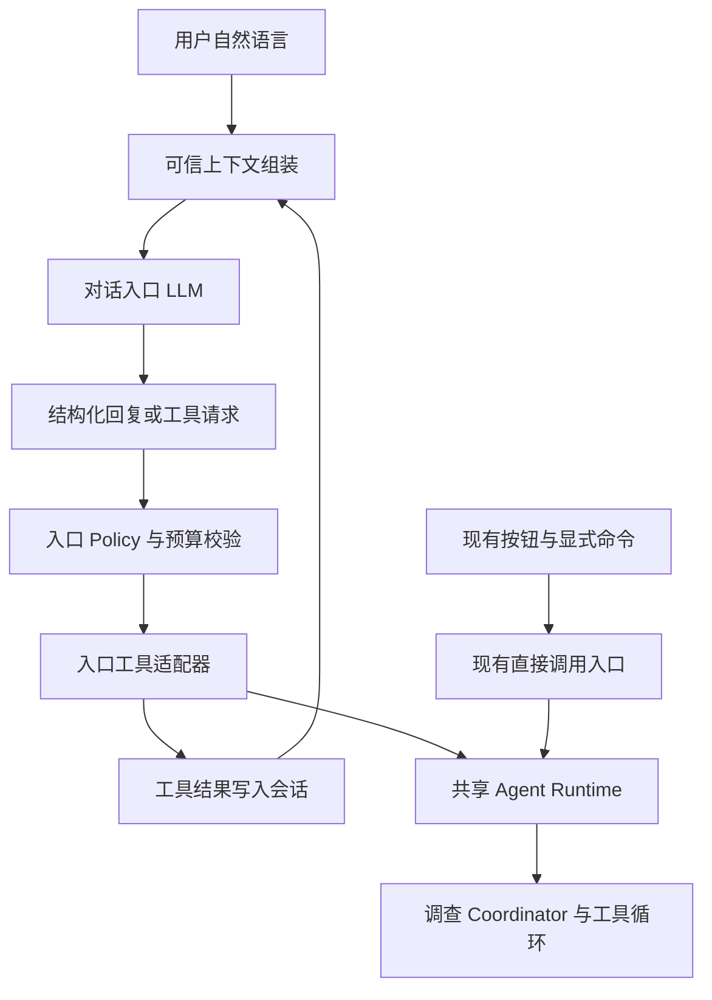

# Credra Agent 自主调查架构开发计划 v2.0

制定日期：2026-09-07。产品名称：Credra Agent。代码基线：`ce7dede`。计划依据：[自主调查架构与演进路线 v2.0](Credra%20Agent%20自主调查架构与演进路线%20v2.0（提案）.md)。

**状态说明：制定时仅交付开发计划，工作包从 `NOT_STARTED` 开始；后续实施事实不追溯改写初始验收记录。2026-09-13 文档整合：P25 已有工具离线闭环及可读服务日志技术 `VERIFIED`，待人工审核；P25/U09 真实试跑、P24/P23 和 G2 未完成。P26 开发及前置顺序已获用户认可；P26-0/P26-1 基础接口技术 VERIFIED，待人工审核；普通对话尚未接入入口模型。会话与调查分别控制预算已确认。**

后续入口、日志优化和对应使用/验收记录统一维护在本计划：P25 见第 6.1.1–6.1.2 节，P26 见第 6.2 节，文本日志见第 10.5 节；实施事实与设计偏差继续记入既有《开发日志》。

## 1. 计划目标与边界

本计划将已认可的演进路线转化为可逐阶段实施、验收和审核提交的工作包。首个目标交付是：用户用自然语言提出尽调问题，LLM 选择并执行合适的只读工具，依据新证据修订调查计划，在预算和审核约束内形成可追溯结论；任务暂停或进程退出后能够继续。

项目成功的主要证据是“模型决策改变了工具行为，并解决了更多有证据支持的问题”，而非模型节点数量或报告长度。

### 1.1 已确认的设计约束

| 编号 | 实施约束 |
|---|---|
| R01 | 使用一个 Coordinator 决策循环，首版顺序执行；不引入多 Agent 自由协商或独立服务网络 |
| R02 | 模型负责意图理解、假设、工具选择、重规划与停止建议；执行前由 Policy 校验 |
| R03 | 保留 baseline Graph；新增 shadow/agentic 与现有表达模式分离，旧任务按创建时版本恢复 |
| R04 | 自然语言先支持已导入主体；包括时间、来源优先级/限制、否定与条件指令，后续支持运行中修订 |
| R05 | 财务数值由 Python 计算；证据、待核验主张、分析推断和假设情景分别记录 |
| R06 | 规则风险等级保留，模型评估单独保存；不自动批准/拒绝贷款或生成授信额度 |
| R07 | 使用现有 LangGraph、SQLite、MCP、Artifact、Retry、Trace 和结构化模型网关，依赖版本以仓库锁定值为准 |
| R08 | 首页隐藏 `case_normal`/`case_risky`，保留其数据和回归用途；比亚迪、上汽及现有默认 Eval 保留 |
| R09 | 首例先深化比亚迪或上汽，围绕回款/现金质量与冲突证据形成可验证问题；首例所需最小财务扩展前置到 V2-2，其余扩展及新企业后续建设 |
| R10 | 新包语义名为 `credra_agent`；`app` 兼容入口与旧 Graph 渐进保留，不同步进行大规模包重命名 |
| R11 | `.env` 由用户维护；配置通知通过 `.env.example` 和文档，配置验证不输出真实密钥 |
| R12 | 设计偏差先记录并确认；每个关键节点提交前必须展示本次文件、摘要和建议提交信息，等待明确 commit 批准 |
| R13 | 全服务统一日志：每次整套服务启动使用一个启动批次，包含 MCP 子进程；单文件按 10 MB 轮转；节点变化、任务状态变化、LLM 调用返回状态及运行异常均有可关联记录 |

本计划细化已获认可的 V2 方向，不追溯覆盖 MVP 的原始验收事实。对于 legacy 模式继续适用旧需求与计划；对于新 agentic 行为，以认可的架构及本计划经确认的条目为依据。后续遇到冲突或缺少决定时，应先向用户确认，不自动放宽约束或缩减验收。

### 1.2 初始规划交付与后续开发交付分开

制定时规划交付：本开发计划、架构文档的审核状态记录、开发日志。该规划轮不改 Python、Prompt、依赖、配置示例、数据、测试或 Git 暂存区，不执行 Git 提交。

后续完整开发交付：版本化 Agent Runtime、全服务启动归档与轮转日志、自然语言入口、可执行 MCP 查询、证据评估与冲突处理、财务分析扩展、复杂案例包、动态计划工作台、回归/Eval、演示与审计材料。所有开发工作包初始状态为 `NOT_STARTED`，已认可架构不等于这些能力已经完成。当前补充实施记录见对应章节，规划说明不替代验收证据。

## 2. 用户决定与后续确认点

用户要求不确定事项先确认。本节区分当前规划需要的决定和进入相关开发阶段前才具备条件确认的事项；后一类列为明确门禁，不能在开发中自行选定。

| 编号 | 当前问题 | 用户确认结果（2026-09-07） | 对计划的影响 |
|---|---|---|---|
| D01 | 首个复杂真实案例的企业范围 | 先深化比亚迪或上汽，再新增企业 | V2-0 先比较两家现有案例的资料和问题，V2-2 完成其中一家深化；具体主体按 D04 确认 |
| D02 | 必须完成日期或工时上限 | 无；属于验证项目，用户会随时调整计划，不要求准确工时估算 | 采用工作包和阶段门禁，不设固定日期或工时承诺；用户调整优先级时更新计划 |
| D03 | 首例必要的最小财务扩展是否前置 | 同意前置至 V2-2，其余仍放 V2-3 | 新增 P24；V2-2 同时验收证据调查与实质计算，V2-3 只补齐剩余能力 |
| D09 | 单个日志文件的轮转阈值 | 10 MB | 按 UTF-8 编码后的字节数计算，配置值为 10,000,000 字节；写入下一完整记录会越界时先轮转 |
| D10 | 日志启动批次的归属 | 整套服务共用一个启动批次，包含 MCP 子进程 | 根服务创建 startup_id，子进程继承；集中写入同一批次的顺序分卷文件 |

**2026-09-12 已确认追加：** 当前 P22 保留 thinking 摘要与独立结构化 JSON 两段请求，后续加入“一次原生结构化输出 vs 两段分析＋JSON”的对照验证，见第 9.1 节。该验证不自动切换当前策略，不改变 P24→P23 的开发顺序；真实试跑的模型能力、规模和预算仍按 D05/D06/D07 确认。

**2026-09-12 已确认追加：** 在当前 V2-2 增补 P25“UI 最小执行闭环与流程验证”，见第 6.1 节。配置启用后，自然语言任务可在界面内完成澄清、可信策略授权、Agent 执行和结果查看，不再要求用户切换到 CLI。本次认可的是开发与验证计划；实际预算仍按 D05 确认，V2-4 完整工作台和 V2-5/D08 全局默认模式决策保留。

以下事项在对应阶段开始前提交可审核材料，再确认：

| 编号 | 确认内容 | 最晚门禁 | 确认前允许做的工作 |
|---|---|---|---|
| D04 | 比亚迪与上汽先深化哪家、期间、材料清单与必答问题；不预设企业必然存在某种风险 | V2-2 材料包冻结前 | 比较两家材料覆盖和可验证问题，形成推荐及依据交用户确认；不伪造新闻或风险事实 |
| D05 | 每任务 Token、活跃时长、真实模型/搜索试跑费用或调用上限 | V2-1 首次真实调用前 | 完成计账契约、Mock、Snapshot 和限额测试；不开始未获授权的付费试跑 |
| D06 | 需要新增或付费来源、模型更换、依赖升级、通用 OCR 等路线外能力 | 对应动作实施前 | 提交兼容性/可访问性调查及影响说明 |
| D07 | 正式验收评分表、不可接受错误及真实试跑规模 | V2-0 评分基线冻结前；预算与次数需在真实试跑前一致 | 形成逐问题 rubric 与建议门槛，不用自评代替审核 |
| D08 | 是否把新自然语言任务默认模式切换为 agentic | V2-5 | 提交质量、成本、恢复和回退证据；此前默认仍为 baseline |

12 个决策轮次、20 次外部请求和连续 2 次无证据增量是演进路线给出的**试验候选值**；本计划不把它们升级为已验证的发布默认值。参数契约、试验结果及最终值需分别记录。所有真实调用的预算覆盖模型、搜索、正文抓取、核验、重试和 fallback。

## 3. 阶段与依赖总览

| 阶段 | 阶段交付 | 前置条件 | 推进标准 |
|---|---|---|---|
| V2-0 | 契约、基线、日志设计、素材可行性与评分表 | 架构认可；规划决定已记录 | G0：契约与验收依据明确 |
| V2-1 | 全服务日志与已导入主体的最小自主调查闭环 | V2-0 门禁通过 | G1：执行可观测、决策真实改变执行且可恢复 |
| V2-2 | 多渠道证据、UI 最小执行闭环、最小财务扩展与现有企业深化首例 | V2-1 门禁通过；D04 已确认 | G2：证据与计算共同回答复杂问题，且能从 UI 发起并查看结果 |
| V2-3 | 财务深度、短债担保、同业与情景 | 财务契约冻结；V2-2 门禁通过 | G3：新增分析可计算、可引用、可复核 |
| V2-4 | 运行中指令、版本化审核与完整交互 | V2-1 恢复机制、V2-2/3 Artifact 契约稳定 | G4：变更、暂停、恢复及审核一致 |
| V2-5 | 对照评测、故障验收、默认值决策与展示 | V2-1 至 V2-4 验收完成 | G5：有质量、可靠性与成本证据 |

本项目按验证进展调整，不以原演进路线的工时区间作为本开发计划的进度约束。每完成一个工作包，记录实际结果、残留问题和下一步；用户可随时调整优先级。调整涉及未完成的依赖、验收口径或架构边界时，先说明影响并确认，再更新计划。

第一批能力交付截止于 V2-2；完整能力交付截止于 V2-5。基础 Checkpoint/Resume、预算和澄清能力必须随 V2-1 落地，V2-4 扩展的是运行中的指令与 UI 完整体验。


## 4. V2-0：契约、基线与实施准备

目标：开发前把“哪些内容可由模型决定、如何执行、如何停止、如何恢复、怎样算通过”明确为契约，避免先堆 Prompt 再补运行约束。

| 工作包 | 具体任务 | 交付物 |
|---|---|---|
| P00 基线冻结 | 记录代码版本、环境和既有用例结果；保存去敏的 legacy 等待审核与已完成任务样本；确认入口与包迁移边界 | 基线记录、兼容样本、检查结果；历史 179 项通过记录仅作参考，实施时重新核验 |
| P01 输入与执行契约 | 定义 TaskSpec、Plan、Hypothesis、Action、Observation、Coverage、BudgetLedger、GraphVersion；区分缺失与失败、业务停止与技术失败 | 结构化契约文档、最小 JSON 示例和适用版本；实现阶段使用 Pydantic 验证 |
| P02 证据与财务契约 | 明确 Evidence/Claim/Assessment 的映射与引用；Financial v2 的期间、合并口径、单位、缺失值、负净资产和血缘 | 数据契约与 v1 兼容表；先定数据表达，不代表所有指标在本阶段实现 |
| P03 案例与评分设计 | 按 D01 做首例素材可行性摸底；设计明确标注的 A+C 合成控制流样本；建立至少 30 条自然语言指令和逐问题评分表 | 素材可行性清单、合成 Fixture 规格、rubric、硬失败清单 |
| P04 全服务日志契约与 Spike | 冻结第 10.4 节事件/字段/归档规则；验证 Windows 上主进程汇聚 MCP 日志、单写入者轮转、退出刷新、协议隔离及与现有 Trace 的桥接 | 日志契约、独立进程汇聚/轮转 Spike、覆盖清单；发现框架兼容问题先确认处理方案 |

门禁 G0：

- TaskSpec 的歧义字段可以触发澄清，工具动作可以表达所需来源和期间限制。
- 每个动作能关联任务/计划版本、预算和结果；停止原因能跨 Runtime、UI、报告和导出一致表达。
- 明确旧 Graph 无版本字段时的处理方式，以及“请求已发生但结果未落盘”的恢复策略。
- 比亚迪与上汽有材料可行性对照；真实主体不必满足预设风险结论，如两家材料均不适合目标问题，先提交问题调整或后续新企业建议确认，不能强行套用。
- P24 的最小财务字段、公式候选和 P23 首例验收依赖明确；评分与预算待决项设为阻塞相应动作的门禁。
- 全服务日志采用已确认的 10 MB/整套启动批次语义；P04 证明子进程事件可被可靠关联与汇聚，日志不会混入 MCP 协议 stdout。

此阶段可以运行已有离线验证和小型契约测试，不接入新的真实业务渠道，不修改旧 Case 数值和人工答案。提交节点为“V2 契约与基线准备”。

## 5. V2-1：最小自主调查纵向链路

### 5.1 工作包与顺序

| 工作包 | 依赖 | 具体实现 | 主要代码落点（拟） |
|---|---|---|---|
| P15 全服务日志基础设施 | G0/P04，先于 P10/P11 集成 | 统一初始化、startup_id、主进程集中写入、MCP 日志汇聚、10 MB 顺序分卷、异常与状态事件、脱敏、Trace 桥接；先覆盖现有 baseline 服务再接新循环 | `credra_agent/observability/`、各 CLI/Chainlit/MCP 启动入口、`app/runtime/tracing.py`、`app/llm/gateway.py`、配置示例与 `.gitignore` |
| P10 TaskSpec 入口 | G0/P15 | 对已导入主体解析自然语言；固定 as_of；区分优先/仅限、否定、条件；必要澄清可持久化；保留既有命令入口 | `credra_agent/intent/`、`app/task_cli.py`、`app/chainlit_app.py` |
| P11 Action 执行通道 | P01/P02/P15 | 注册只读工具及参数 Schema；新增接收完整 query、主体、日期、来源限制的 MCP 通道；旧工具不改调用语义 | `credra_agent/execution/`、`app/mcp/research_client.py`、`app/mcp/research_server.py` |
| P12 Coordinator 循环 | P10/P11 | TaskSpec + 当前假设 + 索引 → 一次 Action → Observation → 覆盖评估 → 下一步；业务原因摘要外置 Prompt；不读取全部历史正文 | `credra_agent/planning/`、`credra_agent/prompts/`、`app/llm/gateway.py` 适配 |
| P13 执行门禁与预算 | P11，与 P12 一同集成 | 参数/来源/范围校验；执行前预留、后结算；重复/无增量处理；finish 审核；兼容约束的 fallback | `credra_agent/execution/`、新 Graph、配置示例 |
| P14 版本与恢复 | P11/P12/P13 | 决策与执行拆 Node；Action 账本先持久化；按 Graph 版本恢复；已有结果重放；澄清/受限完成状态投影 | `credra_agent/graph/`、`app/runtime/tasks.py`、Trace/报告/导出适配 |

顺序要求：先完成 P15，让现有运行路径也有全服务日志；再证明完整 Action 参数能到 Provider，然后接 Coordinator 选择。预算检查和执行账本与真实执行同时接入，不允许先跑无界循环再补。P10 的 UI 是输入/澄清/结果的最小投影，动态计划界面主要在 V2-4。

首版动作集实现 `read_document`、`search_evidence`、`fetch_content`、`verify_claim`、既有 `compute_metrics`、`ask_user`、`finish`。`compare_peers`、`run_scenario` 在对应工具完成前不可被执行；模型选到不可用工具应收到明确错误或能力缺口。

### 5.2 门禁 G1

| 验收 ID | 场景 | 必须出现的证据 |
|---|---|---|
| A10 | 同一企业，分别询问回款和担保 | TaskSpec 和允许执行的 Action 有可解释差异；不能只有最终文案不同 |
| A11 | 财务规则无异常，用户要求核对一条新消息 | 模型主动调查，Trace/Artifact 证明工具被执行 |
| A12 | 首次观察出现反证或缺口 | 下一次 Action 改变查询、资料读取或分析重点 |
| A13 | 自定义查询文本、日期和来源范围 | 客户端、MCP 服务端、Provider 收到同一受控请求；不被类别模板重建覆盖 |
| A14 | 非法工具、超范围来源、无结果、无增量、预算耗尽 | 错误/缺口状态正确；不能静默扩权或无限重试；不能将无结果判为无风险 |
| A15 | 在决策后、请求后、结果落盘后分别中止进程再恢复 | 已落盘 Action 不重复外调；不确定调用窗口有保守计账和去重；不宣称 exactly-once |
| A16 | 旧 Case、旧等待审核任务；新任务模型不可用 | legacy 可恢复；fallback 遵守原 TaskSpec 或明确受限/转人工 |
| A17 | 两次启动、多任务并发、MCP 子进程、日志阈值边界、LLM 失败与恢复 | 第 10.4 节 L01–L08 全部通过；每次启动隔离、分卷连续、节点/任务/LLM 状态可关联且没有敏感内容 |

验收以固定模型响应和 MCP/Provider 测试替身为主；第一次真实模型纵向试跑须完成 D05，记录请求数、Token 和实际失败，不提前承诺费用或成功率。shadow 只验收计划合法性，不能代替 A11/A12 的执行证明。

提交节点建议拆为“全服务日志与启动归档”“意图与执行契约接通”“Coordinator 闭环”“预算与版本化恢复”；每个提交点都必须具备可运行的定向验证，提交前逐次审核。

## 6. V2-2：多渠道证据与首个复杂真实案例

| 工作包 | 具体任务 | 交付物 |
|---|---|---|
| P20 渠道可行性与材料冻结 | 按 D01/D04 确定企业、截止日和问题；优先公告/报告、公开经营资料、行业数据和媒体/澄清；每类验证一个真实材料；不可访问来源列缺口 | 文件清单、哈希、来源类别、原始发布者、访问结果与授权边界 |
| P21 证据与实体处理 | 主体/子公司/同名关系；发布/事件/抓取时间分开；原文定位、转载去重、修订链、独立印证、支持与反证 | Evidence/Claim/Observation Artifact 和兼容映射 |
| P22 证据驱动重规划 | Coordinator 消费冲突与缺口，选择查原文、查另一独立来源或停止并披露；结构化计数不取代语义判断 | 可重放的计划版本、Action、证据状态与停止原因 |
| P25 UI 最小执行闭环与流程验证 | 在 P10/P13/P14 与 P22 之上接通配置策略、自然语言澄清、授权、实际执行和状态/结果投影；分离离线闭环与授权真实试跑，见第 6.1 节 | 配置示例、共享 Runtime 接入、UI 端到端验证脚本、任务/授权/预算/日志证据及能力边界说明 |
| P26 对话入口与上下文 | query、会话、任务列表和动态工具目录共同交给入口 LLM，委派共享 Runtime；会话/调查预算分开，按钮与页面保持不变；见第 6.2 节 | 已批准按 P26-0–P26-4 分节点实施及 E01–E10 验收；本轮基础接口收口见第 6.2.13 节，不能视为入口 LLM 或 P26 整体验收完成 |
| P24 首例最小财务扩展 | 在 P02 契约下增加首例所需输入适配、字段血缘、Decimal/单位/缺失处理及应收、现金质量公式；复用既有收入、利润和现金流；不覆盖旧 Case 数值 | 最小 Financial v2 子集、人工算例、工具 Schema 和可引用计算 Artifact |
| P23 首例与人工答案 | A+C 组合包：问题、材料、允许行动偏序、应拒绝的主张、事实/推断答案、离线快照和人工检查表；准备第 9.1 节请求策略对照的共用样本 | 可复现的首个复杂案例与同素材 baseline 对照；供 P50/P51 复用的策略评测样本 |

**已确认的顺序细化：** P20 先冻结所需材料/问题，P21/P22 完成证据链，P24 完成首例最小计算，最后 P23 做联合验收。P24 的首批候选为应收账款增长、应收与收入增速差、经营现金流与净利润关系；取决于已确认期间和字段可用性，具体公式与容差在 G0/D04 冻结。净利润非正时不能机械使用现金利润比；缺少应收期初/期末值时，返回不可计算而非猜测。完整季度适配、受限资金/债务期限、担保、同业和压力情景仍在 V2-3。

**P25 插入顺序：** P22 已提交后，先完成 P25 的配置策略与已有工具 UI 离线闭环，再继续 P24→P23；P24 不因界面接入而扩展财务范围。P23 联合验收时补上复杂首例的 UI 执行证据。P25 真实试跑仅在 D05 已确认后进行，不以等待真实预算为理由阻塞离线实现，也不以离线通过替代真实调用验证。

为保留原两例回归，深化材料使用独立版本的案例包或新的 Case ID，并记录与原主体的关联；不得原地覆盖旧输入和期望答案。具体数据标识在契约阶段确认。真实结论可以是“不支持目标风险”，案例通过与否取决于调查和计算是否可靠，而不是是否输出负面判断。

门禁 G2：

- 材料目标为至少 4 类业务来源、12–20 份可追溯材料；转载同一文档不能计为独立来源。缺额不能自行下调，应先说明可行性与影响。
- 评测包覆盖资料缺失、证据冲突、主体误匹配；真实材料中没有的现象，通过独立合成反例测试，不伪造真实企业事实。使用脚本化补充指令验证重规划，完整运行中交互留待 V2-4。
- 每条关键结论可定位到原文/计算；企业声明、第三方事实、模型推断分别表达。无法支持的判断留作未决问题。
- baseline 与 agentic 使用相同截止日和可用素材。agentic 至少在一个预先定义问题上，因多轮工具执行得到 baseline 未覆盖的有效答案。
- P24 至少完成与首例必答问题相关的应收/现金质量计算，逐项通过字段与人工算例验收；P23 报告能引用计算结果，不能用语言解释代替未实现的计算。
- P25 完成第 6.1 节 U01–U08 离线验收；P23 从界面发起首例，实际 Action、证据与计算可追溯到同一任务。U09 授权真实试跑的状态与结果单独记录，未执行时不得宣称真实 UI 纵向验证完成。

提交节点：“多源证据与冲突处理”“UI 最小执行闭环与配置策略”“首例最小财务计算”“现有企业深化案例及人工基线”。真实渠道发生调用时按已确认预算执行，fixture 和验收不依赖持续联网。

### 6.1 P25：UI 最小执行闭环与流程验证

**目标：** 用户在 Chainlit 输入自然语言后，能够在同一界面完成必要澄清并启动实际 Agent 调查，看到当前任务、执行状态、证据、预算与停止原因。当前界面只调用 `interpret_message` 并提示转 CLI；P25 接到共享 Runtime，页面不维护另一套执行、预算或业务状态。

**配置与授权契约：**

- 增加自然语言 UI 执行开关及可信运行策略配置，提供 `.env.example`、策略示例与使用说明；不修改用户 `.env`。未配置启用时保留解析入口，明确提示如何开启；显式开启且配置有效后，符合范围的新任务自动执行，不逐条要求用户确认，也不要求使用 CLI。
- 运行策略由用户维护，明确每任务外部请求、Token、活跃时长和 Coordinator 单次/轮次限制，并使用现有模型、只读工具及来源 Policy。TaskSpec 就绪后由 Runtime 生成 `RUNTIME_POLICY` 授权，绑定任务、TaskSpec 版本与策略版本并持久化；模型输出不能生成授权、扩大范围或增加预算。策略示例中的限额须标明用途，不能将试验候选值当成已批准的生产默认值。
- 启用真实调用前检查策略、模型和执行依赖。策略缺失、无效或未批准时，不派发调查调用，界面给出具体缺项。LLM 意图解析本身也属于真实调用：必须在解析请求前具有受控额度，其调用与澄清重试计入同一任务的总消耗；TaskSpec 就绪后的授权不得清零前序消耗。具体预解析额度承接方式在 P25 实施设计中记录并验证。
- 澄清、重复消息和恢复不自动重置预算；恢复沿用持久化授权及账本，不因当前策略更宽松而扩大原任务额度。新授权必须有明确的新任务或经审核的范围变更依据；运行中修订、追加预算及异步暂停交互继续由 V2-4 实现。
- 本开关控制当前用户配置的 UI 验证入口，不更改旧 `start CASE`、baseline/fallback、CLI 或已创建任务的执行语义。全局发布默认切换仍由 D08/P53 决定。

**执行步骤：**

1. 用户启用 UI 执行并配置可信策略；页面显示当前入口模式与配置是否就绪，不展示真实密钥。
2. 输入已导入主体的自然语言问题；生成并持久化消息 ID、任务 ID 和 TaskSpec。字段不完整时展示具体澄清项，用户补充后继续同一任务，不重复解析已处理消息或创建第二个运行。
3. 就绪任务按可信策略取得绑定授权，通过共享 Runtime 启动 Coordinator → Policy → Action → Observation → 重规划循环；正文读取、检索、抓取和核验沿用 P22，财务工具在 P24 完成后加入联合验证。
4. 页面投影持久化状态，展示任务 ID、当前动作、执行/等待/受限状态、预算与公开原因摘要；结果提供证据/计算引用和缺口。当前 Agent 没有最终授信报告时，明确展示调查结果，不伪装成已完成报告或可批准的授信决策。
5. 用户查看状态或恢复已有任务；关闭浏览器不代表撤回外部请求。重连与服务重启按持久化任务 ID 找回状态，已有结果不重发，结果不确定的请求不自动重跑；恢复受运行授权、请求配置及日志健康门禁约束。

**验证顺序与验收：** 先用固定模型、Provider 替身和本地快照完成 UI 离线闭环，再在 D05/D06 已确认后做少量真实纵向试跑。离线自动验证必须经过实际 UI 消息处理入口和共享 Runtime；另做浏览器操作检查，不能仅调用底层函数或断言提示文案就宣称 UI 打通。

| 验收 ID | 场景 | 必须出现的证据 |
|---|---|---|
| U01 | 执行开关关闭；开启但策略/模型/依赖缺失或无效 | 页面准确区分解析模式与配置错误；调查模型/工具零派发；未获解析额度时也不调用意图 LLM；不自动生成宽松授权 |
| U02 | 完整自然语言任务，配置有效且自动执行开启 | 从 UI 消息生成就绪 TaskSpec 和绑定授权，实际 Coordinator 与工具被调用；页面展示同一任务状态、证据引用和停止原因；无需切 CLI 或逐任务批准 |
| U03 | 主体、期间或重点缺失，用户补充澄清 | 澄清前不启动调查；补充后沿用同一任务，授权绑定就绪版本；意图调用计入总消耗，不因新版 TaskSpec 重置预算 |
| U04 | 重复消息、重复启动、重复点击与同一任务并发输入 | 持久化消息/任务去重及执行锁定证明不会重复授权或派发；已有结果返回当前状态，运行中变更明确拒绝或提示能力边界，不静默开第二个循环 |
| U05 | 首轮出现缺口/反证；用户指定来源限制 | 后续 Action 改变调查方向；Policy 在调用前拒绝超范围来源；页面、Artifact 和日志能解释执行差异，不能只改变最终文案 |
| U06 | 预算不足、模型/工具失败、usage 缺失、日志收集器失效 | 停止新动作并显示受限原因/缺口；未知用量保守计账；已发生请求结果保留；日志恢复后按已有授权继续，不自动重跑不确定请求 |
| U07 | 浏览器重连、进程在决策/请求/结果窗口退出后恢复；修改策略后恢复 | 任务 ID 可找回，UI/CLI/Checkpoint 状态一致；落盘结果不二次外调，不确定窗口保守处理；旧任务不继承新增额度，模型请求配置不兼容时派发前拒绝 |
| U08 | 旧命令/案例、基线任务；完整浏览器演示 | 比亚迪/上汽原案例与 baseline 恢复可用；浏览器完成配置状态查看、输入、澄清、运行和结果查看，保留去敏截图/操作记录；P24/P23 完成后补充计算 Artifact 引用 |
| U09 | 按已确认预算开展真实 UI 纵向试跑 | 冻结输入、模型/Provider、素材、策略与截止日；实际 LLM 与可用调查工具返回状态、请求/Token、耗时和失败记录关联同一任务；人工检查事实/证据/计算与缺口，无可访问来源则如实受限 |

**产物与完成口径：** 交付配置/策略说明、UI 接入实现、离线端到端脚本、浏览器操作记录和实施验证记录。各场景记录任务、TaskSpec/授权版本、Action、Artifact、预算、日志关联及是否真实调用。U01–U08 通过后可标记 P25 最小闭环技术完成；U09 单独标记 `NOT_RUN`、受阻原因或实际结果，不能用 Mock 证明真实模型判断质量。P23 再验收复杂首例的 UI、证据和计算联合链路。完整动态计划编辑、运行中指令/暂停、版本化报告审核与完整恢复体验仍归 P40–P44。

本次仅补充计划，未批准具体真实预算、来源扩展或全局默认切换。后续 P25 开发节点独立准备聚焦提交，按项目人工审核约定取得批准后才能执行 commit。

### 6.1.1 UI 执行配置与使用

对应 V2-2/P25 已实现路径。自然语言入口接到共享 Agent Runtime，执行开关与旧 `start CASE` 命令独立。本节所述解析/澄清计入任务预算是现有 P25 口径；第 6.2 节拟议入口改为会话与调查分开预算，不追溯迁移旧任务费用。

#### 6.1.1.1 开启自动执行

1. 复制 `config/agent_ui_policy.example.json` 为 `config/agent_ui_policy.local.json`。
2. 确认每任务外部请求、Token、活跃时长以及单次/轮次限制，填入策略文件；将 `approval` 改为 `APPROVED`。真实试跑须先完成开发计划 D05。示例中的轮次、重试和 Token 预留只是说明配置结构，不是已批准额度；三项总上限默认 `null`、批准状态默认 `UNCONFIRMED`，直接复制示例不能触发真实调用。
3. 用户在自己的 `.env` 中配置以下字段，并保持模型连接配置完整：

```dotenv
AGENT_UI_EXECUTION_ENABLED=true
AGENT_UI_POLICY_PATH=config/agent_ui_policy.local.json
ANALYSIS_MODE=llm
# deterministic 为规则解析；llm 用模型解析，消耗计入任务总预算。
INTENT_MODE=llm
```

4. 重启服务，在仓库根目录启动：

```powershell
chainlit run chainlit_app.py
```

首页说明自动执行是否启用、策略版本和缺失配置。有效配置只需提供一次，之后完整任务自动启动，不逐任务批准或切到 CLI；批准调查运行不代表批准授信或报告。

未开启 UI 执行时，自然语言入口使用规则解析并持久化，不调用意图 LLM。开启但策略/模型/来源依赖无效时显示具体配置错误，不启动调查。CLI 原有意图解析及 baseline 模型入口仍按原有配置工作。

#### 6.1.1.2 输入、澄清与查看

完整输入示例：`调查比亚迪2025年的监管消息，仅限交易所公告`。

信息不足时，页面提示企业名称、比较年度或来源限制的具体澄清项。直接补充即可继续同一任务；澄清前不调查，就绪后自动启动。模型解析和每次澄清的消耗计入同一账本，启动调查不清零。

页面展示任务 ID、当前节点/轮次、调查状态、预算、最近最多 8 条观察及原文/证据/工具结果引用。无结果保持缺口，不等同于无风险；目前未接入最终授信报告及报告审核，不把调查显示成已生成报告。

| 输入/操作 | 行为 |
|---|---|
| `状态`、`查看状态` | 查看当前调查或尚未就绪的解析；不调用模型 |
| `继续`、`恢复任务` | 恢复已保存的调查，或启动解析就绪但尚未创建 Graph 的任务；不重复解析 |
| `agent status THREAD` | 在新浏览器会话中绑定已有任务 ID、查看状态，随后可补充其澄清信息 |
| `agent resume THREAD` | 沿用原授权和账本恢复 |
| 刷新状态/恢复 Agent 调查按钮 | 查询或恢复对应任务，不变成报告/贷款批准 |
| `agent new` | 明确新建任务，之后输入新问题；旧任务额度和结果保留 |

已有调查只在等待澄清时接收补充，主体替换必须新建任务；并发执行请求被拒绝。完整运行中修改、异步暂停和追加预算交互仍属于 V2-4。

关闭浏览器不会撤回网络请求，后台继续保存结果。记下任务 ID，重连后使用上表入口找回；目前没有完整聊天历史自动恢复。解析尚未形成 TaskSpec 的退出窗口由持久化消息 ID 回放：同一消息的已保存模型结果可复用，已派发但没有结果的请求不自动重发。发送一条新的消息不等同于无成本的旧消息回放。

#### 6.1.1.3 预算、策略与恢复

策略包括 `allowed_subject_ids`、三类总上限、`limits` 下的 Coordinator 参数和 `intent_*` 解析限额。当前主体代码为比亚迪 `002594`、上汽 `600104`；只读工具和来源继续受 TaskSpec/Policy 校验。策略内容哈希、ID/版本与授权关联，首次解析前保存，就绪后授权绑定 TaskSpec 版本。用户输入和模型不能自行增加权限或额度。

`intent_token_reservation` 是一次解析（包括重试）的总 Token 预留；`intent_attempt_reservation` 限制解析请求次数。解析始终是独立非 thinking JSON 请求。Coordinator 和核验沿用现有限制，thinking 开启时预留两段请求及 Token，所有重试计入同一总预算。

未知 usage 按预留保守计账；实际返回用量据实记录，额度不足停止新动作。单次预留须覆盖预期输入/输出与重试，不承诺中途撤回已发生请求，也不根据未知 usage 给出准确费用。活跃时长沿用请求耗时累计口径，不包含等待用户澄清的墙钟时间。

策略文件变更只影响新任务，旧任务保留原额度。模型/请求或来源配置变化时，恢复先拒绝不兼容配置，提示恢复原配置或新建任务。密钥可由用户轮换，配置指纹不存真实密钥。关闭执行开关会阻止新的 UI 调查动作；状态仍可用既有只读 `status THREAD` 查询。

日志失效时停止新动作，保留已发生请求结果；恢复日志后继续已有调查。若尚未启动调查，恢复日志后重新发送任务信息，同一任务账本不清零。不确定的调查请求不会自动重跑。

#### 6.1.1.4 离线浏览器复验

自动验证：`python -m pytest tests/test_v2_ui_execution.py -q`。标准门禁使用 `scripts/verify.ps1`。

隔离浏览器入口：

```powershell
chainlit run tests/ui_browser_app.py --host 127.0.0.1 --port 8013 --headless
```

该入口固定模型输出，通过真实 MCP 子进程调用 Mock Provider，页面明确标为离线验收，不改用户 `.env`。数据、授权、账本和日志位于 `checkpoints/.p25-browser/`，不是生产入口，不证明真实模型质量。正式入口仍是根目录 `chainlit_app.py`。

### 6.1.2 P25 实施与验收记录

日期：2026-09-13。起点为用户已提交的 P22 `567bebd`；开始时已有上一轮认可的 P25 计划和日志修改。本轮依照开发计划第 6.1 节实施，保留 V2-4 完整工作台和 V2-5 默认模式门禁。

#### 6.1.2.1 实现

- 增加 UI 执行开关、UIPolicy 和配置示例；就绪任务自动执行，必要澄清后自动启动。页面显示任务/预算/观察/引用，配置未就绪时不调用调查模型或工具。
- 首次解析前冻结策略、无密钥请求配置和 `RUNTIME_POLICY` 授权；就绪后绑定 TaskSpec，校验主体/任务/策略一致性。RunAuthorization 增加可选 task_id/policy_ref，旧授权继续兼容。
- 共享服务拆出 execute_intent，UI 不二次解析。没有 Graph 的澄清 v2 任务首次启动，已有等待任务执行 amend；替换主体在新 TaskSpec 写入前拒绝。
- 意图 LLM 独立非 thinking、聚合 accounting；`intent:message_id` 与 Graph MODEL/TOOL 共用 ActionLedger。返回结果先保存再结算/解析；保存结果可回放，不确定请求不自动重发。
- SQLite 请求响应去重；整个 UI 派发使用跨进程文件锁，进程退出自动释放，不按任意超时抢占。恢复和重复消息沿用原额度，配置文件变更不扩大旧任务预算。
- 保留后台操作，浏览器断开后继续落盘；提供状态/继续、agent new/status/resume 与 Agent 刷新/恢复按钮，状态查询零 LLM 调用。读取完整 Observation 与账本 Action 后显示最近最多 8 条工具、实际查询、摘要与引用；运行中轮询显示当前节点和动作。
- Agent 页面不显示旧报告批准按钮、报告提示、业务图表或固定百分比；旧 Case/baseline 保持原入口。MCP 显式接收 Settings 和同一日志上下文，Mock 类型标为 SYNTHETIC；其他未知来源不因开启 UI 而取得权限。

使用方法见本计划第 6.1.1 节。

#### 6.1.2.2 适配事实

P10 解析调用发生在运行授权之前，因此新增前置可信解析额度及连续计账。关闭执行的 UI 改为规则解析，不单独发未计账意图 LLM 请求；CLI/baseline 不变。

首轮发现观察索引只有 observation_ref，UI 改为读取对应 Observation。IntentStore 状态消息可能遮盖 latest_task_spec，查询改为只返回真实 TaskSpec。规则回退补“仅限/只能使用”来源措辞；原来只识别“只使用/只用/只核对”。Windows 进程测试输出改为 ASCII 转义 JSON，避免默认代码页与 UTF-8 解码冲突。旧日志暂停按钮的简化快照缺 state，新增 Agent 分支兼容此输入。详细原因与影响记录到开发日志。

#### 6.1.2.3 验收与证据

| 验收 | 本阶段证据 |
|---|---|
| U01 | 开关/路径/无效或未批准策略/缺上限/模型与 Provider 缺项在调用前拒绝；关闭 UI 使用规则解析，不发意图 LLM |
| U02 | UI 消息经过共享 Runtime，模型 3 次、实际工具 1 次；授权绑定任务和策略哈希；NO_RESULT 受限结束，不显示已完成报告 |
| U03 | 缺主体/年度后补比亚迪 2024/2025，同任务 v2 启动；2 次解析 + 2 次 Coordinator + 1 次工具连续计账；ask_user 问题可见，继续命令不能跳澄清 |
| U04 | 重复消息/启动零新增外调；ID 复用不同内容/任务被拒；独立子进程不能取得持有中的文件锁，释放后可取得 |
| U05 | 扩大来源在 Handler 前拒绝；首次缺口改变第二次实际查询，两条 Observation 关联不同查询；反证/语义门禁随 P22 回归，不以固定响应证明真实判断质量 |
| U06 | 模型失败、未知 usage、解析/调查额度不足保守计账；日志故障在解析前阻断，恢复后额度连续；旧日志暂停兼容 |
| U07 | 6 个真实 os._exit 窗口：解析 DISPATCHED、解析结果保存、Graph 启动前、Action RESERVED、请求返回、结果保存；重启回放/恢复不重复已发生调用；未知窗口受限，旧额度保持，配置变化在恢复前拒绝 |
| U08 | 浏览器操作记录见下；旧 Case/UI/日志/恢复通过全量回归验证。财务 UI 联合引用留待 P24/P23，当前不标 G2 完成 |
| U09 | NOT_RUN：D05 真实预算尚未确认，没有真实模型/付费搜索/HTTP 业务调用，不用离线结果证明真实语义质量 |

解析尚未形成 TaskSpec 的窗口按同一 message_id 回放；没有完整聊天历史自动恢复，不承诺 exactly-once。正式多端消息恢复仍归 P44，预算预留不是实时费用估算。

#### 6.1.2.4 浏览器操作记录

隔离入口 tests/ui_browser_app.py，监听 127.0.0.1:8013；固定模型 + 真实 stdio MCP + Mock Provider，独立数据/日志，不改 .env。

1. 首页显示离线说明、策略就绪和比亚迪/上汽目录。
2. 输入“比较去年和今年的现金流”：任务 `agentic-ui-85ad179e182d4aef` 等待主体/年度，消耗 1 请求/30 Token，没有工具调用。
3. 补“主体为比亚迪，期间为2024年和2025年，调查监管消息”：同任务 TaskSpec v2 READY，Run `7bbbf77c7131ea92db9f`；MCP search_candidates 执行返回 NO_RESULT，最终 LIMITED / NEEDS_REVIEW，显示工具/证据引用；消耗 5 请求/120 Token，约 4.14 秒活跃时长。
4. 停止并重启服务，浏览器 reload，以 agent status 找回同一任务/Run/结果和原 30 请求/10000 Token/60 秒额度；模型调用日志仍 4 条，查询没有增加模型调用。新批次日志隔离，原批次包含 MCP 子进程事件。
5. agent new 创建 `agentic-ui-03440b08c07344ee`，完整输入“调查比亚迪2025年的监管消息，仅限交易所公告”；自动启动 Run `c641dc4960ec90ba11d0`，LIMITED / NEEDS_REVIEW，消耗 4 请求/90 Token，约 2.89 秒。只读核对持久化 TaskSpec，`source_policy.allowed=["exchange_disclosure"]`。
6. 更新工具/查询投影后再次重启，agent status 找回第二个任务，页面显示 `search_evidence / NO_RESULT`、实际查询“比亚迪 原始公告”及引用。两任务的固定模型日志合计仍为 7 条（4 + 3），状态查询没有增加调用；原 Run 和预算保持一致。临时验收服务已停止。

可见 DOM、无密钥服务日志与账本交叉核对。初次页面出现旧报告/图表提示，已改为最小 Agent 投影；重连页不再出现旧授信批准提示或 100% 业务完成百分比。

#### 6.1.2.5 验证状态

UI/旧恢复早期定向 43 通过；新增进程首轮 28 通过、4 个编码失败，修复后 P25 32 通过。后续补来源/失败/授权保护发现“仅限”回退缺项，修复后单项通过。首轮标准门禁 415 通过、1 个旧暂停按钮兼容失败；修复后旧场景单项通过。新增重规划单项与策略绑定 3 项定向通过。

最终标准脚本 `scripts/verify.ps1` 通过：Ruff lint、191 个 Python 文件 format、417 项 pytest（188.87 秒）、pip check 与独立 MCP stdio smoke。stdio 路径 document → financial → research → risk，research COMPLETE。仅保留第三方 Traceloop 既有 Pydantic 弃用警告。

标准门禁后补充工具/查询的只读投影，最终 P25 全部测试、旧意图 UI/CLI 与旧暂停场景共 42 项定向回归通过（59.00 秒），实际工具及查询映射有独立断言；浏览器第 6 步复核通过。最终 Ruff lint/format、git diff --check 与空暂存区检查通过，当时 24 个拟提交文件均关联 P25（文档整合后的范围见第 6.1.2.6 节）；本轮测试临时目录已清理，隔离浏览器数据保留在已忽略目录。

P25 已有工具的离线最小闭环技术状态为 `VERIFIED`，待人工审核提交。U09 为 `NOT_RUN`，P24/P23 财务与复杂首例联合链路尚未完成，不标记 V2-2/G2 整体通过。预算配置示例仍为 UNCONFIRMED/空上限，真实试跑不能使用离线固定响应的额度和评分代替授权。

#### 6.1.2.6 拟提交范围

建议提交信息：`V2-2：接通UI自主调查与可信运行策略`。未暂存/提交/推送；提交前按 AGENTS.md 等待明确人工批准。

| 分组 | 本次拟提交文件 |
|---|---|
| 配置 | `.env.example`、`.gitignore`、`app/config.py`、`config/agent_ui_policy.example.json` |
| UI | `app/chainlit_app.py` |
| 执行/恢复 | `app/runtime/tasks.py`、`credra_agent/runtime/service.py`、`credra_agent/graph/workflow.py`、`credra_agent/planning/models.py` |
| 意图 | `credra_agent/intent/parser.py`、`credra_agent/intent/service.py`、`credra_agent/intent/store.py` |
| UI Runtime | `credra_agent/runtime/ui_policy.py`、`credra_agent/runtime/ui_store.py`、`credra_agent/runtime/ui_budget.py`、`credra_agent/runtime/ui_service.py` |
| 验证 | `tests/test_v2_ui_execution.py`、`tests/ui_execution_cli.py`、`tests/ui_browser_app.py` |
| 文档 | `README.md`、`docs/Credra Agent 自主调查架构开发计划 v2.0.md`、`docs/开发日志.md` |

包含开始时未提交的已认可 P25 计划；原独立使用说明和实施记录已并入本计划。各节点提交须只包含相关段落，入口提案和日志补齐范围分别审核。临时测试/浏览器数据、用户策略和 .env 不纳入提交。

### 6.2 P26：LLM 对话决策入口与上下文接口

日期：2026-09-13。状态：用户已认可接下来 P26→P24→P23 的工作包并要求开始开发；本轮实施 P26-0/P26-1，P26-2–P26-4 待推进。会话/调查分开预算已确认。对应用户要求：把 LLM 决策接入直接与人对话的入口；完善提供给模型的任务、工具和会话上下文；页面按钮和界面设计保持不变。

本节整合 P10/P25 的入口补充方案；此前归并文档并未批准开发，用户在确认后续工作包并要求开始下一步骤后，明确按 P25→P26→P24→P23 推进。P25 已提交基线为 `58c5ca8`；P26 按第 6.2.10 节分节点实施与审核。P25 已验证的是自然语言调查的纵向执行，不等于已实现本节的通用对话决策入口。

#### 6.2.1 入口补充前实现核查（2026-09-13）

| 接口 | 实际行为 | 本次需要补齐 |
|---|---|---|
| `app/chainlit_app.py:on_message` | 代码先处理 agent/cases/start/status/resume 命令，其他文本进入自然语言服务 | 普通对话统一先交给模型；显式命令/按钮保留直接入口 |
| `_interpret_natural_language` | 默认先分配 intent_thread_id；关闭自动执行时传 model=None，使用规则；开启时进入 ui_service | 会话 ID 与任务 ID 分离；问任务列表不创建调查 TaskSpec |
| `intent/parser.py:parse_draft` | 模型收到 message、anchor_date、当前 TaskSpec、企业目录，输出 IntentDraft | 缺历史任务、对话消息、工具语义、工具可执行条件和任务选择上下文 |
| `runtime/ui_service.py` | 部分状态/恢复短语用正则提前识别；已有非澄清任务拒绝新调查指令 | 启用新入口后不再用自然语言关键词抢先路由；运行中允许对话和只读状态查询，任务修改边界保留 |
| `execution/registry.py` | 调查工具有名称、Schema、available/read_only 和 unavailable_reason | 没有面向对话的工具；描述、效果、权限和动态可执行条件不足 |
| `graph/workflow.py:decide` | Coordinator 收到 TaskSpec、调查工具、假设、证据、观察、覆盖和预算 | 保留这一调查决策层，不复制到入口 |
| `app/runtime/tasks.py` | 有 start/get_status/amend/resume，没有统一任务列表服务 | 增加任务查询投影，不能将 Case 列表当已创建任务 |
| `intent/store.py` / `runtime/ui_store.py` | 保存消息、TaskSpec、策略、响应与模型结果；主要围绕单任务 | 增加会话、选择状态、入口决策/工具执行记录及任务关联 |

截图中的“现有任务有哪些”被 RULE_FALLBACK 当成 start，产生缺企业的 TaskSpec。问题是入口只有调查意图解析，没有通用对话决策和必要上下文；仅增加一个短语规则不能解决这个架构缺口。历史误生成的 TaskSpec 不自动删除，列表中按“尚未启动的草稿”表达。

本机锁定环境中已只读核对 `SqliteSaver.list(config, filter, before, limit)`：返回按 checkpoint_id 倒序的历史 Checkpoint，而不是一行一个任务。不能把 `list(limit=20)` 直接作为“最近 20 个任务”。现有数据也没有可直接信任的用户归属或完整任务更新时间。

#### 6.2.2 架构与职责



- 对话入口负责理解用户当前要求、选择已有任务、读取状态/结果、准备调查、请求澄清、提交恢复动作和回答能力问题。模型决定工具及参数，不输出固定 workflow 路由编号。
- 调查 Coordinator 继续负责拆分问题、证据调查、采信、重规划和停止；入口通过具备类型和权限的 Runtime 工具委派调查。
- 确定性接口负责组装事实、动态工具清单、作用域、Schema、额度、幂等、锁和执行。它不提前决定普通自然语言属于“查列表”还是“新建调查”。
- 按钮和明确语法命令不增加 LLM 前置调用，沿用现有直接下沉路径及已有门禁。按钮布局、名称、任务面板与图表本轮不改。
- 不引入第二套调查 Graph，不复制证据账本，不升级依赖。入口先用现有结构化网关实现模型→工具→模型的有界循环，不要求 Provider 必须支持原生 function calling。

两层的拆分依据任务职责和状态边界；并不要求每条用户消息都调用两个模型。普通对话通常只调用入口；明确调查字段可由入口一次生成，之后直接调用可信 TaskSpec 构造器，避免再调用意图模型。

#### 6.2.3 提供给入口 LLM 的上下文

新增版本化 `EntryContext`，由服务端在每次模型请求前生成。模型看到 query、当前任务及任务摘要和可用工具的组合；数量增长后按需读取，不能把全数据库或全部正文塞入模型。

| 部分 | 必需字段/内容 | 获取方式及边界 |
|---|---|---|
| 请求 | context_version、conversation_id、message_id、query、anchor_date、timezone、snapshot_at | 服务端生成；用户附件/输入作为数据，不作系统指令 |
| 会话 | 最近用户/助手消息、工具请求/结果配对、当前选择、待回答问题、已确认约束 | 新会话存储；首版使用有界历史和确定性摘要，不加隐含摘要 LLM 调用 |
| 当前任务 | task_id、case_id、subject_id、TaskSpec/version、graph_version、run_id、实际状态、待澄清、停止原因、执行阻断、任务版本/快照标识 | 从持久化 TaskSpec/Checkpoint/账本读取；不存在时为 null，不能先虚构调查任务 |
| 任务列表摘要 | 可见范围、筛选条件、候选 task_id/标题/企业/年度/状态/类型、已知更新时间、next_cursor、has_more、是否截断 | TaskQueryService；包含当前任务与最近候选，可通过 list_tasks 按企业/状态/年份查询其余 |
| 已导入 Case/企业 | case_id、名称/别名/代码、实际可用年份、预检状态、已知材料范围 | 复用企业目录与 Case 预检；同企业多个 Case 保留全部 case_id，不能只按 subject_id 去重后任意选一个 |
| 入口工具 | 名称、用途描述、参数 Schema、结果 Schema、效果、前提、成本类别、available/reason、可重放性 | EntryToolRegistry；从可执行 Handler、当前状态及 Policy 联合计算，不能只用默认 available=True |
| 调查能力摘要 | 工具名称/用途、是否已实现、必要输入、当前是否可由任务调用 | 来自调查 Registry + Executor；入口看到后知道能调查什么，不能绕过任务直接调用调查工具 |
| 权限与额度 | 允许企业、工具/来源限制、入口预算、当前任务剩余额度、是否允许启动/恢复、日志健康和请求配置兼容性 | 白名单事实；不发送 API Key、原始环境、内部认证信息或完整配置转储 |
| 最近结果 | 工具状态、Task/Run/Artifact 引用、当前实际动作/查询、观察摘要、缺口和截断说明 | 按所选任务读取；正文/旧报告需要通过受控引用工具按需获取，不全量注入 |

任务、Case、Run 的意义必须在 Prompt 和接口中明确：Case 是资料包，Task 是一次指令与执行记录，Run 是任务的产物运行标识；没有历史任务时仍可有已导入 Case。

首版候选设计值：任务摘要默认一页 20 项，工具查询最大一页 50 项，历史最近 12 条完整消息并保留相关工具对。全部可配置，属于待验证输入边界，不是发布默认承诺。对消息过长、Schema/权限必需部分放不下等情况，在模型请求前返回 CONTEXT_LIMITED；不截掉工具 Schema、来源限制、待澄清问题或关键否定条件。

分页和片段返回必须显示覆盖边界；“当前一页没有匹配”不能回答为“所有历史任务都没有”。对用户明确指定的任务 ID，直接走服务端可见性核对，不要求先出现在第一页，也不允许模型编造任务 ID。

上下文装配顺序固定为：读取会话和可信可见范围 → 取得当前任务/最近摘要/企业 Case → 根据实际 Handler、状态、策略和预算构造动态工具目录 → 拼接用户 query 和最近消息 → 检查完整序列化输入边界 → 保存快照 → 调用模型。固定的是事实装配和门禁，业务动作仍由模型选择。工具执行后更新状态/预算/工具结果，再构造下一次快照；不能仅把旧 Prompt 重发，导致模型看不到刚才的工具结果。

供模型使用的 available/reason 是决策提示，实际调用时必须再次校验最新状态，防止快照之后任务已结束/版本变化。上下文中 selected_task_id 是会话事实，不意味着用户这一条 query 必定针对该任务；模型仍可选择查询所有任务或创建另一个任务。

#### 6.2.4 入口工具接口

建议单独建立 `EntryToolRegistry`，与调查 ActionRegistry 分工。二者共享工具描述契约和实际 Handler 校验；不把任务管理工具塞进现有调查 ToolName Literal，避免破坏旧 Action/恢复兼容。

| 工具 | 关键参数 | 结果和执行效果 |
|---|---|---|
| `list_tasks` | subject_id/status/year、cursor、limit | 返回可见任务摘要、分页/覆盖信息；纯本地只读，零调查调用 |
| `get_task_status` | task_id | 最新 TaskSpec/Checkpoint 状态、预算、待澄清与缺口；不恢复任务 |
| `select_task` | task_id | 核对可见性后设置会话选择；仅修改会话，不派发调查 |
| `list_cases` | subject_hint、year | 已导入资料包/主体/预检/能力；不能把 Case 冒充历史任务 |
| `get_task_result` | task_id、section、引用 ID、cursor | 读取受控结果/Artifact 摘要和引用；限制长度，不执行抓取或核验 |
| `prepare_investigation` | IntentDraft 结构的主体提示、年份、截止日、重点、来源、条件、未决字段 | 可信构造器解析实体和期间，形成新任务 TaskSpec；字段不足返回待澄清，READY 后按既有批准策略自动启动 |
| `submit_clarification` | task_id、expected_spec_version、补充字段及原消息引用 | 仅向草稿或等待澄清任务补字段；原主体/来源/授权约束不可被扩大；READY 后首次启动或 amend |
| `resume_investigation` | task_id、expected_state_ref | 复用原策略/模型配置/账本恢复；终态返回原结果，未知请求不自动重发 |

`prepare_investigation` 的效果应明确写成“可能创建任务并启动外部调查”，不是 read_only。`submit_clarification`/`resume_investigation` 也可能导致后续付费调用。不要沿用调查只读工具的 read_only 标签来描述这些控制效果。

普通回复和提问通过 `reply` / `ask_user` 决策表达，不强迫创建 TaskSpec。不新增终止运行、报告批准、删除任务、扩大预算、任意 SQL、文件路径读取或任意代码执行能力。入口不能直接调用 search_evidence/fetch_content/verify_claim 绕过调查授权；用户提出这些要求时由模型委派调查 Runtime。未来需要单次直查时另立授权契约。

工具目录同时提供实际可用工具和已知不可用能力及原因；不可用项作为能力说明，不能执行。例如 compare_peers/run_scenario 仍是后续能力，compute_metrics 是否可用需核对当前 Executor 和字段，不能凭 Registry 的静态标志宣称财务扩展已完成。

首版每次模型决策最多提出一个工具调用；允许多次只读取数，然后回复。每条用户消息最多提交一个会启动/恢复调查的效果动作，其后返回可信回执并退出入口循环，不让入口模型等待整场调查或重复启动。

#### 6.2.5 决策与结果契约

`EntryDecision` 使用严格 discriminated union，extra=forbid：

- reply：用户可见文本、fact_refs、limitations；只能依上下文/工具结果陈述任务及调查事实。
- ask_user：问题、原因、候选项、待补字段和可选 pending_draft_ref；普通歧义存会话，不一定创建调查任务。
- call_tool：工具名、严格参数、公开原因摘要；调用 ID/幂等 ID 由 Runtime 生成，模型不能输出授权。

`EntryToolResult` 统一返回 call_id、tool、status、data、fact_refs、limitations、observed_at、state_ref、next_cursor 和 usage。状态区分 SUCCESS/NO_RESULT/WAITING_CLARIFICATION/ACCEPTED/UNAVAILABLE/REJECTED/LIMITED/UNKNOWN；拒绝和错误也作为结果给模型，在轮次/预算内允许一次合法修正。修正计账，不新开无界循环。

任务查询、状态和结果陈述必须引用服务端 fact_ref（任务/版本/字段或 Artifact/片段）；不能由模型自由填写已知金额/状态再仅校验引用存在。对关键状态/数值用服务端结构化字段核对或确定性渲染，模型负责说明。状态变化后回复带快照时间，不能把查询时状态当实时保证。

不要求模型输出隐藏推理过程；只记录公开原因摘要。Prompt 和 Schema 从调用服务外置版本化管理，记录 Prompt/模型/上下文/工具 Schema/Policy 版本及决策原文。

#### 6.2.6 一次对话如何执行

##### 6.2.6.1 “现有任务有哪些”

服务组装 query + 可见任务摘要 + 会话 + 工具；LLM 选择 list_tasks。服务本地读取后把真实列表、范围和分页信息返回模型，模型回答。整个过程不要求企业字段，不创建 TaskSpec，不启动 Coordinator。

##### 6.2.6.2 “继续上次比亚迪的调查”

模型根据候选列表定位或调用 list_tasks/get_task_status；多个候选时询问具体哪一个，不能只按最近 ID 猜测。确定任务后调用 resume_investigation。Runtime 再校验状态、原授权、配置、日志和旧预算；显示接受/等待/受限/原终态回执。所选任务在成功选择/提交回执后持久化；调查后续由原 Coordinator 进行。

##### 6.2.6.3 “调查比亚迪 2025 年监管消息，仅限交易所公告”

模型可调用 list_cases 确定资料包，再一次输出 prepare_investigation 的结构化字段。可信 build_task_spec 核对主体/日期/来源和必审约束；不再单独付费调用意图解析器。READY 时自动使用既有策略启动；缺项则同一草稿澄清。未知企业说明未导入或需建档，不套用比亚迪/上汽。

##### 6.2.6.4 “那现金流呢”与调查运行中的对话

结合当前选择、最近消息和待澄清项判断指代。若是询问已有结果则读结果；若是在草稿中补调查重点则提交澄清；若要求修改运行中任务则说明当前边界，必要时询问是否创建新任务，不自动改旧任务或扩大授权。多企业/多任务指代不清时提问。运行中用户仍能通过入口读取已落盘状态和结果。

##### 6.2.6.5 “你能做什么”与模型不可用

模型依据实际能力目录回答，不伪造后续工具已实现。模型未配置或未获得入口额度时，现有按钮/显式命令仍按原权限可用；普通对话明确提示当前入口未启用。规则 fallback 只保留安全命令和明确调查解析，不把所有无法识别的聊天都落成 start；模型失败不偷偷启动新任务。

#### 6.2.7 会话、持久化与并发

- 新增 conversation_id；selected_task_id/pending_task_id 可为空，不再把每段对话等同于一个调查 Thread。conversation_id 与 task_id 使用不同命名空间；服务端可见范围由本地操作者/工作区绑定，模型不能修改。
- 首版按当前本地单用户部署查询工作区中可见、非隐藏的任务；按配置允许企业及工具 Policy 过滤控制效果。既有 legacy 任务可读，跨 Graph 恢复仍走兼容适配，未绑定 UI 策略的任务不能凭入口新策略恢复。此范围不是多用户认证；未来多用户上线须增加持久化 owner/ACL 后再开放跨会话查询。
- 任务列表由 TaskQueryService 提供派生投影：合并最新顶层 Checkpoint、未形成 Graph 的 TaskSpec 草稿和入口新建记录；去重按 task_id/namespace，而不是 checkpoint 数量。同一个任务的多个版本不重复显示。使用 SqliteSaver 公共接口在适配器中回填，扫描分批并标记是否完成；增量投影可重建，实际状态以 Checkpoint/TaskSpec/账本为准。旧记录没有时间/标题时返回 unknown/确定性标题，不生成虚假更新时间。
- 新增会话消息、EntryContext 快照、决策、工具命令/结果、预算归属关联；Schema 版本化并与现有数据库增量兼容。上下文快照只保存有界白名单数据，不能保存密钥。已发生模型结果先写入，再结算与执行工具；结果可回放。
- 每条消息具有稳定 message_id、内容指纹，operation_id 由 conversation/message/decision_seq 派生。重复消息返回已有决策/结果的最新状态，不二次调用模型或二次授权。模型可见的工具参数不包含实际文件路径。
- 会话锁仅覆盖当前决策及工具回执提交；状态/结果查询不获取正在长时间执行的调查派发锁。调查动作以持久化命令状态 RESERVED/QUEUED/DISPATCHED/ACKED/UNCERTAIN 表达，受现有 task_lock 和执行账本互斥；命令成功落盘后由后台 Worker 运行，不持有整个会话锁等调查结束。
- 首版复用本机后台任务，不增加分布式队列服务。启动命令尚未进入 Graph 的窗口必须能从持久化命令恢复；不能仅保存 asyncio.Task 后承诺已接受。尚未执行与结果不确定严格区分，后者不自动重发。锁顺序统一并避免持有任务锁后等待会话锁。
- 崩溃窗口包含上下文生成后、模型请求后结果保存前、结果保存后、命令落盘前后、Graph 启动/恢复前后、回执前后。跨服务重启保留会话选择与预算；完整聊天界面历史恢复仍归 P44，不扩展本轮页面设计。

#### 6.2.8 预算与配置：分别控制

现有 P25 以 task_id 承接预解析额度。新入口在选择任务之前就可能查询多个任务或普通聊天，不能借任意旧任务授权，也不能每条消息新建预算容器。必须在首次入口模型调用前有会话授权。

**用户已明确选择：入口会话预算与调查任务预算分开，分别控制。** 不采用双重扣减，也不把入口费用转入后来选定的任务。

1. 用户维护版本化 EntryPolicy（会话请求/Token/活跃时长、单轮模型/工具次数、单次预留/输出、允许控制效果）；调查保留版本化 UIPolicy/RunAuthorization。入口仍使用既有配置开关和模型选择字段，示例限额未确认。无需对每条合法对话另行批准；未配入口额度不发入口模型调用，不修改用户 .env。
2. 所有入口模型请求、重试、列表取数后的回复、创建/澄清/恢复的入口判断都只计会话额度；本地只读工具零外部请求，但耗时/次数受入口限制。普通对话、任务切换和澄清不重新开会话清零消耗。
3. 调查 Coordinator、搜索、抓取、核验、计算及内部模型/工具扇出只计目标任务额度，仍在动作前预留。创建/恢复前必须有有效任务授权和足够调查额度；入口回复已花费的会话用量不能冒充任务授权。新任务创建不挪走旧会话费用，恢复不重置旧任务消耗。
4. 每个 operation 唯一持久化实际用量、预算 scope、conversation_id 和可选 task_id/command_id；允许关联目标任务用于追踪，但关联不是再次扣账。全服务汇总按 operation 去重；旧任务账本保持兼容。
5. 现有 ActionLedger 只支持 task_id。入口首版建立独立会话预算存储/适配器，复用同一预留、派发、结果落盘、保守结算的状态规则，不把 conversation_id 伪装成调查 task_id，不做复杂跨 scope 转移。任务继续使用原 ActionLedger。
6. 会话额度不足时不发新入口请求，明确提示；已获任务授权的后台调查可以按原任务额度继续。调查额度不足时委派工具返回受限结果，入口若仍有额度可解释；任务耗尽不应阻断普通聊天。未知用量在其真实所属 scope 保守占用，恢复不继承更宽策略。

这改变新入口相对于 P25 的“意图解析也计任务总额”口径，变更依据是本轮用户明确答复。新建 P26 任务采用新预算版本；已有 P25 任务的历史解析费用留在原账本，不迁移、清零或重复扣减，旧任务仍按旧授权恢复。会话显示/回复的用量不得与旧任务账本混为一项。新入口自带结构化调查字段，不发生额外旧意图调用，因此也没有第三个解析费用容器。

用户同时授权开发中有限次数真实调试。次数上限尚待答复，已询问建议最多 5 次 LLM 请求（含失败/重试）、沿用现有单次限额、搜索/抓取仍用 Mock；在次数确定前只做文档和离线开发。不把这一授权升级为不受限调用或正式 E10/P23 验收试跑，具体调试调用保存模型/次数/Token/失败与结果记录。新增入口单次限额需与当前可信配置一致；若实际配置未批准或无法兼容，调用前再确认，不用未确认示例上限自行发请求。

入口沿用小型、非 thinking、结构化请求；不把 P22 调查的 thinking 两段策略自动扩大到每轮对话。请求策略对照可追加入口样本到后续 P50/P51，实际模型能力/成本另行验证。

#### 6.2.9 日志与回复边界

沿用集中收集器、同一 startup_id、10 MB 分卷和日志故障暂停；入口新增阶段日志用既有 ROUTE/TOOL_START/TOOL_END/BUDGET_STATE/REQUEST_* 等事件表达，避免写未注册事件。确需扩展 conversation_id/message_id/decision_id/command_id 字段时同步更新事件白名单、脱敏及跨线程上下文，不能静默丢字段或复用 task_id 冒充会话 ID。

服务日志记录安全元数据、调用结果状态、公开原因和持久化引用，不记录原始 Prompt/完整用户文字、密钥或原始环境。完整但有界的会话/决策上下文保存在本地专用存储，访问范围与任务一致，不自动导出到日志/审计包。

日志不可用暂停新入口模型和效果工具，保留已返回结果，恢复后回放已有结果并继续。不确定模型返回或调查请求不自动重跑。已批准的日志故障策略不因入口升级取消。

普通对话的结果使用现有消息组件显示；调查任务继续沿用现有状态面板/刷新/继续按钮。回复必须区分“命令已接受”“调查正在执行”“受限结束”和“报告完成”；本轮不增加报告批准能力。

#### 6.2.10 实施顺序与验收

不估算准确工时；按可独立审核的小步实施，每个关键节点准备文件清单、变更摘要和提交信息，未经人工批准不 commit。

| 子阶段 | 实现及交付 | 门禁 |
|---|---|---|
| P26-0 契约与基线确认 | 确认本方案/预算归属；冻结 EntryContext/Decision/ToolResult、可见性、动态工具描述与兼容边界 | 不修改按钮；不提前增加实际调用上限；以已提交 P25 基线开始，P26 本节点范围单独可审 |
| P26-1 上下文和只读接口 | TaskQueryService、会话存储、分页、历史/选择/待澄清、工具元数据、企业 Case 歧义 | 旧任务/草稿/多版本/空列表/分页准确；权限/日志/Schema完整；无调查外调 |
| P26-2 对话模型与取数循环 | EntryDecision + Registry + Executor、有界模型→工具→模型、回复引用、失败策略 | 不同自然表达由实际模型请求决策；查询不造 TaskSpec；结果反馈进下一次模型上下文 |
| P26-3 调查委派与分开预算 | 创建/澄清/选择/恢复、复用 TaskSpec 构造器与 Runtime、会话/任务独立账本、后台回执 | 入口不二次解析；参数到真实 Mock Handler；不扩大旧授权；后台运行可对话查状态 |
| P26-4 恢复与集成收口 | 去重、跨会话/任务并发、未知窗口、日志暂停、浏览器操作、标准回归及实施记录 | 通过下表离线项；真实语义试跑单独状态，正式基线更新后才标 P26完成 |

| 验收 | 必须验证的实际行为 |
|---|---|
| E01 上下文 | 模型请求确含 query、会话、任务摘要、工具 Schema/描述/前提、权限制约；无真实密钥；上下文截断可见 |
| E02 自然任务查询 | “现有任务有哪些”“之前做过哪些调查”等由 LLM 根据可信摘要回复或选择 list_tasks；需要刷新/分页的样本实际经过 LLM→工具→LLM，无关键词提前截流、无新 TaskSpec/Coordinator；零结果与分页如实表达 |
| E03 选择/指代 | 多个比亚迪任务先提问，“第二个/继续它”关联真实候选；跨会话选择能保存；未知 ID/隐藏记录/歧义 Case 不越权 |
| E04 创建/澄清 | 完整要求一次入口解析进入实际共享 Runtime；缺项后同草稿补充；调查参数/来源/期间到 Handler；非调查聊天不创建任务 |
| E05 运行中对话 | 真正持有 task_lock 的后台任务运行时，入口可以读已落盘状态/结果；不异步改任务或偷偷起第二个运行 |
| E06 预算 | 入口只扣会话、调查只扣任务，两者分别耗尽分别受限；任务切换/新建/澄清不转移费用；调用事实去重；unknown usage、重复消息、恢复不释放旧消耗；已有 P25 历史账本兼容 |
| E07 动态工具 | 未注册/未实现/当前不可执行/非法参数、跨任务引用、请求扩大来源在执行前拒绝；可用目录与真实 Handler 一致 |
| E08 恢复/日志 | 独立进程故障窗口含模型返回、结果落盘、命令入队/Graph/回执；不重复支付/启动，未知不重发；日志恢复沿用原预算与选择 |
| E09 界面与兼容 | 经真实 on_message 路径的离线自动测试及浏览器操作；原按钮/显式命令/legacy/baseline/Case/CLI 保持既有行为；标准 verify.ps1通过 |
| E10 模型语义 | 授权真实入口试跑：固定多种措辞/多任务/否定/来源/指代/非调查聊天，人工核对决策、事实引用、JSON、用量和延迟；Mock 不证明真实判断质量 |

模型测试替身应读取完整 Context，按不同历史/工具结果生成不同决策；不能只预设 list_tasks 输出后断言页面文案。至少保存第一次模型选择、实际工具参数/结果、第二次模型输入及回复引用作为链路证据。

#### 6.2.11 范围、待决项与本轮产物

- 入口方案分析阶段仅编制提案及开发日志核查记录，未修改应用代码、按钮、界面、配置、数据或 .env；现按用户要求将提案归并本计划。已有 P25 未提交代码全部保留，没有新增真实 LLM/业务搜索调用，没有 Git 暂存/提交/推送。
- 预算归属已由用户确认分开控制；真实开发调试的次数上限待答复，正式试跑具体额度不在本轮硬编码。首版范围为当前本地工作区、已导入企业和现有受控 Runtime；多用户 ACL、运行中编辑/暂停、报告批准与页面重设计不前置。
- 本方案归并后，用户已认可 P26→P24→P23 的下一工作包顺序并要求开始开发。分节点完成状态、接口适配和验证事实见第 6.2.13 节；P26-2–P26-4 与 E10 尚未实施，不因基础接口通过而标记通用对话入口或 G2 完成。

#### 6.2.12 资料依据

项目现状依据本轮工作区源码，包含尚未提交的 P25 实现；不能仅用 HEAD 判断入口能力。本机 SqliteSaver.list签名/实现已只读核对，无数据库写入。现有依赖保持锁定，实施前做针对性兼容验证。

外部设计核对使用官方 [LangChain 上下文工程说明](https://docs.langchain.com/oss/python/langchain/context-engineering)：模型上下文涵盖消息、工具和响应格式，工具结果返回模型形成循环；模型可见上下文与持久化运行上下文需要区分。官方 [LangGraph Workflow 与 Agent 说明](https://docs.langchain.com/oss/python/langgraph/workflows-agents)用于核对动态工具选择与固定流程可以共存。本文的两层职责、TaskQueryService、入口工具及预算归属是本项目设计建议，并非框架内置保证；没有照搬在线 API 或引入框架升级。

#### 6.2.13 P26-0/P26-1：入口契约、上下文和本地工具基础节点

实施日期：2026-09-13。起点：已提交的 `58c5ca8`，开始时工作区干净。用户明确要求开始下一步骤，批准 P26 前置；本节点固定接口、完成上下文和本地工具，不改 Chainlit 普通消息路径，不调用入口模型或调查模型。

| 能力 | 实现与边界 |
|---|---|
| 严格契约 | `EntryContext/EntryDecision/EntryToolResult` 版本化；回复、提问、调用工具采用 discriminated union，拒绝额外授权字段；工具参数由各自 Schema 验证 |
| TaskQueryService | 最新顶层 Checkpoint、真实 TaskSpec 草稿合并；任务按 task_id 去重，子图 namespace 不冒充任务；已运行 Graph 使用其实际 TaskSpec Artifact，不把尚未应用的新草稿当成当前运行版本 |
| 回填与增量 | 使用锁定版本的 SqliteSaver 公共 list/get_tuple 接口；分批冷回填与新头部扫描，溢出时继续回填并显式标注不完整；草稿以批次流式读取，不把全部历史消息读入内存；派生投影可重建 |
| 分页与可见性 | 默认 20、最多 50；按时间/任务 ID 的 keyset 游标分页，绑定数据库与企业/状态/年度过滤；隐藏技术案例和未获允许企业不返回；旧任务无已知期间/Graph 版本时保留未知 |
| 会话 | 独立 conversation_id 和本地工作区绑定；持久化选择、待回答问题、完整消息轮次和有界上下文快照；同 message_id/内容重复不重复插入，内容或会话冲突拒绝；不宣称已实现完整聊天 UI 恢复或多用户 ACL |
| 实际入口工具 | list_tasks、get_task_status、select_task、list_cases、get_task_result 已有本地 Handler；查询不等待调查派发锁、不触发模型/搜索，select_task 仅修改会话；资料包分页保留同企业多个 Case |
| 未接能力 | prepare_investigation、submit_clarification、resume_investigation 有参数/效果契约，但无 Handler，目录及实际执行明确 UNAVAILABLE；get_task_result 当前返回状态及引用索引，正文读取留给后续入口集成 |
| 上下文 | query、日期/时区、完整历史轮次、当前任务/来源限制、任务页、Case 页、动态工具/实际执行器能力、两个预算 scope 的可信元数据一起组装；预算数值由可信调用方提供，本节点不创建会话计费账本 |
| 容量与 Schema | 参数/结果 Schema 共享 `tool_contracts`，所有引用在快照内可解析；保持必需 Schema、query、当前任务否定/来源约束和待澄清问题，先缩减完整历史轮次和任务摘要，仍超限返回 CONTEXT_LIMITED，不调用模型 |
| 日志与故障 | 同一根服务日志批次；新增 conversation_id/message_id/context_id 白名单及可读文本短引用，原文仍不进入服务日志；Checkpoint 错误/日志暂停转换为安全阻断码，不记录原异常；状态读取无需取得调查长任务锁 |

**适配事实：** 本机 SqliteSaver.list 不支持仅凭 namespace 查询全工作区，仍需 config=None 分批扫描并在适配器排除子图；未改库内部 SQL 或依赖。完整独立 Schema 初版会超过默认 30,000 字符容量，因此共享契约而非放宽上限。游标改为 keyset，避免翻页期间新增任务使 offset 分页重复；分页是不同时间的实时投影，并非冻结数据库快照。预算与付费调用去重、命令队列和 UI 普通消息切换仍属于 P26-2/P26-3/P26-4，不能以本节点替代。

**验证：** 新增 20 个离线测试，使用真实 SQLite Checkpoint 版本及 pending_writes；验证草稿/子图去重、增量溢出、权限/隐藏记录/跨任务引用、分页/SQL 参数、任务锁并行读取、动态 Handler、消息/选择重开、Case 歧义、容量和共享 Schema 引用、当前 Graph 与未应用草稿区分、错误及日志保密。模型 generate 被测试禁止，未发起真实调用。首轮修复错误的日志 API 测试导入；沙箱阻止 pytest 临时目录访问，经批准运行离线测试；后续 13 通过、2 失败，修复 Schema 重复与 bytes 文本断言后 15 通过；补强后 P26/旧文本日志/旧意图定向 35 项通过（8.38 秒）。标准脚本已通过 Ruff lint、201 文件 format、444 项 pytest（203.11 秒）、pip check 与独立 MCP stdio smoke（document → financial → research → risk，research COMPLETE）；只保留第三方 Traceloop 既有 Pydantic 弃用警告。脚本开始后补入口日志初始化及查询期间状态/可见性再核对，新增竞态检查后最终 P26 20 项通过（7.60 秒）；最终全仓 lint/format 与 diff 检查通过。标准脚本采集的 444 项与最后 20 项定向结果分别记录，不宣称完整 445 项标准重跑。

**验收状态：** P26-0/P26-1 本基础节点技术 `VERIFIED`，待人工审核；P26-2–P26-4 未开始。本节点验收只覆盖 E01 上下文静态准备、E02 列表本地工具部分、E03 选择持久化部分、E07 动态工具/参数门禁及 E08 日志/投影基础；没有实际 LLM→工具→LLM，没有 UI 消息联通，没有调查委派或两个账本独立耗尽验证。E01–E10 的完整端到端状态保留待实施，P26 整体未完成。下一节点为 P26-2：接入非 thinking 入口模型、普通对话和实际取数反馈循环，同时落实付费请求前会话授权/预留，禁止先无预算调用再补计账。

**本节点拟提交范围（11 文件）：** `credra_agent/entry/{models,store,query,registry,context}.py`、`credra_agent/intent/store.py`、`credra_agent/observability/{events,text}.py`、`tests/test_v2_entry_context.py`、本计划和 `docs/开发日志.md`。建议提交信息：`V2-2：建立对话入口上下文与任务查询接口`。未经人工审核批准不暂存/提交/推送；.env、配置、UI/按钮、案例、既有调查 Graph、模型重试策略和依赖不改。

## 7. V2-3：财务分析深度与扩展案例

| 工作包 | 输入前置 | 实现与范围 |
|---|---|---|
| P30 Financial v2 输入与计算底座 | P02/P24 | 在 P24 最小子集上补齐年/季、合并/母公司、币种/单位、重述、缺失字段、负净资产；延续 Decimal、旧数据适配、勾稽与来源定位 |
| P31 回款与现金质量深化 | P24 与新增票据/合同资产、坏账、扣非、周转字段 | 补齐周转、营运资本和利润质量；P24 已有应收/现金质量公式直接复用，不重复实施 |
| P32 短债与担保案例 B | 受限现金、短债、期限表、融资/评级、担保关系 | 可用现金、覆盖与期限缺口、担保聚合；明示缺失与潜在重复计算 |
| P33 同业与情景案例 D | 同期同口径同行数据、业务结构、显式假设 | 可比性选择/排除、中位数与差异、现金占用/压力敏感性；不生成无约束代码执行 |
| P34 分析消费链 | P30–P33 | Coordinator 看得懂所需字段与工具适用范围；风险/报告/UI/审计可引用新指标和情景，不绕过旧数字引用校验 |

门禁 G3：金额、比率和近似计算分别制定对照容差；字段不足返回 `NOT_COMPUTABLE`，不补 0；非正利润、缺失分母、负净资产、期间错配、重述、受限资金重复扣除均有算例。模型选择工具，Python 生成数值；情景参数与事实来源分开。新增工具不能只在单测中可用，必须形成“任务问题 → Action → 计算 Artifact → 报告引用”的纵向验收。

B/D 场景新增真实企业前，先提交候选及资料覆盖交用户确认。首个现有企业深化案例必须先通过 G2；不因新增企业素材更方便而擅自替换首例。

提交节点：“财务 v2 契约与兼容”“回款/短债分析与 B 案例”“同业/情景与 D 案例”。每组公式以人工算例审核，不能修改旧期望结果来掩盖回归。

## 8. V2-4：运行中指令与完整恢复体验

| 工作包 | 具体任务 | 完成标准 |
|---|---|---|
| P40 持久化指令与补丁 | 新指令记录 message ID、目标任务和期望版本，在 Action 边界消费；否定/缩小/条件调整 | 重复消息不重复应用；过期写入被拒；明确应用在哪一轮 |
| P41 暂停与定向重算 | 停止派发下一动作，已发生请求正常记录；按输入版本识别受影响计算和结论 | 保留历史 Artifact，只重算依赖变更项；不能承诺撤回网络请求 |
| P42 版本化审核 | 审核绑定 TaskSpec/证据/报告版本；材料变化使旧批准失效 | 旧批准不进入新版报告；自然语言“批准报告”不变成贷款决策 |
| P43 动态计划工作台 | 展示问题、当前动作、计划变更、证据缺口、预算与公开原因摘要；页面只投影 Runtime | 自主循环不再伪装为固定六节点百分比；原始思维链和原始模型响应不展示 |
| P44 全端恢复 | CLI、UI、Checkpoint、报告、审计对新增状态一致；验证浏览器关闭、服务退出、重新连接 | 以持久化状态收敛；同一任务能继续，UI 不保存另一份业务状态 |

门禁 G4：完成“运行中改主体/期间/来源或分析假设 → 暂停 → 退出进程 → 恢复 → 新版分析 → 重新审核”的可复现脚本；单独验证只改措辞不导致不必要重算。所有重要变更在 Trace 和审计中能说明原因与版本。

提交节点：“指令队列与计划补丁”“报告审核版本绑定”“动态计划 UI 与跨端恢复”。

## 9. V2-5：质量、成本、可靠性与发布验收

| 工作包 | 任务 | 交付物 |
|---|---|---|
| P50 离线行为 Eval | 固定输入与模型/工具快照；按问题、允许动作及偏序验收，禁止固定整条 Agent 路径；实现第 9.1 节两种请求策略的对照与回放计量 | 指令/规划/证据/财务/停止/恢复套件与负例；请求策略评测脚本和校验/用量记录 |
| P51 对照与真实试跑 | 同素材运行 baseline/agentic；另对 Coordinator、主张核验进行第 9.1 节请求策略配对验证；按确认预算记录每次结果；每旗舰场景至少 3 次是路线建议的小样本起点 | 逐问题人工得分、引用支持、调用和 Token、活跃/等待时间、失败明细；按节点给出的请求策略比较与选择建议 |
| P52 故障矩阵 | Schema 错误、超时、限流、断网、无结果、内容失效、预算不足、循环、恢复、审核过期；日志汇聚中断、队列拥塞、磁盘不可写和异常退出 | 可控故障注入、失败/降级/受限完成证据；日志覆盖与明确的记录缺口 |
| P53 默认模式与展示 | 提交是否切换默认值的证据；修正文档、演示、导出和能力边界 | 用户审核记录、版本化配置说明、可复现演示材料 |

门禁 G5：硬失败场景全部通过；财务/关键事实与人工基线一致；核心复杂问题的 agentic 质量高于 baseline；人工 rubric 建议均分至少 4/5，正式口径以 D07 为准。报告平均值也保留逐次失败与成本分布；三次试跑不能声称统计稳定。没有质量证据时维持 baseline 默认，不能靠增加模型调用数宣称完成优化。

发布不意味着部署外部服务。若需要托管、付费新来源或新模型，单独确认范围。提交节点：“自主调查 Eval 与故障回归”“验收记录与展示材料”；默认值变更如获批应单独形成可回退提交。

### 9.1 模型请求策略对照验证（2026-09-12 已确认追加）

**目标与安排：** 比较“一次原生结构化输出”和“thinking 分析摘要＋独立 JSON 请求”，判断 Coordinator 和主张核验分别适合哪种策略。P23 准备首例及独立合成反例的共用样本和人工答案；P50 完成评测脚本、离线契约/故障验证和真实响应回放；P51 在明确授权后开展配对模型试跑与人工评估。离线固定响应只能证明契约、计量和恢复行为，不能证明某策略的真实语义质量更高。

**能力前提：** 先验证同一模型/Provider 是否支持在单次请求中推理并按原生 JSON Schema 输出。原生 Schema 约束、JSON Mode 和仅靠提示词要求 JSON 分别记录；不能把后两者冒充原生结构化组。若当前模型不支持所需组合，记录能力缺口，暂停该组；更换模型或接口先按 D06 确认，并把结果标为不同条件的比较。

**对照条件与层次：** 两组使用相同企业、截止日、材料池、TaskSpec、输出 Schema、工具/权限及每任务总预算上限，冻结模型/接口版本、核心指令、推理配置和重试规则。两段组的结构化阶段继续获得关键原文与证据引用，分析摘要只作非权威辅助；不允许用摘要替代原始依据。先以同一输入上下文比较单轮决策/核验，再比较完整 Agent 调查；完整调查允许按新证据选择不同动作，不能为了对照强制同一整条路径。分别记录条件差异与预算提前耗尽，避免把模型能力或材料差异误归因于请求次数。

| 维度 | 必须记录的指标与证据 |
|---|---|
| 格式与契约 | 首次及最终 JSON 可解析率、Schema 通过率、必要字段完整性、无效输出与修复重试次数 |
| 调查与语义 | 指令遵循、工具/调查决策、缺口和冲突处理、完成/停止是否合理；复用既有五项等权人工评分 |
| 事实与计算 | 关键主张能否定位到原文，主体/期间/来源依赖是否正确，是否保留反证，财务计算与引用是否正确 |
| 时延与成本 | 单轮及完整任务耗时、每段耗时、LLM/工具实际请求数、包含推理及所有重试的 Token；费用可得时据实记录，未知标未知 |
| 可靠性 | 超时、截断、JSON/Schema/引用拒绝、预算耗尽与崩溃恢复；已发生或不确定请求不得自动重发 |

**验收与决策：** 输出配对结果表、失败样例、可回放 Artifact/日志引用和按节点的选择建议，区分格式正确与业务事实正确。沿用已确认的均分至少 4 分与硬失败口径，不因格式通过率或成本优势放宽门禁。试跑次数、预算和具有决策意义的差异口径在执行前确认；小样本只作探索，不声称统计显著。结果经用户审核后才决定是否切换某些节点、使用两段 fallback 或保留当前策略；任何切换独立提交且可回退。本项验证计划的认可不等于真实调用授权或策略切换批准。

## 10. 跨阶段验证与需求追踪

### 10.1 验证层次

| 层次 | 运行时机 | 验证范围 |
|---|---|---|
| 静态与定向 | 每个工作包变更后 | Ruff、相关契约/业务行为；避免只复述实现的测试 |
| 离线阶段门禁 | 每个阶段结束 | 现有 `scripts/verify.ps1` 加新增包/套件覆盖；baseline 用例、MCP stdio 与恢复；新增 `credra_agent` 必须加入 lint/format 扫描 |
| 进程恢复 | P14/P44 及恢复相关改动后 | 真正退出 Python 再启动；不能用同进程对象替代跨进程证据 |
| 真实纵向验证 | 相应实现完成且 D05 已确认 | 少量模型/来源调用，明确输入、模型、预算、日期和结果 |
| 人工审核 | 公式、材料/rubric、阶段提交及基线变化 | 审核具体产物和差异，不以测试通过推定已获 commit 授权 |

默认 pytest/Eval 保持离线，不因本地 `.env` 启用了真实 Provider 而消费额度。真实运行使用隔离任务/Run/Trace/结果目录。材料与期望答案在版本控制中冻结，生成结果不覆盖人工基线。

### 10.2 需求追踪表

| 需求 | 首次落地 | 完整验收 |
|---|---|---|
| LLM 选择工具与重规划（R01/R02） | P11–P14 | A11/A12、P22、P50/P51 |
| 自然语言驱动（R04） | P10/P25 | A10、U01–U09、P40–P44 |
| baseline/fallback 与旧任务（R03） | P13/P14 | A16、G4、P52 |
| 多渠道与采信（R05/R09） | P20/P21 | G2、P50/P51 |
| 财务深度（R05） | P24 的最小子集，再由 P30/P31 补齐 | G2/G3、P34、P50 |
| 模型评估与人工审核（R06） | P14 的基础门禁 | P42、G5 |
| 现有底座与命名（R07/R10） | P00/P01/P14 | 各阶段 lint、旧入口与恢复测试 |
| 案例保留（R08） | 已完成，作为回归约束 | 目录发现、默认业务 Eval 与旧资料可读 |
| 配置与提交（R11/R12） | 每个阶段 | 阶段记录、日志、明确的人审批准 |
| 全服务日志（R13） | P04/P15，先覆盖 baseline 再接新循环 | A17、L01–L08、P44/P52 |

### 10.3 阶段完成记录

每个阶段在开发日志记录：工作包状态、变更文件、实际依赖/运行环境、对照原约定、适应性修改及原因、测试命令和结果、真实调用统计、残留问题、提交审核状态。状态使用 `NOT_STARTED / IN_PROGRESS / WAITING_USER / VERIFIED / COMMITTED`；`VERIFIED` 与 `COMMITTED` 分开。

遇到未知框架行为，先做隔离 Spike；若不能在既定契约下兼容，报告影响并确认后调整。失败不可通过跳过门禁、改人工答案、静默降级来源要求或删除历史数据解决。

### 10.4 全服务日志、启动归档与轮转

**已确认要求：** 全部应用服务纳入统一日志；每次整套服务启动形成一个独立批次，MCP 子进程加入同批次；每个日志分卷上限 10 MB。本节保留制定时的日志契约；P15 基础设施的实施事实见开发日志，可读双格式日志补齐及最新验证见第 10.5 节。按任务写入 `traces/<thread_id>.jsonl` 的 Trace 不能直接替代全服务日志。

#### 启动与文件生命周期

根入口在业务初始化之前创建唯一 `startup_id`（UTC 启动时间 + 唯一后缀），建立 `logs/<startup_id>/`。目录中保存启动清单和顺序命名的 `service.0001.jsonl`、`service.0002.jsonl` 等 UTF-8 结构化日志，并保存 `service.0001.log` 等可读文本；两种格式独立按 10 MB 轮转，按集中 sequence 对齐，具体使用与故障保证见第 10.5 节。首个分卷启动即创建；同一启动期间的所有任务及受管子进程进入同一条日志流，后续可以用任务标识过滤。不同启动不续写旧批次，也不覆盖旧分卷。

Chainlit 服务启动一次即一个批次，页面重连、创建任务或调用新 MCP 子进程不产生新批次。独立 CLI 或独立启动 MCP Server 视为新的根入口；通过另一进程 Resume 时使用新的 startup_id，但保留原 thread_id/run_id 以串联历史。热重载导致服务执行进程重建时建立新批次，普通模块重复导入不重复安装 Handler。

主进程的单一写入者负责接收、编号、写入与轮转；子进程使用独立日志通道汇聚，不能各自打开同一文件并各自触发轮转。每个进程有自己的 `process_instance_id`，同一启动内重启 MCP 也能区分。MCP 的 stdout 只传协议；CLI 的机器可读结果也不能混入普通日志。

轮转依据为最终序列化后的 UTF-8 字节数，阈值 **10,000,000 字节**。追加下一条完整记录会超过阈值时，先关闭当前分卷，再创建下一序号；保持 JSONL 每行完整，不按中文字符数或行数估算容量。单条超长记录应先做字段限长或结构化分片，保留关键状态、关联 ID 和截断标记，不能产生超阈值文件或截断半条 JSON。旧分卷保持留存，不因创建新分卷而删除；如需自动清理或保留天数，另行确认后制定规则。

启动清单保存 startup_id、启动/结束时间、入口、代码/日志 Schema 版本、进程与分卷索引、正常关闭标识；只记录白名单配置，不转储环境变量。正常退出刷新缓冲并关闭文件；强制终止时允许缺少正常结束标记，不伪造调用完成。日志存放目录应加入 Git 忽略，运行日志也不自动加入业务审计导出包。

#### 事件范围与公共字段

| 范围 | 必须记录的事件与状态 |
|---|---|
| 服务生命周期 | 启动、配置校验结果、就绪、进程启动/退出、正常停止、未处理异常、日志初始化/轮转/汇聚失败 |
| CLI/UI/Runtime | 请求接受或拒绝、任务创建/启动/结束/失败、重试、interrupt、resume、状态迁移前值/后值及原因 |
| Agent/Graph | 节点进入、完成、失败、跳过、路由目标及公开依据、计划版本变更、Action 执行状态、停止/转人工原因 |
| LLM 网关 | 每次 attempt 的开始、用途/阶段、首 Token、返回或异常、耗时、Provider/模型、请求 ID、HTTP 状态（可得时）、finish_reason、Token usage（可得时）、重试与降级 |
| 模型结果校验 | 传输结果、JSON 解析、Schema 校验、引用/业务校验分别记录；最终接受、拒绝、失败或降级，不能把 HTTP 200 直接视为分析成功 |
| MCP/工具/来源 | 连接/会话生命周期、工具名称与调用 ID、查询计划 ID、成功/无结果/失败/超时、限流/重试、受限结果数量与耗时 |
| 持久化与产物 | Checkpoint 保存/读取/恢复结果，Artifact/报告/审计包生成结果，Schema/版本与安全引用；写入异常 |

公共字段包括 `timestamp_utc`、`level`、`event_type`、`event_id`、`startup_id`、集中接收序号、`service`、`logger`、`process_instance_id`、`pid`、执行线程标识、可用时的 `thread_id`/`run_id`/`case_id`、`action_id`/`call_id`/`attempt`、`node`、`from_state`/`to_state`、`status`、`duration_ms`、`error_code` 与受限 `message`。业务 thread_id 与操作系统线程标识分开；尚无任务上下文的启动事件允许业务字段为空。

LLM 总调用与单次重试分别关联；思考流与严格 JSON 阶段记录阶段名，流式失败和解析失败分开。原始请求 ID/HTTP 状态不可得时标为未知，不能猜测。正常完成的 attempt 有起始与终止事件；进程被强杀的未完成调用通过启动清单和已有事件识别。高频进度可以聚合，但节点变化、状态迁移、每次 attempt 的最终结果不可因聚合丢失。

#### 接入、脱敏与故障边界

所有应用模块使用统一日志配置；接入 Chainlit、MCP、HTTP/模型 SDK 的适当诊断事件与异常，避免重复 Handler/重复传播。后台线程、异步任务与每次 MCP 请求显式传递关联上下文，不能用进程级“当前任务”变量导致并发串线。文件默认保留 INFO 级业务事件及 WARNING/ERROR；DEBUG 用于可控诊断，不能以关闭 INFO 的方式丢弃上述必记事件。

日志记录 LLM 的状态及可审计元数据，不落盘 API Key、Authorization、Cookie、完整 Prompt、原始模型响应、原始思维链或抓取全文。异常堆栈保留有用调用位置并脱敏，不记录局部变量；URL 查询参数、第三方异常字符串和请求头同样经过过滤。长数据使用 Artifact 引用和摘要。参数和敏感内容以字段白名单为主，脱敏不能只依赖正则匹配 Key 名称。

现有业务 Trace 与新服务日志通过统一事件 ID/关联字段桥接，避免对同一业务事件生成矛盾记录。业务 Trace 的任务文件、UI 投影和 Checkpoint 语义保留，服务日志不能成为恢复业务状态的第二份真值。不同进程事件按汇聚顺序编号，同时保存原发生时间；不宣称接收顺序是严格业务因果顺序。

P04 Spike 后已确认日志不可达、队列持续满或磁盘写入失败时暂停新动作，保留已有请求结果，恢复日志后继续；不确定结果不自动重跑。双格式持久化 ACK 和跨文件缺口见第 10.5.4 节。不得静默丢弃关键日志、无限阻塞业务或递归记录日志失败。至少提供脱敏 stderr 故障提示与日志完整性缺口记录；正常退出、异常退出和磁盘故障的保证范围必须分别写入验收说明。实现新增配置通过 `.env.example` 通知，不修改用户 `.env`。

集中写入的设计依据是 Python 官方对[多进程写同一日志文件](https://docs.python.org/3/howto/logging-cookbook.html#logging-to-a-single-file-from-multiple-processes)的说明；文件阈值轮转参考[日志 Handler 文档](https://docs.python.org/3/library/logging.handlers.html#rotatingfilehandler)。顺序分卷永久保留不等同于默认有限备份覆盖策略，具体处理器需满足本计划并在项目 Python 3.11/Windows 环境验证。

#### 日志验收矩阵

| 编号 | 测试 | 验收证据 |
|---|---|---|
| L01 | 连续两次根服务启动，含一次同时间并发启动 | 不同 startup_id；各自首个分卷和清单；无旧文件覆盖 |
| L02 | 单次启动包含多个任务与 MCP 子进程重启 | 同一批次；来源进程与任务可区分；事件不串线、不重复安装 Handler |
| L03 | 小阈值快速测试、默认 10 MB 配置、UTF-8/精确边界/超长单条 | 分卷连续、文件不越界、每行可解析、事件不丢失，截断字段有标记 |
| L04 | 正常/风险/重试/interrupt/resume/失败路径 | 节点变化与任务状态迁移有前后值及原因；能够串联到业务 Trace 与 Artifact |
| L05 | LLM 成功、HTTP 错误、超时、流中断、非法 JSON、Schema/引用拒绝、降级 | 各 attempt、阶段和校验状态明确；可区分传输成功与业务失败；usage 不可得时显式未知 |
| L06 | MCP stdio、CLI JSON 输出、多线程/异步并发 | 协议和命令输出不被日志污染；事件关联正确；单写入者轮转无竞争 |
| L07 | 密钥/请求头/URL/第三方异常/原始思维链测试哨兵 | 所有分卷均不出现敏感值，保留可诊断的状态、错误码和受限堆栈 |
| L08 | 正常退出、强制终止、汇聚故障、磁盘不可写、恢复后新启动 | 正常退出刷新；非正常退出有可识别缺口，失败可见不递归；新日志批次可通过相同任务 ID 串联历史 |

### 10.5 可读文本日志、诊断与实施验证

日期：2026-09-13。对应 P15/P25 的日志补齐；用户要求增加便于人工查阅的 `.log` 文本日志。原 JSONL 保留，页面/按钮不改，用户 `.env` 不改。

#### 10.5.1 如何查看

更新代码后重启根服务（Chainlit/CLI），每个新启动批次会自动写出两种文件，不需要开启额外配置：

```text
logs/<startup_id>/
  startup.json
  service.0001.log
  service.0002.log
  service.0001.jsonl
  service.0002.jsonl
```

`.log` 是 UTF-8 文本，包含时间（UTC）、日志级别、汇聚序号、服务/节点中文名称、事件、用途/阶段、状态、尝试次数、耗时、Token、工具、状态迁移与关联引用。原节点 Trace 继续保存；服务日志还覆盖 LLM、MCP 子进程、工具/来源、Checkpoint/Artifact、异常及启动结束，不只保存节点。

两种文件由同一收集器的同一写入线程生成，记录对应同一个 sequence；`.log` 的字段诊断/堆栈可占多行。每个格式分别按照最终 UTF-8 字节数在 10,000,000 字节前轮转，所以同序号分卷的事件范围可能不同，应按 sequence 对齐。旧分卷永久保留，启动清单分别记录 segments/text_segments，不新增自动删除策略。

从最近批次查重试/校验失败，例如 PowerShell：

```powershell
$logBatch = Get-ChildItem ./logs -Directory |
    Where-Object { Test-Path (Join-Path $_.FullName 'startup.json') } |
    Sort-Object Name -Descending | Select-Object -First 1
Select-String -Path (Join-Path $logBatch.FullName 'service.*.log') `
    -Pattern 'INVALID_SCHEMA|INVALID_JSON|INVALID_OUTPUT|调用重试|降级处理' `
    -Context 0,4 -Encoding utf8
```

可用 Get-Content -Encoding utf8 -Tail 100 查看最近事件；尾随当前分卷时注意轮转后需要改读新分卷。关联 ID 在文本中显示短引用，JSONL 保存完整引用；原始任务名/model 字符串仍按既有脱敏规则处理，不能把缩短的引用当绝对唯一 ID。

#### 10.5.2 模型失败会记录什么

后续 Schema 失败除了 INVALID_SCHEMA，还会记录：

- 字段路径，如 executive_summary_reference_ids、sections.0.section。
- 错误类型及中文原因，如缺必填字段、类型错误、取值不在允许范围、超过长度、自定义约束失败。
- 可获得的数字长度约束、列表实际长度、错误总数；最多记录前 20 项，每个路径最多 12 段。
- JSON 语法失败的位置、行、列；可获得的输出/思考字符数仅为数量，不保存内容。

只保存可信 Schema 字段名和安全错误枚举，不记录 ValidationError 的原始 input/msg/异常上下文。模型自行添加的未知字段名转成引用，自定义校验异常也不落盘原文。API Key、Authorization、Cookie、Prompt、原始模型响应、思维链和全文仍不进入任何一种日志。格式转换不会绕过这些边界。

示例是离线模拟失败的示意，并非给历史调用补出的字段：

```text
... | [WARNING] | #... | [chainlit] | LLM 输出校验 | 节点=报告生成(report) | 状态=INVALID_SCHEMA | 校验阶段=schema | 尝试=1
  字段=executive_summary_reference_ids | 缺少必填字段 (missing)
  字段=sections.0.section | 字段取值不在允许范围 (literal_error)
  Schema错误总数=2 | 已记录=2
... | 调用重试 | 尝试=1 | 错误码=INVALID_OUTPUT
```

LLM_ATTEMPT_END SUCCESS 只说明传输返回，后续 JSON/Schema/引用/业务校验决定内容能否采用。重试是瞬时事件，它自己的 0 ms 不能代表请求耗时；应查看同 call_id/attempt 的 LLM 请求返回耗时。本轮仅补日志诊断，没有改变重试次数、相同请求重发行为或报告降级策略。

#### 10.5.3 查看既有日志

历史 JSONL 可导出为 `.log`，原档案不修改，默认输出到 `logs/readable/<startup_id>/`；已有输出目录不覆盖。命令：

```powershell
python -m credra_agent.observability.export --startup-dir logs/<startup_id>
```

可指定 --output-dir。输出 export.json 标记来源、事件数、完成/失败及局限；错误/非法旧记录不写入文本，部分导出保留 complete=false。导出不创建业务任务，不调用模型，输出状态使用 ASCII JSON 以兼容 Windows 控制台编码。

本轮已将最近报告调用所在批次 `20260913T032754445821Z-47762dc148ca474aba817546f1244c30` 的 150 条结构化事件导出。对应文件：`logs/readable/20260913T032754445821Z-47762dc148ca474aba817546f1244c30/service.0001.log`。第 114 行为首次 INVALID_SCHEMA，第 115 行为重试；第 124 行为第二次 INVALID_SCHEMA，第 126 行为降级。过去未记录的具体失败字段/原始输出不能通过转换恢复。

历史导出是一次快照，若原服务之后继续写入，不会自动追加到此导出；再次导出需另选新输出目录。要获得后续自动双格式日志，须重启服务加载新代码，不在正在执行模型调用时强制重启。

#### 10.5.4 写入和故障保证

同一启动批次的主进程/MCP 子进程继续走既有独立 IPC 通道，stdout 不混入文本日志。只有 JSONL 与 `.log` 都写入、flush/fsync 后才返回收集器 ACK；任一失败使收集器不可用，暂停新 Agent/LLM 动作，正常关闭标记为 false/LOG_DELIVERY_UNCERTAIN。

两个文件不具备跨文件原子写入：崩溃/磁盘错误可能留下一份已写、另一份缺失的事件。last_durable_sequence 不确认此事件，Writer 进入失败状态不复用序号；恢复仍遵循已有请求结果不确定不自动重跑。文本不是新的业务真值，Checkpoint/ActionLedger 的恢复语义不变。

#### 10.5.5 验证和审核范围

新增 8 项测试：双格式和独立轮转、旧批次不变、文本写入失败不 ACK/暂停、报告字段约束/未知键保密、自定义异常保密、实际网关重试诊断、JSON 错误位置、历史导出/拒绝覆盖和非法记录缺口。旧实际 MCP 集成测试增加 `.log` 中子进程/来源结果及容量检查。

先行旧日志/网关 28 项通过；新文本/旧集成首轮 23 通过、1 个 Windows GBK 测试读取失败，显式 UTF-8 后新文本 8 项通过（2.59 秒）。最终标准门禁通过：Ruff lint、195 文件 format、425 项 pytest（207.80 秒）、pip check 与独立 MCP stdio smoke（document → financial → research → risk；research COMPLETE）。只有第三方 Traceloop 既有 Pydantic 弃用警告。文档/源码路径、实际导出行号与 diff 检查通过，暂存区为空，定向测试临时目录已清理；技术状态 VERIFIED，待人工审核，不通过真实 LLM 调用验证日志格式。

本次拟审核文件：app/llm/gateway.py；credra_agent/observability 的 writer.py、events.py、wire.py、text.py、validation.py、export.py；tests/test_service_text_logs.py、tests/test_service_log_integration.py；README.md、本计划第 10.5 节及 docs/开发日志.md。建议独立提交信息：`补齐可读文本服务日志与结构化失败诊断`。已有 P25/入口提案修改保留，本次只准备日志范围，不自行暂存/提交/推送。

README.md、本计划和开发日志.md 同时含其他节点修改，独立提交时只包含日志相关段落，不能整文件带入 P25/入口提案；具体暂存和 commit 均等待人工审核。

## 11. 风险、范围控制与回退

| 风险 | 检测点 | 应对与确认要求 |
|---|---|---|
| 首例素材不足/不符合问题 | P03/P20 | 提交缺口与替代主体，不预设真实企业风险；D04 后再冻结 |
| 查询参数在 MCP 传递中丢失 | A13 | 在模型集成前验证完整请求通道；禁止只验“调用成功” |
| 证据误判与伪多源 | P21/G2 | 原文定位、主体与转载关系、反证测试；重要冲突交人工 |
| 预算统计遗漏工具内部调用 | P13 | 覆盖内部扇出和重试，未知费用标未知；配额不明先确认 |
| 新状态破坏旧任务恢复 | P14 | 按版本分发，旧版本状态不原地升级；恢复不兼容时停止该阶段 |
| 财务/schema 扩展扩大首例范围 | P24/P30 | 首例仅做已确认的最小子集；超出首例问题所需能力先说明并确认 |
| 两阶段模型流增加延迟和成本 | P12/P50/P51 | 按第 9.1 节以同素材、同总预算比较单次原生结构化与两段请求，分别评估 Coordinator/核验；更换模型或策略前说明结果与影响并审核 |
| 用户调整优先级或阶段范围 | 每次计划调整 | 说明依赖与验收影响并确认后更新；优先保留能独立验收的切片，预算/恢复/引用门禁不可静默移除 |
| 日志轮转竞争、丢失或泄露 | P04/P15、L01–L08 | 单写入者、关联上下文与脱敏；汇聚/磁盘失败可见；不覆盖旧启动，不擅自删除日志 |

回退按任务版本和执行模式进行：尚未启动的新任务可选择 baseline；已运行任务保持创建版本；agentic 内失败仅通过受控 fallback 处理，不能直接把新状态交给旧 Graph。回退保留输入、Artifact、账本和审计记录。

后续性能优化顺序保持原路线：先测量重复调用与耗时，再做缓存/去重和有界并发；证据召回受限时再考虑索引；并发压力成为证据后再考虑数据库/队列迁移。长期记忆、任意代码执行、A2A、通用 OCR 和生产基础设施不列入本计划必交范围。

## 12. 初始规划交付与后续文档维护

| 文件 | 本轮规划改动 |
|---|---|
| `docs/Credra Agent 自主调查架构开发计划 v2.0.md` | 追加 R13、D09/D10、P04/P15、日志生命周期与事件契约、L01–L08 验收；保留既定开发路线 |
| `docs/Credra Agent 自主调查架构与演进路线 v2.0（提案）.md` | 追加全服务日志架构边界与确认参数，链接详细开发计划 |
| `docs/开发日志.md` | 记录全服务日志需求、用户确认、计划调整与文档验证 |

建议提交信息：`docs(logging): plan startup archives and service-wide event logging`

本轮不执行 commit。后续每个代码提交必须重新提供当次文件、摘要和提交信息，获得明确批准；对架构方向或开发计划的认可不自动授权所有后续提交。


### 12.1 2026-09-13 文档整合范围

按用户要求，将前两轮 P25 使用说明、P25 实施记录，以及本轮入口 LLM 方案、文本日志说明全部归并到本计划第 6.1.1、6.1.2、6.2、10.5 节，删除四份独立文档。README 更新到对应章节，开发日志保留历史实施事实并更新定位。后续优化继续在本计划相应工作包维护，不为同一节点另建方案、使用或验收文档。

本次只调整本计划、README 和既有开发日志，删除上述独立文档；不调整应用代码、测试、配置或 .env，不进行 Git 暂存、提交、推送或真实模型调用。P26 内容归并不等于实施方案批准，原有阶段门禁与真实调用确认点保留。
