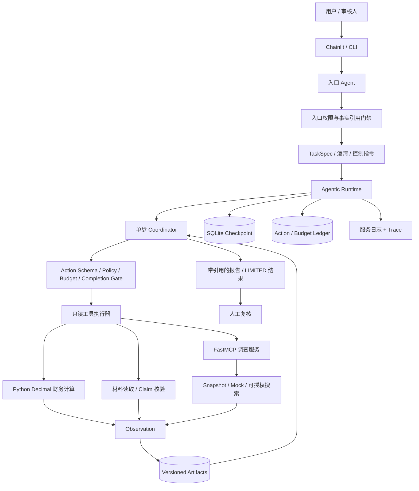
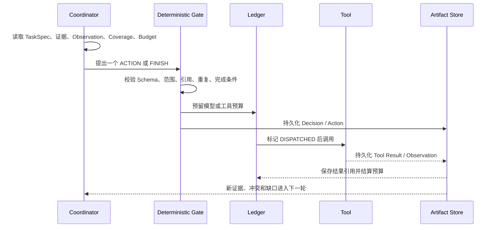

# Credra Agent 面试准备与项目设计说明

更新日期：2026-09-15
适用方向：AI Solution Architect、Agent Solution Architect、AI 应用架构师、Agent 工程师

本文以当前仓库代码、V2 架构文档、阶段实施记录和开发日志为依据，用于准备项目介绍、架构讲解和技术追问。文中的“当前实现”和“后续规划”严格区分，不把技术可行性、单次真实模型成功或规划能力表述为已经稳定交付的结果。

---

## 1. 项目定位

Credra Agent 是一个以企业授信尽调为业务载体的长任务 Agent 验证项目。系统接收自然语言调查需求，把主体、期间、截止日、来源约束和必答问题固化为版本化 `TaskSpec`，再由 Coordinator 根据当前证据、冲突和缺口逐步选择只读工具，形成可引用、可恢复、可审计的调查结果。

项目不自动批准或拒绝贷款，也不生成授信额度。它解决的是“如何可靠地完成调查并说明依据”，而不是替代银行的授信决策模型。

项目经历了两代架构：

- **Baseline Runtime**：以 Document、Financial、Research、Risk、Human Review 和 Report 等固定业务节点验证动态路由、MCP、Checkpoint、HITL、Retry 和 Trace。
- **Agentic Runtime**：在保留确定性工具和可靠执行底座的基础上，引入自然语言入口、单步 Coordinator、证据驱动重规划、显式授权、预算账本和保守恢复。

当前最准确的对外定位是：

> 一个能够基于受控材料和工具进行证据驱动调查，并具备确定性门禁、预算控制、跨进程恢复和人工复核能力的企业授信尽调 Agent PoC。

不应表述为：

- 银行级自动授信或风控系统；
- 已经能够替代专业尽调人员；
- 已经证明 Agentic 模式稳定优于固定工作流；
- 已经实现分布式、Exactly-once 的生产级执行平台。

---

## 2. 一分钟项目介绍

Credra Agent 是我围绕企业授信尽调设计的长任务 Agent。用户可以用自然语言提出主体、时间范围、来源要求和调查问题，入口 Agent 会先形成版本化任务规格；随后 Coordinator 根据已有材料、证据冲突和未覆盖问题，一次只选择一个读取、检索、核验或财务计算动作。

系统并不直接信任模型。主体、期间、来源、引用、预算和完成条件都由确定性 Policy 校验；财务指标由 Python `Decimal` 计算，模型不能修改计算结果。每次 Action、Observation、Evidence、预算变化和报告都写入版本化 Artifact，SQLite 保存 Graph Checkpoint 和 Action 账本，因此任务可以在进程退出后恢复。对于已经发出但结果未可靠落盘的外部请求，系统不会自动重发，而是标记为不确定并转人工复核。

这个项目的重点不是“用了多少个 Agent”，而是把模型推理、工具执行、证据采信、成本控制和可靠恢复放进同一套受约束 Runtime。

---

## 3. 业务问题与目标

### 3.1 为什么选择授信尽调

授信尽调天然具有以下特点：

- 输入来自年报、公告、监管信息、媒体和用户补充材料；
- 财务计算需要严格口径，不能交给模型自由计算；
- 外部消息需要区分事实、当事方声明、分析机构估计和系统推断；
- 调查可能持续较长时间，并等待用户澄清或人工审核；
- 最终结论必须能够回查来源、期间、主体和计算过程；
- 信息不足时应披露限制，而不是生成看似完整的答案。

因此，这个场景可以同时检验 Agent 的规划能力与工程可靠性。

### 3.2 项目目标

项目希望验证以下闭环：

1. 自然语言需求可以转化为稳定、可版本化的任务契约；
2. Agent 能根据新证据、冲突和缺口调整下一步动作；
3. 所有外部动作都受权限、范围和预算控制；
4. 事实和数字都能回溯到证据或计算 Artifact；
5. 任务中断、进程退出或部分失败后仍能安全恢复；
6. 证据不足时可以有界停止并请求人工复核；
7. 日志、Trace、报告和审计产物能够解释系统做了什么。

### 3.3 非目标

- 自动授信审批、拒绝或额度决策；
- 银行级信用评分模型；
- OCR 与任意 PDF 的通用解析平台；
- 多租户、RBAC、Kubernetes 和高并发生产部署；
- 在缺少质量证据时默认启用完全自主调查。

---

## 4. 总体架构



### 4.1 分层职责

| 层次 | 当前职责 |
|---|---|
| 交互层 | Chainlit 提供自然语言入口、任务状态、人工操作与报告展示；CLI 用于自动化、诊断和评测 |
| 入口 Agent | 结合用户 query、会话历史、任务目录、工具目录和权限，选择回复、澄清、准备调查、查询状态或恢复任务 |
| Intent 层 | 将自然语言解析为版本化 `TaskSpec`，固定主体、期间、截止日、来源策略、问题和完成要求 |
| Coordinator | 根据受限证据上下文、Observation、假设、覆盖度和预算，一轮只决定一个 Action 或提出 FINISH |
| 执行门禁 | 在工具调用前验证工具可用性、参数 Schema、主体、期间、来源、引用、重复动作和预算 |
| 工具层 | 读取材料、搜索证据、抓取内容、核验 Claim、计算财务指标、询问用户或结束调查 |
| 证据层 | 管理 Entity、Document、Fragment、Evidence、Claim、Corroboration 和修订关系 |
| 持久化层 | Checkpoint 保存小状态；Artifact 保存完整业务结果；Action/Budget Ledger 保存外部动作和费用状态 |
| 可观测层 | 根服务与 MCP 子进程共享启动批次日志，并保留节点、模型、工具、预算、持久化和停止原因 |

### 4.2 当前可用工具

当前 Agentic Registry 注册了九类动作：

| 动作 | 状态 | 用途 |
|---|---|---|
| `read_document` | 已实现 | 读取任务允许范围内的材料或 Artifact |
| `search_evidence` | 已实现 | 按 query、主体、期间和来源策略调查外部证据 |
| `fetch_content` | 已实现 | 受控获取候选 URL 正文 |
| `verify_claim` | 已实现 | 将一条 Claim Proposal 与指定文档绑定后核验 |
| `compute_metrics` | 已实现 | 使用已持久化财务输入计算允许的指标 |
| `ask_user` | 已实现 | 信息不足时进入澄清状态 |
| `finish` | 已实现 | 提出 ANSWERED、NEEDS_REVIEW、NO_PROGRESS 或 BUDGET_EXHAUSTED |
| `compare_peers` | 规划 | V2-3 同业比较能力 |
| `run_scenario` | 规划 | V2-3 情景分析能力 |

---

## 5. Agent 设计

### 5.1 为什么不是简单的“多个角色互相聊天”

当前架构不把每个功能都包装成一个自由对话 Agent，而是区分两类真正需要模型判断的角色：

1. **入口 Agent**：理解用户此刻想做什么，以及是否需要查询、澄清或控制已有任务。
2. **调查 Coordinator**：面对一个已经冻结范围的任务，根据证据状态选择下一步动作。

财务计算、证据校验、预算、权限、恢复和报告引用等能力由确定性组件承担。这样可以减少角色间自由文本传递，避免多个 Agent 各自维护一套事实和状态。

Baseline 中的 Document、Financial、Research、Risk 更接近业务工作流节点；V2 的入口 Agent 与 Coordinator 才承担动态决策。面试时应主动说明这种演进关系。

### 5.2 核心状态对象

| 对象 | 含义 |
|---|---|
| `TaskSpec` | 用户需求的版本化快照，定义主体、期间、截止日、来源范围、问题和完成条件 |
| `HypothesisState` | 当前调查假设及其 OPEN、SUPPORTED、REFUTED、CONFLICTING 或 UNRESOLVED 状态 |
| `DecisionDraft` | 模型提出的单步 ACTION 或 FINISH，不是最终执行授权 |
| `Action` | 经 Runtime 分配稳定 ID、绑定计划版本、引用和预算记录的可执行动作 |
| `Observation` | 工具执行后的结构化观察，包含结果状态、Artifact、增量键、问题覆盖和错误码 |
| `Coverage` | 必答问题、已回答问题、缺口、冲突和人工复核要求 |
| `RunAuthorization` | 由可信 Runtime 提供，绑定 TaskSpec 版本、授权来源、请求、Token、时长和决策上限 |

### 5.3 单步规划循环



选择单步而不是一次生成完整计划，原因是调查中的后续动作依赖前一步的真实结果。一次性计划很容易在事实发生变化后继续执行过期步骤；单步循环更适合做证据驱动重规划，也便于在每个动作前执行权限和预算门禁。

### 5.4 模型的权限边界

模型可以：

- 判断下一步应读取、检索、核验还是计算；
- 维护调查假设；
- 提出一条绑定问题和来源文档的 Claim Proposal；
- 对必答问题给出候选结论和局限；
- 在证据不足时请求澄清或建议停止。

模型不可以：

- 自行创建受信任主体 ID、TaskSpec 版本或授权；
- 修改允许的主体、期间、来源和预算；
- 把 Claim Proposal 直接升级为已核验事实；
- 自造财务金额或修改 Python 计算结果；
- 仅凭搜索结果数量认定事实已被独立印证；
- 在必答问题、冲突或复核要求未满足时强行完成任务；
- 自动批准、拒绝授信或生成额度。

### 5.5 完成门禁

模型提出 `FINISH` 不等于任务已经完成。Runtime 仍会检查：

- 所有 REQUIRED 问题是否覆盖；
- 每个问题要求的财务指标是否存在有效引用；
- 非财务问题是否达到最低已核验 finding 数量；
- Claim 与 Evidence 是否属于同一主体、期间和当前版本；
- 是否存在未解决冲突或必须人工复核的状态；
- 引用是否指向当前 Run 中真实存在的 Artifact；
- 是否出现未经支持的数字、来源或事实。

第一次不完整的 FINISH 会反馈固定缺口并允许重规划；持续不满足时可以诚实地以 `LIMITED/NEEDS_REVIEW` 有界停止，不能伪装成完成。

---

## 6. 运行架构与可靠执行

### 6.1 双运行模式

| 模式 | 作用 |
|---|---|
| `baseline` / `legacy_v1` | 稳定固定工作流，继续作为可回归和降级的业务基线 |
| `agentic` / `agentic_v2` | Coordinator 动态选择动作，使用版本化 Graph、Action Ledger 和预算账本 |
| `shadow` | 记录通过门禁的模型计划，但不执行模型选择的工具；实际结果由独立 baseline 任务产生 |

保留 baseline 的原因是：在 Agentic 质量尚未稳定优于固定流程前，需要一个可靠的默认路径和对照基线。Shadow 也不是“Agentic 已完成”，它只表示计划采集完成。

### 6.2 Checkpoint、Artifact 与 Ledger 的分工

| 存储 | 保存内容 | 为什么独立 |
|---|---|---|
| SQLite Checkpoint | Graph 版本、状态、当前节点、迭代号和 Artifact 引用 | 用于恢复控制流，保持状态小且可序列化 |
| Versioned Artifact | TaskSpec、材料、证据图、Decision、Action、Observation、财务结果、Coverage 和报告 | 完整结果需要版本化、校验、回放和审计，不适合塞入 Checkpoint |
| Action Ledger | Action 的 RESERVED、DISPATCHED、RESULT_STORED、UNCERTAIN、FAILED 状态 | 处理外部调用跨越事务边界时的恢复歧义 |
| Budget Ledger | 模型与工具的预留、派发、实际用量、时长和不确定状态 | 防止重启后预算重置或重试低估成本 |
| 服务日志与 Trace | 节点、模型、工具、预算、状态变化和错误摘要 | 用于诊断和审计，但不是第二份业务真值 |

### 6.3 外部请求的恢复策略

项目采用保守的 at-most-once 恢复策略，不宣称 exactly-once：

- `RESERVED`：动作尚未派发，恢复后可以继续执行；
- `DISPATCHED`：请求可能已经到达外部系统，但结果未可靠保存；恢复时转为 `UNCERTAIN/LIMITED`，不自动重发；
- `RESULT_STORED`：结果和指纹已经持久化，恢复时重放 Observation，不再次调用工具；
- `FAILED`：保留失败状态和最小错误摘要，由上层决定是否继续。

这一取舍避免了“为了自动恢复而重复产生外部费用或副作用”。如果真实 Provider 支持幂等键和结果查询，后续可以在适配层进一步收窄不确定窗口。

### 6.4 预算控制

每次 Agentic 运行必须绑定 `RunAuthorization`，其中包含：

- 授权来源与授权 ID；
- TaskSpec 版本；
- 最大外部请求数；
- 最大 Token；
- 最大活动时长；
- 最大决策轮数、无进展阈值和单次输出上限。

模型和工具调用均采用“先预留、后派发、再结算”。当 Provider 未返回完整 usage，或发生重试、两阶段调用和不确定请求时，系统按预留值保守计费，不能假设未计费。

### 6.5 全服务日志

根服务、Graph、模型网关、搜索/抓取/核验组件和 MCP 子进程共享一个启动批次日志。日志通过认证 IPC 汇聚，由单写入者输出 UTF-8 文本和 JSONL，并按 10 MB 精确轮转。

日志不保存 API Key、Authorization、Cookie、完整 Prompt、原始模型输出、思维链或完整正文。日志不可用、队列持续满或磁盘写入失败时，Runtime 在新的持久化动作边界暂停，而不是静默丢失关键审计记录。日志本身不参与业务恢复，Checkpoint 和 Ledger 仍是状态真值。

---

## 7. 证据与财务设计

### 7.1 证据不是搜索结果

项目将证据处理拆为：

```text
Raw Result
  → Candidate
  → Document / Fragment
  → Claim Proposal
  → Subject / Time / Source / Content Verification
  → Evidence
  → Claim Status
  → Question Assessment / Report
```

搜索命中只表示候选相关，不代表事实成立。Evidence 需要绑定具体 Document、Fragment、主体、期间、支持或反证关系以及核验版本。支持和反证同时存在时保留 `CONFLICTING`，不能覆盖反证。

### 7.2 实体、时间和来源边界

- 母公司、子公司、控股股东和品牌不是同一个主体；关联关系需要单独证据，不能自动继承主张。
- 发布日期、事件日期、报告期间和抓取时间分别保存，抓取日不能替代事件日。
- 同一研究被多个网站转载仍属于同一来源组，不能按 URL 数量累计独立印证。
- 公司声明可以证明“公司作出过该声明”，不能自动证明声明已经履行。
- 年报新版本或重述值需要显式版本关系，不能静默覆盖历史值。

### 7.3 财务计算

当前最小扩展财务链路使用 Python `Decimal`，已支持：

- 营业收入增长率；
- 应收账款增长率；
- 应收增长与营收增长的百分点差；
- 经营现金流与合并净利润之比。

模型只能选择允许的指标和输入引用。Runtime 会检查主体、期间、会计口径、字段版本、缺失值和分母条件；无法计算时返回 `NOT_COMPUTABLE`，不能补零或让模型估算。

---

## 8. 关键设计取舍

### 8.1 LLM 负责决策，代码负责约束

这是项目最重要的设计原则。模型擅长理解问题、选择调查方向和组织表达，但不适合承担财务计算、权限判断、预算记账和状态恢复。把这些硬约束放在 Runtime 中，既保留 Agent 的适应性，也使结果可测试、可解释。

### 8.2 单步决策，而不是一次生成整套计划

优点是每一步都能消费真实 Observation 并重新规划；缺点是模型调用次数和延迟增加。因此系统通过显式预算、无进展锁、重复动作去重和 FINISH 门禁控制成本与循环。

### 8.3 State 最小化，完整对象写 Artifact

这样降低 Checkpoint 体积并方便恢复，但需要维护 Artifact 引用图、版本和一致性。项目通过不可覆盖写入、哈希、任务/Run 隔离和恢复校验承担这部分复杂度。

### 8.4 MCP 只承载适合隔离的外部调查能力

外部搜索最需要替换 Provider、独立进程和统一协议，因此通过 FastMCP stdio 隔离。财务计算仍保留为进程内确定性工具，避免为了形式上的“全部 MCP 化”增加无收益的协议成本。

### 8.5 保守停止优先于自动重试

对明确的临时失败可以按策略重试；对“请求可能发生但结果不确定”的窗口不自动重发。这个选择牺牲一部分自动完成率，换取费用、副作用和审计风险可控。

### 8.6 保留 Baseline，不急于把 Agentic 设为默认

真实试跑已经证明 Agentic 链路能够产生通过技术门禁的候选报告，但不同轮次仍出现提前结束、重复核验、关键 finding 缺失或无报告。当前证据不足以证明 Agentic 稳定优于 Baseline，因此默认切换必须等待配对评测和人工评分。

### 8.7 结构化输出仍需应用层校验

Provider 的 JSON Mode 只能提高语法有效率，不能保证枚举、类型、引用和业务约束正确。项目保留 Pydantic Schema、固定安全修复提示和二次引用门禁，不把“返回 JSON”视为结果可信。

---

## 9. 遇到的问题与解决方案

### 9.1 LangGraph Resume 会重新进入 interrupt 节点

**问题：** 如果中断节点在 `interrupt()` 前执行外部调用或不可重复写入，恢复时可能重复副作用。

**解决：** 将准备、审核和完成拆成不同节点；审核节点只读取状态、生成审核信息并中断，不在 interrupt 前执行不可重复操作。用独立 Python 进程验证恢复后已完成节点没有重跑。

### 9.2 外部请求与本地事务之间存在崩溃窗口

**问题：** Handler 已经收到请求，但进程在结果落盘前退出，系统无法证明请求是否完成。

**解决：** 引入 Action Ledger 和 Budget Ledger。请求前写 `RESERVED`，派发前写 `DISPATCHED`，结果先写不可覆盖 Artifact，再进入 `RESULT_STORED`。恢复遇到 `DISPATCHED` 时标记 `UNCERTAIN` 并停止，不自动重发。

### 9.3 Qwen 返回合法 JSON，但不符合业务 Schema

**问题：** 真实调用中出现布尔值代替枚举、模型自造枚举、字段互斥冲突和输出截断。

**解决：** 向模型提供完整 JSON Schema；关闭 SDK 隐式重试，统一由应用控制尝试次数；按用途设置不同输出预算；第二次请求只提供受限的字段路径和错误类别，不记录或回传任意内部异常文本。完整结果仍必须经过 Pydantic 校验。

### 9.4 搜索结果出现主体误匹配

**问题：** 搜索摘要中偶然出现“比亚迪”，但文章主体实际是另一家公司，搜索相关度不能证明实体匹配。

**解决：** 增加标题主体门槛、稳定主体 ID、别名碰撞处理和负向 Snapshot；在正文核验前阻断弱来源误召回。母子公司关系也不自动继承，需要单独的关系证据。

### 9.5 模型把线索、声明或分析估计写成事实

**问题：** 模型可能把 Reuters 线索写成年报披露，或把企业承诺当成已经履约。

**解决：** Claim 明确区分 `REPORTED_FACT`、`PARTY_STATEMENT`、`ANALYST_ESTIMATE` 和 `HYPOTHESIS`；声明与估计必须注明归属。Claim Proposal 只能随匹配的 `verify_claim` 动作提交，并绑定来源文档；报告门禁只接受已核验的当前版本主张。

### 9.6 模型重复读取或核验，造成无效循环

**问题：** 真实 Agentic 试跑中出现重复读取同一材料、轮换 Evidence Bundle 重复核验同一主张等行为。

**解决：** 以规范化 Action 签名和 novelty key 去重；Claim + 文档集合形成核验签名；策略拒绝、NO_RESULT、无效 FINISH 和无新增证据都会增加无进展计数，达到阈值后停止或要求复核。

### 9.7 上下文过长和重复投影

**问题：** TaskView 同时出现在当前任务和工具结果中，叠加证据上下文后超过模型输入上限；简单截断又可能漏掉冲突。

**解决：** 去除语义完全相同的重复 TaskView；模型上下文只投影受限索引和最近 Observation，完整证据保留在 Artifact；Runtime 的完成判定读取完整索引，不依赖被裁剪的模型视图。

### 9.8 模型调用用量不完整

**问题：** Provider 可能不返回 usage；重试和两阶段调用只看最后一次响应会低估真实成本。

**解决：** 每个逻辑操作分配稳定 operation ID，先预留最坏预算；只有单阶段、首轮成功且 usage 完整时才按实际值结算，其他情况保守保留预留值并标记 `usage_uncertain`。

### 9.9 多进程日志存在轮转竞争和敏感信息风险

**问题：** 根进程与 MCP 子进程直接写同一文件会产生竞争；SDK 异常和原始消息可能泄露 Prompt、正文或凭证。

**解决：** 使用认证 IPC 和单写入者统一汇聚；事件字段采用白名单和稳定引用；日志同时输出文本和 JSONL，精确轮转并记录持久化确认。日志失败时暂停新动作，避免无审计执行。

### 9.10 正常问候被事实门禁拒绝

**问题：** 入口模型回答“你好”时主动宣称工作区已有企业资料，但没有事实引用；门禁正确拒绝，却让普通对话看起来不可用。

**解决：** Prompt 明确纯问候不得主动扩展工作区事实；当用户问题本身不要求任务事实时，丢弃整段越界文本并返回固定安全提示。涉及企业、任务、报告或财务事实时仍保持失败关闭。

### 9.11 真实 Agentic 结果波动较大

**问题：** 真实模型有时可以完成全部技术检查，有时会提前 FINISH、遗漏独立指标、重复核验或产生无效引用。

**解决：** 将“格式正确”和“业务质量正确”分开验收；保留同材料 fixed/agentic 回放、人工答案、动作偏序和评分表。通过真实失败轨迹改进问题级完成条件、证据引用和收敛机制，但不因为单次成功就宣称稳定优于 Baseline。

---

## 10. 项目难点

### 10.1 在自主性与可控性之间划边界

过度确定性会退化成普通工作流；过度交给模型又会导致越权、幻觉、成本不可控和无法恢复。项目的难点是让模型真正决定调查方向，同时把权限、预算、事实采信和完成语义留在代码中。

### 10.2 可靠恢复不是简单保存 State

Checkpoint 只能恢复 Graph 状态，不能自动解决外部请求是否已经发生的问题。必须把动作、结果和预算拆成可恢复的状态机，并为每个崩溃窗口定义不同策略。

### 10.3 证据可信度是图结构问题

可信证据不只是 URL 和摘要，还包含主体、时间、片段位置、来源依赖、声明归属、支持/反证和修订版本。任何一项缺失都可能导致错误结论。

### 10.4 模型的语义质量难以只靠单元测试评价

Schema 测试可以证明输出结构，但不能证明调查路线合理或结论真正回答了问题。因此项目需要固定材料、人工答案、同素材对照、动作偏序和人工 Rubric，而不能只统计测试通过数。

### 10.5 长任务成本与上下文持续增长

Agent 每轮都可能增加 Evidence、Observation 和日志。如果把完整对象反复送入模型，成本会快速上升。项目采用索引投影、Artifact 引用、上下文去重、显式预算和有界停止控制增长。

---

## 11. 项目优点

1. **不是只展示 Prompt 的 Demo**：包含状态机、持久化、工具协议、预算、恢复、日志和审计边界。
2. **模型真正参与动态决策**：Coordinator 会根据新 Observation 改变下一步动作，而不是给固定工作流换一个 Agent 名称。
3. **确定性核心清晰**：财务计算、权限、来源、引用、预算和完成门禁均可离线回归。
4. **恢复语义诚实**：不宣称 Exactly-once，对不确定请求宁可 LIMITED，也不自动重复收费或副作用。
5. **证据模型较完整**：能区分主体、时间、声明、估计、转载、独立来源、支持、反证和修订。
6. **具备真实失败反馈**：项目保留真实模型试跑中的失败类型，并据此调整 Schema、Prompt、预算和收敛策略。
7. **Baseline、Shadow、Agentic 可对照**：有稳定基线，也为后续质量评估留下可复现路径。
8. **可观测和安全边界明确**：根进程与 MCP 子进程统一日志，敏感正文和凭证不进入日志。
9. **工程验证较充分**：截至 2026-09-15，最新阶段记录为 Ruff、格式、依赖、独立 MCP smoke 和 628 项 pytest 通过。

---

## 12. 当前局限与后续演进

### 12.1 当前局限

- V2-2 离线技术链路已经通过，但 G2 仍待真实模型稳定性复测和五项人工评分；
- 真实 Agentic 试跑存在较大波动，尚不能证明稳定优于 Baseline；
- 当前复杂案例集中在比亚迪现金质量，上汽案例深度和跨市场案例仍需扩展；
- `compare_peers` 和 `run_scenario` 尚未实现；
- 运行中修改主体、期间、来源或分析假设尚未接入完整指令队列；
- 尚未完成版本化报告审核、跨端恢复体验和完整发布故障矩阵；
- SQLite、本地 Artifact 和单机 Chainlit 适合 PoC，不适合直接作为高并发生产架构；
- 还没有银行级身份认证、租户隔离、数据治理和合规控制。

### 12.2 后续路线

1. **V2-3**：扩展财务指标、同业比较和情景分析，保持 Python 计算与来源血缘；
2. **V2-4**：支持运行中指令、TaskSpec 补丁、审核版本绑定和完整跨端恢复；
3. **V2-5**：建立离线行为 Eval、真实配对试跑、故障矩阵和默认模式发布决策；
4. **生产化方向**：将 Checkpoint/Ledger 迁移至并发数据库，Artifact 迁移至对象存储，引入认证、RBAC、租户隔离和队列化 Worker。

---

## 13. 面试问题、追问与参考答案

以下答案按口述方式编写。面试时不必逐字背诵，应围绕“业务问题—架构选择—约束—结果—局限”组织表达。

### 13.1 请用一两分钟介绍这个项目

**参考答案：**

Credra Agent 是一个面向企业授信尽调的长任务 Agent。我希望解决的不是自动审批，而是怎样让 Agent 在多轮调查、工具调用和人工复核中保持可控、可恢复和可审计。

用户用自然语言描述企业、期间、来源要求和调查问题后，入口 Agent 先生成版本化 TaskSpec；Coordinator 再根据已有证据、冲突和缺口，一次选择一个读取、检索、核验或财务计算动作。模型负责调查决策和表达，主体、期间、来源、引用、预算和完成条件由确定性 Runtime 校验。状态通过 LangGraph 和 SQLite 恢复，完整结果放在版本化 Artifact 中，外部调用另外使用 Action 和预算账本处理崩溃窗口。

项目当前已经完成离线技术闭环和真实模型候选验收，但真实 Agentic 质量仍有波动，所以我保留了 Baseline 和 Shadow，并没有把单次成功包装成稳定提升。

**可能追问：它和普通 RAG 有什么区别？**

普通 RAG 通常是一次检索加一次生成，而这个项目的调查路径不是预先固定的。Coordinator 会根据前一步 Observation 判断是否继续读原文、核验主张、计算指标、搜索独立来源或停止；同时任务可能跨进程、等待澄清，并受到预算和证据完成门禁约束。

### 13.2 这个项目为什么需要 Agent，而不是普通工作流？

**参考答案：**

固定财务处理和审批节点适合工作流，但调查部分的下一步依赖当前证据。例如发现来源只是转载时，下一步应该寻找独立来源；出现主体范围不明确时，应核验关联关系；问题已经有足够证据时则不应继续搜索。这些动作无法完全在开发前枚举，所以引入 Coordinator 做单步重规划。

但我没有把所有逻辑 Agent 化。计算、权限、预算和恢复仍然是确定性组件，Agent 只处理需要语义判断和动态选择的部分。

**可能追问：那 Baseline 为什么还保留？**

Baseline 是稳定回归和降级路径，也用于与 Agentic 做同材料对照。在没有足够质量证据前，我认为直接切换默认模式是不负责任的。

### 13.3 你如何定义项目中的 Agent？

**参考答案：**

我不按“拥有一个角色 Prompt”来定义 Agent，而按是否具有目标、观察、动作选择和反馈闭环来定义。入口 Agent 面向会话目标选择回复或工具；Coordinator 面向调查目标读取 Observation 和 Coverage，选择下一步 Action，并在新证据回来后重新规划。

Financial、Evidence 和 Search 更像受约束工具能力，而不是自治 Agent。这样可以避免多个角色通过自由文本同步事实。

### 13.4 Coordinator 每一轮具体看什么、输出什么？

**参考答案：**

它读取 TaskSpec、当前假设、最近 Observation 索引、问题 Coverage、可用 Artifact 引用、受限证据上下文、工具目录、策略拒绝历史和预算快照。输出严格的 `DecisionDraft`，只能是一个 ACTION 或 FINISH。

模型输出后还不能直接执行。Runtime 会校验工具 Schema、主体、期间、来源、引用、重复动作和预算，然后生成带稳定 ID、计划版本和预算引用的 Action。

**可能追问：为什么一次只能一个 Action？**

因为下一步往往依赖刚取得的证据。单步能减少过期计划，也让每次外部调用都能独立授权、持久化和恢复。代价是模型调用更多，所以必须配合预算和无进展控制。

### 13.5 为什么不用 LLM 决定全部路由和规则？

**参考答案：**

财务计算、权限、范围和完成条件需要稳定复现。如果交给模型，测试和审计都会变得困难。我采用“模型提出、代码裁决”：模型选择调查方向并提出候选结论，代码决定动作是否允许、数字是否有效、证据是否达到采信条件以及任务是否真的完成。

这不是限制 Agent，而是把模型放在它擅长的语义层，把控制面留给 Runtime。

### 13.6 TaskSpec 的作用是什么？

**参考答案：**

TaskSpec 是自然语言和执行系统之间的稳定合同。它把主体、Case、截止日、分析期间、来源策略、问题、完成条件、假设和待澄清字段固化下来，并且有版本号。

这样后续 Coordinator 不需要每轮重新猜用户意图，授权也可以绑定到具体 TaskSpec 版本。澄清会生成新版本，而不是在原对象上静默修改。

**可能追问：模型解析错了怎么办？**

模型只生成 Draft，主体必须在已导入目录中二次解析，期间不能超过截止日，来源 allow/deny 不能冲突。关键字段不明确时进入 `NEEDS_CLARIFICATION`，不会直接执行。

### 13.7 你如何防止 Agent 越权调用工具？

**参考答案：**

Action Registry 先定义可用工具和各自参数 Schema，Policy 再检查主体、期间、来源、引用、重复动作和当前能力。模型上下文中的工具目录只是能力说明，真正是否执行由 Runtime 决定。

运行还必须有可信方生成的 `RunAuthorization`。授权没有批准、版本不匹配或预算字段不完整时，模型和工具调用都会在派发前被拒绝。

### 13.8 为什么使用 MCP？

**参考答案：**

Research 是最适合隔离的外部能力：它可能更换搜索 Provider、需要独立进程，也有明确的输入输出契约。通过 MCP，Coordinator 只依赖 `search_evidence` 能力，不直接耦合 Tavily、Snapshot 或 Mock 的实现。

财务计算没有 MCP 化，因为它是进程内、确定性且低成本的核心能力。把所有工具都 MCP 化会增加协议和进程开销，却不一定提高可维护性。

### 13.9 搜索结果如何变成可用证据？

**参考答案：**

搜索结果只能进入 Raw 或 Candidate，不能直接成为事实。系统需要取得正文片段，校验主体、时间、来源范围和内容位置，再把 Claim Proposal 与指定文档交给核验动作。通过后形成 Evidence，并投影 Claim 的支持、反证或冲突状态。

报告只接受当前主体、截止日和版本下的有效引用。转载网站数量不会自动升级为独立印证。

**可能追问：如何防止母子公司混淆？**

每个实体有稳定 ID，关系本身需要单独的已核验证据。子公司的事实不会自动继承到母公司，简称或关键词命中也不能替代主体范围校验。

### 13.10 财务计算为什么不用模型？

**参考答案：**

财务计算需要严格口径、精度和边界处理。项目使用 Python `Decimal`，并把字段来源、主体、期间、合并或母公司口径和版本一起校验。缺字段、分母非正或期间不一致时返回 `NOT_COMPUTABLE`。

模型可以决定是否需要某项计算，但不能传入自造金额，也不能覆盖计算结果。这使财务结果可以用人工答案独立复核。

### 13.11 为什么 State 和 Artifact 要分开？

**参考答案：**

Checkpoint 只需要保存恢复控制流所需的小状态，例如当前节点、状态、迭代号和 Artifact 引用。完整正文、证据图、模型 Decision 和财务结果体积大，也需要版本化和审计，更适合放在 Artifact Store。

代价是需要维护引用一致性，所以项目使用不可覆盖写入、Run 隔离、哈希和恢复校验。Artifact 缺失或损坏时会受限停止，不会重新派发外部调用来“修复”。

### 13.12 Checkpoint 为什么不能解决全部恢复问题？

**参考答案：**

Checkpoint 可以说明 Graph 执行到哪里，却不能证明外部请求是否已经到达 Provider。最危险的情况是请求已发生，但本地还没保存结果。如果只恢复 Graph 并重跑节点，就可能重复收费或产生副作用。

因此我增加了 Action Ledger。它把预留、派发、结果落盘和失败拆成独立状态，并针对每个崩溃窗口决定继续、重放还是停止。

### 13.13 项目能保证 Exactly-once 吗？

**参考答案：**

不能，我明确不做这个承诺。跨越本地数据库和第三方 API 时，没有分布式事务或 Provider 幂等查询，就无法严格保证 Exactly-once。

当前策略是保守的 at-most-once：无法确认结果时不自动重发，而是标记 UNCERTAIN 并转人工。若将来 Provider 支持幂等键和结果查询，可以进一步缩小不确定窗口。

### 13.14 预算是如何控制的？

**参考答案：**

每个运行授权绑定最大外部请求、Token、活动时长和决策轮数。每次模型或工具动作先预留最坏预算，再标记派发，完成后根据可信 usage 结算。

如果 Provider usage 不完整，或者发生重试、两阶段调用和结果不确定，系统按预留值保守计费。预算状态持久化在 SQLite 中，所以重启不会把额度恢复成初始值。

### 13.15 如何避免 Agent 无限循环？

**参考答案：**

我用了四层控制：最大决策轮数、预算上限、动作签名去重和无进展计数。Observation 会带 novelty key；NO_RESULT、重复动作、策略拒绝和不完整 FINISH 都会推进无进展状态。

达到阈值后系统会要求模型收敛，最终以 LIMITED 或 NEEDS_REVIEW 停止，而不是持续调用。

### 13.16 模型输出 Schema 不合法时怎么办？

**参考答案：**

首先使用严格 Pydantic Schema 和 JSON 输出；失败后由应用层进行有限重试。修复轮次只告诉模型安全的字段路径和错误类别，并要求重新生成完整对象，不把内部异常和原始响应写进日志。

重试仍失败时，调查进入受限状态或使用经过同样门禁的确定性 fallback。不能因为 JSON 可解析就跳过业务校验。

### 13.17 模型提出 FINISH 时，系统如何判断真的完成？

**参考答案：**

Runtime 会重新计算 Coverage，检查必答问题、所需指标、最低核验 finding、冲突和人工复核标记，并验证全部财务、Evidence 和 Claim 引用。

模型第一次过早结束时会收到固定缺口并重规划；如果仍无法满足，可以返回 NEEDS_REVIEW，但不能把不完整任务标记为 ANSWERED。

### 13.18 真实模型试跑暴露了什么问题？

**参考答案：**

主要有四类：输出被 Token 上限截断、合法 JSON 不符合业务 Schema、重复核验导致无进展、以及模型提前结束或遗漏关键 finding。不同 thinking 配置也带来明显的 Token 和时延差异，但不一定提高完成质量。

这些结果促使我增加用途级输出预算、受限 Schema 修复、问题级完成要求、Claim 与文档绑定、无进展锁和同材料对照评测。最重要的是，我没有用一轮成功掩盖其他失败；当前只能证明链路能产生合格候选，不能证明稳定优于 Baseline。

### 13.19 如何评价 Agentic 是否比 Baseline 好？

**参考答案：**

不能只比较最终有没有报告，也不能只看格式通过率。我冻结同一材料、TaskSpec、截止日、工具权限和总预算，对比问题覆盖、引用支持、关键 finding、错误主张、调用次数、Token、活动时间和失败分布。

当前已经有 fixed/agentic 同材料回放和人工评分模板，但真实模型稳定性与五项人工评分尚未完成，因此还没有做默认模式切换。

### 13.20 项目如何做测试？

**参考答案：**

测试分为 Schema 和纯函数单测、工具与 MCP 组件测试、Graph 集成测试、真正跨进程恢复测试、固定材料回放、故障注入和 UI/入口测试。跨进程测试使用 `os._exit` 制造决策后、请求后和结果落盘后的不同崩溃窗口，再由新 Python 进程恢复。

截至 2026-09-15，最新标准门禁记录为 628 项 pytest、Ruff lint/format、依赖一致性和独立 MCP stdio smoke 全部通过。这个数字说明工程回归范围，但不能替代真实业务质量评估。

### 13.21 日志和 Trace 有什么区别？

**参考答案：**

Trace 更接近单任务业务执行记录；全服务日志覆盖根服务、MCP 子进程、模型、工具、预算和持久化基础设施。二者通过任务和事件引用关联，但日志不是恢复状态的第二份真值。

日志只保留受限字段和摘要，不记录 Key、Prompt、思维链和完整正文。关键日志不可持久化时，系统会在新动作边界暂停。

### 13.22 项目如何考虑安全？

**参考答案：**

当前主要做了执行范围和数据泄露控制：主体、期间、来源和工具白名单；版本化授权；Artifact 路径限制；模型无直接工具权限；日志敏感字段白名单；外部正文不能作为系统指令；报告引用二次校验。

如果生产化，还需要身份认证、RBAC、多租户隔离、密钥托管、数据库和对象存储加密、数据保留策略、网络出站控制和正式合规审计。这些目前不能宣称已经完成。

### 13.23 为什么使用 SQLite？如何扩展到生产环境？

**参考答案：**

SQLite 很适合单机 PoC：部署简单、事务明确，也方便验证 Checkpoint、Action Ledger 和预算恢复。它不是高并发多实例方案。

生产化时我会把 Checkpoint 和 Ledger 迁移到支持并发事务的数据库，把 Artifact 放到对象存储，Runtime 做成无状态 Worker，并通过队列调度任务。Action ID、operation ID、TaskSpec 版本和 Artifact 引用契约可以继续保留。

### 13.24 项目中最难的部分是什么？

**参考答案：**

最难的不是调用模型，而是定义模型与 Runtime 的责任边界。既要让模型能根据证据真正改变调查路线，又不能让它越权、伪造事实、绕过预算或在恢复时重复调用。

我最后把系统拆成 TaskSpec、Decision、Action、Observation、Evidence、Coverage 和 Ledger 几类契约，每类只表达一个层次的事实。这样虽然实现复杂度更高，但系统在失败时能说明到底是模型错误、策略拒绝、证据不足、预算耗尽还是恢复不确定。

### 13.25 如果重新设计，你会优先改什么？

**参考答案：**

我会更早建立同材料的 Baseline/Agentic Eval，而不是先通过大量真实试跑再逐步补充问题级评分。这样可以更快区分“Schema 能跑通”和“业务质量更好”。

工程上，我会尽早统一 V1/V2 的持久化和入口抽象，并为支持幂等键的外部 Provider 设计结果查询接口，减少 UNCERTAIN 状态。下一步则是完成 V2-3 财务扩展、V2-4 运行中指令和 V2-5 配对评测，而不是继续增加更多 Agent 角色。

### 13.26 你个人在项目中承担了什么？

**参考答案：**

我负责业务场景选择、需求边界、架构设计、关键技术 Spike、代码实现、测试和真实案例验收。AI 编程工具帮助我生成部分实现、补充测试和审查边界，但 TaskSpec、证据模型、预算授权、恢复语义和完成门禁等关键取舍由我制定并根据实际失败结果迭代。

如果面试官继续追问，我会重点讲一个具体案例，例如 interrupt 重入、DISPATCHED 崩溃窗口或真实模型重复核验问题，而不是泛泛地说“我做了整体架构”。

---

## 14. 推荐演示顺序

1. 用自然语言提出一条有主体、期间和来源要求的调查任务；
2. 展示入口 Agent 生成的 TaskSpec 和授权边界；
3. 展示 Coordinator 如何基于缺口选择一个 Action；
4. 展示 Policy 在工具执行前校验主体、来源、引用和预算；
5. 展示财务结果或 Evidence Artifact 如何回到下一轮规划；
6. 展示 Coverage、LIMITED/NEEDS_REVIEW 和带引用报告；
7. 退出进程后使用同一任务恢复，说明 Ledger 对不确定请求的处理；
8. 最后展示服务日志、Artifact 和固定材料回放结果。

演示时优先展示“为什么系统拒绝一条不可信结论”以及“为什么某个动作没有重发”。这比只展示最终报告更能体现解决方案架构能力。

---

## 15. 面试表达原则

- 先讲业务风险，再讲框架名称；
- 先说明模型可以做什么，再说明 Runtime 如何约束；
- 区分搜索结果、候选材料、Evidence、Claim 和最终结论；
- 区分 Graph Checkpoint、Artifact、Action Ledger、Budget Ledger 和日志；
- 对恢复明确使用“保守 at-most-once”，不要说 Exactly-once；
- 对真实模型明确说“已有合格候选但稳定性待验证”，不要说 Agentic 已稳定胜出；
- 对未完成能力使用“当前规划在 V2-3/V2-4/V2-5”，不要包装成已实现；
- 测试数量只代表工程回归，不代表金融业务准确率。

一个通用回答结构是：

> 这个问题的业务风险是……；我在架构上把……交给模型，把……留给确定性 Runtime；当前代码已经实现并通过……验证；仍然存在的限制是……，生产化时会……。
